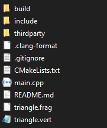

Vulkan 三角形
===================

.. dropdown:: 更新记录
   :color: muted
   :icon: history

   * 2024/11/7 增加该文章
   * 2024/11/8 更新该文章

.. sidebar::

   .. image:: ../_static/VulkanTriangle/vulkan_triangle.png

.. card:: Vulkan 三角形
   :link: https://github.com/FuXiii/VulkanTriangle/archive/refs/heads/main.zip
   :shadow: lg
   :text-align: center
   
   点击下载源码
   +++

   .. raw:: html

    

    <svg stroke="currentColor" fill="currentColor" stroke-width="0" viewBox="0 0 16 16" width="16" height="16">
        <path fill-rule="evenodd" d="M8 0C3.58 0 0 3.58 0 8c0 3.54 2.29 6.53 5.47 7.59.4.07.55-.17.55-.38 0-.19-.01-.82-.01-1.49-2.01.37-2.53-.49-2.69-.94-.09-.23-.48-.94-.82-1.13-.28-.15-.68-.52-.01-.53.63-.01 1.08.58 1.23.82.72 1.21 1.87.87 2.33.66.07-.52.28-.87.51-1.07-1.78-.2-3.64-.89-3.64-3.95 0-.87.31-1.59.82-2.15-.08-.2-.36-1.02.08-2.12 0 0 .67-.21 2.2.82.64-.18 1.32-.27 2-.27.68 0 1.36.09 2 .27 1.53-1.04 2.2-.82 2.2-.82.44 1.1.16 1.92.08 2.12.51.56.82 1.27.82 2.15 0 3.07-1.87 3.75-3.65 3.95.29.25.54.73.54 1.48 0 1.07-.01 1.93-.01 2.2 0 .21.15.46.55.38A8.013 8.013 0 0 0 16 8c0-4.42-3.58-8-8-8z">https://github.com/FuXiii/VulkanTriangle</path>
    </svg>
    https://github.com/FuXiii/VulkanTriangle
    

.. admonition:: 项目要求
    :class: note

    * ``CMake``
    * ``C/C++`` 的编译环境
    * ``Vulkan 运行时`` （一般系统都默认自带）

.. admonition:: 支持平台
    :class: tip

    * ``Windows``
    * ``Linux``

1. 下载并解压
2. 在同级目录下创建 ``build`` 文件夹

    创建 build 文件夹

3. 命令行定位到 ``build`` 文件夹，执行如下指令：

.. code-block:: console

    cmake ..

4. 编译生成可执行程序

.. tab-set::

    .. tab-item:: Visual Studio

        打开 ``build`` 文件夹下的 ``.sln`` 文件，编译执行即可。

    .. tab-item:: Linux

        命令行中执行如下指令即可：

        .. code-block:: console

            make