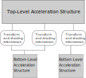

Vulkan KHR 光线追踪标准
===========================

.. dropdown:: 更新记录
   :color: muted
   :icon: history

   * 2023/6/5 创建该文章
   * 2023/6/5 增加 ``VK_KHR_acceleration_structure`` 章节
   * 2023/6/5 增加 ``查看是否支持加速结构特性`` 章节
   * 2023/6/5 增加 ``激活加速结构特性`` 章节
   * 2023/6/5 增加 ``创建加速结构`` 章节
   * 2023/6/6 更新 ``激活加速结构特性`` 章节
   * 2023/6/6 更新 ``创建加速结构`` 章节
   * 2023/6/7 增加 ``获取加速结构的构建大小`` 章节
   * 2023/6/7 更新 ``VK_KHR_acceleration_structure`` 章节，增加 ``加速结构的创建和构建`` 注意项
   * 2023/6/7 增加 ``销毁加速结构`` 章节
   * 2023/6/8 增加 ``有关本文档结构`` 的说明
   * 2023/6/8 增加 ``有关本文档结构`` 的说明
   * 2023/6/8 将 ``获取加速结构的构建大小`` 章节插入到 ``创建加速结构`` 之前
   * 2023/6/8 更新 ``获取加速结构的构建大小`` 章节
   * 2023/6/8 增加 ``加速结构`` 章节
   * 2023/6/8 增加 ``几何体`` 章节
   * 2023/6/8 增加 ``顶层加速结构`` 章节
   * 2023/6/8 增加 ``底层加速结构`` 章节
   * 2023/6/8 增加 ``无效的图元和实体`` 章节
   * 2023/6/8 增加 ``构建加速结构`` 章节
   * 2023/6/9 更新 ``构建加速结构`` 章节

.. admonition:: 有关本文档结构
    :class: warning

    本文档基本提炼于 ``Vulkan`` 标准文档，由于 ``Vulkan`` 标准文档中有时并没有按照开发者的学习逻辑角度布局其文档的前后关系，所以该文档在书写过程中章节会随时按照开发的前后逻辑关系随时调整。

在 ``Vulkan API`` 中有5个与光追相关的扩展

* `VK_KHR_acceleration_structure <https://registry.khronos.org/vulkan/specs/1.3-extensions/man/html/VK_KHR_acceleration_structure.html>`_
* `VK_KHR_ray_tracing_pipeline <https://registry.khronos.org/vulkan/specs/1.3-extensions/man/html/VK_KHR_ray_tracing_pipeline.html>`_
* `VK_KHR_ray_query <https://registry.khronos.org/vulkan/specs/1.3-extensions/man/html/VK_KHR_ray_query.html>`_
* `VK_KHR_pipeline_library <https://registry.khronos.org/vulkan/specs/1.3-extensions/man/html/VK_KHR_pipeline_library.html>`_
* `VK_KHR_deferred_host_operations <https://registry.khronos.org/vulkan/specs/1.3-extensions/man/html/VK_KHR_deferred_host_operations.html>`_

按照扩展的顺序研究研究。

VK_KHR_acceleration_structure
###################################

.. admonition:: 加速结构的创建和构建
    :class: important

    加速结构中经常能看到 ``创建`` 和 ``构建`` 的字样，这是两个不同的概念。加速结构的创建指的是创建加速结构句柄 ``VkAccelerationStructureKHR`` ，在创建时可以不指定其内部的具体数据，可以先创建。对于加速结构的构建指的是构建加速结构内部真正的数据和结构，具体内部结构是什么形式的是驱动内部自定义的（一种可能的结构为 ``BVH`` ）。

该扩展属于 :bdg-info:`设备扩展`。

:bdg-primary:`依赖如下`

* Vulkan 1.1
* `VK_EXT_descriptor_indexing <https://registry.khronos.org/vulkan/specs/1.3-extensions/html/chap54.html#VK_EXT_descriptor_indexing>`_ :bdg-info:`设备扩展` :bdg-warning:`在Vulkan 1.2中被纳入核心` :bdg-primary:`依赖如下`
        * `VK_KHR_get_physical_device_properties2 <https://registry.khronos.org/vulkan/specs/1.3-extensions/html/chap54.html#VK_KHR_get_physical_device_properties2>`_ :bdg-info:`instance扩展` :bdg-warning:`在Vulkan 1.1中被纳入核心`
        * `VK_KHR_maintenance3 <https://registry.khronos.org/vulkan/specs/1.3-extensions/html/chap54.html#VK_KHR_maintenance3>`_ :bdg-info:`设备扩展` :bdg-warning:`在Vulkan 1.1中被纳入核心` :bdg-primary:`依赖如下`
              * `VK_KHR_get_physical_device_properties2 <https://registry.khronos.org/vulkan/specs/1.3-extensions/html/chap54.html#VK_KHR_get_physical_device_properties2>`_ :bdg-info:`instance扩展` :bdg-warning:`在Vulkan 1.1中被纳入核心`

* `VK_KHR_buffer_device_address <https://registry.khronos.org/vulkan/specs/1.3-extensions/html/chap54.html#VK_KHR_buffer_device_address>`_ :bdg-info:`设备扩展` :bdg-warning:`在Vulkan 1.2中被纳入核心` :bdg-primary:`依赖如下`
        * `VK_KHR_get_physical_device_properties2 <https://registry.khronos.org/vulkan/specs/1.3-extensions/html/chap54.html#VK_KHR_get_physical_device_properties2>`_ :bdg-info:`instance扩展` :bdg-warning:`在Vulkan 1.1中被纳入核心`
        * `VK_KHR_device_group <https://registry.khronos.org/vulkan/specs/1.3-extensions/html/chap54.html#VK_KHR_device_group>`_ :bdg-info:`设备扩展` :bdg-warning:`在Vulkan 1.1中被纳入核心` :bdg-primary:`依赖如下`
              * `VK_KHR_device_group_creation <https://registry.khronos.org/vulkan/specs/1.3-extensions/html/chap54.html#VK_KHR_device_group_creation>`_ :bdg-info:`设备扩展` :bdg-warning:`在Vulkan 1.1中被纳入核心`
* `VK_KHR_deferred_host_operations <https://registry.khronos.org/vulkan/specs/1.3-extensions/html/chap54.html#VK_KHR_deferred_host_operations>`_ :bdg-info:`设备扩展`

新添加的对象类型（句柄）：

  * `VkAccelerationStructureKHR <https://registry.khronos.org/vulkan/specs/1.3-extensions/html/chap12.html#VkAccelerationStructureKHR>`_

新添加的函数：

  * `vkBuildAccelerationStructuresKHR <https://registry.khronos.org/vulkan/specs/1.3-extensions/html/chap37.html#vkBuildAccelerationStructuresKHR>`_
  * `vkCmdBuildAccelerationStructuresIndirectKHR <https://registry.khronos.org/vulkan/specs/1.3-extensions/html/chap37.html#vkCmdBuildAccelerationStructuresIndirectKHR>`_
  * `vkCmdBuildAccelerationStructuresKHR <https://registry.khronos.org/vulkan/specs/1.3-extensions/html/chap37.html#vkCmdBuildAccelerationStructuresKHR>`_
  * `vkCmdCopyAccelerationStructureKHR <https://registry.khronos.org/vulkan/specs/1.3-extensions/html/chap37.html#vkCmdCopyAccelerationStructureKHR>`_
  * `vkCmdCopyAccelerationStructureToMemoryKHR <https://registry.khronos.org/vulkan/specs/1.3-extensions/html/chap37.html#vkCmdCopyAccelerationStructureToMemoryKHR>`_
  * `vkCmdCopyMemoryToAccelerationStructureKHR <https://registry.khronos.org/vulkan/specs/1.3-extensions/html/chap37.html#vkCmdCopyMemoryToAccelerationStructureKHR>`_
  * `vkCmdWriteAccelerationStructuresPropertiesKHR <https://registry.khronos.org/vulkan/specs/1.3-extensions/html/chap37.html#vkCmdWriteAccelerationStructuresPropertiesKHR>`_
  * `vkCopyAccelerationStructureKHR <https://registry.khronos.org/vulkan/specs/1.3-extensions/html/chap37.html#vkCopyAccelerationStructureKHR>`_
  * `vkCopyAccelerationStructureToMemoryKHR <https://registry.khronos.org/vulkan/specs/1.3-extensions/html/chap37.html#vkCopyAccelerationStructureToMemoryKHR>`_
  * `vkCopyMemoryToAccelerationStructureKHR <https://registry.khronos.org/vulkan/specs/1.3-extensions/html/chap37.html#vkCopyMemoryToAccelerationStructureKHR>`_
  * `vkCreateAccelerationStructureKHR <https://registry.khronos.org/vulkan/specs/1.3-extensions/html/chap12.html#vkCreateAccelerationStructureKHR>`_
  * `vkDestroyAccelerationStructureKHR <https://registry.khronos.org/vulkan/specs/1.3-extensions/html/chap12.html#vkDestroyAccelerationStructureKHR>`_
  * `vkGetAccelerationStructureBuildSizesKHR <https://registry.khronos.org/vulkan/specs/1.3-extensions/html/chap12.html#vkGetAccelerationStructureBuildSizesKHR>`_
  * `vkGetAccelerationStructureDeviceAddressKHR <https://registry.khronos.org/vulkan/specs/1.3-extensions/html/chap12.html#vkGetAccelerationStructureDeviceAddressKHR>`_
  * `vkGetDeviceAccelerationStructureCompatibilityKHR <https://registry.khronos.org/vulkan/specs/1.3-extensions/html/chap37.html#vkGetDeviceAccelerationStructureCompatibilityKHR>`_
  * `vkWriteAccelerationStructuresPropertiesKHR <https://registry.khronos.org/vulkan/specs/1.3-extensions/html/chap37.html#vkWriteAccelerationStructuresPropertiesKHR>`_

查看是否支持加速结构特性
************************

如果使用 ``Vulkan 1.1`` 标准，可以通过调用 ``vkGetPhysicalDeviceFeatures2`` 获取加速结构特性相关信息。

.. code:: c++

    // 由 Vulkan 1.1 提供
    void vkGetPhysicalDeviceFeatures2(
    VkPhysicalDevice                            physicalDevice,
    VkPhysicalDeviceFeatures2*                  pFeatures);

如果激活了 ``VK_KHR_get_physical_device_properties2`` 扩展，可以通过 ``vkGetPhysicalDeviceFeatures2KHR`` 获取。

.. code:: c++

    // 由 VK_KHR_get_physical_device_properties2 提供
    void vkGetPhysicalDeviceFeatures2KHR(
        VkPhysicalDevice                            physicalDevice,
        VkPhysicalDeviceFeatures2*                  pFeatures);

对于获取设备是否支持加速结构特性，是通过将 ``VkPhysicalDeviceAccelerationStructureFeaturesKHR`` 的指针包含在 ``VkPhysicalDeviceFeatures2::pNext`` 指针链中。

.. code:: c++

    // 由 Vulkan 1.1 提供
    typedef struct VkPhysicalDeviceFeatures2 {
        VkStructureType             sType;
        void*                       pNext;
        VkPhysicalDeviceFeatures    features;
    } VkPhysicalDeviceFeatures2;

.. code:: c++

    // 由 VK_KHR_acceleration_structure 提供
    typedef struct VkPhysicalDeviceAccelerationStructureFeaturesKHR {
        VkStructureType    sType;
        void*              pNext;
        VkBool32           accelerationStructure;
        VkBool32           accelerationStructureCaptureReplay;
        VkBool32           accelerationStructureIndirectBuild;
        VkBool32           accelerationStructureHostCommands;
        VkBool32           descriptorBindingAccelerationStructureUpdateAfterBind;
    } VkPhysicalDeviceAccelerationStructureFeaturesKHR;

* :bdg-secondary:`accelerationStructure` 描述设备是否支持加速结构特性。
* :bdg-secondary:`accelerationStructureCaptureReplay` 描述设备是否支持保存和重复使用加速结构的设备地址。比如用于追踪捕获和回放。
* :bdg-secondary:`accelerationStructureIndirectBuild` 描述设备是否支持间接加速结构构建指令。比如 ``vkCmdBuildAccelerationStructuresIndirectKHR`` 。
* :bdg-secondary:`accelerationStructureHostCommands` 描述设备是否支持 ``Host`` 端（ ``CPU`` ）的加速结构相关指令函数。比如 ``vkBuildAccelerationStructuresKHR`` ， ``vkCopyAccelerationStructureKHR`` ， ``vkCopyAccelerationStructureToMemoryKHR`` ， ``vkCopyMemoryToAccelerationStructureKHR`` ， ``vkWriteAccelerationStructuresPropertiesKHR`` 。
* :bdg-secondary:`descriptorBindingAccelerationStructureUpdateAfterBind` 描述设备是否支持在描述符集中已经绑定加速结构之后对加速结构进行更新。如果该特性不支持， ``VK_DESCRIPTOR_BINDING_UPDATE_AFTER_BIND_BIT`` 将不能与 ``VK_DESCRIPTOR_TYPE_ACCELERATION_STRUCTURE_KHR`` 一起使用。

.. admonition:: ``host`` 端还是 ``device`` 端
    :class: note

    ``host`` 端一般指 ``CPU`` 。 ``device`` 端一般指 ``GPU`` 。

例程
--------------------

.. note:: 需要开启 ``VK_KHR_get_physical_device_properties2`` 扩展

.. code:: c++

    VkPhysicalDevice vk_physical_device = /*某个精挑细选的物理设备*/;

    VkPhysicalDeviceAccelerationStructureFeaturesKHR vk_physical_device_acceleration_structure_features_khr = {};
    vk_physical_device_acceleration_structure_features_khr.sType = VkStructureType::VK_STRUCTURE_TYPE_PHYSICAL_DEVICE_ACCELERATION_STRUCTURE_FEATURES_KHR;
    vk_physical_device_acceleration_structure_features_khr.pNext = nullptr;
    vk_physical_device_acceleration_structure_features_khr.accelerationStructure = VK_FALSE;
    vk_physical_device_acceleration_structure_features_khr.accelerationStructureCaptureReplay = VK_FALSE;
    vk_physical_device_acceleration_structure_features_khr.accelerationStructureIndirectBuild = VK_FALSE;
    vk_physical_device_acceleration_structure_features_khr.accelerationStructureHostCommands = VK_FALSE;
    vk_physical_device_acceleration_structure_features_khr.descriptorBindingAccelerationStructureUpdateAfterBind = VK_FALSE;

    VkPhysicalDeviceFeatures2 vk_physical_device_features_2;
    vk_physical_device_features_2.sType = VkStructureType::VK_STRUCTURE_TYPE_PHYSICAL_DEVICE_FEATURES_2;
    vk_physical_device_features_2.pNext = &vk_physical_device_acceleration_structure_features_khr;
    vk_physical_device_features_2.features = {};

    vkGetPhysicalDeviceFeatures2KHR(vk_physical_device, &vk_physical_device_features_2);

激活加速结构特性
**********************

在创建 ``VkDevice`` 时需要将要开启的特性加入到 ``VkDeviceCreateInfo::pNext`` 指针链中。

例程
--------------------

.. code:: c++

    VkPhysicalDevice vk_physical_device = /*某个精挑细选的物理设备*/;
    VkPhysicalDeviceAccelerationStructureFeaturesKHR vk_physical_device_acceleration_structure_features_khr = /*之前通过vkGetPhysicalDeviceFeatures2KHR获取到的加速结构特性信息*/;

    VkDeviceCreateInfo vk_device_create_info = {};
    vk_device_create_info.sType = VkStructureType::VK_STRUCTURE_TYPE_DEVICE_CREATE_INFO;
    vk_device_create_info.pNext = &vk_physical_device_acceleration_structure_features_khr;
    vk_device_create_info. ...

    VkDevice vk_device = VK_NULL_HANDLE;
    VkResult result = vkCreateDevice(vk_physical_device, &vk_device_create_info, &vk_device);
    if (result != VK_SUCCESS)
    {
        /*创建失败*/
    }

加速结构
****************

加速结构是设备驱动用于光线遍历并管理场景几何体的数据结构。应用的职责是管理加速结构，包括创建、销毁、构建和更新，并在光线查询期间同步资源。

加速结构有两种：

* 顶层加速结构（ ``top level acceleration structures`` ）
* 底层加速结构（ ``bottom level acceleration structures`` ）

一个加速结构被构建的标志是对于一个目标加速结构执行了加速结构构建指令或拷贝指令。

    加速结构

如图为顶层加速结构和底层加速结构的关系图。

几何体
****************

几何体指的是三角形或轴对齐包围盒。

.. admonition:: 轴对齐包围盒
    :class: note

    也叫 ``AABB`` （ ``Axis Aligned Bounding Box`` ）包围盒。

顶层加速结构
****************

代表实体（ ``instances`` ）的集合。描述符或设备地址将顶层加速结构作为遍历的起点。

顶层加速结构通过实体可以引用任意的底层加速结构。当顶层加速结构访问底层加速结构时底层加速结构必须保持有效。

底层加速结构
****************

用于表示几何体集合

加速结构的更新规则
*****************************

``Vulkan API``  提供两种方式从几何体中生成加速结构：

* :bdg-secondary:`构建操作` 用于构建一个加速结构
* :bdg-secondary:`更新操作` 用于修改一个已经存在的加速结构

更新操作为了执行的更快更有效率在输入方面施加了一些限制。在进行更新时，应用需要提供对于加速结构完整的描述，除了实体的定义、变换矩阵、顶点和 ``AABB`` 的位置可以改变，其他的禁止发生改变并与之前的构建描述相匹配。

更明确的说，应用禁止在更新时做如下操作：

* 将图元或实体从有效转成无效，反之亦然。
* 更改三角形几何体的索引和顶点格式
* 将三角形几何体的变换指针从空变成非空，反之亦然。
* 改变加速结构中几何体或实体的数量。
* 改变加速结构中几何体的标志位域（ ``flags`` ）。
* 改变加速结构中几何体的顶点数量或图元数量。

无效的图元和实体
**********************

加速结构允许使用一个特定的输入值表示无效的图元或实体。

当三角形的每个顶点的第一个（ ``X`` ）分量为 ``NaN`` 时即为一个无效三角形。如果顶点的其他分量为 ``NaN`` 但是第一个分量不为 ``NaN`` 时其行为是未定义的。如果顶点格式中不存在 ``NaN`` 的话，则所有的三角形都认为是有效的。

当一个实体引用的加速结构为 ``0`` 时被认为是无效。

当 ``AABB`` 的最小 ``X`` 坐标为 ``NaN`` 时被认为是无效，如果其他的部分为 ``NaN`` 而第一个不是 ``NaN`` 的话其行为是未定义的。

在如上定义中 ``NaN`` 可以是任意类型的 ``NaN`` ，比如有符号的。无符号的、安静的、吵闹的或是其他种种。

.. admonition:: 安静的、吵闹的
    :class: note

    安静的 ``NaN`` ，大概率是指 ``IEEE 754-2008`` 标准中定义的 ``Quiet NaN`` 。是指尾数最高位为 ``1`` 的 ``NaN`` 值。
    吵闹的 ``NaN`` ，大概率是指 ``IEEE 754-2008`` 标准中定义的 ``Signaling NaN`` 。是指尾数最高位为 ``0`` ，其余低位不全为 ``0`` 的 ``NaN`` 值。

一个无效对象对于所有的光线都被认为是不可见的，并且不应该出现在加速结构中。驱动应确保无效对象的存在不会严重降低遍历性能。

无效对象使用一个自然增涨的索引值计数，在 ``SPIR-V`` 是通过 ``InstanceId`` 和 ``PrimitiveId`` 体现出来。这允许场景中的对象在有效与无效之间自由的变换。不影响使用 ``ID`` 值进行索引的任何数组的布局。

对于任何有效与无效状态的转换都需要进行一个完整的加速结构重构建。如果拷贝源加速结构中有效的对象在目标加速结构中变成无效对象，反之亦然，则应用不能执行加速结构的更新。

构建加速结构
********************

构建加速结构调用:

.. code:: c++

    // 由 VK_KHR_acceleration_structure 提供
    void vkCmdBuildAccelerationStructuresKHR(
        VkCommandBuffer                             commandBuffer,
        uint32_t                                    infoCount,
        const VkAccelerationStructureBuildGeometryInfoKHR* pInfos,
        const VkAccelerationStructureBuildRangeInfoKHR* const* ppBuildRangeInfos);

* :bdg-secondary:`commandBuffer` 指定在哪个指令缓存中记录指令。
* :bdg-secondary:`infoCount` 只是要构建的加速结构的个数。该个数为 ``pInfos`` 和 ``ppBuildRangeInfos`` 需要提供的个数。
* :bdg-secondary:`pInfos` 是类型为 ``VkAccelerationStructureBuildGeometryInfoKHR`` 数量为 ``infoCount`` 的数组，用于定义构建的每一个加速结构中的几何体。
* :bdg-secondary:`ppBuildRangeInfos` 是类型为 ``VkAccelerationStructureBuildRangeInfoKHR`` 数量为 ``infoCount`` 的数组。每一个 ``ppBuildRangeInfos[i]`` 都是指向数量为 ``pInfos[i].geometryCount`` 类型为 ``VkAccelerationStructureBuildRangeInfoKHR`` 的数组，用于动态定义 ``pInfos[i]`` 中对应的几何数据在内存中偏移。

``vkCmdBuildAccelerationStructuresKHR`` 指令支持一次性构建多个加速结构，然而在每一个加速结构构建之间是没有隐含的顺序或同步的。

.. note:: 这也就意味着应用不能在构建底层架结构或者实体加速结构（ ``instance acceleration structures`` ）的同一个 ``vkCmdBuildAccelerationStructuresKHR`` 构建指令中构建顶层加速结构。同时也不能在构建时在加速结构内存或暂付缓存上使用内存混叠。

.. admonition:: 实体加速结构
    :class: hint

    大概率是指 ``pInfos`` 中的 ``VkAccelerationStructureGeometryKHR* pGeometries`` 成员中 ``VkAccelerationStructureGeometryInstancesDataKHR instances`` 成员，用于构建实体加速结构。但在构建顶层加速结构是也会使用到 ``VkAccelerationStructureGeometryInstancesDataKHR instances`` ，此处的实体加速结构是啥并不明确，待后文看看。

.. admonition:: 暂付缓存
    :class: note

    暂付缓存（ ``scratch buffer`` ），是 ``Vulkan`` 对于内部缓存的优化。原本的内部缓存应由 ``Vulkan`` 驱动内部自身分配和管理，但是有些内部内存会经常性的更新，为了优化这一部分缓存， ``Vulkan`` 将这一部分
    缓存交由用户分配管理，优化了内存使用和读写。 ``scratch`` 原本是抓挠之意，由于这部分内存时不时的要更新一下，像猫抓一样，所以叫 ``抓挠`` 缓存，实则是暂时交付给 ``Vulkan`` 驱动内部。

.. admonition:: 内存混叠
    :class: note

    内存混叠有点类似于 ``C++`` 的 ``union`` 。同一段内存可以被多个资源使用，多见于临时资源的覆盖，使得一段内存可以多次重复使用。

访问 ``VkAccelerationStructureBuildGeometryInfoKHR::scratchData`` 对应的暂付缓存的设备地址必须在 ``VK_PIPELINE_STAGE_ACCELERATION_STRUCTURE_BUILD_BIT_KHR`` 管线阶段使用 ``VK_ACCESS_ACCELERATION_STRUCTURE_READ_BIT_KHR | VK_ACCESS_ACCELERATION_STRUCTURE_WRITE_BIT_KHR`` 访问类型进行同步。
访问 ``VkAccelerationStructureBuildGeometryInfoKHR::srcAccelerationStructure`` 和 ``VkAccelerationStructureBuildGeometryInfoKHR::dstAccelerationStructure`` 时必须在 ``VK_PIPELINE_STAGE_ACCELERATION_STRUCTURE_BUILD_BIT_KHR`` 管线阶段使用 ``VK_ACCESS_ACCELERATION_STRUCTURE_READ_BIT_KHR`` 或 ``VK_ACCESS_ACCELERATION_STRUCTURE_WRITE_BIT_KHR`` 访问类型进行同步较适当。

访问其他的 ``VkAccelerationStructureGeometryTrianglesDataKHR::vertexData`` 、 ``VkAccelerationStructureGeometryTrianglesDataKHR::indexData`` 、 ``VkAccelerationStructureGeometryTrianglesDataKHR::transformData`` 、 ``VkAccelerationStructureGeometryAabbsDataKHR::data`` 和 ``VkAccelerationStructureGeometryInstancesDataKHR::data`` 的输入缓存
时必须在 ``VK_PIPELINE_STAGE_ACCELERATION_STRUCTURE_BUILD_BIT_KHR`` 管线阶段使用 ``VK_ACCESS_SHADER_READ_BIT`` 访问类型进行同步。

..
    .. admonition:: 正确用法
        :class: note

        * 对于 ``pInfos`` 数组中的每一个元素，如果对应的 ``mode`` 是 ``VK_BUILD_ACCELERATION_STRUCTURE_MODE_UPDATE_KHR`` ，其对应的 ``srcAccelerationStructure`` 就一定不能为 ``VK_NULL_HANDLE`` 。
        * 对于 ``pInfos`` 数组中的任意一个 ``srcAccelerationStructure`` 元素和对应的任意一个 ``dstAccelerationStructure`` 不能是相同的加速结构句柄 。
        * 对于 ``pInfos`` 数组中的任意一个 ``dstAccelerationStructure`` 元素和其他的任意一个 ``dstAccelerationStructure`` 不能是相同的加速结构句柄 。
        * 对于 ``pInfos`` 数组中的任意一个 ``dstAccelerationStructure`` 必须是有效的 ``VkAccelerationStructureKHR`` 句柄。
        * 对于 ``pInfos`` 数组中的任意一个元素，如果 ``type`` 是 ``VK_ACCELERATION_STRUCTURE_TYPE_TOP_LEVEL_KHR`` 的话，对应的 ``dstAccelerationStructure`` 创建时 ``VkAccelerationStructureCreateInfoKHR::type`` 必须是 ``VK_ACCELERATION_STRUCTURE_TYPE_TOP_LEVEL_KHR`` 或 ``VK_ACCELERATION_STRUCTURE_TYPE_GENERIC_KHR`` 。
        * 对于 ``pInfos`` 数组中的任意一个元素，如果 ``type`` 是 ``VK_ACCELERATION_STRUCTURE_TYPE_BOTTOM_LEVEL_KHR`` 的话，对应的 ``dstAccelerationStructure`` 创建时 ``VkAccelerationStructureCreateInfoKHR::type`` 必须是 ``VK_ACCELERATION_STRUCTURE_TYPE_BOTTOM_LEVEL_KHR`` 或 ``VK_ACCELERATION_STRUCTURE_TYPE_GENERIC_KHR`` 。

``VkAccelerationStructureBuildGeometryInfoKHR`` 结构体定义如下：

.. code:: c++

    // 由 VK_KHR_acceleration_structure 提供
    typedef struct VkAccelerationStructureBuildGeometryInfoKHR {
        VkStructureType                                     sType;
        const void*                                         pNext;
        VkAccelerationStructureTypeKHR                      type;
        VkBuildAccelerationStructureFlagsKHR                flags;
        VkBuildAccelerationStructureModeKHR                 mode;
        VkAccelerationStructureKHR                          srcAccelerationStructure;
        VkAccelerationStructureKHR                          dstAccelerationStructure;
        uint32_t                                            geometryCount;
        const VkAccelerationStructureGeometryKHR*           pGeometries;
        const VkAccelerationStructureGeometryKHR* const*    ppGeometries;
        VkDeviceOrHostAddressKHR                            scratchData;
    } VkAccelerationStructureBuildGeometryInfoKHR;

* :bdg-secondary:`sType` 该结构体的类型，必须为 ``VK_STRUCTURE_TYPE_ACCELERATION_STRUCTURE_BUILD_GEOMETRY_INFO_KHR`` 。
* :bdg-secondary:`pNext` 要么是 ``NULL`` 要么指向其他结构体来扩展该结构体。
* :bdg-secondary:`type` 用于设置加速结构的构建类型。
* :bdg-secondary:`flags` 用于指定的加速结构的额外参数。
* :bdg-secondary:`mode` 用于设置要进行的操作类型。
* :bdg-secondary:`srcAccelerationStructure` 是用于当 ``mode`` 为 ``VK_BUILD_ACCELERATION_STRUCTURE_MODE_UPDATE_KHR`` 时其指向一个已经存在的加速结构，用于更新到 ``dst`` 加速结构中 。
* :bdg-secondary:`dstAccelerationStructure` 指向一个用于构建的目标加速结构。
* :bdg-secondary:`geometryCount` 表示要构建进入到 ``dstAccelerationStructure`` 的几何数量。
* :bdg-secondary:`pGeometries` 指向 ``VkAccelerationStructureGeometryKHR`` 结构体数组。
* :bdg-secondary:`ppGeometries` 指向 ``VkAccelerationStructureGeometryKHR`` 结构体指针数组。
* :bdg-secondary:`scratchData` 是 ``device`` 或 ``host`` 端用于构建时暂付缓存的内存地址。

只有 ``pGeometries`` 或者 ``ppGeometries`` 其中之一可以设置有效指针，另外一个必须是 ``NULL`` 。有效指针所对应的数组用于描述构建加速结构的几何数据。

 ``pGeometries`` 或者 ``ppGeometries`` 对应的每一个元素的索引将会作为光线遍历的几何索引。该几何索引可在光追着色器中通过内置的 ``RayGeometryIndexKHR`` 访问，并且用于在光线遍历时确定运行哪一个最近命中着色器和相交着色器。
 该几何索引可以通过 ``OpRayQueryGetIntersectionGeometryIndexKHR`` 指令进行光线查询。

当 ``mode`` 是 ``VK_BUILD_ACCELERATION_STRUCTURE_MODE_UPDATE_KHR`` 时 ``srcAccelerationStructure`` 和 ``dstAccelerationStructure`` 对于此更新操作也许是相同的或是不同的。如果是相同的，其本身将会更新，否则。目标加速结构将会更新而不会修改源加速结构。

.. admonition:: 正确用法
   :class: note

   * 只有 ``pGeometries`` 或者 ``ppGeometries`` 其中之一可以设置有效指针，另外一个必须是 ``NULL`` 。
   * 如果 ``type`` 是 ``VK_ACCELERATION_STRUCTURE_TYPE_TOP_LEVEL_KHR`` ，则 ``pGeometries`` 或 ``ppGeometries`` 数组的 ``geometryType`` 必须是 ``VK_GEOMETRY_TYPE_INSTANCES_KHR`` 。
   * 如果 ``type`` 是 ``VK_ACCELERATION_STRUCTURE_TYPE_TOP_LEVEL_KHR`` ，则 ``geometryCount `` 只能是 ``1`` 。
   * 如果 ``type`` 是 ``VK_ACCELERATION_STRUCTURE_TYPE_BOTTOM_LEVEL_KHR`` ，则 ``pGeometries`` 或 ``ppGeometries`` 数组的 ``geometryType`` 必须不能是 ``VK_GEOMETRY_TYPE_INSTANCES_KHR`` 。
   * 如果 ``type`` 是 ``VK_ACCELERATION_STRUCTURE_TYPE_BOTTOM_LEVEL_KHR`` ，则 ``pGeometries`` 或 ``ppGeometries`` 数组的 ``geometryType`` 必须相同 。
   * 如果 ``type`` 是 ``VK_ACCELERATION_STRUCTURE_TYPE_BOTTOM_LEVEL_KHR`` ，则 ``geometryCount`` 必须小于等于 ``VkPhysicalDeviceAccelerationStructurePropertiesKHR::maxGeometryCount`` 。
   * 如果 ``type`` 是 ``VK_ACCELERATION_STRUCTURE_TYPE_BOTTOM_LEVEL_KHR`` ，则 ``pGeometries`` 或 ``ppGeometries`` 数组的 ``geometryType`` 是 ``VK_GEOMETRY_TYPE_AABBS_KHR`` 的话，所有数量的 ``AABB`` 对应的所有几何体必须小于等于 ``VkPhysicalDeviceAccelerationStructurePropertiesKHR::maxPrimitiveCount`` 。
   * 如果 ``type`` 是 ``VK_ACCELERATION_STRUCTURE_TYPE_BOTTOM_LEVEL_KHR`` ，则 ``pGeometries`` 或 ``ppGeometries`` 数组的 ``geometryType`` 是 ``VK_GEOMETRY_TYPE_TRIANGLES_KHR`` 的话，所有数量的三角形对应的所有几何体必须小于等于 ``VkPhysicalDeviceAccelerationStructurePropertiesKHR::maxPrimitiveCount`` 。
   * 如果 ``flags `` 包含 ``VK_BUILD_ACCELERATION_STRUCTURE_PREFER_FAST_TRACE_BIT_KHR`` 位域 ，就不能再包含 ``VK_BUILD_ACCELERATION_STRUCTURE_PREFER_FAST_BUILD_BIT_KHR`` 位域了。

``VkBuildAccelerationStructureModeKHR`` 枚举定义如下：

.. code:: c++

    // 由 VK_KHR_acceleration_structure 提供
    typedef enum VkBuildAccelerationStructureModeKHR {
        VK_BUILD_ACCELERATION_STRUCTURE_MODE_BUILD_KHR = 0,
        VK_BUILD_ACCELERATION_STRUCTURE_MODE_UPDATE_KHR = 1,
    } VkBuildAccelerationStructureModeKHR;

* :bdg-secondary:`VK_BUILD_ACCELERATION_STRUCTURE_MODE_BUILD_KHR` 表示目标加速结构将会使用用户提供的几何数据构建。
* :bdg-secondary:`VK_BUILD_ACCELERATION_STRUCTURE_MODE_UPDATE_KHR` 表示目标加速结构将会使用用户提供的源加速结构的几何数据进行更新。

``VkBuildAccelerationStructureModeKHR`` 定义的 ``union`` 联合体如下：

.. code:: c++

    // 由 VK_KHR_acceleration_structure 提供
    typedef union VkDeviceOrHostAddressKHR {
        VkDeviceAddress    deviceAddress;
        void*              hostAddress;
    } VkDeviceOrHostAddressKHR;

.. note:: ``VkDeviceOrHostAddressKHR`` 是联合体 ``union`` 。

* :bdg-secondary:`deviceAddress` 表示通过 ``vkGetBufferDeviceAddressKHR`` 获取到的设备缓存地址。
* :bdg-secondary:`hostAddress` 表示 ``host`` 端的内存地址。

``VkDeviceOrHostAddressConstKHR`` 定义的 ``union`` 联合体如下：

.. code:: c++

    // 由 VK_KHR_acceleration_structure 提供
    typedef union VkDeviceOrHostAddressConstKHR {
        VkDeviceAddress    deviceAddress;
        const void*        hostAddress;
    } VkDeviceOrHostAddressConstKHR;

* :bdg-secondary:`deviceAddress` 表示通过 ``vkGetBufferDeviceAddressKHR`` 获取到的设备缓存地址。
* :bdg-secondary:`hostAddress` 表示 ``host`` 端的内存地址。

.. note:: ``VkDeviceOrHostAddressConstKHR`` 是联合体 ``union`` 。比 ``VkDeviceOrHostAddressKHR`` 在命名上多了个 ``Const`` 。

``VkAccelerationStructureGeometryKHR`` 结构体定义如下：

.. code:: c++

    // 由 VK_KHR_acceleration_structure 提供
    typedef struct VkAccelerationStructureGeometryKHR {
        VkStructureType                           sType;
        const void*                               pNext;
        VkGeometryTypeKHR                         geometryType;
        VkAccelerationStructureGeometryDataKHR    geometry;
        VkGeometryFlagsKHR                        flags;
    } VkAccelerationStructureGeometryKHR;

* :bdg-secondary:`sType` 该结构体的类型，必须为 ``VK_STRUCTURE_TYPE_ACCELERATION_STRUCTURE_GEOMETRY_KHR`` 。
* :bdg-secondary:`pNext` 要么是 ``NULL`` 要么指向其他结构体来扩展该结构体。。
* :bdg-secondary:`geometryType` 描述几何类型。
* :bdg-secondary:`geometry` 为 ``VkAccelerationStructureGeometryDataKHR`` 联合类型，描述 ``geometryType`` 对应的数据。
* :bdg-secondary:`flags` 是 ``VkGeometryFlagBitsKHR`` 值的位域，用于描述几何体如何构建的额外参数。

获取加速结构的构建大小
**********************

为了获取加速结构构建的大小，调用：

.. code:: c++

    // 由 VK_KHR_acceleration_structure 提供
    void vkGetAccelerationStructureBuildSizesKHR(
        VkDevice                                    device,
        VkAccelerationStructureBuildTypeKHR         buildType,
        const VkAccelerationStructureBuildGeometryInfoKHR* pBuildInfo,
        const uint32_t*                             pMaxPrimitiveCounts,
        VkAccelerationStructureBuildSizesInfoKHR*   pSizeInfo);

* :bdg-secondary:`device` 用于创建加速结构的逻辑设备句柄。
* :bdg-secondary:`buildType` 指定是使用 ``host`` 端还是 ``device`` 端（或是两者兼得）上构建加速结构。
* :bdg-secondary:`pBuildInfo` 描述构建的参数。
* :bdg-secondary:`pMaxPrimitiveCounts` 是指向类型为 ``uint32_t`` 长度为 ``pBuildInfo->geometryCount`` 的数组指针。用于定义有多少图元构建进入每个几何体中。
* :bdg-secondary:`pSizeInfo` 返回构建加速结构时需要的大小、暂付缓存的大小。

.. admonition:: 获取加速结构的构建大小
    :class: note

    在获取加速结构要构建的大小时，主要是通过 ``VkAccelerationStructureBuildGeometryInfoKHR`` 描述加速结构，而不像 ``VkImage`` 和 ``VkBuffer`` 这类先创建资源句柄再获取资源要分配的大小。换而言之，加速结构在获取大小时不需要先创建完加速结构资源句柄后再获取大小。

在调用该函数时 ``pBuildInfo`` 的 ``srcAccelerationStructure`` 、 ``dstAccelerationStructure`` 和 ``mode`` 成员数据会被忽略。 ``pBuildInfo`` 中 ``VkDeviceOrHostAddressKHR scratchData`` 也将会被忽略，除非 ``VkAccelerationStructureGeometryTrianglesDataKHR::transformData`` 中的 ``hostAddress`` 成员是 ``NULL`` 。

使用该函数中的 ``VkAccelerationStructureBuildSizesInfoKHR`` 返回的 ``accelerationStructureSize`` 的大小创建加速结构，为了支持使用 ``VkAccelerationStructureBuildGeometryInfoKHR`` 和 ``VkAccelerationStructureBuildRangeInfoKHR`` 数组进行任意的构建和更新，构建和更新时需要依照如下规范：

* 构建指令是 ``host`` 端， ``buildType`` 需要是 ``VK_ACCELERATION_STRUCTURE_BUILD_TYPE_HOST_KHR`` 或者 ``VK_ACCELERATION_STRUCTURE_BUILD_TYPE_HOST_OR_DEVICE_KHR`` 。
* 构建指令是 ``device`` 端， ``buildType`` 需要是 ``VK_ACCELERATION_STRUCTURE_BUILD_TYPE_DEVICE_KHR`` 或者 ``VK_ACCELERATION_STRUCTURE_BUILD_TYPE_HOST_OR_DEVICE_KHR`` 。
* 对于 ``VkAccelerationStructureBuildGeometryInfoKHR`` ：
    * 其 ``type`` 和 ``flags`` 成员需要分别与 ``pBuildInfo->type`` 和 ``pBuildInfo->flags`` 对应相等。
    * ``geometryCount`` 需要小于等与 ``pBuildInfo->geometryCount`` 。
    * 对于 ``pGeometries`` 或 ``ppGeometries`` 数组中的每一个元素，其 ``geometryType`` 成员需要与 ``pBuildInfo->geometryType`` 相等。
    * 对于 ``pGeometries`` 或 ``ppGeometries`` 数组中的每一个元素，其 ``flags`` 成员需要与 ``pBuildInfo->flags`` 相等。
    * 对于 ``pGeometries`` 或 ``ppGeometries`` 数组中的每一个元素，当其 ``geometryType`` 成员等于 ``VK_GEOMETRY_TYPE_TRIANGLES_KHR`` 时， ``geometry.triangles`` 的 ``vertexFormat`` 和 ``indexType`` 成员需要与 ``pBuildInfo`` 中的对应成员相等。
    * 对于 ``pGeometries`` 或 ``ppGeometries`` 数组中的每一个元素，当其 ``geometryType`` 成员等于 ``VK_GEOMETRY_TYPE_TRIANGLES_KHR`` 时， ``geometry.triangles`` 的 ``maxVertex`` 成员需要与 ``pBuildInfo`` 中的对应成员相等。
    * 对于 ``pGeometries`` 或 ``ppGeometries`` 数组中的每一个元素，当其 ``geometryType`` 成员等于 ``VK_GEOMETRY_TYPE_TRIANGLES_KHR`` 时， ``geometry.triangles`` 的 ``transformData `` 成员不是 ``NULL`` ， ``pBuildInfo`` 对应的 ``transformData.hostAddress`` 也不能是 ``NULL`` 。
* 对于每一个与 ``VkAccelerationStructureBuildGeometryInfoKHR`` 对应的 ``VkAccelerationStructureBuildRangeInfoKHR`` ：
    * 其 ``VkAccelerationStructureBuildGeometryInfoKHR`` 的 ``primitiveCount`` 成员需要小于等于对应 ``pMaxPrimitiveCounts`` 的元素。

与之相似的 ``updateScratchSize`` 在如上规范下使用 ``VK_BUILD_ACCELERATION_STRUCTURE_MODE_UPDATE_KHR`` 的 ``mode`` 的话将支持任意构建指令，并且 ``buildScratchSize`` 值在如上规范下使用 ``VK_BUILD_ACCELERATION_STRUCTURE_MODE_BUILD_KHR `` 的 ``mode`` 的话将支持任意构建指令。

.. admonition:: 正确用法
    :class: note

    * 必须激活 ``rayTracingPipeline`` 或 ``rayQuery`` 特性。
    * 如果 ``device`` 使用多物理设备创建的，则一定不能激活 ``bufferDeviceAddressMultiDevice`` 特性。
    * 如果 ``pBuildInfo->geometryCount`` 不是 ``0`` 的话， ``pMaxPrimitiveCounts`` 必须指向一个有效的类型为 ``uint32_t`` 长度为 ``pBuildInfo->geometryCount`` 的数组指针。
    * 如果 ``pBuildInfo->pGeometries`` 或 ``pBuildInfo->ppGeometries`` 有一个 ``VK_GEOMETRY_TYPE_INSTANCES_KHR`` 类型的 ``geometryType`` 的话，每一个 ``pMaxPrimitiveCounts[i]`` 必须小于等于 ``VkPhysicalDeviceAccelerationStructurePropertiesKHR::maxInstanceCount`` 。

``VkAccelerationStructureBuildSizesInfoKHR`` 结构体描述了加速结构构建需求大小和暂付缓存的大小：

.. code:: c++

    // 由 VK_KHR_acceleration_structure 提供
    typedef struct VkAccelerationStructureBuildSizesInfoKHR {
        VkStructureType    sType;
        const void*        pNext;
        VkDeviceSize       accelerationStructureSize;
        VkDeviceSize       updateScratchSize;
        VkDeviceSize       buildScratchSize;
    } VkAccelerationStructureBuildSizesInfoKHR;

* :bdg-secondary:`sType` 该结构体的类型，必须为 ``VK_STRUCTURE_TYPE_ACCELERATION_STRUCTURE_BUILD_SIZES_INFO_KHR`` 。
* :bdg-secondary:`pNext` 要么是 ``NULL`` 要么指向其他结构体来扩展该结构体。
* :bdg-secondary:`accelerationStructureSize` 为 ``VkAccelerationStructureKHR`` 在构建和更新时需要的比特大小。
* :bdg-secondary:`updateScratchSize` 在更新时需要暂付缓存的比特大小。
* :bdg-secondary:`buildScratchSize` 在构建时需要暂付缓存的比特大小。

创建加速结构
**********************

通过调用 ``vkCreateAccelerationStructureKHR`` 创建加速结构

.. code:: c++

    // 由 VK_KHR_acceleration_structure 提供
    VkResult vkCreateAccelerationStructureKHR(
        VkDevice                                    device,
        const VkAccelerationStructureCreateInfoKHR* pCreateInfo,
        const VkAllocationCallbacks*                pAllocator,
        VkAccelerationStructureKHR*                 pAccelerationStructure);

* :bdg-secondary:`device` 用于创建加速结构的逻辑设备句柄。
* :bdg-secondary:`pCreateInfo` 加速结构的构建信息。
* :bdg-secondary:`pAllocator` 分配器。
* :bdg-secondary:`pAccelerationStructure` 创建的目标加速结构句柄。

加速结构仅仅用于创建一个具有特定形状的物体。可以构建进入加速结构的几何数量和类型是通过 ``VkAccelerationStructureCreateInfoKHR`` 来指定。

之后往加速结构内部填入数据和绑定内存是通过调用 ``vkCmdBuildAccelerationStructuresKHR`` 、 ``vkBuildAccelerationStructuresKHR`` 、 ``vkCmdCopyAccelerationStructureKHR`` 和 ``vkCopyAccelerationStructureKHR`` 函数实现的。

在将缓存输入构建加速结构指令构建加速结构时，如何构建加速结构是设备自己内部实现。

.. admonition:: 正确用法
    :class: note

    * 必须激活 ``accelerationStructure`` 特性。
    * 如果 ``VkAccelerationStructureCreateInfoKHR::deviceAddress`` 不是 ``0`` 的话，需要激活 ``accelerationStructureCaptureReplay`` 特性。
    * 如果 ``device`` 是从多个物理设备建立的话，需要激活 ``bufferDeviceAddressMultiDevice`` 特性。

对应调用 ``vkCreateAccelerationStructureKHR`` 时，需要设置对应的 ``VkAccelerationStructureCreateInfoKHR`` 创建信息。

.. code:: c++

    // 由 VK_KHR_acceleration_structure 提供
    typedef struct VkAccelerationStructureCreateInfoKHR {
        VkStructureType                          sType;
        const void*                              pNext;
        VkAccelerationStructureCreateFlagsKHR    createFlags;
        VkBuffer                                 buffer;
        VkDeviceSize                             offset;
        VkDeviceSize                             size;
        VkAccelerationStructureTypeKHR           type;
        VkDeviceAddress                          deviceAddress;
    } VkAccelerationStructureCreateInfoKHR;

* :bdg-secondary:`sType` 必须是 ``VkStructureType::VK_STRUCTURE_TYPE_ACCELERATION_STRUCTURE_CREATE_INFO_KHR`` 。
* :bdg-secondary:`pNext` 要么是 ``NULL`` 要么指向 ``VkAccelerationStructureMotionInfoNV`` 或 ``VkOpaqueCaptureDescriptorDataCreateInfoEXT`` 。
* :bdg-secondary:`createFlags` 是 ``VkAccelerationStructureCreateFlagBitsKHR`` 的位域，用于创建加速结构时指定附加参数。
* :bdg-secondary:`buffer` 加速结构将会存储的目标缓存。
* :bdg-secondary:`offset` 对于目标缓存的起始地址的比特偏移，在目标缓存的此偏移位置之后存储加速结构。偏移值必须是 ``256`` 的倍数。
* :bdg-secondary:`size` 加速结构需要的大小。
* :bdg-secondary:`type` ``VkAccelerationStructureTypeKHR`` 枚举值，用于创建的加速结构类型。
* :bdg-secondary:`deviceAddress` 如果使用 ``accelerationStructureCaptureReplay`` 特性，需要该加速结构请求的设备地址。

如果 ``deviceAddress`` 为 ``0`` 的话，表示没有指定请求地址。

如果 ``deviceAddress`` 不为 ``0`` 的话，其地址需要与 ``buffer`` 相对应。

应用应该避免在同一进程中使用应用提供的地址和设备实现提供的地址，这是为了减少 ``VK_ERROR_INVALID_OPAQUE_CAPTURE_ADDRESS_KHR`` 错误出现的可能性。

.. admonition:: 备注
    :class: note

    一个预期的用法是将追踪捕获、回放工具，在使用 ``VK_BUFFER_USAGE_SHADER_DEVICE_ADDRESS_BIT`` 位域创建的所有缓存上添加 ``VK_BUFFER_CREATE_DEVICE_ADDRESS_CAPTURE_REPLAY_BIT`` 位域，并且在那些 ``deviceAddress`` 不是 ``0`` 的
    加速结构所对应的所有用于存储的缓存上增加 ``VK_BUFFER_USAGE_SHADER_DEVICE_ADDRESS_BIT`` 位域。这也就意味着在应用还没有需要增加 ``VK_MEMORY_ALLOCATE_DEVICE_ADDRESS_BIT`` 位域时，工具需要对于内存分配增加 ``VK_MEMORY_ALLOCATE_DEVICE_ADDRESS_BIT`` 位域。
    在捕获期间，工具将会保存捕获追踪到的设备地址。在回放期间，缓存将会根据原始地址创建，所以任何在追踪数据中存储的地址值将会一直处于有效状态。

    驱动实现比较喜欢将这些缓存在 ``GPU`` 地址空间上进行分解，所以正常的内存分配将不会使用这些分解内存。为了避免地址空间分配冲突，应用或工具需要避免在 ``VK_BUFFER_CREATE_DEVICE_ADDRESS_CAPTURE_REPLAY_BIT`` 缓存上混合使用应用和驱动提供的地址。

应用应该使用除了 ``VK_ACCELERATION_STRUCTURE_TYPE_GENERIC_KHR`` 之外的 ``VkAccelerationStructureTypeKHR`` 类型来创建加速结构

.. admonition:: 备注
    :class: note

    ``VK_ACCELERATION_STRUCTURE_TYPE_GENERIC_KHR`` 本意是给 ``API`` 转换层（ ``API translation layers`` ）使用的。 该类型可以在你创建加速结构时不清楚创建的是顶层加速结构还是底层加速结构时使用。在构建时真正的加速结构类型必须指定为 ``VK_ACCELERATION_STRUCTURE_TYPE_TOP_LEVEL_KHR`` 或 ``VK_ACCELERATION_STRUCTURE_TYPE_BOTTOM_LEVEL_KHR`` 。

如果加速结构将作为构建的目标，加速结构需要的大小可以通过 ``vkGetAccelerationStructureBuildSizesKHR`` 获取。如果加速结构用于压缩拷贝的话， ``vkCmdWriteAccelerationStructuresPropertiesKHR`` 或 ``vkWriteAccelerationStructuresPropertiesKHR`` 可以用于获取需要的压缩大小。

如果加速结构用于构建 ``VK_BUILD_ACCELERATION_STRUCTURE_MOTION_BIT_NV`` 的话，其 ``VkAccelerationStructureCreateInfoKHR::createFlags`` 必须包含 ``VK_ACCELERATION_STRUCTURE_CREATE_MOTION_BIT_NV`` ，并且 ``VkAccelerationStructureCreateInfoKHR::pNext`` 中增加 ``VkAccelerationStructureMotionInfoNV`` 作为构建对象的原始数据。

.. admonition:: VkAccelerationStructureMotionInfoNV 和 VK_BUILD_ACCELERATION_STRUCTURE_MOTION_BIT_NV
    :class: tip

    这两个属于 ``VK_NV_ray_tracing_motion_blur`` ，是 ``NVIDIA`` 的扩展，并不是 ``KHR`` 扩展，目前先忽略。

获取64位加速结构设备地址
*************************

获取 ``64`` 位的加速结构设备地址，通过调用：

.. code:: c++

    // 由 VK_KHR_acceleration_structure 提供
    VkDeviceAddress vkGetAccelerationStructureDeviceAddressKHR(
        VkDevice                                    device,
        const VkAccelerationStructureDeviceAddressInfoKHR* pInfo);

* :bdg-secondary:`device` 用于之前创建加速结构的逻辑设备句柄。
* :bdg-secondary:`pInfo` 指向用于设定获取目标加速结构地址的 ``VkAccelerationStructureDeviceAddressInfoKHR`` 结构体。

该函数返回的 ``64`` 位的加速结构地址，可以用于与加速结构相关的设备和着色器操作，比如光线遍历和绑定加速结构。

如果加速结构在创建时 ``VkAccelerationStructureCreateInfoKHR::deviceAddress`` 给的是有效设备地址，该函数将返回与之相同的设备地址。

如果加速结构在创建时 ``type`` 是 ``VK_ACCELERATION_STRUCTURE_TYPE_GENERIC_KHR`` 时，该函数返回的地址在使用相同的 ``VkBuffer`` 分配的 ``VK_ACCELERATION_STRUCTURE_TYPE_GENERIC_KHR`` 的类型加速结构必须与其他加速度结构的相对偏移量一致。

返回的地址必须以 ``256`` 比特对齐。

相应的 ``VkAccelerationStructureDeviceAddressInfoKHR`` 定义为：

.. code:: c++

    // Provided by VK_KHR_acceleration_structure
    typedef struct VkAccelerationStructureDeviceAddressInfoKHR {
        VkStructureType               sType;
        const void*                   pNext;
        VkAccelerationStructureKHR    accelerationStructure;
    } VkAccelerationStructureDeviceAddressInfoKHR;

* :bdg-secondary:`sType` 该结构体的类型，必须为 ``VK_STRUCTURE_TYPE_ACCELERATION_STRUCTURE_DEVICE_ADDRESS_INFO_KHR`` 。
* :bdg-secondary:`pNext` 要么是 ``NULL`` 要么指向其他结构体来扩展该结构体。
* :bdg-secondary:`accelerationStructure` 设定要获取设备地址的目标加速结构。

销毁加速结构
**********************

销毁一个加速结构，通过调用：

.. code:: c++

    // 由 VK_KHR_acceleration_structure 提供
    void vkDestroyAccelerationStructureKHR(
        VkDevice                                    device,
        VkAccelerationStructureKHR                  accelerationStructure,
        const VkAllocationCallbacks*                pAllocator);

* :bdg-secondary:`device` 用于销毁加速结构的逻辑设备句柄。
* :bdg-secondary:`accelerationStructure` 要销毁的加速结构句柄。
* :bdg-secondary:`pAllocator` 指定使用 ``host`` 端的内存分配器。

