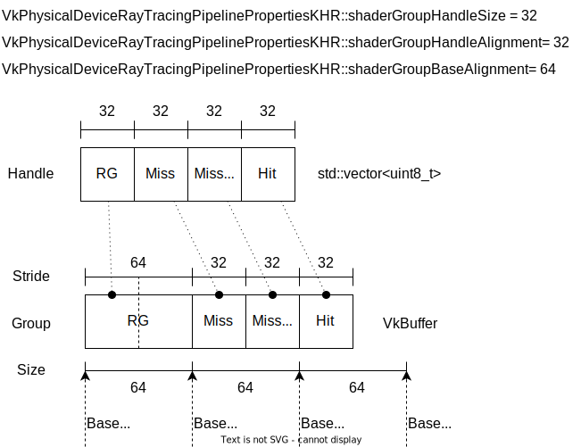
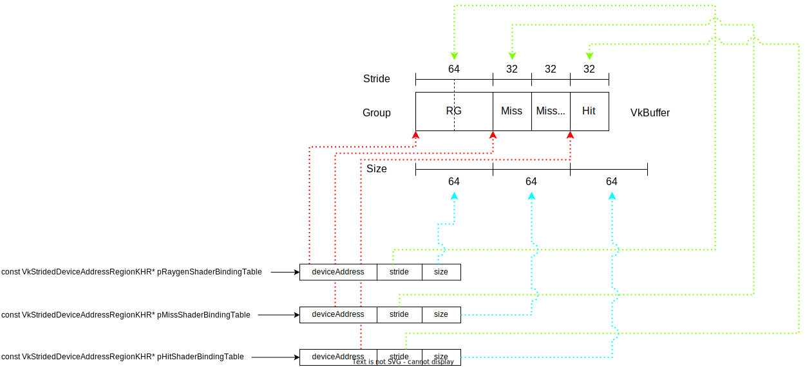

着色器绑定表
===========================

.. dropdown:: 更新记录
    :color: muted
    :icon: history

    * 2023/9/14 增加该扩展文档
    * 2023/9/14 增加 ``光追管线和着色器组结构`` 章节
    * 2023/9/14 增加 ``VkRayTracingShaderGroupCreateInfoKHR`` 章节
    * 2023/9/14 增加 ``一个简单的着色器绑定表示意图`` 章节
    * 2023/9/14 增加 ``着色器绑定表的分类`` 章节
    * 2023/9/14 增加 ``光线生成着色器组`` 章节
    * 2023/9/14 增加 ``命中组`` 章节
    * 2023/9/14 增加 ``未命中组`` 章节
    * 2023/9/14 增加 ``着色器绑定表的拷贝`` 章节
    * 2023/9/14 增加 ``着色器绑定表`` 章节
    * 2023/9/15 重命名 ``光线生成着色器组`` 为 ``生成组``
    * 2023/9/15 更新 ``生成组`` 章节
    * 2023/9/15 更新 ``一个简单的着色器绑定表示意图`` 章节
    * 2023/9/15 更新 ``未命中组`` 章节
    * 2023/9/15 重命名 ``着色器绑定表的分类`` 章节为 ``着色器组``
    * 2023/9/15 更新 ``着色器组`` 章节
    * 2023/9/15 更新 ``命中组`` 章节
    * 2023/9/15 更新 ``未命中组`` 章节
    * 2023/9/15 增加 ``着色器绑定表的构成`` 章节
    * 2023/9/15 增加 ``光线生成着色器绑定表`` 章节
    * 2023/9/15 增加 ``综上`` 章节
    * 2023/9/15 更新 ``着色器绑定表的拷贝`` 章节
    * 2023/9/15 增加 ``光追调度着色器绑定表寻址`` 章节
    * 2023/9/15 增加 ``命中着色器绑定表寻址`` 章节

`文献源`_

.. _文献源: https://registry.khronos.org/vulkan/specs/1.3-extensions/html/chap40.html#shader-binding-table

着色器绑定表
#####################################

* 着色器绑定表是一种用于将光追管线和加速结构联系起来的一种资源。
* 其指定了加速结构中每一个几何上要操作的着色器。
* 此外还包含每一个着色器要访问的资源，包括纹理索引，缓存地址和常量。
* 应用通过 ``VkBuffer`` 来分配和管理着色绑定表。
* 着色器绑定表作为光追管线的 ``vkCmdTraceRaysNV`` ， ``vkCmdTraceRaysKHR`` 或者 ``vkCmdTraceRaysIndirectKHR`` 光追调度指令的参数使用。

光追管线和着色器组结构
#####################################

    光追管线和着色器组结构示意图

VkRayTracingShaderGroupCreateInfoKHR
********************************************

`VkRayTracingShaderGroupCreateInfoKHR <./VK_KHR_ray_tracing_pipeline.html#vkraytracingshadergroupcreateinfokhr>`_

一个简单的着色器绑定表示意图
#####################################

    一个简单的着色器绑定表示意图

在创建光线追踪管线时需要通过指定 ``VkRayTracingShaderGroupCreateInfoKHR`` 来设置该管线中的着色器组。在光追光线创建时，驱动会根据用户 ``VkRayTracingPipelineCreateInfoKHR::pGroups`` 指定的着色器组创建相应着色器组句柄。在光追管线构建成功后，就可以
通过 ``vkGetRayTracingShaderGroupHandlesKHR`` 获取相应的着色器组句柄（示意图中的 ``Handle``）。

``Handle`` 是一个类型为 ``uint8_t`` 的数组，实际上就是一段连续的内存，用于存储着色器组对应的句柄（其中 :bdg-secondary:`VkPhysicalDeviceRayTracingPipelinePropertiesKHR::shaderGroupHandleSize` 就是单个句柄的比特大小，本机为 ``32``）。该数组就是通过 ``vkGetRayTracingShaderGroupHandlesKHR`` 获取得到的相应着色器句柄数据。

之后就需要创建一个 ``Buffer`` 缓存（上图的 ``Group``）用于存放（ ``Handle`` 拷贝到 ``Buffer`` 中）这些着色器组句柄，该 ``Buffer`` 就是传说中的着色器绑定表。

着色器组
********************************************

着色器组分为三种：

生成组
--------------------

生成组只能由一个光线生成着色器构成，用于生成光线。每一次光追调度只能执行一个光线生成着色器，也就是每一次光追调度只能有一个生成组。

如上图中的 ``RG`` 就是由一个光线生成着色器构成的生成组。

命中组
--------------------

命中组是由相交着色器、任意命中着色器和最近命中着色器，单一或两两或三三不重复构成的，比如：

* 单个相交着色器或单个任意命中着色器或单个最近命中着色器，可以构成一个命中组
* 一个任意命中着色器和一个最近命中着色器，可以构成一个命中组
* 一个任意命中着色器和一个最近命中着色器，可以构成一个命中组
* 一个相交着色器和一个任意命中着色器和一个最近命中着色器，可以构成一个命中组

如上图中的 ``Hit`` 就是由一个最近命中着色器构成的命中组。

未命中组
--------------------

当对场景中的某一几何物体光线相交查询失败时会调用。一次光追调度可以执行多个未命中着色器。

未命中组只能由一个未命中着色器构成。

如上图中的 ``Miss`` 和 ``Miss Shadow`` 就是各自由一个未命中着色器构成的未命中组。

可调用组
--------------------

可调用着色器是通过光追着色器请求执行的，一次光追调度可能会执行多次可调用着色器。

一个可调用组由一个可调用着色器构成。

.. note:: 着色器绑定表示意图中没有用到可调用着色器，也就没有可调用组。

着色器绑定表的构成
********************************************

与着色器组分类对应，着色器绑定表由三类着色器绑定表构成：

光线生成着色器绑定表
-----------------------

由一个生成组构成。

如上图的 ``RG`` 就是使用一个生成组构成一个光线生成着色器绑定表。

命中着色器绑定表
-----------------------

由多个命中组构成。

如上图的 ``Hit`` 就是使用一个命中组构成一个命中着色器绑定表。

未命中着色器绑定表
-----------------------

由多个未命中组构成。

如上图的 ``Miss`` 和 ``Miss Shadow`` 就是使用两个未命中组构成一个未命中着色器绑定表。

可调用着色器绑定表
-----------------------

由多个可调用组构成。

.. note:: 着色器绑定表示意图中没有用到可调用组，也就没有可调用着色器绑定表。

综上
-----------------------

着色器绑定表是由光线生成着色器绑定表、命中着色器绑定表、未命中着色器绑定表和可调用着色器绑定表组成的一张大表。

在使用 ``vkCmdTraceRaysKHR`` 光追调度时：

.. code:: c++

    // 由 VK_KHR_ray_tracing_pipeline 提供
    void vkCmdTraceRaysKHR(
        VkCommandBuffer                             commandBuffer,
        const VkStridedDeviceAddressRegionKHR*      pRaygenShaderBindingTable,
        const VkStridedDeviceAddressRegionKHR*      pMissShaderBindingTable,
        const VkStridedDeviceAddressRegionKHR*      pHitShaderBindingTable,
        const VkStridedDeviceAddressRegionKHR*      pCallableShaderBindingTable,
        uint32_t                                    width,
        uint32_t                                    height,
        uint32_t                                    depth);

其中：

* :bdg-secondary:`pRaygenShaderBindingTable` 对应着光线生成着色器绑定表。
* :bdg-secondary:`pMissShaderBindingTable` 对应着未命中着色器绑定表。
* :bdg-secondary:`pHitShaderBindingTable` 对应着命中着色器绑定表。
* :bdg-secondary:`pCallableShaderBindingTable` 对应着可调用着色器绑定表。

而 ``VkStridedDeviceAddressRegionKHR`` 定义如下：

.. code:: c++

    // 由 VK_KHR_ray_tracing_pipeline 提供
    typedef struct VkStridedDeviceAddressRegionKHR {
        VkDeviceAddress    deviceAddress;
        VkDeviceSize       stride;
        VkDeviceSize       size;
    } VkStridedDeviceAddressRegionKHR;

* :bdg-secondary:`deviceAddress` 对应着色器绑定表那张大表中该类型的绑定表的起始偏移地址。
* :bdg-secondary:`stride` 对应着该类型的绑定表中组句柄的大小。
* :bdg-secondary:`size` 对应着该类型的绑定表的大小。

各类型 ``VkStridedDeviceAddressRegionKHR`` 与示意图中着色器绑定表的对应结构示意图如下：

着色器绑定表的拷贝
********************************************

就是将各类着色器绑定表拷贝至由 ``VkBuffer`` 构成的着色器绑定表的大表中。

在将 ``Handle`` 拷贝到 ``Buffer`` 中时需要满足如下条件：

* :bdg-secondary:`VkPhysicalDeviceRayTracingPipelinePropertiesKHR::shaderGroupHandleSize` 单个着色器组句柄的大小。
* :bdg-secondary:`VkPhysicalDeviceRayTracingPipelinePropertiesKHR::shaderGroupHandleAlignment` 单个着色器组句柄的对齐大小。
* :bdg-secondary:`VkPhysicalDeviceRayTracingPipelinePropertiesKHR::shaderGroupBaseAlignment` 不同着色器组句柄的对齐大小。
* 光线生成着色器绑定表的 ``pRaygenShaderBindingTable->stride`` 是不使用的且必须等于 ``pRaygenShaderBindingTable->size``

光追调度着色器绑定表寻址
#####################################

在使用 ``vkCmdTraceRaysKHR`` 光追调度时， ``GPU`` 首先会去调用 ``光线生成着色器绑定表`` 中绑定的光线生成着色器生成光线并进行光线追踪。

光线生成着色器绑定表寻址
********************************************

该寻址比较简单，由于 ``pRaygenShaderBindingTable`` 中的 ``stride`` 和 ``size`` 是固定的，且相同， ``GPU`` 可直接通过 ``pRaygenShaderBindingTable`` 寻址到光线生成着色器。

自后，在光追着色器中使用 ``traceRayEXT`` 函数进行光线追踪。

.. code:: glsl

    void traceRayEXT(
                        accelerationStructureEXT topLevel,
                        uint rayFlags,
                        uint cullMask,
                        uint sbtRecordOffset,
                        uint sbtRecordStride,
                        uint missIndex,
                        vec3 origin,
                        float Tmin,
                        vec3 direction,
                        float Tmax,
                        int payload
                    );

* :bdg-secondary:`topLevel` 为顶层加速结构。
* :bdg-secondary:`rayFlags` 为追踪标志位。
* :bdg-secondary:`cullMask` 为剔除遮罩。
* :bdg-secondary:`sbtRecordOffset` 为命中着色器绑定表记录偏移。
* :bdg-secondary:`sbtRecordStride` 为命中着色器绑定表记录跨度。
* :bdg-secondary:`missIndex` 为未命中着色器绑定表引用。
* :bdg-secondary:`origin` 为追踪的光线起点。
* :bdg-secondary:`Tmin` 为追踪的光线长度的最小值。
* :bdg-secondary:`direction` 为追踪的光线的方向。
* :bdg-secondary:`Tmax` 为追踪的光线长度的最大值。
* :bdg-secondary:`payload` 为负载引用。

当调用 ``traceRayEXT`` 时需要设置 ``sbtRecordOffset`` 、 ``sbtRecordStride`` 和 ``missIndex`` 用于告诉 ``GPU`` ，当该追踪该光线时如果反生了命中或未命中， ``GPU`` 会根据这些设置去着色器绑定表中进行寻址，找到对应命中着色器绑定表和未命中绑定表中的光追着色器，进而进行调用。其中：

命中着色器绑定表寻址
********************************************

``sbtRecordOffset`` 和 ``sbtRecordStride`` 用于寻址命中着色器绑定表中的命中组。该寻址与创建实体（ ``VkAccelerationStructureInstanceKHR`` ）时设置的 ``instanceShaderBingdingTableRecordOffset`` 进行配合寻址。
``instanceShaderBingdingTableRecordOffset`` 用于记录命中着色器绑定表中的其实位置。 ``sbtRecordOffset`` 、 ``sbtRecordStride`` 和 ``instanceShaderBingdingTableRecordOffset`` 最终的寻址结果会加到 ``pHitShaderBindingTable->deviceAddress`` 中。

对于 ``traceRayEXT`` 完整的命中着色器绑定表寻址计算为：

.. math::

    pHitShaderBindingTable->deviceAddress+pHitShaderBindingTable->stride\times(instanceShaderBindingTableRecordOffset+geometryIndex \times sbtRecordStride+sbtRecordOffset)

.. note:: 其中 ``geometryIndex`` 为实体中的相交的几何体索引值

未命中着色器绑定表寻址
********************************************

``missIndex`` 用于寻址未命中着色器绑定表中的未命中组。进而找到对应的未命中着色器。

对于 ``traceRayEXT`` 完整的未命中着色器绑定表寻址计算为：

.. math::

    pMissShaderBindingTable->deviceAddress + pMissShaderBindingTable->stride \times missIndex

可调用着色器绑定表寻址
********************************************

通过在主色器中调用 ``executeCallableEXT`` 函数传入 ``sbtRecordIndex`` 参数进行可调用着色器绑定表寻址：

.. code:: glsl

    void executeCallableEXT(uint sbtRecordIndex, int callable);

对于 ``executeCallableEXT`` 完整的可调用着色器绑定表寻址算法为：

.. math::

    pCallableShaderBindingTable->deviceAddress + pCallableShaderBindingTable->stride \times sbtRecordIndex

