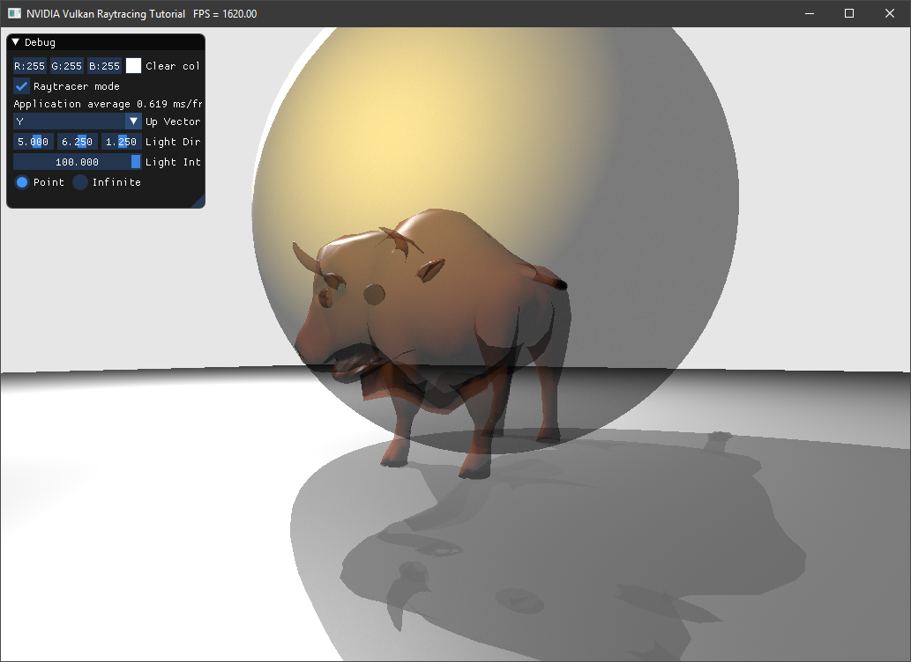

任意命中着色器（Any Hit Shaders）教程
======================================

.. dropdown:: 更新记录
    :color: muted
    :icon: history

    * 2023/8/24 增加该扩展文档
    * 2023/8/24 增加 ``教程`` 章节
    * 2023/8/24 增加 ``任意命中着色器`` 章节
    * 2023/8/24 增加 ``负载`` 章节
    * 2023/8/24 增加 ``将任意命中着色器加入光追管线中`` 章节
    * 2023/8/24 增加 ``配置任意命中着色器中访问的缓存`` 章节
    * 2023/8/24 增加 ``不透明标志位`` 章节
    * 2023/8/24 增加 ``光线生成着色器`` 章节
    * 2023/8/24 增加 ``最近命中着色器`` 章节
    * 2023/8/24 增加 ``场景和模型`` 章节
    * 2023/8/24 增加 ``OBJ 材质`` 章节
    * 2023/8/24 增加 ``累积`` 章节
    * 2023/8/24 增加 ``修正管线`` 章节

`文献源`_

.. _文献源: https://github.com/nvpro-samples/vk_raytracing_tutorial_KHR/blob/master/ray_tracing_anyhit/README.md

    任意命中着色器结果示意图

教程
####################

该教程为 ``Vulkan`` 光线追踪教程的扩展。

与最近命中着色器（ ``closest hit shade`` ）类似，任意命中着色器在光线与几何体相交处执行，与最近命中着色器不同的是，任意命中着色器将会在沿着光线与几何体的所有交点处执行。最近命中着色器只会在最近的交点处执行。

任意命中着色器对于交点的剔除很有用，比如剔除透明的交点，但也可用于进行简单的透明化操作。在本示例中我们将会展示添加该着色器类型需要做什么并实现一个透明效果。

.. note:: 该示例的很多元素来源于 `相机抖动抗锯齿教程 <./JitterCamera.html>`_

任意命中着色器
####################

创建一个新的着色器文件 ``raytrace.rahit`` 之后执行 ``CMake`` 使其加入到工程的解决方案中。

该着色器一开始和 ``raytrace.chit`` 最近命中着色器相似，但使用的信息更少。

.. code:: glsl

    #version 460
    #extension GL_EXT_ray_tracing : require
    #extension GL_EXT_scalar_block_layout : enable
    #extension GL_GOOGLE_include_directive : enable

    #extension GL_EXT_shader_explicit_arithmetic_types_int64 : require
    #extension GL_EXT_buffer_reference2 : require

    #include "random.glsl"
    #include "raycommon.glsl"
    #include "wavefront.glsl"

    // clang-format off
    layout(location = 0) rayPayloadInEXT hitPayload prd;
    layout(buffer_reference, scalar) buffer Vertices {Vertex v[]; }; // 物体的顶点数据
    layout(buffer_reference, scalar) buffer Indices {uint i[]; }; // 三角形索引
    layout(buffer_reference, scalar) buffer Materials {WaveFrontMaterial m[]; }; // 物体中的所有材质数据
    layout(buffer_reference, scalar) buffer MatIndices {int i[]; }; // 每一个三角形对应的材质信息
    layout(set = 1, binding = eObjDescs, scalar) buffer ObjDesc_ { ObjDesc i[]; } objDesc;
    // clang-format on

.. note:: ``random.glsl`` 可以在 `相机抖动抗锯齿教程 <./JitterCamera.html>`_ 中找到。

对于任意命中着色器，我们需要知道我们命中了哪一个材质，且该材质是否支持透明。如果材质是不透明，我们直接返回，也就是说采用该命中点为最终命中。

.. code:: glsl

    void main()
    {
      // 物体数据
      ObjDesc    objResource = objDesc.i[gl_InstanceCustomIndexEXT];
      MatIndices matIndices  = MatIndices(objResource.materialIndexAddress);
      Materials  materials   = Materials(objResource.materialAddress);

      // 物体的材质
      int               matIdx = matIndices.i[gl_PrimitiveID];
      WaveFrontMaterial mat    = materials.m[matIdx];

      if (mat.illum != 4)
        return;

现在我们开启透明：

.. code:: glsl

      if (mat.dissolve == 0.0)
          ignoreIntersectionEXT();
      else if(rnd(prd.seed) > mat.dissolve)
         ignoreIntersectionEXT();
    }

正如你所见，我们生成一个随机数（ :code:`rnd(prd.seed)` ）来判断光线是否命中或忽略该物体。如果我们积累了足够多的光线的话，最终的结果将会趋向于我们希望的理想结果。

负载
####################

随机 ``seed`` 同样需要存入光线负载中。

在 ``raycommon.glsl`` 中，增加 ``seed`` 成员变量：

.. code:: glsl

    struct hitPayload
    {
      vec3 hitValue;
      uint seed;
    };

将任意命中着色器加入光追管线中
###############################

该任意命中着色器将会作为命中着色器组的成员。就目前为止，命中着色器组仅有一个最近命中着色器。

在 ``createRtPipeline()`` 中，在加载 ``raytrace.rchit.spv`` 之后加载 ``raytrace.rahit.spv`` 。

.. code:: c++

    enum StageIndices
    {
      ...
      eAnyHit,
      eShaderGroupCount
    };

    // 命中组 - 任意命中
    stage.module = nvvk::createShaderModule(m_device, nvh::loadFile("spv/raytrace.rahit.spv", true, defaultSearchPaths, true));
    stage.stage  = VK_SHADER_STAGE_ANY_HIT_BIT_KHR;
    stages[eAnyHit] = stage;

任意命中着色器和最近命中着色器在同一个命中组中，所以我们需要将任意命中着色器索引加入其中并存入到相应数组中。

.. code:: c++

    // 最近命中着色器
    // 负载 0
    group.type             = VK_RAY_TRACING_SHADER_GROUP_TYPE_TRIANGLES_HIT_GROUP_KHR;
    group.generalShader    = VK_SHADER_UNUSED_KHR;
    group.closestHitShader = eClosestHit;
    group.anyHitShader     = eAnyHit;
    m_rtShaderGroups.push_back(group);

配置任意命中着色器中访问的缓存
###############################

在 ``createDescriptorSetLayout()`` 中我们配置描述符集布局使得任意命中着色器可访问场景描述缓存。

.. code:: c++

    // 物体描述
    m_descSetLayoutBind.addBinding(eObjDescs, VK_DESCRIPTOR_TYPE_STORAGE_BUFFER, 1,
                                   VK_SHADER_STAGE_VERTEX_BIT | VK_SHADER_STAGE_FRAGMENT_BIT
                                       | VK_SHADER_STAGE_CLOSEST_HIT_BIT_KHR | VK_SHADER_STAGE_ANY_HIT_BIT_KHR);

不透明标志位
###############################

当该示例创建 ``VkAccelerationStructureGeometryKHR`` 时，我们设置的标示位为 ``VK_GEOMETRY_OPAQUE_BIT_KHR`` 不透明标志位。然而该标志位会导致忽略任意命中着色器。

我们可以简单的移除所有的 ``VK_GEOMETRY_OPAQUE_BIT_KHR`` 标志位，但这会导致另一个问题：:bdg-warning:`同一个三角形可能会多次调用任意命中着色器` 。为了在每一个三角形上只执行一次任意命中着色器，设置 ``VK_GEOMETRY_NO_DUPLICATE_ANY_HIT_INVOCATION_BIT_KHR`` 标志位：

.. code:: c++

    asGeom.flags = VK_GEOMETRY_NO_DUPLICATE_ANY_HIT_INVOCATION_BIT_KHR;  // 避免重复命中

光线生成着色器
###############################

如果您已经完成了 `相机抖动抗锯齿教程 <./JitterCamera.html>`_ 的话，接下来只需要稍作修改即可。

首先 ``seed`` 需要在任意命中着色器中使用，这就是为什么我们将其加入到 ``hitPayload`` 结构体中。

将所有 ``seed`` 改成 ``prd.seed`` 。

.. code:: c++

    prd.seed = tea(gl_LaunchIDEXT.y * gl_LaunchSizeEXT.x + gl_LaunchIDEXT.x, pushC.frame);

之前为了优化，调用 ``TraceRayEXT`` 时使用 ``gl_RayFlagsOpaqueEXT`` 标志位。但这会忽略任意命中着色器，所以将其改成：

.. code:: c++

    uint  rayFlags = gl_RayFlagsNoneEXT;

最近命中着色器
###############################

类似的，在最近命中着色器中将标志位修改成 ``gl_RayFlagsSkipClosestHitShaderEXT`` ，目的是我们希望激活任意命中着色器和未命中着色器，但我们还不关心最近命中着色器的阴影射线。这将会开启透明阴影。

.. code:: c++

    uint  flags = gl_RayFlagsSkipClosestHitShaderEXT;

场景和模型
###############################

您可以通过改变 ``main()`` 中的 ``helloVk.loadModel`` 调用来组建更加有趣的场景：

.. code:: c++

    helloVk.loadModel(nvh::findFile("media/scenes/wuson.obj", defaultSearchPaths, true));
    helloVk.loadModel(nvh::findFile("media/scenes/sphere.obj", defaultSearchPaths, true),
                      nvmath::scale_mat4(nvmath::vec3f(1.5f))
                          * nvmath::translation_mat4(nvmath::vec3f(0.0f, 1.0f, 0.0f)));
    helloVk.loadModel(nvh::findFile("media/scenes/plane.obj", defaultSearchPaths, true));

OBJ 材质
###############################

默认情况下，所有的物体都是不透明的，您需要改变材质的描述信息。

修改 ``media/scenes/wuson.mtl`` 和 ``media/scenes/sphere.mtl`` 前几行使得新的光照模型为 ``4`` ， ``dissolve`` 值为 ``0.5`` ：

.. code:: c++

    newmtl  default
    illum 4
    d 0.5
    ...

累积
###############################

正如前面提到的，为了达到效果，我们需要随着时间累积每一帧，请实现 `相机抖动抗锯齿教程 <./JitterCamera.html>`_ 中的：

* `Frame Number <https://github.com/nvpro-samples/vk_raytracing_tutorial_KHR/tree/master/ray_tracing_jitter_cam#frame-number>`_ :bdg-danger:`未翻译`
* `Storing or Updating <https://github.com/nvpro-samples/vk_raytracing_tutorial_KHR/tree/master/ray_tracing_jitter_cam#storing-or-updating>`_ :bdg-danger:`未翻译`
* `Application Frame Update <https://github.com/nvpro-samples/vk_raytracing_tutorial_KHR/tree/master/ray_tracing_jitter_cam#application-frame-update>`_ :bdg-danger:`未翻译`

修正管线
###############################