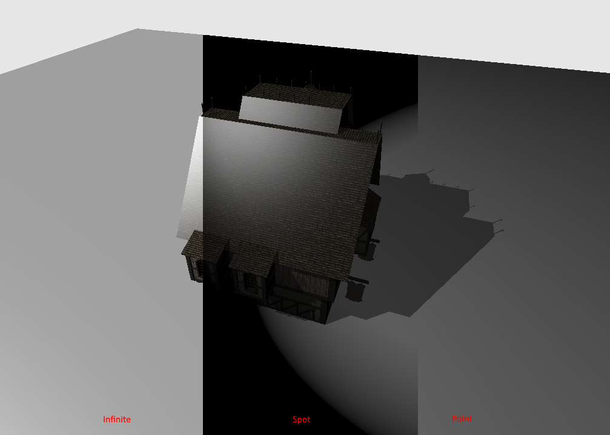

可调用着色器
======================================

.. dropdown:: 更新记录
    :color: muted
    :icon: history

    * 2023/10/16 增加该扩展文档
    * 2023/10/16 增加 ``教程`` 章节
    * 2023/10/16 增加 ``数据存储`` 章节
    * 2023/10/17 增加 ``执行`` 章节
    * 2023/10/17 增加 ``可调用着色器加入着色器绑定表中`` 章节
    * 2023/10/17 增加 ``创建可调用着色器`` 章节
    * 2023/10/17 增加 ``可调用着色器`` 章节
    * 2023/10/17 增加 ``着色器绑定表`` 章节
    * 2023/10/17 增加 ``调用可调用着色器`` 章节

`文献源`_

.. _文献源: https://github.com/nvpro-samples/vk_raytracing_tutorial_KHR/tree/master/ray_tracing_callable

.. _光线追踪教程: ../NVIDIAVulkanRayTracingTutorial.html

    可调用着色器结果示意图

教程
####################

该教程为 ``Vulkan`` `光线追踪教程`_ 的扩展。

实时光追支持在光线生成着色器、最近命中着色器、未命中着色器或者其他可调用着色器中使用 ``可调用着色器`` 。可调用着色器的调用有点类似间接函数的调用，不需要将这些着色器链接进可执行程序中。

数据存储
####################

可调用着色器只能够访问父阶段（可调用着色器的调用者）传进来的数据。且一次只能传递一个结构提数据并像负载那样声明。

在父阶段，使用 ``callableDataEXT`` 存储限定符声明传递的数据。比如：

.. code:: glsl

    layout(location = 0) callableDataEXT rayLight cLight;

其中 ``rayLight`` 结构体定义在共享文件中。

.. code:: glsl

    struct rayLight
    {
      vec3  inHitPosition;
      float outLightDistance;
      vec3  outLightDir;
      float outIntensity;
    };

并且在可调用着色器内部必须使用 ``callableDataInEXT`` 存储限定符声明传入的数据。

.. code:: glsl

    layout(location = 0) callableDataInEXT rayLight cLight;

执行
####################

为了执行可调用着色器，需要在父阶段着色器中调用 ``executeCallableEXT`` 函数。

该函数的第一个参数就是着色器绑定表中的索引，第二个参数对应着 ``location`` 声明的索引。

如下函数调用将执行可调用着色器。

.. code:: glsl

    executeCallableEXT(pushC.lightType, 0);

可调用着色器加入着色器绑定表中
#################################

创建可调用着色器
********************

在 ``HelloVulkan::createRtPipeline()`` 中，紧接着最近命中着色器的后面，我们将会增加 ``3`` 个可调用着色器，分别对应不同的光源类型。

首先创建相应的着色器：

.. code:: c++

  enum StageIndices
  {
    eRaygen,
    eMiss,
    eMiss2,
    eClosestHit,
    eCall0,
    eCall1,
    eCall2,
    eShaderGroupCount
  };

  ...
  // 可调用着色器 0
  stage.module = nvvk::createShaderModule(m_device, nvh::loadFile("spv/light_point.rcall.spv", true, defaultSearchPaths, true));
  stage.stage    = VK_SHADER_STAGE_CALLABLE_BIT_KHR;
  stages[eCall0] = stage;
  // 可调用着色器 1
  stage.module = nvvk::createShaderModule(m_device, nvh::loadFile("spv/light_spot.rcall.spv", true, defaultSearchPaths, true));
  stage.stage    = VK_SHADER_STAGE_CALLABLE_BIT_KHR;
  stages[eCall1] = stage;
  // 可调用着色器 2
  stage.module = nvvk::createShaderModule(m_device, nvh::loadFile("spv/light_inf.rcall.spv", true, defaultSearchPaths, true));
  stage.stage    = VK_SHADER_STAGE_CALLABLE_BIT_KHR;
  stages[eCall2] = stage;

之后使用相应的着色器设置 ``3`` 个可调用着色器组：

.. code:: c++

    // 可调用着色器组
    group.type             = VK_RAY_TRACING_SHADER_GROUP_TYPE_GENERAL_KHR;
    group.closestHitShader = VK_SHADER_UNUSED_KHR;
    group.generalShader    = eCall0;
    m_rtShaderGroups.push_back(group);
    group.generalShader = eCall1;
    m_rtShaderGroups.push_back(group);
    group.generalShader = eCall2;
    m_rtShaderGroups.push_back(group);

可调用着色器
********************

三个可调用着色器源码如下：

.. code:: glsl

    // light_point.rcall

    #version 460 core
    #extension GL_EXT_ray_tracing : enable
    #extension GL_GOOGLE_include_directive : enable
    #include "raycommon.glsl"

    layout(location = 0) callableDataInEXT rayLight cLight;

    layout(push_constant) uniform Constants
    {
      vec4  clearColor;
      vec3  lightPosition;
      float lightIntensity;
      vec3  lightDirection;
      float lightSpotCutoff;
      float lightSpotOuterCutoff;
      int   lightType;
    };

    void main()
    {
      vec3 lDir               = lightPosition - cLight.inHitPosition;
      cLight.outLightDistance = length(lDir);
      cLight.outIntensity     = lightIntensity / (cLight.outLightDistance * cLight.outLightDistance);
      cLight.outLightDir      = normalize(lDir);
    }

.. code:: glsl

    // light_spot.rcall

    #version 460 core
    #extension GL_EXT_ray_tracing : enable
    #extension GL_GOOGLE_include_directive : enable
    #include "raycommon.glsl"

    layout(location = 0) callableDataInEXT rayLight cLight;

    layout(push_constant) uniform Constants
    {
      vec4  clearColor;
      vec3  lightPosition;
      float lightIntensity;
      vec3  lightDirection;
      float lightSpotCutoff;
      float lightSpotOuterCutoff;
      int   lightType;
    };

    void main()
    {
      vec3 lDir               = lightPosition - cLight.inHitPosition;
      cLight.outLightDistance = length(lDir);
      cLight.outIntensity     = lightIntensity / (cLight.outLightDistance * cLight.outLightDistance);
      cLight.outLightDir      = normalize(lDir);
      float theta             = dot(cLight.outLightDir, normalize(-lightDirection));
      float epsilon           = lightSpotCutoff - lightSpotOuterCutoff;
      float spotIntensity     = clamp((theta - lightSpotOuterCutoff) / epsilon, 0.0, 1.0);
      cLight.outIntensity *= spotIntensity;
    }

.. code:: glsl

    // light_inf.rcall

    #version 460 core
    #extension GL_EXT_ray_tracing : enable
    #extension GL_GOOGLE_include_directive : enable
    #include "raycommon.glsl"

    layout(location = 0) callableDataInEXT rayLight cLight;

    layout(push_constant) uniform Constants
    {
      vec4  clearColor;
      vec3  lightPosition;
      float lightIntensity;
      vec3  lightDirection;
      float lightSpotCutoff;
      float lightSpotOuterCutoff;
      int   lightType;
    };

    void main()
    {
      cLight.outLightDistance = 10000000;
      cLight.outIntensity     = 1.0;
      cLight.outLightDir      = normalize(-lightDirection);
    }

可以看到每个可调用着色器分别计算各自的光源类型数据。

着色器绑定表
********************

在本示例中，我们将会使用 ``nvvk::SBTWrapper`` 。其内部将会使用创建光追管线中的信息自动适配着色器绑定表缓存的内部结构。

在 ``hello_vulkan.h`` 头文件中，将该包装器添加进来并增加一个新成员。

.. code:: c++

    #include "nvvk/sbtwrapper_vk.hpp"
    ...
    nvvk::SBTWrapper m_sbtWrapper;

在 ``HelloVulkan::initRayTracing()`` 通过如下代码进行初始化。

.. code:: c++

    m_sbtWrapper.setup(m_device, m_graphicsQueueIndex, &m_alloc, m_rtProperties);

在 ``HelloVulkan::createRtPipeline()`` 中紧接着调用 ``vkCreateRayTracingPipelinesKHR()`` 创建管线之后，调用如下代码创建着色器绑定表：

.. code:: c++

    m_sbtWrapper.create(m_rtPipeline, rayPipelineInfo);

在 ``HelloVulkan::raytrace()`` 中，我们将会告诉管线可调用着色器对应的起始位置。我们将会在命中着色器绑定表之后增加可调用着色器绑定表。着色器绑定表的结构如下：

.. figure:: ../../../_static/sbt.png

    着色器绑定表内部结构意图

着色器绑定表包装器将会返回我们需要的信息。相比于手动计算每个绑定表的偏移，我们可以通过包装器直接获得每个类型组对应的 ``VkStridedDeviceAddressRegionKHR`` 。

.. code:: c++

    auto& regions = m_sbtWrapper.getRegions();
    vkCmdTraceRaysKHR(cmdBuf, &regions[0], &regions[1], &regions[2], &regions[3], m_size.width, m_size.height, 1);

调用可调用着色器
#################################

在最近命中着色器中，相比于使用 ``if-else`` 判定，我们现在可以使用可调用着色器分别计算相应的光源类型数据。

.. code:: glsl

    cLight.inHitPosition = worldPos;
    //#define DONT_USE_CALLABLE
    #if defined(DONT_USE_CALLABLE)
      // Point light
      if(pushC.lightType == 0)
      {
        vec3  lDir              = pushC.lightPosition - cLight.inHitPosition;
        float lightDistance     = length(lDir);
        cLight.outIntensity     = pushC.lightIntensity / (lightDistance * lightDistance);
        cLight.outLightDir      = normalize(lDir);
        cLight.outLightDistance = lightDistance;
      }
      else if(pushC.lightType == 1)
      {
        vec3 lDir               = pushC.lightPosition - cLight.inHitPosition;
        cLight.outLightDistance = length(lDir);
        cLight.outIntensity =
            pushC.lightIntensity / (cLight.outLightDistance * cLight.outLightDistance);
        cLight.outLightDir  = normalize(lDir);
        float theta         = dot(cLight.outLightDir, normalize(-pushC.lightDirection));
        float epsilon       = pushC.lightSpotCutoff - pushC.lightSpotOuterCutoff;
        float spotIntensity = clamp((theta - pushC.lightSpotOuterCutoff) / epsilon, 0.0, 1.0);
        cLight.outIntensity *= spotIntensity;
      }
      else  // Directional light
      {
        cLight.outLightDir      = normalize(-pushC.lightDirection);
        cLight.outIntensity     = 1.0;
        cLight.outLightDistance = 10000000;
      }
    #else
      executeCallableEXT(pushC.lightType, 0);
    #endif

.. admonition:: DONT_USE_CALLABLE
    :class: note

    使用宏 ``DONT_USE_CALLABLE`` 来设置使用可调用着色器还是使用 ``if-else`` 进行计算。