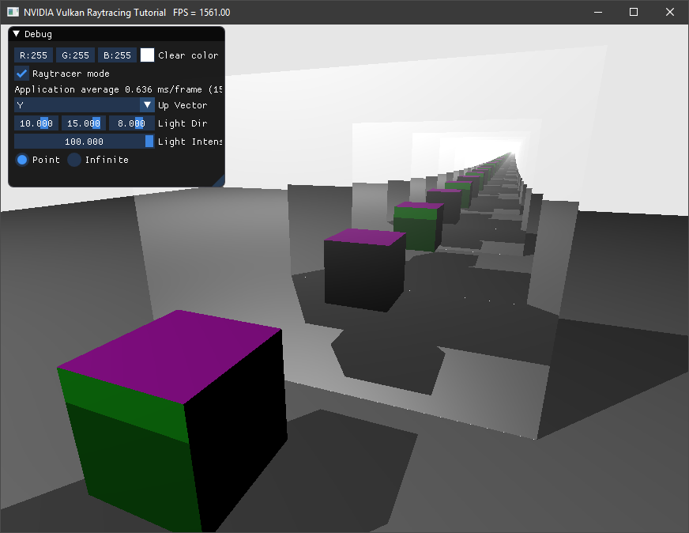

反射
======================================

.. dropdown:: 更新记录
    :color: muted
    :icon: history

    * 2023/9/7 增加该扩展文档
    * 2023/9/7 增加 ``教程`` 章节
    * 2023/9/7 增加 ``布置场景`` 章节
    * 2023/9/7 增加 ``递归反射`` 章节
    * 2023/9/7 增加 ``raycommon.glsl`` 章节
    * 2023/9/7 增加 ``raytrace.rgen`` 章节
    * 2023/9/7 增加 ``raytrace.rchit`` 章节
    * 2023/9/7 增加 ``raytrace.rmiss`` 章节
    * 2023/9/7 增加 ``可运行，但有限制`` 章节
    * 2023/9/7 增加 ``迭代反射`` 章节
    * 2023/9/7 ``迭代反射`` 章节下增加 ``raycommon.glsl`` 章节
    * 2023/9/7 ``迭代反射`` 章节下增加 ``raytrace.rgen`` 章节
    * 2023/9/7 ``迭代反射`` 章节下增加 ``raytrace.rchit`` 章节
    * 2023/9/7 ``迭代反射`` 章节下增加 ``raytrace.rmiss`` 章节
    * 2023/9/7 ``迭代反射`` 章节下增加 ``最大递归`` 章节
    * 2023/9/7 增加 ``控制递归深度`` 章节
    * 2023/9/12 提供 ``Turbo`` 实现开源示例

`文献源`_

.. _文献源: https://github.com/nvpro-samples/vk_raytracing_tutorial_KHR/tree/master/ray_tracing_reflections

.. admonition:: Turbo 引擎中对该教程的实现示例
    :class: note

    ``Turbo`` 引擎对该教程进行了实现，具体如下：

    * `VulkanKHRRayTracingTestForReflections <https://github.com/FuXiii/Turbo/blob/master/samples/VulkanKHRRayTracingTestForReflections.cpp>`_ ：在 `实例化 <../extensions/Instances.html>`_ 基础上实现。 `示例视频 <https://www.bilibili.com/video/BV1pp4y1L7Ew/?vd_source=df46bdc268062b383081e71f702cbc1d>`_
    * `VulkanKHRRayTracingTestForReflections_WithoutLimited <https://github.com/FuXiii/Turbo/blob/master/samples/VulkanKHRRayTracingTestForReflections_WithoutLimited.cpp>`_ ：在 `实例化 <../extensions/Instances.html>`_ 基础上实现。 `示例视频 <https://www.bilibili.com/video/BV17z4y1j7St/?spm_id_from=333.999.0.0&vd_source=df46bdc268062b383081e71f702cbc1d>`_

    反射结果示意图

教程
####################

该教程为 ``Vulkan`` `光线追踪教程 <../NVIDIAVulkanRayTracingTutorial.html>`_ 的扩展。

布置场景
####################

首先，我们将在场景中平行按一定间隔放置两个反光平面（压扁拉长的正方体），并在中间放置一个各面异色的正方体。将 ``main()`` 中的 ``helloVk.loadModel`` 调用修改成如下：

.. code:: c++

    helloVk.loadModel(nvh::findFile("media/scenes/cube.obj", defaultSearchPaths, true),
                      nvmath::translation_mat4(nvmath::vec3f(-2, 0, 0))
                          * nvmath::scale_mat4(nvmath::vec3f(.1f, 5.f, 5.f)));
    helloVk.loadModel(nvh::findFile("media/scenes/cube.obj", defaultSearchPaths, true),
                      nvmath::translation_mat4(nvmath::vec3f(2, 0, 0))
                          * nvmath::scale_mat4(nvmath::vec3f(.1f, 5.f, 5.f)));
    helloVk.loadModel(nvh::findFile("media/scenes/cube_multi.obj", defaultSearchPaths, true));
    helloVk.loadModel(nvh::findFile("media/scenes/plane.obj", defaultSearchPaths, true),
                      nvmath::translation_mat4(nvmath::vec3f(0, -1, 0)));

之后在 ``media/scenes`` 中找到 ``cube.mtl`` 并将材质的反射率修改为 ``95%`` ，并修改漫反射影响系数，使其不受漫反射影响。

.. code:: text

    newmtl  cube_instance_material
    illum 3
    d 1
    Ns 32
    Ni 0
    Ka 0 0 0
    Kd 0 0 0
    Ks 0.95 0.95 0.95

递归反射
####################

``Vulkan`` 的光线追踪允许递归调用 ``traceRayEXT`` ，对应的限制定义在 ``VkPhysicalDeviceRayTracingPropertiesKHR`` 中。

在 ``hello_vulkan.cpp`` 的 ``createRtPipeline()`` 中，将最大的递归深度设置为 ``10`` ，并确保不会超过物理设备允许的最大递归限制：

.. code:: c++

    rayPipelineInfo.maxPipelineRayRecursionDepth  = std::max(10u, m_rtProperties.maxRecursionDepth);  // 光线递归深度

raycommon.glsl
********************

我们需要知道光线的递归深度和衰减。在 ``raycommon.glsl`` 的 ``hitPayload`` 结构体中增加如下：

.. code:: glsl

    int  depth;
    vec3 attenuation;

raytrace.rgen
********************

在光线生成着色器中，我们在调用 ``traceRayEXT`` 之前初始化所有的负载。

.. code:: glsl

    prd.depth       = 0;
    prd.hitValue    = vec3(0);
    prd.attenuation = vec3(1.f, 1.f, 1.f);

raytrace.rchit
********************

在最近命中着色器的结尾，设置 ``prd.hitValue`` 之前，当材质是反射时我们需要发射一条光线。

.. code:: glsl

    // 反射
    if(mat.illum == 3 && prd.depth < 10)
    {
      vec3 origin   = worldPos;
      vec3 rayDir   = reflect(gl_WorldRayDirectionEXT, normal);
      prd.attenuation *= mat.specular;

      prd.depth++;
      traceRayEXT(topLevelAS,         // acceleration structure
              gl_RayFlagsNoneEXT,  // rayFlags
              0xFF,               // cullMask
              0,                  // sbtRecordOffset
              0,                  // sbtRecordStride
              0,                  // missIndex
              origin,             // ray origin
              0.1,                // ray min range
              rayDir,             // ray direction
              100000.0,           // ray max range
              0                   // payload (location = 0)
      );
      prd.depth--;
    }

我们需要积累 ``hitValue`` 的计算值，目前的负载是用于执行光线生成着色器生成的光线的全局负载，所以将 ``main()`` 函数的最后一行改成：

.. code:: glsl

    prd.hitValue += vec3(attenuation * lightIntensity * (diffuse + specular)) * prd.attenuation;

raytrace.rmiss
********************

最后，未命中着色器中同样也需要进行衰减计算：

.. code:: glsl

    prd.hitValue = clearColor.xyz * 0.8 * prd.attenuation;

可运行，但有限制
********************

目前是可以运行的，但是 ``GPU`` 的递归能力有限制，并且会性能造成冲击。如果我们强制越过该递归限制的话，最终会造成设备丢失的错误。

迭代反射
####################

之前是在最近命中着色器中发射一条新射线，现在我们将返回负载中的信息用于判断是否需要发射新的射线。

raycommon.glsl
********************

在负载中增加如下信息用于发射新射线。

.. code:: glsl

    int  done;
    vec3 rayOrigin;
    vec3 rayDir;

raytrace.rgen
********************

初始化负载的新成员：

.. code:: glsl

    prd.done        = 1;
    prd.rayOrigin   = origin.xyz;
    prd.rayDir      = direction.xyz;

之前仅调用一次 ``traceRayEXT`` ，现在我能将循环调用直到结束。

将 ``raytrace.rgen`` 中的追踪调用包装成如下形式：

.. code:: glsl

    vec3 hitValue = vec3(0);
    for(;;)
    {
      traceRayEXT(/*.. */);

      hitValue += prd.hitValue * prd.attenuation;

      prd.depth++;
      if(prd.done == 1 || prd.depth >= 10)
        break;

      origin.xyz    = prd.rayOrigin;
      direction.xyz = prd.rayDir;
      prd.done      = 1; // 如果没有击中反射材质将会结束
    }

并确保写入正确的值。

.. code:: glsl

    imageStore(image, ivec2(gl_LaunchIDEXT.xy), vec4(hitValue, 1.0));

raytrace.rchit
********************

现在我们就不需要在最近命中着色器中发射光线了，所以我们可以将结尾的代码改成如下：

.. code:: glsl

    if(mat.illum == 3)
    {
      vec3 origin = worldPos;
      vec3 rayDir = reflect(gl_WorldRayDirectionEXT, normal);
      prd.attenuation *= mat.specular;
      prd.done      = 0;
      prd.rayOrigin = origin;
      prd.rayDir    = rayDir;
    }

对于负载的 ``hitValue`` 也不需要进行累加，也不需要与负载衰减相乘：

.. code:: glsl

    prd.hitValue = vec3(attenuation * lightIntensity * (diffuse + specular));

raytrace.rmiss
********************

现在衰减有光线生成着色器负责处理，未命中着色器中就不需要衰减光线了：

.. code:: glsl

    prd.hitValue = clearColor.xyz * 0.8;

最大递归
********************

最后，我们不再需要 ``createRtPipeline`` 时设置的更高递归层级，仅使用 ``2`` 层递归层级即可，一个用于初始发射光线，一个用于阴影射线。

.. code:: c++

    rayPipelineInfo.maxPipelineRayRecursionDepth = 2;  // Ray depth

在 ``raytrace.rgen`` 中，现在我们就可以将最大光线递归深度设置的非常大，比如 ``100`` ，这样就不会导致设备丢失错误。

控制递归深度
####################

此外，我们还可以增加一个 ``UI`` 控件来控制最大的递归深度

在 ``PushConstantRay`` 结构体中，增加一个新的 ``maxDepths`` 成员传递到着色器中。

.. code:: c++

    struct PushConstantRay
    {
      vec4  clearColor;
      vec3  lightPosition;
      float lightIntensity;
      int   lightType;
      int   maxDepth;
    };

并在 ``hello_vulkan.h`` 中将其默认值设置为 ``10`` 。

.. code:: c++

    PushConstantRay m_pcRay{{}, {}, 0, 0, 10};

在 ``raytrace.rgen`` 着色器中，我们将使用该值用于判定何时结束。

.. code:: glsl

    if(prd.done == 1 || prd.depth >= pushC.maxDepth)
        break;

最后，在 ``main.cpp`` 中调用 ``renderUI()`` 函数之后，我们在界面上增加一个滑条控件来控制递归深度值。

.. code:: c++

    ImGui::SliderInt("Max Depth", &helloVk.m_pcRay.maxDepth, 1, 50);