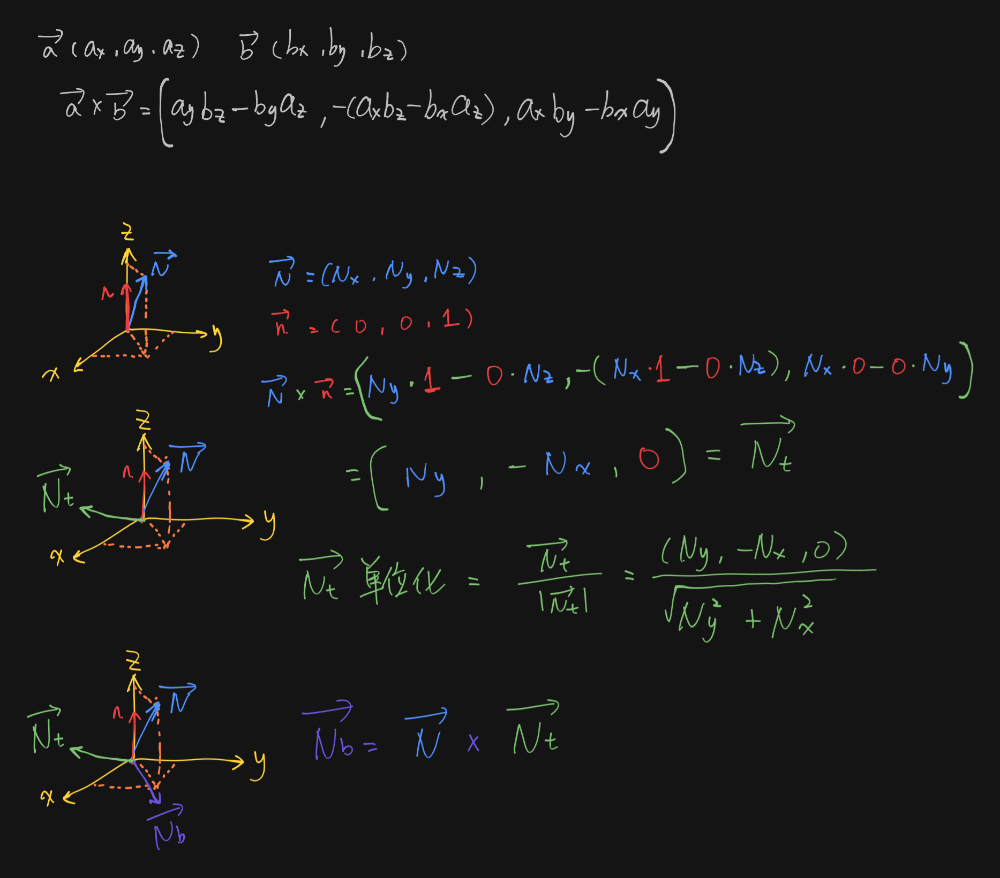

glTF 场景
======================================

.. dropdown:: 更新记录
    :color: muted
    :icon: history

    * 2023/10/24 增加该扩展文档
    * 2023/10/24 增加 ``教程`` 章节
    * 2023/10/24 增加 ``场景数据`` 章节
    * 2023/10/26 增加 ``加载 glTF 场景`` 章节
    * 2023/10/26 增加 ``加载场景`` 章节
    * 2023/10/26 增加 ``几何体转底层加速结构`` 章节
    * 2023/10/26 增加 ``创建顶层加速结构`` 章节
    * 2023/10/28 增加 ``光栅化渲染`` 章节
    * 2023/10/28 增加 ``光线追踪修改`` 章节
    * 2023/10/28 增加 ``描述符和管线修改`` 章节
    * 2023/10/28 增加 ``着色器`` 章节
    * 2023/10/28 增加 ``其他改变`` 章节
    * 2023/10/28 增加 ``相机位置`` 章节
    * 2023/10/28 增加 ``场景`` 章节
    * 2023/10/28 增加 ``简单路径（光线）追踪`` 章节
    * 2023/10/28 增加 ``光线生成着色器`` 章节
    * 2023/10/28 增加 ``最近命中着色器`` 章节
    * 2023/10/28 增加 ``createCoordinateSystem`` 章节
    * 2023/10/28 增加 ``samplingHemisphere`` 章节
    * 2023/11/1 更新 ``createCoordinateSystem`` 章节

`文献源`_

.. _文献源: https://github.com/nvpro-samples/vk_raytracing_tutorial_KHR/tree/master/ray_tracing_gltf

.. _光线追踪教程: ../NVIDIAVulkanRayTracingTutorial.html

.. figure:: ../../../_static/vk_ray_tracing_gltf_KHR.png

    glTF 场景光栅化结果示意图

教程
####################

该教程为对 ``Vulkan`` `光线追踪教程`_ 示例的修改。之前是加载单个的 ``OBJ`` 模型，在该示例中将会加载包含多个物体的 ``glTF`` 场景。

该示例并不是介绍如何渲染的，但是使用了比 ``OBJ`` 更加复杂的数据。

如果您想查阅更加完善的版本，请查阅：

* `vk_raytrace <https://github.com/nvpro-samples/vk_raytrace>`_
* `vk_shaded_gltfscene <https://github.com/nvpro-samples/vk_shaded_gltfscene>`_

场景数据
####################

对于 ``OBJ`` 模型加载的数据最终会存入四个缓存中：

* :bdg-secondary:`顶点缓存` 对于顶点位置、法线、纹理坐标和颜色的数组。
* :bdg-secondary:`索引缓存` 顶点的索引数组，每三个组成一个三角形。
* :bdg-secondary:`材质缓存` ``wavefront`` 材质。
* :bdg-secondary:`材质索引缓存` 每个三角形的材质索引。

由于 ``OBJ`` 模型可以有多个，所以对于这些缓存也可以有多个。

但对于 ``glTF`` 场景，为了方便，数据的组织有点不一样。相较于每个 ``OBJ`` 模型分别创建顶点、位置、法线和其他各种属性数缓存，在 ``glTF`` 中我们将场景中所有的几何体的顶点、索引和其他属性都分别存入相应的单一缓存中。
对于每个几何体本身使用对应的元素数量和偏移进行获取。

对于该示例，不再需要接下来对于 ``OBJ`` 的相关代码，将其移除：

.. code:: c++

    std::vector<ObjModel>    m_objModel;   // host 端的模型数据
    std::vector<ObjDesc>     m_objDesc;    // 用于设备获取模型描述信息
    std::vector<ObjInstance> m_instances;  // 场景模型的实体

在 ``host_device.h`` 中我们将增加新的数据结构： ``PrimMeshInfo`` ， ``SceneDesc`` 和 ``GltfShadeMaterial`` 。

.. code:: c++

    // 用于在最近命中着色器中获取图元信息
    struct PrimMeshInfo
    {
      uint indexOffset;
      uint vertexOffset;
      int  materialIndex;
    };

    // 场景的缓存地址
    struct SceneDesc
    {
      uint64_t vertexAddress;    // 顶点缓存地址
      uint64_t normalAddress;    // 法线缓存地址
      uint64_t uvAddress;        // 纹理坐标缓存地址
      uint64_t indexAddress;     // 索引缓存地址
      uint64_t materialAddress;  // 材质缓存地址 (GltfShadeMaterial)
      uint64_t primInfoAddress;  // 网格图元缓存地址 (PrimMeshInfo)
    };

同样， ``glTF`` 材质也用于光照渲染。该示例使用的是 ``glTF PBR`` 的简化版。如果您对完整的 ``PBR`` (基于物理的渲染) 感兴趣，可以阅览 `vk_raytrace <https://github.com/nvpro-samples/vk_raytrace>`_ 。

.. code:: glsl

    struct GltfShadeMaterial
    {
      vec4 pbrBaseColorFactor;
      vec3 emissiveFactor;
      int  pbrBaseColorTexture;
    };

同时为了存储场景分配的所有缓存，相关声明如下：

.. code:: c++

    nvh::GltfScene m_gltfScene;
    nvvk::Buffer   m_vertexBuffer;
    nvvk::Buffer   m_normalBuffer;
    nvvk::Buffer   m_uvBuffer;
    nvvk::Buffer   m_indexBuffer;
    nvvk::Buffer   m_materialBuffer;
    nvvk::Buffer   m_primInfo;
    nvvk::Buffer   m_sceneDesc;

加载 glTF 场景
####################

我们这里将会使用 `TinyGLTF <https://github.com/syoyo/tinygltf>`_ 加载 ``glTF`` ，之后为了屏蔽掉繁琐的场景解析遍历，将会使用 `gltfScene <https://github.com/nvpro-samples/nvpro_core/tree/master/nvh#gltfscenehpp>`_ 来帮助我们将场景进行压缩。

加载场景
************************

相较于加载一个模型，这次我们将加载一个场景，所以我们使用 ``loadScene()`` 来代替 ``loadModel()`` 加载场景。

``loadScene()`` 函数在源文件中的开头将会引入 ``TinyGLTF`` 。

.. code:: c++

  tinygltf::Model    tmodel;
  tinygltf::TinyGLTF tcontext;
  std::string        warn, error;
  if(!tcontext.LoadASCIIFromFile(&tmodel, &error, &warn, filename))
    assert(!"Error while loading scene");

之后我们将使用 ``gltfScene`` 来帮助我们压缩和提炼我们需要的数据。

.. code:: c++

  m_gltfScene.importMaterials(tmodel);
  m_gltfScene.importDrawableNodes(tmodel,
                                  nvh::GltfAttributes::Normal | nvh::GltfAttributes::Texcoord_0);

接下来就是分配缓存并存储数据。比如，顶点位置，法线，纹理坐标等等。

.. code:: c++

  // 在设备上创建换次年并拷贝顶点，索引和材质信息
  nvvk::CommandPool cmdBufGet(m_device, m_graphicsQueueIndex);
  VkCommandBuffer   cmdBuf = cmdBufGet.createCommandBuffer();

  m_vertexBuffer = m_alloc.createBuffer(cmdBuf, m_gltfScene.m_positions,
                                        VK_BUFFER_USAGE_VERTEX_BUFFER_BIT | VK_BUFFER_USAGE_STORAGE_BUFFER_BIT | VK_BUFFER_USAGE_SHADER_DEVICE_ADDRESS_BIT
                                            | VK_BUFFER_USAGE_ACCELERATION_STRUCTURE_BUILD_INPUT_READ_ONLY_BIT_KHR);
  m_indexBuffer  = m_alloc.createBuffer(cmdBuf, m_gltfScene.m_indices,
                                       VK_BUFFER_USAGE_INDEX_BUFFER_BIT | VK_BUFFER_USAGE_STORAGE_BUFFER_BIT | VK_BUFFER_USAGE_SHADER_DEVICE_ADDRESS_BIT
                                           | VK_BUFFER_USAGE_ACCELERATION_STRUCTURE_BUILD_INPUT_READ_ONLY_BIT_KHR);
  m_normalBuffer = m_alloc.createBuffer(cmdBuf, m_gltfScene.m_normals,
                                        VK_BUFFER_USAGE_VERTEX_BUFFER_BIT | VK_BUFFER_USAGE_STORAGE_BUFFER_BIT
                                            | VK_BUFFER_USAGE_SHADER_DEVICE_ADDRESS_BIT);
  m_uvBuffer     = m_alloc.createBuffer(cmdBuf, m_gltfScene.m_texcoords0,
                                    VK_BUFFER_USAGE_VERTEX_BUFFER_BIT | VK_BUFFER_USAGE_STORAGE_BUFFER_BIT
                                        | VK_BUFFER_USAGE_SHADER_DEVICE_ADDRESS_BIT);

由于该示例的材质是一个简化版本，这里我们将从 ``glTF`` 材质中提取我们需要的部分。

.. code:: c++

  // 仅获取我们需要的材质数据
  std::vector<GltfShadeMaterial> shadeMaterials;
  for(auto& m : m_gltfScene.m_materials)
  {
    shadeMaterials.emplace_back(GltfShadeMaterial{m.baseColorFactor, m.emissiveFactor, m.baseColorTexture});
  }
  m_materialBuffer = m_alloc.createBuffer(cmdBuf, shadeMaterials,
                                          VK_BUFFER_USAGE_STORAGE_BUFFER_BIT | VK_BUFFER_USAGE_SHADER_DEVICE_ADDRESS_BIT);

为了能够在最近命中着色器中找到命中位置，同时也能获取其它属性，我们将存储几何的偏移信息。

.. code:: c++

  // 如下是用于在最近命中着色器中找到网格的图元信息
  std::vector<PrimMeshInfo> primLookup;
  for(auto& primMesh : m_gltfScene.m_primMeshes)
  {
    primLookup.push_back({primMesh.firstIndex, primMesh.vertexOffset, primMesh.materialIndex});
  }
  m_rtPrimLookup =
      m_alloc.createBuffer(cmdBuf, primLookup, VK_BUFFER_USAGE_STORAGE_BUFFER_BIT | VK_BUFFER_USAGE_SHADER_DEVICE_ADDRESS_BIT);

.. admonition:: std::vector<PrimMeshInfo> primLookup
    :class: note

    在本示例中一共有 ``10`` 个物体（ ``5`` 面墙， ``3`` 个矩形， ``2`` 个球体）。然而解析完 ``glTF`` 场景后 ``primLookup`` 中有 ``9`` 个元素（模型）。其中顶面和底面墙体共用同一个网格。

最后创建一个缓存存储所以缓存的引用：

.. code:: c++

  SceneDesc sceneDesc;
  sceneDesc.vertexAddress   = nvvk::getBufferDeviceAddress(m_device, m_vertexBuffer.buffer);
  sceneDesc.indexAddress    = nvvk::getBufferDeviceAddress(m_device, m_indexBuffer.buffer);
  sceneDesc.normalAddress   = nvvk::getBufferDeviceAddress(m_device, m_normalBuffer.buffer);
  sceneDesc.uvAddress       = nvvk::getBufferDeviceAddress(m_device, m_uvBuffer.buffer);
  sceneDesc.materialAddress = nvvk::getBufferDeviceAddress(m_device, m_materialBuffer.buffer);
  sceneDesc.primInfoAddress = nvvk::getBufferDeviceAddress(m_device, m_primInfo.buffer);
  m_sceneDesc               = m_alloc.createBuffer(cmdBuf, sizeof(SceneDesc), &sceneDesc,
                                     VK_BUFFER_USAGE_STORAGE_BUFFER_BIT | VK_BUFFER_USAGE_SHADER_DEVICE_ADDRESS_BIT);

在退出该函数之前，我们需要创建纹理（默认场景中没有纹理）并提交指令缓存。最后等到所有的数据拷贝完成。

.. code:: c++

    // 创建所有找到的纹理
    createTextureImages(cmdBuf, tmodel);
    cmdBufGet.submitAndWait(cmdBuf);
    m_alloc.finalizeAndReleaseStaging();

    NAME_VK(m_vertexBuffer.buffer);
    NAME_VK(m_indexBuffer.buffer);
    NAME_VK(m_normalBuffer.buffer);
    NAME_VK(m_uvBuffer.buffer);
    NAME_VK(m_materialBuffer.buffer);
    NAME_VK(m_primInfo.buffer);
    NAME_VK(m_sceneDesc.buffer);
  }

.. admonition:: NAME_VK
    :class: note

    宏 ``NAME_VK`` 是用于简化 ``Nsight Graphics`` 中 ``Vulkan`` 对象命名，用于调试时获取相应的创建信息。

几何体转底层加速结构
####################

我们不再使用 ``objectToVkGeometryKHR()`` 而会使用 ``primitiveToVkGeometry(const nvh::GltfPrimMesh& prim)`` 。该函数与之前的相似，仅仅是输入不同，这里 ``VkAccelerationStructureBuildRangeInfoKHR`` 将会设置偏移数据。

.. code:: c++

  //--------------------------------------------------------------------------------------------------
  // 将 glTF 中的网格转换成底层加速结构中的几何图元
  //
  auto HelloVulkan::primitiveToGeometry(const nvh::GltfPrimMesh& prim)
  {
    // 底层加速结构的构建需要原始的设备内存地址
    VkDeviceAddress vertexAddress = nvvk::getBufferDeviceAddress(m_device, m_vertexBuffer.buffer);
    VkDeviceAddress indexAddress  = nvvk::getBufferDeviceAddress(m_device, m_indexBuffer.buffer);

    uint32_t maxPrimitiveCount = prim.indexCount / 3;

    // 设置顶点数组缓存
    VkAccelerationStructureGeometryTrianglesDataKHR triangles{VK_STRUCTURE_TYPE_ACCELERATION_STRUCTURE_GEOMETRY_TRIANGLES_DATA_KHR};
    triangles.vertexFormat             = VK_FORMAT_R32G32B32_SFLOAT;  // vec3 vertex position data.
    triangles.vertexData.deviceAddress = vertexAddress;
    triangles.vertexStride             = sizeof(nvmath::vec3f);
    // 设置索引缓存（32比特无符号整形）
    triangles.indexType               = VK_INDEX_TYPE_UINT32;
    triangles.indexData.deviceAddress = indexAddress;
    // 底层加速结构本身的变换为单位矩阵（无变换）
    //triangles.transformData = {};
    triangles.maxVertex = prim.vertexCount - 1;

    // 将之前的三角形设置为不透明
    VkAccelerationStructureGeometryKHR asGeom{VK_STRUCTURE_TYPE_ACCELERATION_STRUCTURE_GEOMETRY_KHR};
    asGeom.geometryType       = VK_GEOMETRY_TYPE_TRIANGLES_KHR;
    asGeom.flags              = VK_GEOMETRY_NO_DUPLICATE_ANY_HIT_INVOCATION_BIT_KHR;  // 对任意命中的限制
    asGeom.geometry.triangles = triangles;

    VkAccelerationStructureBuildRangeInfoKHR offset;
    offset.firstVertex     = prim.vertexOffset;
    offset.primitiveCount  = prim.indexCount / 3;
    offset.primitiveOffset = prim.firstIndex * sizeof(uint32_t);
    offset.transformOffset = 0;

    // 目前我们一个底层加速结构对应一个几何体，但其实可以加入更多几何体
    nvvk::RaytracingBuilderKHR::BlasInput input;
    input.asGeometry.emplace_back(asGeom);
    input.asBuildOffsetInfo.emplace_back(offset);

    return input;
  }

创建顶层加速结构
####################

基本上与之前的没什么区别，除了索引数据存在 ``primMesh`` 中。

.. code:: c++

  for(auto& node : m_gltfScene.m_nodes)
  {
    VkAccelerationStructureInstanceKHR rayInst;
    rayInst.transform                      = nvvk::toTransformMatrixKHR(node.worldMatrix);
    rayInst.instanceCustomIndex            = node.primMesh;  // gl_InstanceCustomIndexEXT: 用于寻找图元
    rayInst.accelerationStructureReference = m_rtBuilder.getBlasDeviceAddress(node.primMesh);
    rayInst.flags                          = VK_GEOMETRY_INSTANCE_TRIANGLE_FACING_CULL_DISABLE_BIT_KHR;
    rayInst.mask                           = 0xFF;
    rayInst.instanceShaderBindingTableRecordOffset = 0;  // 所有的物体都是用相同的命中组
    tlas.emplace_back(rayInst);
  }

.. admonition:: m_gltfScene.m_nodes
    :class: note

    长度为 ``10`` ，每个元素分别对应场景中的 ``10`` 个物体。

光栅化渲染
####################

光栅化比较简单。着色器将会使用顶点，法线和纹理坐标。对于每一个物体节点，我们会将传入该图元使用的材质 ``ID`` 。由于我们压缩了场景，所以可以遍历所有的可绘制节点进行绘制。

.. code:: c++

  std::vector<VkBuffer> vertexBuffers = {m_vertexBuffer.buffer, m_normalBuffer.buffer, m_uvBuffer.buffer};
  vkCmdBindVertexBuffers(cmdBuf, 0, static_cast<uint32_t>(vertexBuffers.size()), vertexBuffers.data(), offsets.data());
  vkCmdBindIndexBuffer(cmdBuf, m_indexBuffer.buffer, 0, VK_INDEX_TYPE_UINT32);

  uint32_t idxNode = 0;
  for(auto& node : m_gltfScene.m_nodes)
  {
    auto& primitive = m_gltfScene.m_primMeshes[node.primMesh];

    m_pcRaster.modelMatrix = node.worldMatrix;
    m_pcRaster.objIndex    = node.primMesh;
    m_pcRaster.materialId  = primitive.materialIndex;
    vkCmdPushConstants(cmdBuf, m_pipelineLayout, VK_SHADER_STAGE_VERTEX_BIT | VK_SHADER_STAGE_FRAGMENT_BIT, 0,
                       sizeof(PushConstantRaster), &m_pcRaster);
    vkCmdDrawIndexed(cmdBuf, primitive.indexCount, 1, primitive.firstIndex, primitive.vertexOffset, 0);
  }

光线追踪修改
####################

在 ``createRtDescriptorSet()`` 中唯一的改变就是为了当命中三角形时能够获取相应的图元信息而传入的图元信息缓存。

.. code:: c++

    m_rtDescSetLayoutBind.addBinding(ePrimLookup, VK_DESCRIPTOR_TYPE_STORAGE_BUFFER, 1,
                                     VK_SHADER_STAGE_CLOSEST_HIT_BIT_KHR | VK_SHADER_STAGE_ANY_HIT_BIT_KHR);  // Primitive info
  // ...
    VkDescriptorBufferInfo primitiveInfoDesc{m_rtPrimLookup.buffer, 0, VK_WHOLE_SIZE};
  // ...
    writes.emplace_back(m_rtDescSetLayoutBind.makeWrite(m_rtDescSet, ePrimLookup, &primitiveInfoDesc));

描述符和管线修改
####################

由于我们对于顶点位置。法线和纹理坐标使用三个不同的缓存。相应的 ``createDescriptorSetLayout()`` ， ``updateDescriptorSet()`` 和 ``createGraphicsPipeline()`` 也需要适配这三个不同的缓存。具体可参考 `hello_vulkan <https://github.com/nvpro-samples/vk_raytracing_tutorial_KHR/blob/master/ray_tracing_gltf/hello_vulkan.cpp>`_ 。

着色器
####################

此时（还未进行基于物理的光追）着色器与之前的没什么区别，并且并没有实现完整的 ``glTF`` 的基于物理的着色模型，着色器仅仅适配新的输入数据格式。

* 光栅化： `vert_shader <https://github.com/nvpro-samples/vk_raytracing_tutorial_KHR/blob/master/ray_tracing_gltf/shaders/vert_shader.vert>`_ ， `frag_shader <https://github.com/nvpro-samples/vk_raytracing_tutorial_KHR/blob/master/ray_tracing_gltf/shaders/frag_shader.frag>`_
* 光线追踪 `RayGen <https://github.com/nvpro-samples/vk_raytracing_tutorial_KHR/blob/master/ray_tracing_gltf/shaders/raytrace.rgen>`_ ， `ClosestHit <https://github.com/nvpro-samples/vk_raytracing_tutorial_KHR/blob/master/ray_tracing_gltf/shaders/raytrace.rchit>`_

其他改变
####################

还要其他的一些改变，场景不同，相机和光源位置也就不同。

相机位置
**********

.. code:: c++

  CameraManip.setLookat(nvmath::vec3f(0, 0, 15), nvmath::vec3f(0, 0, 0), nvmath::vec3f(0, 1, 0));

场景
**********

.. code:: c++

  helloVk.loadScene(nvh::findFile("media/scenes/cornellBox.gltf", defaultSearchPaths, true));

光源位置
**********

.. code:: c++

  nvmath::vec3f lightPosition{0.f, 4.5f, 0.f};

简单路径（光线）追踪
####################

为了将当前示例实现一个简单的 `路径追踪 <https://en.wikipedia.org/wiki/Path_tracing>`_ 我们需要修改 ``RayGen`` （光线生成）和 ``ClosestHit`` （最近命中）着色器。在正式开始修改前，我们需要修改应用使其能够向着色器中传递当前的渲染帧序号，这样就能积累采样（降噪）。

.. admonition:: 积累采样（降噪）
    :class: note

    此处的降噪完整教程可参考 `相机抖动抗锯齿教程 <./JitterCamera.html>`_

.. figure:: ../../../_static/vk_ray_tracing_gltf_KHR_2.png

    glTF 场景光追结果示意图

在 ``hello_vulkan.cpp`` 中增加如下两个函数：

.. code:: c++

  //--------------------------------------------------------------------------------------------------
  // 如果相机矩阵发生了改变，重置帧序号（-1）
  // 否则递增帧序号
  //
  void HelloVulkan::updateFrame()
  {
    static nvmath::mat4f refCamMatrix;
    static float         refFov{CameraManip.getFov()};

    const auto& m   = CameraManip.getMatrix();
    const auto  fov = CameraManip.getFov();

    if(memcmp(&refCamMatrix.a00, &m.a00, sizeof(nvmath::mat4f)) != 0 || refFov != fov)
    {
      resetFrame();
      refCamMatrix = m;
      refFov       = fov;
    }
    m_pcRay.frame++;
  }

  void HelloVulkan::resetFrame()
  {
    m_pcRay.frame = -1;
  }

并在 ``raytrace()`` 函数开头调用 ``updateFrame()`` 。

在 ``hello_vulkan.cpp`` 中增加对应的说明：

.. code:: c++

  void updateFrame();
  void resetFrame();

并在着色器的 ``RtPushConstant`` 结构体中增加一个 ``frame`` 成员。用于将帧序号传入着色器。

光线生成着色器
####################

对于光线生成着色器的修改很少。首先，其将会使用时钟时间来生成随机数种子。这是通过增加 `ARB_shader_clock <https://www.khronos.org/registry/OpenGL/extensions/ARB/ARB_shader_clock.txt>`_ 扩展实现的。

.. code:: glsl

  #extension GL_ARB_shader_clock : enable

随机数的生成器位于 ``sampling.glsl`` 中，在着色器中使用 ``#include`` 将其引用进来。

在 ``main()`` 中我们将会使用如下代码初始化随机数种子：

.. code:: glsl

  // 初始化随机数种子
  uint seed = tea(gl_LaunchIDEXT.y * gl_LaunchSizeEXT.x + gl_LaunchIDEXT.x, int(clockARB()));

为了积累采样结果而不是仅向目标图片中写入，我们需要使用前一帧的数据。

.. code:: glsl

  // 随时间积累
  if(pcRay.frame > 0)
  {
    float a         = 1.0f / float(pcRay.frame + 1);
    vec3  old_color = imageLoad(image, ivec2(gl_LaunchIDEXT.xy)).xyz;
    imageStore(image, ivec2(gl_LaunchIDEXT.xy), vec4(mix(old_color, hitValue, a), 1.f));
  }
  else
  {
    // 如果为第一帧或相机矩阵发生变化，需要重新刷新渲染结果
    imageStore(image, ivec2(gl_LaunchIDEXT.xy), vec4(hitValue, 1.f));
  }

光追时我们也需要 ``seed`` 和 ``depth`` 信息。将其加入到光追负载中。

.. admonition:: depth
    :class: note

    这里的 ``depth`` 不是深度。而是光追的递归追踪次数。

在 ``raycommon.glsl`` 中修改成如下：

.. code:: glsl

  struct hitPayload
  {
    vec3 hitValue;
    uint seed;
    uint depth;
  };

最近命中着色器
####################

需要修改实现光线的递归追踪直到递归到第 ``10`` 次（硬代码）或者击中了发光元素（光源）。

在着色器追踪唯一需要保留的信息就是计算的命中信息：位置和法线。所以所有的 :code:`// Vector toward the light` 到结尾的代码都可以去掉了，并使用如下代码代替：

.. code:: glsl

  // https://en.wikipedia.org/wiki/Path_tracing
  // 该物体的材质
  GltfMaterial mat       = materials[nonuniformEXT(matIndex)];
  vec3         emittance = mat.emissiveFactor;

  // 从当前命中位置随机生成一个方向，用于继续追踪（递归）
  vec3 tangent, bitangent;
  createCoordinateSystem(world_normal, tangent, bitangent);
  vec3 rayOrigin    = world_position;
  vec3 rayDirection = samplingHemisphere(prd.seed, tangent, bitangent, world_normal);

  const float cos_theta = dot(rayDirection, world_normal);
  // 半球域选择该光线方向（rayDirection）的概率密度函数
  const float p = cos_theta / M_PI;

  // 计算该光线的BRDF（双线反射分布函数） ，假设为兰伯特反射（Lambertian reflection，也叫理想反射，所有方向均匀反射）)
  vec3 albedo = mat.pbrBaseColorFactor.xyz;
  if(mat.pbrBaseColorTexture > -1)
  {
    uint txtId = mat.pbrBaseColorTexture;
    albedo *= texture(texturesMap[nonuniformEXT(txtId)], texcoord0).xyz;
  }
  vec3 BRDF = albedo / M_PI;

  // 递归追踪光线
  if(prd.depth < 10)
  {
    prd.depth++;
    float tMin  = 0.001;
    float tMax  = 100000000.0;
    uint  flags = gl_RayFlagsOpaqueEXT;
    traceRayEXT(topLevelAS,    // acceleration structure
                flags,         // rayFlags
                0xFF,          // cullMask
                0,             // sbtRecordOffset
                0,             // sbtRecordStride
                0,             // missIndex
                rayOrigin,     // ray origin
                tMin,          // ray min range
                rayDirection,  // ray direction
                tMax,          // ray max range
                0              // payload (location = 0)
    );
  }
  vec3 incoming = prd.hitValue;

  // 在此处应用渲染等式.
  prd.hitValue = emittance + (BRDF * incoming * cos_theta / p);

.. note:: 光追中我们并没有实现像光栅化渲染中的点光源。而是仅使用发光物体来照亮该场景。

createCoordinateSystem
******************************

.. code:: c++

  void createCoordinateSystem(in vec3 N, out vec3 Nt, out vec3 Nb)
  {
    if(abs(N.x) > abs(N.y))
      Nt = vec3(N.z, 0, -N.x) / sqrt(N.x * N.x + N.z * N.z);
    else
      Nt = vec3(0, -N.z, N.y) / sqrt(N.y * N.y + N.z * N.z);
    Nb = cross(N, Nt);
  }

该函数组要是用于返回由法线 ``N`` 为基准生成的一个正交基。

其中 :code:`Nt = vec3(N.z, 0, -N.x) / sqrt(N.x * N.x + N.z * N.z);`  是法线向量 ``N`` 与向量 ``(0, 1, 0)`` 叉乘后进行单位化（除以向量模长）。如此得到一个与法线 ``N`` 垂直的向量 ``Nt`` 。

之后 :code:`Nb = cross(N, Nt)` 是 ``Nt`` 向量与法向量 ``N`` 再次叉乘，获取与这两个向量都垂直的向量 ``Nb`` 。

这样使用 ``N`` ， ``Nt`` 和 ``Nb`` 就可以组成一个正交基（一个三维坐标系）。

图解如下：（这里使用 ``(0, 0, 1)`` 向量与法线向量 ``N`` 做叉乘）

samplingHemisphere
******************************

未命中着色器
####################

为了避免环境中的光线计算。简单返回一个单色。

.. code:: glsl

  void main()
  {
    if(prd.depth == 0)
      prd.hitValue = clearColor.xyz * 0.8;
    else
      prd.hitValue = vec3(0.01);  // 返回一个简单的环境颜色
    prd.depth = 100;              // 结束追踪递归
  }