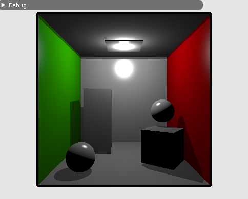

glTF 场景
======================================

.. dropdown:: 更新记录
    :color: muted
    :icon: history

    * 2023/10/24 增加该扩展文档
    * 2023/10/24 增加 ``教程`` 章节
    * 2023/10/24 增加 ``场景数据`` 章节
    * 2023/10/26 增加 ``加载 glTF 场景`` 章节
    * 2023/10/26 增加 ``加载场景`` 章节
    * 2023/10/26 增加 ``几何体转底层加速结构`` 章节
    * 2023/10/26 增加 ``创建顶层加速结构`` 章节

`文献源`_

.. _文献源: https://github.com/nvpro-samples/vk_raytracing_tutorial_KHR/tree/master/ray_tracing_gltf

.. _光线追踪教程: ../NVIDIAVulkanRayTracingTutorial.html

    glTF 场景光栅化结果示意图

教程
####################

该教程为对 ``Vulkan`` `光线追踪教程`_ 示例的修改。之前是加载单个的 ``OBJ`` 模型，在该示例中将会加载包含多个物体的 ``glTF`` 场景。

该示例并不是介绍如何渲染的，但是使用了比 ``OBJ`` 更加复杂的数据。

如果您想查阅更加完善的版本，请查阅：

* `vk_raytrace <https://github.com/nvpro-samples/vk_raytrace>`_
* `vk_shaded_gltfscene <https://github.com/nvpro-samples/vk_shaded_gltfscene>`_

场景数据
####################

对于 ``OBJ`` 模型加载的数据最终会存入四个缓存中：

* :bdg-secondary:`顶点缓存` 对于顶点位置、法线、纹理坐标和颜色的数组。
* :bdg-secondary:`索引缓存` 顶点的索引数组，每三个组成一个三角形。
* :bdg-secondary:`材质缓存` ``wavefront`` 材质。
* :bdg-secondary:`材质索引缓存` 每个三角形的材质索引。

由于 ``OBJ`` 模型可以有多个，所以对于这些缓存也可以有多个。

但对于 ``glTF`` 场景，为了方便，数据的组织有点不一样。相较于每个 ``OBJ`` 模型分别创建顶点、位置、法线和其他各种属性数缓存，在 ``glTF`` 中我们将场景中所有的几何体的顶点、索引和其他属性都分别存入相应的单一缓存中。
对于每个几何体本身使用对应的元素数量和偏移进行获取。

对于该示例，不再需要接下来对于 ``OBJ`` 的相关代码，将其移除：

.. code:: c++

    std::vector<ObjModel>    m_objModel;   // host 端的模型数据
    std::vector<ObjDesc>     m_objDesc;    // 用于设备获取模型描述信息
    std::vector<ObjInstance> m_instances;  // 场景模型的实体

在 ``host_device.h`` 中我们将增加新的数据结构： ``PrimMeshInfo`` ， ``SceneDesc`` 和 ``GltfShadeMaterial`` 。

.. code:: c++

    // 用于在最近命中着色器中获取图元信息
    struct PrimMeshInfo
    {
      uint indexOffset;
      uint vertexOffset;
      int  materialIndex;
    };

    // 场景的缓存地址
    struct SceneDesc
    {
      uint64_t vertexAddress;    // 顶点缓存地址
      uint64_t normalAddress;    // 法线缓存地址
      uint64_t uvAddress;        // 纹理坐标缓存地址
      uint64_t indexAddress;     // 索引缓存地址
      uint64_t materialAddress;  // 材质缓存地址 (GltfShadeMaterial)
      uint64_t primInfoAddress;  // 网格图元缓存地址 (PrimMeshInfo)
    };

同样， ``glTF`` 材质也用于光照渲染。该示例使用的是 ``glTF PBR`` 的简化版。如果您对完整的 ``PBR`` (基于物理的渲染) 感兴趣，可以阅览 `vk_raytrace <https://github.com/nvpro-samples/vk_raytrace>`_ 。

.. code:: glsl

    struct GltfShadeMaterial
    {
      vec4 pbrBaseColorFactor;
      vec3 emissiveFactor;
      int  pbrBaseColorTexture;
    };

同时为了存储场景分配的所有缓存，相关声明如下：

.. code:: c++

    nvh::GltfScene m_gltfScene;
    nvvk::Buffer   m_vertexBuffer;
    nvvk::Buffer   m_normalBuffer;
    nvvk::Buffer   m_uvBuffer;
    nvvk::Buffer   m_indexBuffer;
    nvvk::Buffer   m_materialBuffer;
    nvvk::Buffer   m_primInfo;
    nvvk::Buffer   m_sceneDesc;

加载 glTF 场景
####################

我们这里将会使用 `TinyGLTF <https://github.com/syoyo/tinygltf>`_ 加载 ``glTF`` ，之后为了屏蔽掉繁琐的场景解析遍历，将会使用 `gltfScene <https://github.com/nvpro-samples/nvpro_core/tree/master/nvh#gltfscenehpp>`_ 来帮助我们将场景进行压缩。

加载场景
************************

相较于加载一个模型，这次我们将加载一个场景，所以我们使用 ``loadScene()`` 来代替 ``loadModel()`` 加载场景。

``loadScene()`` 函数在源文件中的开头将会引入 ``TinyGLTF`` 。

.. code:: c++

  tinygltf::Model    tmodel;
  tinygltf::TinyGLTF tcontext;
  std::string        warn, error;
  if(!tcontext.LoadASCIIFromFile(&tmodel, &error, &warn, filename))
    assert(!"Error while loading scene");

之后我们将使用 ``gltfScene`` 来帮助我们压缩和提炼我们需要的数据。

.. code:: c++

  m_gltfScene.importMaterials(tmodel);
  m_gltfScene.importDrawableNodes(tmodel,
                                  nvh::GltfAttributes::Normal | nvh::GltfAttributes::Texcoord_0);

接下来就是分配缓存并存储数据。比如，顶点位置，法线，纹理坐标等等。

.. code:: c++

  // 在设备上创建换次年并拷贝顶点，索引和材质信息
  nvvk::CommandPool cmdBufGet(m_device, m_graphicsQueueIndex);
  VkCommandBuffer   cmdBuf = cmdBufGet.createCommandBuffer();

  m_vertexBuffer = m_alloc.createBuffer(cmdBuf, m_gltfScene.m_positions,
                                        VK_BUFFER_USAGE_VERTEX_BUFFER_BIT | VK_BUFFER_USAGE_STORAGE_BUFFER_BIT | VK_BUFFER_USAGE_SHADER_DEVICE_ADDRESS_BIT
                                            | VK_BUFFER_USAGE_ACCELERATION_STRUCTURE_BUILD_INPUT_READ_ONLY_BIT_KHR);
  m_indexBuffer  = m_alloc.createBuffer(cmdBuf, m_gltfScene.m_indices,
                                       VK_BUFFER_USAGE_INDEX_BUFFER_BIT | VK_BUFFER_USAGE_STORAGE_BUFFER_BIT | VK_BUFFER_USAGE_SHADER_DEVICE_ADDRESS_BIT
                                           | VK_BUFFER_USAGE_ACCELERATION_STRUCTURE_BUILD_INPUT_READ_ONLY_BIT_KHR);
  m_normalBuffer = m_alloc.createBuffer(cmdBuf, m_gltfScene.m_normals,
                                        VK_BUFFER_USAGE_VERTEX_BUFFER_BIT | VK_BUFFER_USAGE_STORAGE_BUFFER_BIT
                                            | VK_BUFFER_USAGE_SHADER_DEVICE_ADDRESS_BIT);
  m_uvBuffer     = m_alloc.createBuffer(cmdBuf, m_gltfScene.m_texcoords0,
                                    VK_BUFFER_USAGE_VERTEX_BUFFER_BIT | VK_BUFFER_USAGE_STORAGE_BUFFER_BIT
                                        | VK_BUFFER_USAGE_SHADER_DEVICE_ADDRESS_BIT);

由于该示例的材质是一个简化版本，这里我们将从 ``glTF`` 材质中提取我们需要的部分。

.. code:: c++

  // 仅获取我们需要的材质数据
  std::vector<GltfShadeMaterial> shadeMaterials;
  for(auto& m : m_gltfScene.m_materials)
  {
    shadeMaterials.emplace_back(GltfShadeMaterial{m.baseColorFactor, m.emissiveFactor, m.baseColorTexture});
  }
  m_materialBuffer = m_alloc.createBuffer(cmdBuf, shadeMaterials,
                                          VK_BUFFER_USAGE_STORAGE_BUFFER_BIT | VK_BUFFER_USAGE_SHADER_DEVICE_ADDRESS_BIT);

为了能够在最近命中着色器中找到命中位置，同时也能获取其它属性，我们将存储几何的偏移信息。

.. code:: c++

  // 如下是用于在最近命中着色器中找到网格的图元信息
  std::vector<PrimMeshInfo> primLookup;
  for(auto& primMesh : m_gltfScene.m_primMeshes)
  {
    primLookup.push_back({primMesh.firstIndex, primMesh.vertexOffset, primMesh.materialIndex});
  }
  m_rtPrimLookup =
      m_alloc.createBuffer(cmdBuf, primLookup, VK_BUFFER_USAGE_STORAGE_BUFFER_BIT | VK_BUFFER_USAGE_SHADER_DEVICE_ADDRESS_BIT);

.. admonition:: std::vector<PrimMeshInfo> primLookup
    :class: note

    在本示例中一共有 ``10`` 个物体（ ``5`` 面墙， ``3`` 个矩形， ``2`` 个球体）。然而解析完 ``glTF`` 场景后 ``primLookup`` 中有 ``9`` 个元素（模型）。其中顶面和底面墙体共用同一个网格。

最后创建一个缓存存储所以缓存的引用：

.. code:: c++

  SceneDesc sceneDesc;
  sceneDesc.vertexAddress   = nvvk::getBufferDeviceAddress(m_device, m_vertexBuffer.buffer);
  sceneDesc.indexAddress    = nvvk::getBufferDeviceAddress(m_device, m_indexBuffer.buffer);
  sceneDesc.normalAddress   = nvvk::getBufferDeviceAddress(m_device, m_normalBuffer.buffer);
  sceneDesc.uvAddress       = nvvk::getBufferDeviceAddress(m_device, m_uvBuffer.buffer);
  sceneDesc.materialAddress = nvvk::getBufferDeviceAddress(m_device, m_materialBuffer.buffer);
  sceneDesc.primInfoAddress = nvvk::getBufferDeviceAddress(m_device, m_primInfo.buffer);
  m_sceneDesc               = m_alloc.createBuffer(cmdBuf, sizeof(SceneDesc), &sceneDesc,
                                     VK_BUFFER_USAGE_STORAGE_BUFFER_BIT | VK_BUFFER_USAGE_SHADER_DEVICE_ADDRESS_BIT);

在退出该函数之前，我们需要创建纹理（默认场景中没有纹理）并提交指令缓存。最后等到所有的数据拷贝完成。

.. code:: c++

    // 创建所有找到的纹理
    createTextureImages(cmdBuf, tmodel);
    cmdBufGet.submitAndWait(cmdBuf);
    m_alloc.finalizeAndReleaseStaging();

    NAME_VK(m_vertexBuffer.buffer);
    NAME_VK(m_indexBuffer.buffer);
    NAME_VK(m_normalBuffer.buffer);
    NAME_VK(m_uvBuffer.buffer);
    NAME_VK(m_materialBuffer.buffer);
    NAME_VK(m_primInfo.buffer);
    NAME_VK(m_sceneDesc.buffer);
  }

.. admonition:: NAME_VK
    :class: note

    宏 ``NAME_VK`` 是用于简化 ``Nsight Graphics`` 中 ``Vulkan`` 对象命名，用于调试时获取相应的创建信息。

几何体转底层加速结构
####################

我们不再使用 ``objectToVkGeometryKHR()`` 而会使用 ``primitiveToVkGeometry(const nvh::GltfPrimMesh& prim)`` 。该函数与之前的相似，仅仅是输入不同，这里 ``VkAccelerationStructureBuildRangeInfoKHR`` 将会设置偏移数据。

.. code:: c++

  //--------------------------------------------------------------------------------------------------
  // 将 glTF 中的网格转换成底层加速结构中的几何图元
  //
  auto HelloVulkan::primitiveToGeometry(const nvh::GltfPrimMesh& prim)
  {
    // 底层加速结构的构建需要原始的设备内存地址
    VkDeviceAddress vertexAddress = nvvk::getBufferDeviceAddress(m_device, m_vertexBuffer.buffer);
    VkDeviceAddress indexAddress  = nvvk::getBufferDeviceAddress(m_device, m_indexBuffer.buffer);

    uint32_t maxPrimitiveCount = prim.indexCount / 3;

    // 设置顶点数组缓存
    VkAccelerationStructureGeometryTrianglesDataKHR triangles{VK_STRUCTURE_TYPE_ACCELERATION_STRUCTURE_GEOMETRY_TRIANGLES_DATA_KHR};
    triangles.vertexFormat             = VK_FORMAT_R32G32B32_SFLOAT;  // vec3 vertex position data.
    triangles.vertexData.deviceAddress = vertexAddress;
    triangles.vertexStride             = sizeof(nvmath::vec3f);
    // 设置索引缓存（32比特无符号整形）
    triangles.indexType               = VK_INDEX_TYPE_UINT32;
    triangles.indexData.deviceAddress = indexAddress;
    // 底层加速结构本身的变换为单位矩阵（无变换）
    //triangles.transformData = {};
    triangles.maxVertex = prim.vertexCount - 1;

    // 将之前的三角形设置为不透明
    VkAccelerationStructureGeometryKHR asGeom{VK_STRUCTURE_TYPE_ACCELERATION_STRUCTURE_GEOMETRY_KHR};
    asGeom.geometryType       = VK_GEOMETRY_TYPE_TRIANGLES_KHR;
    asGeom.flags              = VK_GEOMETRY_NO_DUPLICATE_ANY_HIT_INVOCATION_BIT_KHR;  // 对任意命中的限制
    asGeom.geometry.triangles = triangles;

    VkAccelerationStructureBuildRangeInfoKHR offset;
    offset.firstVertex     = prim.vertexOffset;
    offset.primitiveCount  = prim.indexCount / 3;
    offset.primitiveOffset = prim.firstIndex * sizeof(uint32_t);
    offset.transformOffset = 0;

    // 目前我们一个底层加速结构对应一个几何体，但其实可以加入更多几何体
    nvvk::RaytracingBuilderKHR::BlasInput input;
    input.asGeometry.emplace_back(asGeom);
    input.asBuildOffsetInfo.emplace_back(offset);

    return input;
  }

创建顶层加速结构
####################

基本上与之前的没什么区别，除了索引数据存在 ``primMesh`` 中。

.. code:: c++

  for(auto& node : m_gltfScene.m_nodes)
  {
    VkAccelerationStructureInstanceKHR rayInst;
    rayInst.transform                      = nvvk::toTransformMatrixKHR(node.worldMatrix);
    rayInst.instanceCustomIndex            = node.primMesh;  // gl_InstanceCustomIndexEXT: 用于寻找图元
    rayInst.accelerationStructureReference = m_rtBuilder.getBlasDeviceAddress(node.primMesh);
    rayInst.flags                          = VK_GEOMETRY_INSTANCE_TRIANGLE_FACING_CULL_DISABLE_BIT_KHR;
    rayInst.mask                           = 0xFF;
    rayInst.instanceShaderBindingTableRecordOffset = 0;  // 所有的物体都是用相同的命中组
    tlas.emplace_back(rayInst);
  }

.. admonition:: m_gltfScene.m_nodes
    :class: note

    长度为 ``10`` ，每个元素分别对应场景中的 ``10`` 个物体。

