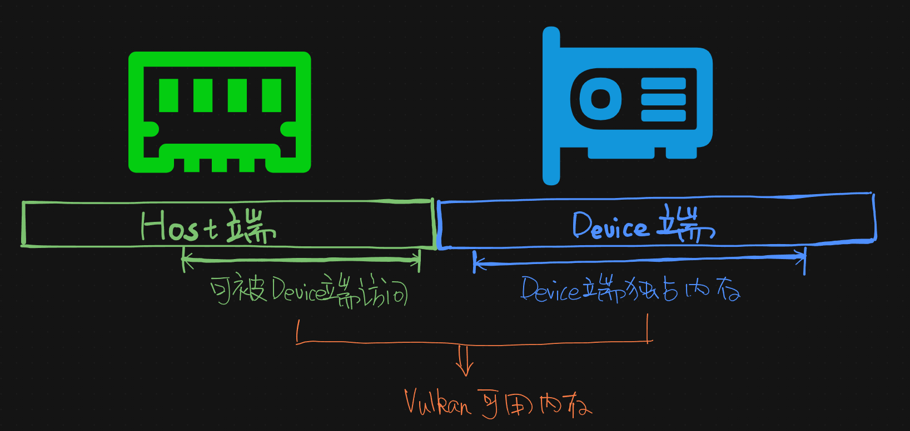
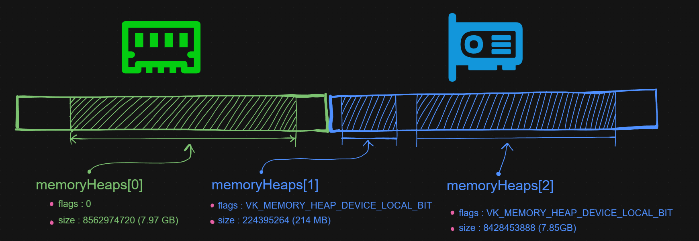
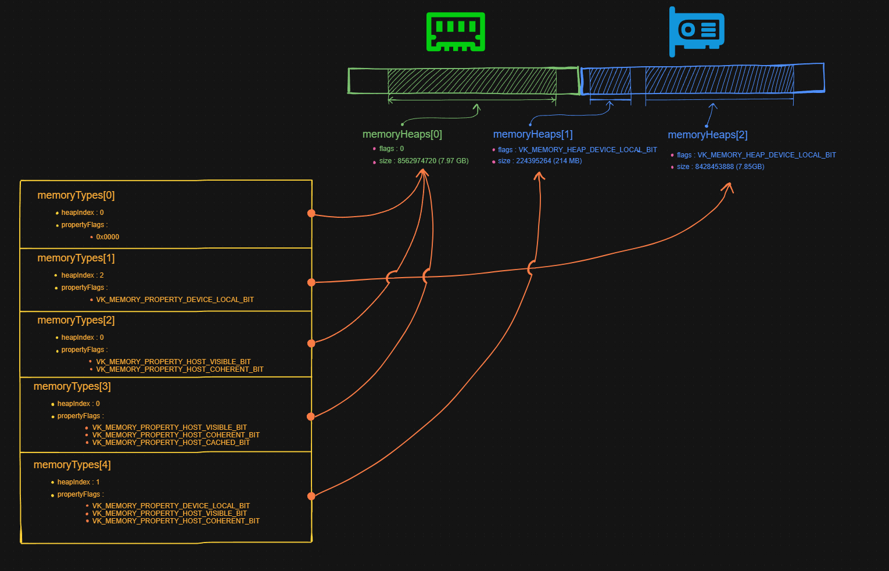

内存
============

.. dropdown:: 更新记录
   :color: muted
   :icon: history

   * 2024/1/2 增加该文档。
   * 2024/2/17 更新该文档。
   * 2024/2/17 增加 ``句柄对象的内存分配器`` 章节。
   * 2024/2/17 增加 ``PFN_vkAllocationFunction`` 章节。
   * 2024/2/17 增加 ``PFN_vkReallocationFunction`` 章节。
   * 2024/2/21 更新 ``PFN_vkAllocationFunction`` 章节。
   * 2024/2/21 更新 ``PFN_vkReallocationFunction`` 章节。
   * 2024/2/21 增加 ``PFN_vkInternalAllocationNotification`` 章节。
   * 2024/2/21 增加 ``PFN_vkInternalFreeNotification`` 章节。
   * 2024/2/21 增加 ``VkSystemAllocationScope`` 章节。
   * 2024/2/21 增加 ``VkInternalAllocationType`` 章节。
   * 2024/2/21 增加 ``示例`` 章节。
   * 2024/2/27 增加 ``设备内存`` 章节。
   * 2024/2/27 增加 ``vkGetPhysicalDeviceMemoryProperties`` 章节。
   * 2024/3/3 更新 ``vkGetPhysicalDeviceMemoryProperties`` 章节。
   * 2024/3/3 增加 ``VkPhysicalDeviceMemoryProperties`` 章节。
   * 2024/3/3 增加 ``VkMemoryHeap`` 章节。
   * 2024/3/3 增加 ``VkMemoryType`` 章节。
   * 2024/3/3 更新 ``设备内存`` 章节。
   * 2024/3/9 更新 ``VkMemoryType`` 章节。
   * 2024/3/9 增加 ``VkMemoryPropertyFlagBits`` 章节。
   * 2024/3/10 增加 ``VkMemoryPropertyFlagBits`` 章节。
   * 2024/3/10 增加 ``内存分配`` 章节。
   * 2024/3/10 增加 ``vkAllocateMemory`` 章节。
   * 2024/3/14 更新 ``vkAllocateMemory`` 章节。
   * 2024/3/14 增加 ``VkMemoryAllocateInfo`` 章节。
   * 2024/3/14 增加 ``VkMemoryAllocateInfo`` 章节下增加 ``示例`` 章节。
   * 2024/3/14 增加 ``内存回收`` 章节。
   * 2024/3/14 增加 ``vkFreeMemory`` 章节。
   * 2024/3/14 增加 ``vkFreeMemory`` 章节下增加 ``示例`` 章节。
   * 2024/3/15 增加 ``内存映射`` 章节。
   * 2024/3/16 增加 ``vkMapMemory`` 章节。
   * 2024/3/16 增加 ``vkMapMemory`` 章节下增加 ``示例`` 章节。
   * 2024/3/16 更新 ``设备内存类型示意图`` 内容，之前图中有错误。
   * 2024/3/16 更新 ``内存分配`` 章节中的 ``示例`` 章节。
   * 2024/3/16 增加 ``内存解映射`` 章节。
   * 2024/3/16 增加 ``内存解映射`` 章节下增加 ``示例`` 章节。
   * 2024/3/16 增加 ``内存同步`` 章节。
   * 2024/3/17 更新 ``PFN_vkAllocationFunction`` 章节，更新示例代码，增加 ``通用自定义`` 代码模块。
   * 2024/3/17 更新 ``PFN_vkReallocationFunction`` 章节，更新示例代码，增加 ``通用自定义`` 代码模块。
   * 2024/3/17 更新 ``PFN_vkFreeFunction`` 章节，更新示例代码，增加 ``通用自定义`` 代码模块。
   * 2024/3/19 更新 ``PFN_vkAllocationFunction`` 章节，增加 ``通用自定义`` 代码模块内存分配说明。
   * 2024/3/19 更新 ``PFN_vkReallocationFunction`` 章节，增加 ``通用自定义`` 代码模块内存分配说明。
   * 2024/3/19 更新 ``PFN_vkFreeFunction`` 章节，增加 ``通用自定义`` 代码模块内存分配说明。

``Vulkan`` 中有两种分配内存的途径：

1. 在 ``vkCreate{对象名称}(...)`` 或 ``vkDestroy{对象名称}(...)`` 函数中指定 ``const VkAllocationCallbacks* pAllocator`` 内存分配器。比如：

   * ``vkCreateInstance(...)`` 和 ``vkDestroyInstance(...)``
   * ``vkCreateDevice(...)`` 和 ``vkDestroyDevice(...)``

   该方式是在创建和销毁句柄对象时指定，用于在 ``内存条`` 上分配和回收内存。其内部通过 ``malloc(...)`` 和 ``free(...)`` 之类的函数进行内存分配和销毁。用于 ``句柄对象`` 本身的分配和销毁。

   .. note::

      * 一般 ``pAllocator`` 可以直接指定为 ``nullptr`` ，用于告诉 ``Vulkan`` 使用内置的内存分配器。
      * 如果 :bdg-danger:`不为` ``nullptr`` ，则用于指定自定义内存分配器。

   .. note::

      自定义内存分配器常用于内存统计。

2. 通过 ``vkAllocateMemory(...)`` 函数分配内存。

   该方式主要用于在 ``Host`` 端和 ``Device`` 端进行内存分配。主要用于存储 ``GPU`` 的计算结果。

现在就安顺进行讲解：

句柄对象的内存分配器
#########################

在创建句柄（对象）时需要指定 ``const VkAllocationCallbacks* pAllocator`` 的内存分配器。其中 ``VkAllocationCallbacks`` 定义如下：

.. code:: c++

   // 由 VK_VERSION_1_0 提供
   typedef struct VkAllocationCallbacks {
       void*                                   pUserData;
       PFN_vkAllocationFunction                pfnAllocation;
       PFN_vkReallocationFunction              pfnReallocation;
       PFN_vkFreeFunction                      pfnFree;
       PFN_vkInternalAllocationNotification    pfnInternalAllocation;
       PFN_vkInternalFreeNotification          pfnInternalFree;
   } VkAllocationCallbacks;

* :bdg-secondary:`pUserData` 为用户自定义数据指针。当该分配器中的回调被调用时将会传入 ``pUserData`` 作为回调的第一个参数。
* :bdg-secondary:`pfnAllocation` 内存分配回调。用于分配内存。
* :bdg-secondary:`pfnReallocation` 内存重分配回调。用于重分配内存。
* :bdg-secondary:`pfnFree` 内存释放回调。用于释放内存。
* :bdg-secondary:`pfnInternalAllocation` 内部内存分配通知回调。该回调由驱动在分配内部内存时调用。仅用于将内部内存分配信息反馈给用户。该回调内部 :bdg-danger:`不应该` 分配新内存。
* :bdg-secondary:`pfnInternalFree` 内部内存释放通知回调。该回调由驱动在释放内部内存时调用。仅用于将内部内存释放信息反馈给用户。该回调内部 :bdg-danger:`不应该` 释放内存。

其中 ``PFN_vkAllocationFunction`` 定义如下：

PFN_vkAllocationFunction
****************************

.. code:: c++

   // 由 VK_VERSION_1_0 提供
   typedef void* (VKAPI_PTR *PFN_vkAllocationFunction)(
      void*                                       pUserData,
      size_t                                      size,
      size_t                                      alignment,
      VkSystemAllocationScope                     allocationScope);

* :bdg-secondary:`pUserData` 为用户自定义数据指针。对应 ``VkAllocationCallbacks::pUserData`` 。
* :bdg-secondary:`size` 要分配的内存大小。单位为 ``字节`` 。
* :bdg-secondary:`alignment` 要分配内存的 ``内存对齐`` 大小。单位为 ``字节`` 。:bdg-danger:`必须` 为 ``2`` 的幂次方。
* :bdg-secondary:`allocationScope` 该内存声明周期所属的分配范围。

该函数回调将返回大小为 ``size`` 比特，内存对齐为 ``alignment`` 分配的新内存。

如果分配失败，该函数 :bdg-danger:`必须` 返回 ``NULL`` 。如果分配成功，需要返回空间 :bdg-danger:`最少` 为 ``size`` 字节，并且指针地址为 ``alignment`` 的倍数。

.. admonition:: 内存对齐
   :class: note

   .. important:: 此处简单讲解内存对齐，并不完善，只是说明了基本思想，网上有很多详细资料可供参阅。

   处理芯片在读取内存时并不是一比特一比特的读，而是 :math:`n` 字节 :math:`n` 字节的读取（其中 :math:`n` 为 ``2`` 的幂次方）。如下结构体：

   .. code:: c++

      struct Demo
      {
         char  a; // 占 1 字节
         int   b; // 占 4 字节
         short c; // 占 2 字节
      };

   比如当 :math:`n = 4` 时，也就是一次读取 ``4`` 个字节。判定如下：

   * 由于 ``a`` 只占 ``1`` 个字节，而处理器一次性读 ``4`` 个字节，则 ``a`` 成员大小将会扩展到 ``4`` 个字节。其中只有第一个字节为 ``a`` 成员的有效内存，其他 ``3`` 个扩展字节用于占位。
   * 由于 ``b`` 的大小为 ``4`` 个字节，正好为 ``4`` 的倍数。则不需要扩展字节就可以直接读。
   * 由于 ``c`` 的大小小于 ``4`` 则其处理方式与 ``a`` 的一样，扩展到 ``4`` 字节，其中前两个字节为 ``c`` 成员的有效内存，其他 ``2`` 个字节用于占位。

   示意图如下：

   .. figure:: ./_static/aligment_struct.png

   这样处理器在 ``4`` 个字节 ``4`` 个字节读的时候就能够读取到正确的数据了。
   
   如上就是按照 ``4`` 字节进行的内存对齐。

``PFN_vkAllocationFunction`` 是一个函数指针，需要指向一个返回值为 ``void*`` 形参为 ``(void *pUserData, size_t size, size_t alignment, VkSystemAllocationScope allocationScope)`` 的函数。比如：

.. tab-set::

    .. tab-item:: C++ 17

      .. code:: c++

         #include <cstdlib>

         void *VKAPI_PTR Allocation(void *pUserData, size_t size, size_t alignment, VkSystemAllocationScope allocationScope)
         {
            return std::aligned_alloc(alignment, size);
         }

         PFN_vkAllocationFunction pfn_allocation = &Allocation;

      .. warning::
         
         ``C++`` 标准中没有定义如何获取 ``std::aligned_alloc(...)`` 分配的内存大小函数。需要自己存储。
         
         具体如何存储，可参考 ``通用自定义`` 代码模块，该模块给出了一种解决方案。

    .. tab-item:: Windows

      .. code:: c++

         #include <malloc.h>

         void *VKAPI_PTR Allocation(void *pUserData, size_t size, size_t alignment, VkSystemAllocationScope allocationScope)
         {
            return _aligned_malloc(size, alignment);
         }

         PFN_vkAllocationFunction pfn_allocation = &Allocation;

    .. tab-item:: Linux

      .. code:: c++

         #include <malloc.h>

         void *VKAPI_PTR Allocation(void *pUserData, size_t size, size_t alignment, VkSystemAllocationScope allocationScope)
         {
            return memalign(alignment, size);
         }

         PFN_vkAllocationFunction pfn_allocation = &Allocation;

    .. tab-item:: 通用自定义

      .. code:: c++

         #include <stdlib.h>

         void* AlignedMalloc(size_t size, size_t alignment)
         {
            size_t meta_point_size = sizeof(void *);
            size_t aligned_size = sizeof(size_t);
            size_t meta_size = aligned_size + meta_point_size + alignment - 1 + size;

            void *meta = malloc(meta_size);

            uintptr_t start = (uintptr_t)meta + aligned_size + meta_point_size;

            void *aligned_meta = (void *)((start + ((alignment) - 1)) & ~(alignment - 1));

            *(void **)((uintptr_t)aligned_meta - meta_point_size) = meta;
            *(size_t *)((uintptr_t)aligned_meta - (meta_point_size + aligned_size)) = size;

            return aligned_meta;
         }

         void *VKAPI_PTR Allocation(void *pUserData, size_t size, size_t alignment, VkSystemAllocationScope allocationScope)
         {
            return AlignedMalloc(size, alignment);
         }

         PFN_vkAllocationFunction pfn_allocation = &Allocation;

      .. admonition:: 算法说明
         :class: important

         该算法分配的对齐内存结构示意图如下：
   
         .. figure:: ./_static/aligned_memory_struct.png
         
            AlignedMalloc 对齐内存示意图
   
         其中示意图最上面一行标注为各部分所占字节长度：
   
         * :bdg-secondary:`alignment - 1` 用于内存对齐所需的基本占位符长度。该部分数据没用上，仅仅用于占位符。最大为 ``alignment - 1`` ，会随着 ``(void *)((start + ((alignment) - 1)) & ~(alignment - 1))`` 对齐算法中 ``start`` 的不同而不同。
         * :bdg-secondary:`alignment_size` 用于存储需要分配的对齐内存长度。也就是 ``size`` 的字面值。
         * :bdg-secondary:`meta_point_size`用于存储 ``malloc(...)`` 分配的原指针。也就是 ``meta`` 的字面值（指针）。
         * :bdg-secondary:`size` 对齐内存长度。真正会被使用的对齐内存。

         最下面一行标注为核心指针位置：

         * :bdg-secondary:`meta` ``malloc(...)`` 分配的原指针。字面值（指针）被存储在 ``meta_point_size`` 占有的内存中。
         * :bdg-secondary:`aligned_meta` 被需要的对齐内存指针。作为结果返回。

         其中 ``aligned_meta`` 满足 ``Vulkan`` 要求的对齐内存地址。并作为目标内存返回给 ``Vulkan`` 。

      
其中 ``PFN_vkReallocationFunction`` 定义如下：

PFN_vkReallocationFunction
****************************

.. code:: c++

   // 由 VK_VERSION_1_0 提供
   typedef void* (VKAPI_PTR *PFN_vkReallocationFunction)(
       void*                                       pUserData,
       void*                                       pOriginal,
       size_t                                      size,
       size_t                                      alignment,
       VkSystemAllocationScope                     allocationScope);

* :bdg-secondary:`pUserData` 为用户自定义数据指针。对应 ``VkAllocationCallbacks::pUserData`` 。
* :bdg-secondary:`pOriginal` 在该内存的基础上进行重分配。
* :bdg-secondary:`size` 要重分配的内存大小。单位为 ``字节`` 。
* :bdg-secondary:`alignment` 要分配内存的 ``内存对齐`` 大小。单位为 ``字节`` 。:bdg-danger:`必须` 为 ``2`` 的幂次方。
* :bdg-secondary:`allocationScope` 该内存声明周期所属的分配范围。

.. 该回调将返回在 ``pOriginal`` 内存的基础上进行重分配，并将新分配的内存结果返回。

如果分配成功，需要返回空间 :bdg-danger:`最少` 为 ``size`` 字节，并且 ``pOriginal`` 原始内存内的 :math:`[0, min(原始内存大小, 新分配的内存大小)-1]` 范围的数据需要原封不动的转移至新分配的内存中。

如果新分配的内存大小大于之前的分配，则多出来的内存数据初始值是未定义的。

如果满足如上要求进行了重新单独分配，则之前的内存需要进行回收。

如果 ``pOriginal`` 为 ``空`` ，则该回调的行为需要与 ``PFN_vkAllocationFunction`` 回调一致。

如果 ``size`` 为 ``0`` ，则该回调的行为需要与 ``PFN_vkFreeFunction`` 回调一致。

如果 ``pOriginal`` 非空，该分配 :bdg-danger:`必须` 确保 ``alignment`` 与 ``pOriginal`` 分配的 ``alignment`` 保持一致。

如果重分配失败，并且 ``pOriginal`` 非空，则 :bdg-danger:`不能` 回收 ``pOriginal`` 之前的内存。

``PFN_vkReallocationFunction`` 是一个函数指针，需要指向一个返回值为 ``void*`` 形参为 ``(void *pUserData, void *pOriginal, size_t size, size_t alignment, VkSystemAllocationScope allocationScope)`` 的函数。比如：

.. tab-set::

    .. tab-item:: C++ 17

      .. code:: c++

         #include <cstdlib>

         void *VKAPI_PTR Reallocate(void *pUserData, void *pOriginal, size_t size, size_t alignment, VkSystemAllocationScope allocationScope)
         {
            void* new_memory = std::aligned_alloc(alignment, size);
            if(new_memory)
            {
               memcpy(new_memory, pOriginal, size);// 此处 size 不一定对应 pOriginal 的内存大小，存在一定的问题。需要自己存储管理内存大小。
               free(pOriginal);
               return new_memory;
            }

            return nullptr;
         }

         PFN_vkReallocationFunction pfn_reallocation = &Reallocate;

      .. warning::
         
         :code:`memcpy(new_memory, pOriginal, size)` 中由于标准中没有定义如何获取 ``memalign(...)`` 分配的内存大小函数。需要自己存储。所以 ``size`` 不一定对应 ``pOriginal`` 的内存大小，存在一定的问题。
         
         具体如何存储，可参考 ``通用自定义`` 代码模块，该模块给出了一种解决方案。

    .. tab-item:: Windows

      .. code:: c++

         #include <malloc.h>

         void *VKAPI_PTR Reallocate(void *pUserData, void *pOriginal, size_t size, size_t alignment, VkSystemAllocationScope allocationScope)
         {
            return _aligned_realloc(pOriginal, size, alignment);
         }

         PFN_vkReallocationFunction pfn_reallocation = &Reallocate;

    .. tab-item:: Linux

      .. code:: c++

         #include <malloc.h>
         #include <algorithm>

         void *VKAPI_PTR Reallocate(void *pUserData, void *pOriginal, size_t size, size_t alignment, VkSystemAllocationScope allocationScope)
         {
            void* new_memory = memalign(alignment, size);
            if(new_memory)
            {
               memcpy(new_memory, pOriginal, std::min(malloc_usable_size(pOriginal), size));
               free(pOriginal);
               return new_memory;
            }

            return nullptr;
         }

         PFN_vkReallocationFunction pfn_reallocation = &Reallocate;

    .. tab-item:: 通用自定义

      .. code:: c++

         #include <stdlib.h>
         #include <algorithm>

         void* AlignedRealloc(void* memory, size_t size, size_t alignment)
         {
            auto get_aligned_memory_size =  -> size_t
            {
               return *(size_t *)((uintptr_t)memory - sizeof(void *) - sizeof(size_t));
            };

            void *new_meta = AlignedMalloc(size, alignment);
            memcpy(new_meta, memory, std::min(size, get_aligned_memory_size(memory)));
            AlignedFree(memory); // 源码见 PFN_vkFreeFunction 章节中 通用自定义 代码模块
            return new_meta;
         }

         void *VKAPI_PTR Reallocate(void *pUserData, void *pOriginal, size_t size, size_t alignment, VkSystemAllocationScope allocationScope)
         {
            return AlignedRealloc(pOriginal, size, alignment);
         }

         PFN_vkReallocationFunction pfn_reallocation = &Reallocate;

      .. admonition:: 算法说明
         :class: important

         该算法分配的对齐内存结构示意图如下：
   
         .. figure:: ./_static/aligned_memory_struct.png
         
            AlignedMalloc 对齐内存示意图

         其中获取 ``memory`` 分配大小，直接获取 ``aligned_size`` 字段中的数据即可。

其中 ``PFN_vkFreeFunction`` 定义如下：

PFN_vkFreeFunction
****************************

.. code:: c++

   // 由 VK_VERSION_1_0 提供
   typedef void (VKAPI_PTR *PFN_vkFreeFunction)(
       void*                                       pUserData,
       void*                                       pMemory);

* :bdg-secondary:`pUserData` 为用户自定义数据指针。对应 ``VkAllocationCallbacks::pUserData`` 。
* :bdg-secondary:`pMemory` 要回收的内存指针。

``PFN_vkFreeFunction`` 是一个函数指针，需要指向一个返回值为 ``void`` 形参为 ``(void *pUserData, void *pMemory)`` 的函数。比如：

.. tab-set::

    .. tab-item:: C++ 17

      .. code:: c++

         #include <cstdlib>

         void VKAPI_PTR Free(void *pUserData, void *pMemory)
         {
            std::free(pMemory);
         }

         PFN_vkFreeFunction pfn_free = &Free;

    .. tab-item:: Windows

      .. code:: c++

         #include <malloc.h>

         void VKAPI_PTR Free(void *pUserData, void *pMemory)
         {
            _aligned_free(pMemory);
         }

         PFN_vkFreeFunction pfn_free = &Free;

    .. tab-item:: Linux

      .. code:: c++

         #include <malloc.h>

         void VKAPI_PTR Free(void *pUserData, void *pMemory)
         {
            free(pMemory);
         }

         PFN_vkFreeFunction pfn_free = &Free;

    .. tab-item:: 通用自定义

      .. code:: c++

         #include <stdlib.h>

         void AlignedFree(void* memory)
         {
            auto get_aligned_meta =  -> void*
            {
               return (((void **)pMemory)[-1]);
            };

            free(get_aligned_meta(memory));
         }
         
         void VKAPI_PTR Free(void *pUserData, void *pMemory)
         {
            AlignedFree(pMemory);
         }

         PFN_vkFreeFunction pfn_free = &Free;

      .. admonition:: 算法说明
         :class: important

         该算法分配的对齐内存结构示意图如下：
   
         .. figure:: ./_static/aligned_memory_struct.png
         
            AlignedMalloc 对齐内存示意图

         其中获取 ``memory`` 之前通过 ``malloc(...)`` 分配的原指针，直接获取 ``meta_point_size`` 字段中的数据即可。

其中 ``PFN_vkInternalAllocationNotification`` 定义如下：

PFN_vkInternalAllocationNotification
***************************************

.. code:: c++

   // 由 VK_VERSION_1_0 提供
   typedef void (VKAPI_PTR *PFN_vkInternalAllocationNotification)(
       void*                                       pUserData,
       size_t                                      size,
       VkInternalAllocationType                    allocationType,
       VkSystemAllocationScope                     allocationScope);

* :bdg-secondary:`pUserData` 为用户自定义数据指针。对应 ``VkAllocationCallbacks::pUserData`` 。
* :bdg-secondary:`size` 分配的内存大小。单位为 ``字节`` 。
* :bdg-secondary:`allocationType` 分配的类型。
* :bdg-secondary:`allocationScope` 该内存声明周期所属的分配范围。

该函数回调仅仅用于纯信息返回。

其中 ``PFN_vkInternalFreeNotification`` 定义如下：

PFN_vkInternalFreeNotification
***************************************

.. code:: c++

   // 由 VK_VERSION_1_0 提供
   typedef void (VKAPI_PTR *PFN_vkInternalFreeNotification)(
       void*                                       pUserData,
       size_t                                      size,
       VkInternalAllocationType                    allocationType,
       VkSystemAllocationScope                     allocationScope);

* :bdg-secondary:`pUserData` 为用户自定义数据指针。对应 ``VkAllocationCallbacks::pUserData`` 。
* :bdg-secondary:`size` 回收的内存大小。单位为 ``字节`` 。
* :bdg-secondary:`allocationType` 分配的类型。
* :bdg-secondary:`allocationScope` 该内存声明周期所属的分配范围。

该函数回调仅仅用于纯信息返回。

每一次分配都对应的 ``allocationScope`` 分配范围用于定义此次分配与之相关的对象。有效的枚举值被定义在了 ``VkSystemAllocationScope`` 中。其定义如下：

VkSystemAllocationScope
***************************************

.. code:: c++

   // 由 VK_VERSION_1_0 提供
   typedef enum VkSystemAllocationScope {
       VK_SYSTEM_ALLOCATION_SCOPE_COMMAND = 0,
       VK_SYSTEM_ALLOCATION_SCOPE_OBJECT = 1,
       VK_SYSTEM_ALLOCATION_SCOPE_CACHE = 2,
       VK_SYSTEM_ALLOCATION_SCOPE_DEVICE = 3,
       VK_SYSTEM_ALLOCATION_SCOPE_INSTANCE = 4,
   } VkSystemAllocationScope;

* :bdg-secondary:`VK_SYSTEM_ALLOCATION_SCOPE_COMMAND` 表示此次分配作用于 ``Vulkan`` 指令。
* :bdg-secondary:`VK_SYSTEM_ALLOCATION_SCOPE_OBJECT` 表示此次分配作用于 ``Vulkan`` 对象创建或使用。
* :bdg-secondary:`VK_SYSTEM_ALLOCATION_SCOPE_CACHE` 表示此次分配作用于 ``VkPipelineCache`` 或者 ``VkValidationCacheEXT `` 对象。
* :bdg-secondary:`VK_SYSTEM_ALLOCATION_SCOPE_DEVICE` 表示此次分配作用于 ``Vulkan`` 的设备。
* :bdg-secondary:`VK_SYSTEM_ALLOCATION_SCOPE_INSTANCE` 表示此次分配作用于 ``Vulkan`` 的实例。

其中作为 ``pfnInternalAllocation`` 和 ``pfnInternalFree`` 回调函数形参的 ``allocationType`` 有效的枚举值被定义在了 ``VkInternalAllocationType`` 中。其定义如下：

VkInternalAllocationType
***************************************

.. code:: c++

   // 由 VK_VERSION_1_0 提供
   typedef enum VkInternalAllocationType {
       VK_INTERNAL_ALLOCATION_TYPE_EXECUTABLE = 0,
   } VkInternalAllocationType;

* :bdg-secondary:`VK_INTERNAL_ALLOCATION_TYPE_EXECUTABLE` 表示此次分配作用于 ``Host`` 端程序。

示例
*******

这里给出 ``Windows`` 平台和 ``通用自定义`` 代码完整示例， 其他平台以此类推。

.. tab-set::

    .. tab-item:: Windows

      .. code:: c++
      
         #include <malloc.h>
      
         size_t memory_in_use = 0; // 统计内存使用大小

         void *VKAPI_PTR Allocation(void *pUserData, size_t size, size_t alignment, VkSystemAllocationScope allocationScope)
         {
            memory_in_use += size;
            return _aligned_malloc(size, alignment);
         }
      
         void *VKAPI_PTR Reallocate(void *pUserData, void *pOriginal, size_t size, size_t alignment, VkSystemAllocationScope allocationScope)
         {
            memory_in_use -= _aligned_msize(pOriginal, alignment, 0);
            memory_in_use += size;
            return _aligned_realloc(pOriginal, size, alignment);
         }
      
         void *VKAPI_PTR Free(void *pUserData, void *pMemory)
         {
            memory_in_use -= _aligned_msize(pMemory, alignment, 0);
            return _aligned_free(pMemory);
         }
      
         void VKAPI_PTR InternalAllocationNotification(void* pUserData, size_t size, VkInternalAllocationType allocationType, VkSystemAllocationScope allocationScope)
         {
         }
      
         void VKAPI_PTR InternalFreeNotification(void* pUserData, size_t size, VkInternalAllocationType allocationType, VkSystemAllocationScope allocationScope)
         {
         }
      
         VkAllocationCallbacks GetVkAllocationCallbacks(void* pUserData)
         {
            VkAllocationCallbacks vk_allocation_callbacks = {};
            vk_allocation_callbacks.pUserData = pUserData;
            vk_allocation_callbacks.pfnAllocation = &Allocation;
            vk_allocation_callbacks.pfnReallocation = &Reallocate;
            vk_allocation_callbacks.pfnFree = &Free;
            vk_allocation_callbacks.pfnInternalAllocation = &InternalAllocationNotification;
            vk_allocation_callbacks.pfnInternalFree = &InternalFreeNotification;
      
            return vk_allocation_callbacks;
         }
      
         VkInstanceCreateInfo instance_create_info = 之前填写的创建信息;
      
         VkAllocationCallbacks allocation_callbacks = GetVkAllocationCallbacks(nullptr);
      
         VkInstance instance = VK_NULL_HANDLE;
      
         VkResult result = vkCreateInstance(&instance_create_info, &allocation_callbacks, &instance);
         if (result != VK_SUCCESS)
         {
            throw std::runtime_error("VkInstance 创建失败");
         }
      
         // 缤纷绚丽的 Vulkan 程序 ...
      
         vkDestroyInstance(instance, &allocation_callbacks);

    .. tab-item:: 通用自定义

      .. code:: c++

         void* AlignedMalloc(size_t size, size_t alignment)
         {
            size_t meta_point_size = sizeof(void *);
            size_t aligned_size = sizeof(size_t);
            size_t meta_size = aligned_size + meta_point_size + alignment - 1 + size;

            void *meta = malloc(meta_size);

            uintptr_t start = (uintptr_t)meta + aligned_size + meta_point_size;

            void *aligned_meta = (void *)((start + ((alignment) - 1)) & ~(alignment - 1));

            *(void **)((uintptr_t)aligned_meta - meta_point_size) = meta;
            *(size_t *)((uintptr_t)aligned_meta - (meta_point_size + aligned_size)) = size;

            return aligned_meta;
         }

         void AlignedFree(void* memory)
         {
            auto get_aligned_meta =  -> void*
            {
               return (((void **)pMemory)[-1]);
            };

            free(get_aligned_meta(memory));
         }

         void* AlignedRealloc(void* memory, size_t size, size_t alignment)
         {
            auto get_aligned_memory_size =  -> size_t
            {
               return *(size_t *)((uintptr_t)memory - sizeof(void *) - sizeof(size_t));
            };

            void *new_meta = AlignedMalloc(size, alignment);
            memcpy(new_meta, memory, std::min(size, get_aligned_memory_size(memory)));
            AlignedFree(memory);
            return new_meta;
         }

         size_t GetAlignedMemorySize(void* memory)
         {
            return *(size_t *)((uintptr_t)memory - sizeof(void *) - sizeof(size_t));
         }

         size_t memory_in_use = 0; // 统计内存使用大小

         void *VKAPI_PTR Allocation(void *pUserData, size_t size, size_t alignment, VkSystemAllocationScope allocationScope)
         {
            memory_in_use += size;
            return AlignedMalloc(size, alignment);
         }

         void *VKAPI_PTR Reallocate(void *pUserData, void *pOriginal, size_t size, size_t alignment, VkSystemAllocationScope allocationScope)
         {
            memory_in_use -= GetAlignedMemorySize(pOriginal);
            memory_in_use += size;
            return AlignedRealloc(pOriginal, size, alignment);
         }
         
         void VKAPI_PTR Free(void *pUserData, void *pMemory)
         {
            memory_in_use -= GetAlignedMemorySize(pMemory);
            AlignedFree(pMemory);
         }
         
         VkAllocationCallbacks GetVkAllocationCallbacks(void* pUserData)
         {
            VkAllocationCallbacks vk_allocation_callbacks = {};
            vk_allocation_callbacks.pUserData = pUserData;
            vk_allocation_callbacks.pfnAllocation = &Allocation;
            vk_allocation_callbacks.pfnReallocation = &Reallocate;
            vk_allocation_callbacks.pfnFree = &Free;
            vk_allocation_callbacks.pfnInternalAllocation = &InternalAllocationNotification;
            vk_allocation_callbacks.pfnInternalFree = &InternalFreeNotification;
      
            return vk_allocation_callbacks;
         }
      
         VkInstanceCreateInfo instance_create_info = 之前填写的创建信息;
      
         VkAllocationCallbacks allocation_callbacks = GetVkAllocationCallbacks(nullptr);
      
         VkInstance instance = VK_NULL_HANDLE;
      
         VkResult result = vkCreateInstance(&instance_create_info, &allocation_callbacks, &instance);
         if (result != VK_SUCCESS)
         {
            throw std::runtime_error("VkInstance 创建失败");
         }
      
         // 缤纷绚丽的 Vulkan 程序 ...
      
         vkDestroyInstance(instance, &allocation_callbacks);

设备内存
#########################

``Vulkan`` 标准规定了两种设备内存：

1. :bdg-secondary:`Host 端内存` 一般表示主板内存条上的内存。
2. :bdg-secondary:`Device 端内存` 一般表示 ``GPU`` 设备内部使用的内存。

这些设备内存根据不同特性又分为两种类型：

1. :bdg-secondary:`Host 端内存，但可被 Device 端访问` 这类内存的前提是在主板的内存条上，并且这部分内存可被 ``GPU`` 访问。
2. :bdg-secondary:`Device 端独占内存` ``GPU`` 设备自身携带的专有内存。数据在该内存中将会有更高的性能。

其示意图如下：

   Vulkan 设备内存示意图

.. important::

   不管内存是内存条上的还是物理设备上的，只要能被 ``Vulkan`` 识别并使用的内存都叫做 ``设备内存`` 。

由于 ``Vulkan`` 支持多种类型的内存，所以需要先通过 ``vkGetPhysicalDeviceMemoryProperties(...)`` 获取支持的内存信息。其定义如下：

vkGetPhysicalDeviceMemoryProperties
**************************************

.. code:: c++

   // 由 VK_VERSION_1_0 提供
   void vkGetPhysicalDeviceMemoryProperties(
       VkPhysicalDevice                            physicalDevice,
       VkPhysicalDeviceMemoryProperties*           pMemoryProperties);

* :bdg-secondary:`physicalDevice` 要获取设备内存所对应的物理设备。
* :bdg-secondary:`pMemoryProperties` 返回设备内存信息。

其中 ``pMemoryProperties`` 将会写入 ``physicalDevice`` 所对应设备的所有可访问内存信息，有关 ``VkPhysicalDeviceMemoryProperties`` 定义如下：

VkPhysicalDeviceMemoryProperties
**************************************

.. code:: c++

   // 由 VK_VERSION_1_0 提供
   typedef struct VkPhysicalDeviceMemoryProperties {
       uint32_t        memoryTypeCount;
       VkMemoryType    memoryTypes[VK_MAX_MEMORY_TYPES];
       uint32_t        memoryHeapCount;
       VkMemoryHeap    memoryHeaps[VK_MAX_MEMORY_HEAPS];
   } VkPhysicalDeviceMemoryProperties;

* :bdg-secondary:`memoryTypeCount` 支持的内存类型数量。
* :bdg-secondary:`memoryTypes` 有效元素个数为 ``memoryTypeCount`` 的内存类型信息数组。
* :bdg-secondary:`memoryHeapCount` 支持的内存堆数量。
* :bdg-secondary:`memoryHeaps` 有效元素个数为 ``memoryHeapCount`` 的内存堆信息数组。

.. admonition:: VK_MAX_MEMORY_TYPES 和 VK_MAX_MEMORY_HEAPS
   :class: note

   .. code:: c++

      #define VK_MAX_MEMORY_TYPES 32U
      #define VK_MAX_MEMORY_HEAPS 16U

.. admonition:: 内存堆
   :class: note

   所谓 ``堆`` 其实就是一大块连续的容器，当分配内存时，操作系统会尝试从一大块容器中分配连续并且大小合适的小容器返回给用户，之后用户就可以使用这部分容器读写数据了。

在 ``Vulkan`` 中我们知道内存堆可分为两种：

* :bdg-secondary:`Host 端`
* :bdg-secondary:`Device 端`

其中 ``memoryHeaps`` 中就是用于获取具体内存堆是哪一种。其中 ``VkMemoryHeap`` 定义如下：

..
   并且每一个堆自身拥有一些列属性，用于定义堆上内存对应的内存类型，这些内存类型信息存储在 ``memoryTypes`` 中。示意图如下：

   .. figure:: ./_static/device_memory_struct.png

      Vulkan 设备内存示意图

VkMemoryHeap
**************************************

.. code:: c++

   // 由 VK_VERSION_1_0 提供
   typedef struct VkMemoryHeap {
       VkDeviceSize         size;
       VkMemoryHeapFlags    flags;
   } VkMemoryHeap;

* :bdg-secondary:`size` 该堆大小。单位为字节。
* :bdg-secondary:`flags` 该堆类型标志位。

其中 ``flags`` 就是用于指示该堆的类型。其有效值定义于 ``VkMemoryHeapFlagBits`` 中，如下：

VkMemoryHeapFlagBits
----------------------

.. code:: c++

   // Provided by VK_VERSION_1_0
   typedef enum VkMemoryHeapFlagBits {
       VK_MEMORY_HEAP_DEVICE_LOCAL_BIT = 0x00000001,
   } VkMemoryHeapFlagBits;

* :bdg-secondary:`VK_MEMORY_HEAP_DEVICE_LOCAL_BIT` 该堆为设备端独占内存。

.. note::

   有时 ``VkMemoryHeap::flags`` 为 ``0`` ，该值并没有定义于 ``VkMemoryHeapFlagBits`` 中。此时一般认为该内存堆为 ``Host`` 端内存。

如下，为一种可能的设备内存堆获取结果：

   设备内存堆示意图

其中每个堆自身可以包含一到多个类型的内存，堆上的内存类型信息被定义在 ``memoryTypes`` 中，其 ``VkMemoryType`` 定义如下：

VkMemoryType
**************************************

.. code:: c++

   // 由 VK_VERSION_1_0 提供
   typedef struct VkMemoryType {
       VkMemoryPropertyFlags    propertyFlags;
       uint32_t                 heapIndex;
   } VkMemoryType;

* :bdg-secondary:`propertyFlags` 内存类型标志位。
* :bdg-secondary:`heapIndex` 对应的 ``memoryHeaps`` 堆索引。

其中 ``propertyFlags`` 有效值被定义在了 ``VkMemoryPropertyFlagBits`` 枚举中，其定义如下：

VkMemoryPropertyFlagBits
----------------------------

.. code:: c++

   // 由 VK_VERSION_1_0 提供
   typedef enum VkMemoryPropertyFlagBits {
       VK_MEMORY_PROPERTY_DEVICE_LOCAL_BIT = 0x00000001,
       VK_MEMORY_PROPERTY_HOST_VISIBLE_BIT = 0x00000002,
       VK_MEMORY_PROPERTY_HOST_COHERENT_BIT = 0x00000004,
       VK_MEMORY_PROPERTY_HOST_CACHED_BIT = 0x00000008,
       VK_MEMORY_PROPERTY_LAZILY_ALLOCATED_BIT = 0x00000010,
   } VkMemoryPropertyFlagBits;

* :bdg-secondary:`VK_MEMORY_PROPERTY_DEVICE_LOCAL_BIT` 表示在此内存类型上分配的内存可被物理设备高效访问。只有对应的堆为 ``VK_MEMORY_HEAP_DEVICE_LOCAL_BIT`` 才会有该内存类型。
* :bdg-secondary:`VK_MEMORY_PROPERTY_HOST_VISIBLE_BIT` 表示在此内存类型上分配的内存可被 ``Host`` 端通过 :code:`vkMapMemory(...)` 函数进行映射，进而进行访问。
* :bdg-secondary:`VK_MEMORY_PROPERTY_HOST_COHERENT_BIT` 表示在此内存类型上分配的内存将会自动进行同步，不需要手动调用 :code:`vkFlushMappedMemoryRanges(...)` 和 :code:`vkInvalidateMappedMemoryRanges(...)` 来进行内存同步。
* :bdg-secondary:`VK_MEMORY_PROPERTY_HOST_CACHED_BIT` 表示在此内存类型上分配的内存为 ``缓存`` （高速缓存）内存， ``Host`` 端访问 ``非缓存`` 内存要比访问 ``缓存`` 内存慢。但是 ``非缓存`` 内存总是 ``同步内存`` ( ``VK_MEMORY_PROPERTY_HOST_COHERENT_BIT`` )。
* :bdg-secondary:`VK_MEMORY_PROPERTY_LAZILY_ALLOCATED_BIT` 表示在此内存类型上分配的内存只有物理设备可访问。内存类型不能同时为 ``VK_MEMORY_PROPERTY_LAZILY_ALLOCATED_BIT`` 和 ``VK_MEMORY_PROPERTY_HOST_VISIBLE_BIT`` 。此外其底层内存将会用于 ``惰性内存`` 。

.. note::

   有时 ``VkMemoryType::propertyFlags`` 为 ``0`` ，该值并没有定义于 ``VkMemoryPropertyFlagBits`` 中。此时一般认为该内存堆为 ``Host`` 端内存（纯内存条上的内存）。

.. admonition:: 内存同步
   :class: important

   所谓内存同步，就是将内存公开给 ``目标端`` ，使得目标端能够看见完整的最新内容并访问。

   如果在 ``VK_MEMORY_PROPERTY_HOST_COHERENT_BIT`` 类型内存上进行内存分配，则这部分内存将会自动进行内存同步，否则需要手动进行内存同步。

   具体如何进行内存同步将会在之后的章节进行讲解。

.. admonition:: 惰性内存
   :class: important

   当使用 ``VK_MEMORY_PROPERTY_LAZILY_ALLOCATED_BIT`` 类型分配内存时，表示底层分配 ``惰性内存`` 。所谓惰性内存是表示在该内存分配时其大小可以为 ``0`` 也可以为申请的内存大小。当该内存被需要时，其内存大小会随着需求单调增加。
   
   *该类型内存平时用的不多*。

如下，为一种可能的设备内存类型获取结果：

.. _memory_heap_and_type:

   设备内存类型示意图

从如上示例可看出，不同的 ``VkMemoryType::propertyFlags`` 之间可以有重叠的 ``VkMemoryPropertyFlagBits`` ，但是两两 ``VkMemoryType`` 不会有完全相同的 ``propertyFlags`` 。 ``Vulkan`` 中是根据不同的 ``VkMemoryType::propertyFlags`` 对内存进行分类的。

.. note::

   有些设备的 ``VK_MEMORY_PROPERTY_DEVICE_LOCAL_BIT`` 类型内存也会带有 ``VK_MEMORY_PROPERTY_HOST_VISIBLE_BIT`` 、 ``VK_MEMORY_PROPERTY_HOST_COHERENT_BIT`` 属性。这表示该设备专用内存可以被 ``Host`` 端直接访问。这种情况多见于移动端，某些 ``PC`` 端也可能出现该情况。

.. important::

   ``VkPhysicalDeviceMemoryProperties::memoryTypes[i]`` 中的 ``i`` 非常重要，内存的分配主要是通过指定该索引进行分配。

内存分配
**************************************

通过之前 ``vkGetPhysicalDeviceMemoryProperties(...)`` 函数我们可以获取到设备的内存信息，现在我们就可以通过这些信息进行内存分配了。为此 ``Vulkan`` 为我们提供了 ``vkAllocateMemory(...)`` 函数进行内存分配。该函数定义如下：

vkAllocateMemory
----------------------------

.. code:: c++

   // 由 VK_VERSION_1_0 提供
   VkResult vkAllocateMemory(
       VkDevice                                    device,
       const VkMemoryAllocateInfo*                 pAllocateInfo,
       const VkAllocationCallbacks*                pAllocator,
       VkDeviceMemory*                             pMemory);

* :bdg-secondary:`device` 分配内存的目标设备。
* :bdg-secondary:`pAllocateInfo` 内存分配信息。
* :bdg-secondary:`pAllocator` 句柄内存分配器。
* :bdg-secondary:`pMemory` 分配的内存句柄。

其中 ``pAllocateInfo`` 用于指定内存的分配信息， ``pAllocator`` 用于指定创建 ``pMemory`` 内存句柄时的分配器。

其中主要的内存分配信息被定义在了 ``pAllocateInfo`` ，对应的 ``VkMemoryAllocateInfo`` 定义如下：

VkMemoryAllocateInfo
----------------------------

.. code:: c++

   // 由 VK_VERSION_1_0 提供
   typedef struct VkMemoryAllocateInfo {
       VkStructureType    sType;
       const void*        pNext;
       VkDeviceSize       allocationSize;
       uint32_t           memoryTypeIndex;
   } VkMemoryAllocateInfo;

* :bdg-secondary:`sType` 是该结构体的类型枚举值， :bdg-danger:`必须` 是 ``VkStructureType::VK_STRUCTURE_TYPE_MEMORY_ALLOCATE_INFO`` 。
* :bdg-secondary:`pNext` 要么是 ``NULL`` 要么指向其他结构体来扩展该结构体。
* :bdg-secondary:`allocationSize` 要分配的内存大小。单位为 ``字节`` 。
* :bdg-secondary:`memoryTypeIndex` 分配内存的目标内存类型索引。

其中 ``memoryTypeIndex`` 尤为重要，用于指定在 ``memoryTypes[memoryTypeIndex]`` 对应的内存类型上进行内存分配，对应分配的堆为 ``memoryHeaps[memoryTypes[memoryTypeIndex].heapIndex]`` 。

由于每个 ``memoryTypes`` 都有着不同的属性，所以一般会根据功能需求在某个内存类型上进行分配。

示例
----------------------------

比如在设备专用内存中分配内存（根据 :ref:`memory_heap_and_type` 中的情况）：

.. code:: c++

   VkDevice device = 之前创建的逻辑设备;

   struct Color
   {
      float r;
      float g;
      float b;

      Color(float r, float g, float b)
      {
         this->r = r;
         this->g = g;
         this->b = b;
      }
   };

   std::vector<Color> colors;
   colors.push_back(Color(0, 0, 0));
   colors.push_back(Color(0, 0, 1));
   colors.push_back(Color(0, 1, 0));
   colors.push_back(Color(0, 1, 1));
   colors.push_back(Color(1, 0, 0));
   colors.push_back(Color(1, 0, 1));
   colors.push_back(Color(1, 1, 0));
   colors.push_back(Color(1, 1, 1));

   VkMemoryAllocateInfo memory_allocate_info = {};
   memory_allocate_info.sType = VkStructureType::VK_STRUCTURE_TYPE_MEMORY_ALLOCATE_INFO;
   memory_allocate_info.pNext = nullptr;
   memory_allocate_info.allocationSize = sizeof(Color) * colors.size();
   memory_allocate_info.memoryTypeIndex = 1; // 对应 VkPhysicalDeviceMemoryProperties::memoryTypes[1]

   VkDeviceMemory device_memory = VK_NULL_HANDLE;

   VkResult result = vkAllocateMemory(device, &memory_allocate_info, nullptr, &device_memory);
   if(result != VkResult::VK_SUCCESS)
   {
      throw std::runtime_error("VkDeviceMemory 内存创建失败");
   }

内存回收
**************************************

当内存成功分配之后，一般会对该内存进行一些列写入和读取操作，当该内存不再被需要时，就可以将该内存通过调用 ``vkFreeMemory(...)`` 进行回收了。其定义如下：

vkFreeMemory
-----------------

.. code:: c++

   // 由 VK_VERSION_1_0 提供
   void vkFreeMemory(
       VkDevice                                    device,
       VkDeviceMemory                              memory,
       const VkAllocationCallbacks*                pAllocator);

* :bdg-secondary:`device` 要回收 ``memory`` 在分配时所对应的逻辑设备。
* :bdg-secondary:`memory` 要回收的目标内存。
* :bdg-secondary:`pAllocator` 要回收 ``memory`` 在分配时所对应的句柄分配器。

内存回收相对简单，只要 ``device`` 和 ``pAllocator`` 与分配时一致即可。

示例
----------------------------

.. code:: c++

   VkDevice device = 之前创建的逻辑设备;
   VkDeviceMemory device_memory = 之前分配的设备内存;

   vkFreeMemory(device, device_memory, nullptr);

内存映射
**************************************

如果内存分配时指定的内存类型支持 ``VkMemoryPropertyFlagBits::VK_MEMORY_PROPERTY_HOST_VISIBLE_BIT`` 的话，说明该内存 :bdg-warning:`可映射` 。

* 所谓 :bdg-warning:`可映射` 意思是：可以将该内存所对应的内存地址返回给 ``CPU`` 。

原则上所有的设备内存对于 ``CPU`` 来说并不像 ``new/malloc`` 分配出来的内存那样能够直接进行读写。为了 ``CPU`` 能够读写设备内存，硬件供应商都会提供一部分带有 ``VkMemoryPropertyFlagBits::VK_MEMORY_PROPERTY_HOST_VISIBLE_BIT`` 属性的内存用于 ``CPU`` 访问。

而在 ``Vulkan`` 中分配的内存最终只会对应一个 ``VkDeviceMemory`` 句柄，为了能够获得 ``VkMemoryPropertyFlagBits::VK_MEMORY_PROPERTY_HOST_VISIBLE_BIT`` 内存类型分配的内存句柄底层的内存地址，可以通过 ``vkMapMemory(...)`` 函数将分配的设备内存底层的 :bdg-warning:`虚拟` （说明见下文）地址返回给 ``CPU`` （也就是 ``Host`` 端）。

该函数定义如下：

vkMapMemory
----------------------------

.. code:: c++

   // 由 VK_VERSION_1_0 提供
   VkResult vkMapMemory(
       VkDevice                                    device,
       VkDeviceMemory                              memory,
       VkDeviceSize                                offset,
       VkDeviceSize                                size,
       VkMemoryMapFlags                            flags,
       void**                                      ppData);

* :bdg-secondary:`device` 内存对应的逻辑设备。
* :bdg-secondary:`memory` 要映射的目标内存。
* :bdg-secondary:`offset` 内存映射从内存首地址开始的偏移量。从 ``0`` 开始。单位为 ``字节`` 。
* :bdg-secondary:`size` 要映射的内存大小。单位为 ``字节`` 。如果指定为 ``VK_WHOLE_SIZE`` ，则表明映射范围为从 ``offset`` 开始到 ``memory`` 结尾。
* :bdg-secondary:`flags` 内存映射的额外标志位参数。
* :bdg-secondary:`ppData` 内存映射结果。为 ``void*`` 的指针。该指针减去 ``offset`` 的对齐大小最小 :bdg-danger:`必须` 为 ``VkPhysicalDeviceLimits::minMemoryMapAlignment`` 。

其中 ``memory`` :bdg-danger:`必须` 在 ``VkMemoryPropertyFlagBits::VK_MEMORY_PROPERTY_HOST_VISIBLE_BIT`` 类型的内存上分配。当该函数成功返回后， ``memory`` 就被认为在 ``Host 端`` 进行了 ``内存映射`` ，并处于 :bdg-warning:`映射态` 。

.. admonition:: VkMemoryMapFlags
   :class: note

   在 ``Vulkan 1.0`` 标准中， ``VkMemoryMapFlags`` 没有定义有效值，所以相应的 ``flags`` 参数赋值为 ``0`` 即可。

.. note::

   在已经进行 ``内存映射`` 的内存上再次调用 ``vkMapMemory(...)`` 是开发错误。开发者应避免该错误。

.. admonition:: 虚拟地址
   :class: important

   ``vkMapMemory(...)`` 函数返回的 ``ppData`` 内存映射结果确切来说 :bdg-warning:`不是` 真正意义上的内存地址，而是一个 :bdg-warning:`虚拟` 内存地址，对该地址的操作就 :bdg-warning:`好似` 对底层真正的内存进行操作，其本质上是对虚拟内存的操作。

   由于返回的是虚拟内存地址，不同平台对于虚拟内存大小有不同的限制，所以当 ``vkMapMemory()`` 映射的虚拟地址范围超过平台限制后该函数将会返回 ``VkResult::VK_ERROR_MEMORY_MAP_FAILED`` 表示本次映射失败。为此，可通过将内存进行分小块进行映射或对已经映射的内存进行 :bdg-warning:`解映射` （说明见下文）来释放一部分虚拟内存。

示例
^^^^^^^^^^^^^^^^^^^^

在有 ``VkMemoryPropertyFlagBits::VK_MEMORY_PROPERTY_HOST_VISIBLE_BIT`` 内存类型的内存上分配内存，并进行内存映射（根据 :ref:`memory_heap_and_type` 中的情况）：

.. code:: c++

   VkDevice device = 之前创建的逻辑设备;

   struct Position
   {
      float x;
      float y;
      float z;

      Position(float x, float y, float z)
      {
         this->x = x;
         this->y = y;
         this->z = z;
      }
   };

   std::vector<Position> positions;
   positions.push_back(Position(0, 0, 0));
   positions.push_back(Position(0, 0, 1));
   positions.push_back(Position(0, 1, 0));
   positions.push_back(Position(0, 1, 1));
   positions.push_back(Position(1, 0, 0));
   positions.push_back(Position(1, 0, 1));
   positions.push_back(Position(1, 1, 0));
   positions.push_back(Position(1, 1, 1));

   VkMemoryAllocateInfo memory_allocate_info = {};
   memory_allocate_info.sType = VkStructureType::VK_STRUCTURE_TYPE_MEMORY_ALLOCATE_INFO;
   memory_allocate_info.pNext = nullptr;
   memory_allocate_info.allocationSize = sizeof(Position) * positions.size();
   memory_allocate_info.memoryTypeIndex = 2; // 对应 VkPhysicalDeviceMemoryProperties::memoryTypes[2]

   VkDeviceMemory device_memory = VK_NULL_HANDLE;

   VkResult result = vkAllocateMemory(device, &memory_allocate_info, nullptr, &device_memory);
   if(result != VkResult::VK_SUCCESS)
   {
      throw std::runtime_error("VkDeviceMemory 内存创建失败");
   }

   void* device_memory_ptr = nullptr;

   result = vkMapMemory(device, device_memory, 0, VK_WHOLE_SIZE, 0, &device_memory_ptr);
   if(result != VkResult::VK_SUCCESS)
   {
      throw std::runtime_error("VkDeviceMemory 内存映射失败");
   }

   memcpy(device_memory_ptr, positions.data(), memory_allocate_info.allocationSize); // 将数据写入 device_memory 内存中

内存解映射
**************************************

当内存映射并使用结束后，可进行解除映射，进而释放系统的虚拟内存。可通过 ``vkUnmapMemory(...)`` 函数将映射过的内存进行 :bdg-warning:`解映射` 。该函数定义如下：

.. code:: c++

   // 由 VK_VERSION_1_0 提供
   void vkUnmapMemory(
       VkDevice                                    device,
       VkDeviceMemory                              memory);

* :bdg-secondary:`device` 内存对应的逻辑设备。
* :bdg-secondary:`memory` 要解映射的目标内存。该内存 :bdg-danger:`必须` 处于 :bdg-warning:`映射态` 。

该函数之后 :bdg-warning:`映射态` 的状态将解除，回归到 :bdg-warning:`原始状态` 。

示例
--------------------

对前一个示例中分配的设备内存进行解映射：

.. code:: c++

   VkDevice device = 之前创建的逻辑设备;
   VkDeviceMemory device_memory = 之前分配的设备内存; // 分配于 VkMemoryPropertyFlagBits::VK_MEMORY_PROPERTY_HOST_VISIBLE_BIT 并处于 映射态

   vkUnmapMemory(device, device_memory);

内存同步
**************************************

..
   通用自定义图示
   VkMemoryMapFlags
   vkMapMemory不能重复调用
   HOST_VISIBLE
   HOST_COHERENT