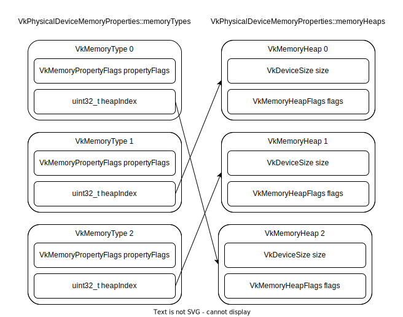

纵览
================

.. dropdown:: 更新记录
   :color: muted
   :icon: history

   * 2023/5/15 增加该文章
   * 2023/5/16 将 ``开始于 Vulkan SDK`` 章节的内容移动至单独 ``开始于 Vulkan SDK`` 文章中
   * 2023/6/23 更新该文档
   * 2023/6/23 增加 ``Vulkan 能为我们做什么`` 章节
   * 2023/6/23 增加 ``获取 Vulkan 接口`` 章节
   * 2023/6/23 增加 ``vkGetInstanceProcAddr`` 章节
   * 2023/6/23 增加 ``加载 Vulkan 动态库`` 章节
   * 2023/6/24 更新 ``vkGetInstanceProcAddr`` 章节
   * 2023/6/24 更新 ``Vulkan 最初之物 VkInstance`` 章节
   * 2023/6/24 增加 ``创建 VkInstance`` 章节
   * 2023/6/25 更新 ``创建 VkInstance`` 章节
   * 2023/6/25 增加 ``vkCreateInstance`` 章节
   * 2023/6/25 增加 ``VkInstanceCreateInfo`` 章节
   * 2023/6/25 增加 ``VkApplicationInfo`` 章节
   * 2023/6/25 增加 ``获取支持的 Vulkan 版本`` 章节
   * 2023/6/26 更新 ``获取支持的 Vulkan 版本`` 章节
   * 2023/6/26 增加 ``vkEnumerateInstanceVersion`` 章节
   * 2023/6/26 增加 ``Vulkan 的接口`` 章节
   * 2023/6/26 增加 ``获取物理硬件设备`` 章节
   * 2023/6/26 增加 ``Vulkan 函数分类`` 章节并增加 ``全局函数`` 声明
   * 2023/6/26 更新 ``vkGetInstanceProcAddr`` 章节，增加 ``全局函数`` 相关说明
   * 2023/6/26 更新 ``vkCreateInstance`` 章节，增加 ``全局函数`` 相关说明
   * 2023/6/26 更新 ``vkEnumerateInstanceVersion`` 章节，增加 ``全局函数`` 相关说明
   * 2023/6/27 更新 ``获取物理硬件设备`` 章节
   * 2023/6/27 更新 ``Vulkan 函数分类`` 章节，增加全局函数的条目
   * 2023/6/27 增加 ``vkEnumeratePhysicalDevices`` 章节
   * 2023/6/28 增加 ``获取物理设备属性`` 章节
   * 2023/6/28 增加 ``vkGetPhysicalDeviceProperties`` 章节
   * 2023/6/28 增加 ``VkPhysicalDeviceProperties`` 章节
   * 2023/6/28 更新 ``vkEnumeratePhysicalDevices`` 章节
   * 2023/6/28 增加 ``VkPhysicalDeviceType`` 章节
   * 2023/6/28 更新 ``vkGetInstanceProcAddr`` 章节，增加 ``句柄`` 描述
   * 2023/6/29 增加 ``设备队列`` 章节
   * 2023/6/29 更新 ``VkPhysicalDeviceProperties`` 章节，增加 ``稀疏`` 说明
   * 2023/6/29 增加 ``获取设备队列信息`` 章节
   * 2023/6/29 增加 ``vkGetPhysicalDeviceQueueFamilyProperties`` 章节
   * 2023/6/29 增加 ``VkQueueFamilyProperties`` 章节
   * 2023/6/29 增加 ``VkQueueFlags`` 章节
   * 2023/6/29 增加 ``VkQueueFlagBits`` 章节
   * 2023/6/30 更新 ``加载 Vulkan 动态库`` 章节，增加 ``Vulkan 的静态库`` 说明
   * 2023/6/30 增加 ``逻辑设备`` 章节
   * 2023/6/30 增加 ``创建逻辑设备`` 章节
   * 2023/6/30 增加 ``vkCreateDevice`` 章节
   * 2023/6/30 增加 ``VkDeviceCreateInfo`` 章节
   * 2023/6/30 增加 ``VkDeviceQueueCreateInfo`` 章节
   * 2023/6/30 更新 ``获取设备队列（族）信息`` 章节。修改 ``例程`` 的错误
   * 2023/6/30 增加 ``获取设备队列（族）信息`` 章节
   * 2023/7/2 增加 ``获取设备队列`` 章节
   * 2023/7/2 增加 ``vkGetDeviceQueue`` 章节
   * 2023/7/2 增加 ``获取 Device 域函数`` 章节
   * 2023/7/2 增加 ``vkGetDeviceProcAddr`` 章节
   * 2023/7/2 更新 ``vkGetPhysicalDeviceProperties`` 章节，增加 ``PhysicalDevice 域函数`` 说明
   * 2023/7/2 更新 ``Vulkan 函数分类`` 章节，增加 ``PhysicalDevice 域函数特殊性`` 说明，修正分类说明，删除 ``PhysicalDevice 域函数`` 说明
   * 2023/7/2 更新 ``vkGetPhysicalDeviceQueueFamilyProperties`` 章节，增加 ``PhysicalDevice 域函数`` 说明
   * 2023/7/8 增加 ``内存`` 章节
   * 2023/7/8 增加 ``内存分类`` 章节
   * 2023/7/8 增加 ``分配内存`` 章节
   * 2023/7/8 更新 ``Vulkan 函数分类`` 章节中的 ``PhysicalDevice 域函数特殊性`` 说明
   * 2023/7/9 更新 ``分配内存`` 章节更名为 ``分配缓存``
   * 2023/7/9 增加 ``获取 Vulkan 支持的缓存`` 章节
   * 2023/7/9 增加 ``vkGetPhysicalDeviceMemoryProperties`` 章节
   * 2023/7/9 增加 ``VkPhysicalDeviceMemoryProperties`` 章节
   * 2023/7/9 增加 ``VkMemoryType`` 章节
   * 2023/7/9 修正 ``内存分类`` 章节中的一些错误，优化调理，增加新的说明。
   * 2023/7/9 增加 ``VkMemoryHeap`` 章节
   * 2023/7/9 增加 ``VkMemoryHeapFlagBits`` 章节
   * 2023/7/9 增加 ``VkPhysicalDeviceMemoryProperties 结构图`` 章节
   * 2023/7/10 增加 ``vkGetPhysicalDeviceMemoryProperties`` 函数例程
   * 2023/10/3 将 ``获取 Vulkan 支持的缓存`` 章节重命名为 ``获取 Vulkan 支持的缓存信息``
   * 2023/10/3 更新 ``VkMemoryHeap`` 章节，增加 ``堆`` 说明。
   * 2023/10/3 更新 ``vkGetPhysicalDeviceQueueFamilyProperties`` 章节，更新 ``队列族`` 说明图示。
   * 2023/10/3 更新 ``VkPhysicalDeviceMemoryProperties 结构图`` 章节，更新说明图示。
   * 2023/10/4 更新 ``vkGetDeviceProcAddr`` 章节中的说明。
   * 2023/10/4 更新 ``分配缓存`` 章节。
   * 2023/10/4 更新 ``获取 Vulkan 支持的缓存信息`` 章节。将 ``缓存`` 更改为 ``内存`` 。
   * 2023/10/4 更新 ``const VkAllocationCallbacks* pAllocator`` 说明。
   * 2023/10/6 增加 ``内存管理`` 章节。
   * 2023/10/6 增加 ``VkMemoryAllocateInfo`` 章节。
   * 2023/10/6 更新 ``VkMemoryHeap`` 章节。修正 ``VkMemoryHeap::size`` 单位讲解错误。
   * 2023/10/6 增加 ``回收内存`` 章节。
   * 2023/10/6 增加 ``vkFreeMemory`` 章节。
   * 2023/10/12 增加开头 ``篇幅`` 注意事项。
   * 2023/10/12 增加 ``资源`` 章节。
   * 2023/10/12 增加 ``缓存`` 章节。
   * 2023/10/15 更新 ``资源`` 章节。
   * 2023/10/15 更新 ``缓存`` 章节。
   * 2023/10/15 增加 ``vkCreateBuffer`` 章节。
   * 2023/10/15 增加 ``VkBufferCreateInfo`` 章节。
   * 2023/10/15 增加 ``VkDeviceSize`` 章节。
   * 2023/10/15 增加 ``VkBufferUsageFlags`` 章节。
   * 2023/10/15 增加 ``VkSharingMode`` 章节。
   * 2023/10/18 增加 ``图片`` 章节。
   * 2023/10/18 增加 ``vkCreateImage`` 章节。
   * 2023/10/18 增加 ``VkImageCreateInfo`` 章节。
   * 2023/10/18 增加 ``VkImageType`` 章节。
   * 2023/10/18 增加 ``VkExtent3D`` 章节。
   * 2023/10/19 增加 ``VkSampleCountFlagBits`` 章节。
   * 2023/10/19 增加 ``VkImageTiling`` 章节。
   * 2023/10/19 增加 ``VkImageUsageFlags`` 章节。
   * 2023/10/19 增加 ``VkFormat`` 章节。
   * 2023/10/19 增加 ``VkImageLayout`` 章节。
   * 2023/10/19 增加 ``VkImageCreateInfo 其他参数和综述`` 章节。
   * 2023/10/21 更新 ``VkImageLayout`` 章节。修正一些语句不通顺的地方。
   * 2023/10/21 更新 ``VkImageUsageFlags`` 章节。
   * 2023/10/21 更新 ``VkImageCreateInfo 其他参数和综述`` 章节。
   * 2023/10/21 更新 ``综述`` 章节。
   * 2023/10/22 增加 ``资源与内存`` 章节。
   * 2023/10/22 增加 ``vkGetBufferMemoryRequirements`` 章节。
   * 2023/10/22 增加 ``vkGetImageMemoryRequirements`` 章节。
   * 2023/10/22 增加 ``VkMemoryRequirements`` 章节。
   * 2023/10/22 增加 ``memoryTypeBits`` 章节。
   * 2024/1/2 更新 ``篇幅`` 说明。
   * 2024/1/2 更新 ``加载 Vulkan 动态库`` 章节。修正一些用词。
   * 2024/1/2 增加 ``Vulkan 的句柄`` 章节。
   * 2024/1/2 增加 ``Dispatchable`` 章节。
   * 2024/1/2 增加 ``Non-dispatchable`` 章节。
   * 2024/1/3 增加 ``句柄的使用`` 章节。
   * 2024/1/3 更新 ``Non-dispatchable`` 章节。
   * 2024/1/3 增加 ``句柄初始化`` 章节。
   * 2024/1/3 更新 ``篇幅`` 章节。去掉分章计划。
   * 2024/1/3 增加 ``资源与内存的绑定`` 章节。
   * 2024/1/3 增加 ``vkBindBufferMemory`` 章节。
   * 2024/1/3 增加 ``vkBindImageMemory`` 章节。
   * 2024/1/4 更新 ``vkBindBufferMemory`` 章节。
   * 2024/1/4 更新 ``vkBindImageMemory`` 章节。
   * 2024/1/4 增加 ``数据传输`` 章节。
   * 2024/1/4 增加 ``通过CPU向内存中传输数据`` 章节。
   * 2024/1/4 增加 ``vkMapMemory`` 章节。
   * 2024/1/4 增加 ``vkUnmapMemory`` 章节。
   * 2024/1/5 更新 ``通过GPU向内存中传输数据`` 章节。
   * 2024/1/6 更新 ``通过GPU向内存中传输数据`` 章节。增加对 ``srcBuffer`` 和 ``dstBuffer`` 的基本要求说明。
   * 2024/1/6 增加 ``图片视图`` 章节。
   * 2024/1/6 增加 ``vkCreateImageView`` 章节。
   * 2024/1/6 增加 ``VkImageViewCreateInfo`` 章节。
   * 2024/1/6 增加 ``VkImageViewType`` 章节。
   * 2024/1/6 增加 ``VkImageSubresourceRange`` 章节。
   * 2024/1/6 增加 ``VkImageAspectFlags`` 章节。
   * 2024/1/6 增加 ``解析范围`` 章节。
   * 2024/1/6 增加 ``VkComponentMapping`` 章节。
   * 2024/1/6 增加 ``VkComponentSwizzle`` 章节。
   * 2024/1/8 增加 ``指令`` 章节。
   * 2024/1/8 增加 ``指令缓存`` 章节。
   * 2024/1/9 更新 ``指令缓存`` 章节。
   * 2024/1/9 增加 ``指令缓存池`` 章节。
   * 2024/1/9 增加 ``vkCreateCommandPool`` 章节。
   * 2024/1/9 增加 ``VkCommandPoolCreateInfo`` 章节。
   * 2024/1/9 增加 ``VkCommandPoolCreateFlagBits`` 章节。
   * 2024/1/10 增加 ``分配指令缓存`` 章节。
   * 2024/1/10 增加 ``VkCommandBufferAllocateInfo`` 章节。
   * 2024/1/10 增加 ``VkCommandBufferLevel`` 章节。
   * 2024/1/10 增加 ``指令记录`` 章节。
   * 2024/1/14 更新 ``指令记录`` 章节。
   * 2024/1/14 增加 ``vkBeginCommandBuffer`` 章节。
   * 2024/1/14 更新 ``VkCommandBufferLevel`` 章节。增加对 ``一级`` 和 ``二级`` 说明。
   * 2024/1/14 增加 ``开启指令缓存`` 章节。
   * 2024/1/14 更新 ``通过GPU向内存中传输数据`` 章节。增加 ``开启指令缓存指令记录`` 和 ``结束指令缓存指令记录`` 。
   * 2024/1/14 增加 ``结束指令缓存`` 章节。
   * 2024/1/14 增加 ``vkEndCommandBuffer`` 章节。
   * 2024/1/14 更新 ``Vulkan 能为我们做什么`` 章节。修改该文档的 ``纵览目标``。
   * 2024/1/20 更新代码中中文符号修改成英文符号。
   * 2024/1/20 更新 ``指令推送`` 章节。
   * 2024/1/20 增加 ``vkQueueSubmit`` 章节。
   * 2024/1/20 增加 ``VkSubmitInfo`` 章节。
   * 2024/1/20 增加 ``等待指令缓存执行完成`` 章节。
   * 2024/1/20 增加 ``vkDeviceWaitIdle`` 章节。
   * 2024/1/20 增加 ``vkQueueWaitIdle`` 章节。
   * 2024/1/20 增加 ``栏栅`` 章节。
   * 2024/1/20 增加 ``vkCreateFence`` 章节。
   * 2024/1/20 增加 ``VkFenceCreateInfo`` 章节。
   * 2024/1/20 增加 ``等待栏栅`` 章节。
   * 2024/1/20 增加 ``vkWaitForFences`` 章节。
   * 2024/2/4 增加 ``VkInstanceCreateFlags`` 章节。并增加 ``VkFlags 与 位域`` 说明。
   * 2024/2/4 更新 ``VkQueueFlags`` 章节。将其中的 ``VkFlags`` 说明转移至 ``VkInstanceCreateFlags`` 章节的 ``VkFlags 与 位域`` 说明中。

由于 ``Vulkan`` 比较复杂，为了更好的入门 ``Vulkan`` ，还是大致过一遍 ``Vulkan`` 的核心思路，这对以后的学习很有帮助。

.. admonition:: 篇幅
   :class: caution

   该 ``纵览`` 章节会比较长。但也推荐您通读一遍。之后会分章节进行精讲。

Vulkan 能为我们做什么
######################

``Vulkan`` 最主要的任务就是为我们提供了 ``GPU`` 并行计算的接口。是的 ``Vulkan`` 仅仅只是规定了一套接口，其并没有接口的具体实现，而实现是需要硬件厂商自己适配实现，所以市面上并不是所有硬件设备都支持 ``Vulkan`` 。像 ``NVIDIA`` 、 ``AMD`` 和 ``Intel`` 等国际大厂基本提供了完整的 ``Vulkan``
核心标准接口。而像国产的后起之秀 `摩尔线程 <https://www.mthreads.com/>`_ 也在努力适配 ``Vulkan`` 标准（ :bdg-warning:`景嘉微你要加油啊`）。由于标准的实现都是自家的，所以每家厂商都可以根据自家设备的特点进行优化和扩展，这样在提供 ``Vulkan`` 核心功能的基础上也推出了自家的扩展功能，而扩展功能往往是该设备的卖点（比如硬件实时光线追踪扩展功能）。

而在使用 ``Vulkan`` 时，相比于标准，我们往往更关注于 ``Vulkan`` 所提供的功能，主要的功能如下：

* 光栅化渲染
* 实时光线追踪
* 视频编解码
* （通用）并行计算

其中 ``光栅化渲染`` 应该是最主要的功能了（同时也是 ``Vulkan`` 的核心功能）。

该章节主要以所有功能通用开发流程为核心进行纵览。

Vulkan 的句柄
######################

在 ``Vulkan`` 中所有 ``对象`` 都是以 ``句柄`` 的形式呈现的。在 ``Vulkan`` 中有两种句柄：

* :bdg-secondary:`Dispatchable` 可调度句柄。
* :bdg-secondary:`Non-dispatchable` 不可调度句柄。

Dispatchable
************************

可调度句柄有如下特点：

* 拥有具体类型定义的指针。
* 在生命周期内，其句柄值是唯一的。

在 ``vulkan_core.h`` 的头文件中使用 ``VK_DEFINE_HANDLE(object)`` 宏来定义，该宏的定义如下：

.. code:: c++

   #define VK_DEFINE_HANDLE(object) typedef struct object##_T* object;

其中 ``VkInstance`` 句柄就是使用该宏定义的可调度句柄：

.. code:: c++

   VK_DEFINE_HANDLE(VkInstance)
   // 等价于如下定义
   typedef struct VkInstance_T* VkInstance;

Non-dispatchable
************************

不可调度句柄有如下特点：
 
* 是一个 ``64`` 位整形。
* 具体存储的数据是驱动内部自定义的。
* 句柄本身可能用于存储对象数据，所以句柄值不是唯一的（但这不影响该句柄的销毁）

.. note::

   * :bdg-secondary:`是一个64位整形` 也不绝对，其说明如下。
   * :bdg-secondary:`句柄值不是唯一的` 如果设备激活 ``privateData`` 特性了的话，不可调度的句柄在生命周期内，其句柄值是唯一的。
 
在 ``vulkan_core.h`` 的头文件中使用 ``VK_DEFINE_NON_DISPATCHABLE_HANDLE(object)`` 宏来定义，该宏的定义如下：

.. code:: c++

   #ifndef VK_USE_64_BIT_PTR_DEFINES
      #if defined(__LP64__) || defined(_WIN64) || (defined(__x86_64__) && !defined(__ILP32__) ) || defined(_M_X64) || defined(__ia64) || defined (_M_IA64) || defined(__aarch64__) || defined(__powerpc64__)
         #define VK_USE_64_BIT_PTR_DEFINES 1
      #else
         #define VK_USE_64_BIT_PTR_DEFINES 0
      #endif
   #endif

   #ifndef VK_DEFINE_NON_DISPATCHABLE_HANDLE
      #if (VK_USE_64_BIT_PTR_DEFINES==1)
         #define VK_DEFINE_NON_DISPATCHABLE_HANDLE(object) typedef struct object##_T *object;
      #else
         #define VK_DEFINE_NON_DISPATCHABLE_HANDLE(object) typedef uint64_t object;
      #endif
   #endif

通过上面的代码我们可以知道， ``Vulkan`` 会先确认当前平台是否支持 ``64`` 位的指针，如果支持则 ``不可调度句柄`` 定义与 ``可调度句柄`` 定义相同。否则使用 ``64`` 位整形表示该句柄。

其中 ``VkBuffer`` 句柄就是使用该宏定义的不可调度句柄：

.. code:: c++  

   VK_DEFINE_NON_DISPATCHABLE_HANDLE(VkBuffer)
   // 等价于如下定义
   typedef struct VkBuffer_T* VkBuffer; // 支持64位指针
   typedef uint64_t VkBuffer; // 不支持64位指针

句柄的使用
************************

在 ``Vulkan`` 中已经声明了一系列的句柄类型供我们使用：

.. code:: c++

   VK_DEFINE_HANDLE(VkInstance)
   VK_DEFINE_HANDLE(VkPhysicalDevice)
   VK_DEFINE_HANDLE(VkDevice)
   VK_DEFINE_HANDLE(VkQueue)
   VK_DEFINE_HANDLE(VkCommandBuffer)
   VK_DEFINE_NON_DISPATCHABLE_HANDLE(VkBuffer)
   VK_DEFINE_NON_DISPATCHABLE_HANDLE(VkImage)
   VK_DEFINE_NON_DISPATCHABLE_HANDLE(VkSemaphore)
   VK_DEFINE_NON_DISPATCHABLE_HANDLE(VkFence)
   VK_DEFINE_NON_DISPATCHABLE_HANDLE(VkDeviceMemory)
   VK_DEFINE_NON_DISPATCHABLE_HANDLE(VkEvent)
   VK_DEFINE_NON_DISPATCHABLE_HANDLE(VkQueryPool)
   VK_DEFINE_NON_DISPATCHABLE_HANDLE(VkBufferView)
   VK_DEFINE_NON_DISPATCHABLE_HANDLE(VkImageView)
   VK_DEFINE_NON_DISPATCHABLE_HANDLE(VkShaderModule)
   VK_DEFINE_NON_DISPATCHABLE_HANDLE(VkPipelineCache)
   VK_DEFINE_NON_DISPATCHABLE_HANDLE(VkPipelineLayout)
   VK_DEFINE_NON_DISPATCHABLE_HANDLE(VkPipeline)
   VK_DEFINE_NON_DISPATCHABLE_HANDLE(VkRenderPass)
   VK_DEFINE_NON_DISPATCHABLE_HANDLE(VkDescriptorSetLayout)
   VK_DEFINE_NON_DISPATCHABLE_HANDLE(VkSampler)
   VK_DEFINE_NON_DISPATCHABLE_HANDLE(VkDescriptorSet)
   VK_DEFINE_NON_DISPATCHABLE_HANDLE(VkDescriptorPool)
   VK_DEFINE_NON_DISPATCHABLE_HANDLE(VkFramebuffer)
   VK_DEFINE_NON_DISPATCHABLE_HANDLE(VkCommandPool)

.. note::

   此处为核心句柄， ``Vulkan`` 还有很多其他用于扩展功能的句柄。

.. important::

   ``Vulkan`` 的句柄有明确的子父级关系，也就是 ``B`` 句柄是由 ``A`` 句柄创建出来的，因此 ``A`` 为 ``B`` 的父句柄。 ``Vulkan`` 要求子句柄仅能被自己的父句柄使用。比如 ``VkInstance`` 句柄就是 ``VkPhysicalDevice`` 的父句柄。

如此，我们就可以使用这些已经声明好的句柄了，比如声明一个 ``VkInstance`` 句柄：

.. code:: c++

   VkInstance instance;
   //等价于
   VkInstance_T* instance;

句柄初始化
************************

不同编译器对于没有明确初始值变量默认值策略不同，为此 ``Vulkan`` 声明了 ``VK_NULL_HANDLE`` 宏定义用于明确句柄的初始值。其定义如下：

.. code:: c++

   #ifndef VK_DEFINE_NON_DISPATCHABLE_HANDLE
       #if (VK_USE_64_BIT_PTR_DEFINES==1)
           #if (defined(__cplusplus) && (__cplusplus >= 201103L)) || (defined(_MSVC_LANG) && (_MSVC_LANG >= 201103L))
               #define VK_NULL_HANDLE nullptr
           #else
               #define VK_NULL_HANDLE ((void*)0)
           #endif
       #else
           #define VK_NULL_HANDLE 0ULL
       #endif
   #endif
   #ifndef VK_NULL_HANDLE
       #define VK_NULL_HANDLE 0
   #endif

可以看到 ``VK_NULL_HANDLE`` 要么是个明确的空指针，要么就是 ``0`` 。如此，我们就可以初始化句柄了：

.. code:: c++

   VkInstance instance = VK_NULL_HANDLE;

Vulkan 的接口
######################

``Vulkan`` 的接口，也就是 ``Vulkan`` 函数，最开始是使用 ``C`` 语言发布的，有些繁琐，后来推出了 ``C++`` 版本的接口，现在 ``Python`` 、 ``Java`` 和 ``C#`` 等高级语言也陆续支持开发 ``Vulkan`` ，支持 ``Vulkan`` 的家族也在慢慢壮大。

.. important::

   本教程主要是用最原始的 ``C`` 语言版本进行讲解。

获取 Vulkan 接口
######################

由于 ``Vulkan`` 只是一套标准，具体的实现都在硬件驱动中，为了能够使用 ``Vulkan`` 驱动硬件设备，我们需要获取驱动中 ``Vulkan`` 标准实现的接口。

加载 Vulkan 动态库
************************

``Vulkan`` 中提供了 ``Vulkan Loader`` 用于 ``Vulkan`` 标准接口函数的获取。根据前文介绍我们知道 ``Vulkan Loader`` 对应着 ``Vulkan`` 的动态库，所以我们第一步就是加载 ``Vulkan`` 的动态库。

.. admonition:: Vulkan 的动态库
   :class: note

   ``Windows`` 操作系统上 ``Vulkan`` 的动态库为 ``vulkan-1.dll`` ，而 ``Linux`` 上的为 ``libvulkan.so.1`` 或 ``libvulkan.so`` 。

.. admonition:: Vulkan 的静态库
   :class: hint

   为什么不是用 ``Vulkan`` 的静态库呢？最主要的原因来源于 `Vulkan Loader 的 Static Linking <https://github.com/KhronosGroup/Vulkan-Loader/blob/main/docs/LoaderApplicationInterface.md#static-linking>`_ 文档：

      In previous versions of the loader, it was possible to statically link the loader. This was removed and is no longer possible. The decision to remove static linking was because of changes to the driver which made older applications that statically linked unable to find newer drivers.

      在 ``Loader`` 之前的版本中，是可以静态链接 ``Loader`` 的。这将会在不久的将来移除。这是由于之前静态链接的老程序无法找到新的驱动。

   此外静态链接有如下问题：

   * 除非重编译链接原工程否则永远得不到新 ``Loader`` 内容
   * 包含的两个库可能会链接了不同版本的 ``Loader``

.. tab-set::

    .. tab-item:: Windows 加载

      .. code:: c++

         #include <Windows.h>

         HMODULE library = LoadLibraryA("vulkan-1.dll");

    .. tab-item:: Linux 加载

      .. code:: c++

         #include <dlfcn.h>

         void *library = dlopen("libvulkan.so.1", RTLD_NOW | RTLD_LOCAL);
         if (!library)
         {
             library = dlopen("libvulkan.so", RTLD_NOW | RTLD_LOCAL);
         }

Vulkan 函数分类
************************

之后我们就可以从加载的动态库中获取 ``Vulkan`` 的函数了，但是在获取 ``Vulkan`` 函数前我们需要先介绍一下 ``Vulkan`` 中函数的分类：

* :bdg-secondary:`Instance 域函数` 主要是通过 ``vkGetInstanceProcAddr`` 函数接口获取，该类函数大部分与 ``VkInstance`` 进行交互。主要是获取一些与设备不相关与环境相关的函数。
   * :bdg-secondary:`全局函数` 在 ``Instance`` 域函数中有几个函数为全局函数。所谓全局函数是指任何驱动都需要实现的接口，并且用户可直接无条件获取其实现。全局函数如下：
      * ``vkEnumerateInstanceVersion``
      * ``vkEnumerateInstanceExtensionProperties``
      * ``vkEnumerateInstanceLayerProperties``
      * ``vkCreateInstance``

* :bdg-secondary:`PhysicalDevice 域函数` 主要是通过 ``vkGetInstanceProcAddr`` 函数接口获取，该类函数大部分与 ``VkPhysicalDevice`` 进行交互。主要是一些获取硬件设备相关信息的函数。
* :bdg-secondary:`Device 域函数` 主要是通过 ``vkGetDeviceProcAddr`` 函数接口获取，该类函数大部分与 ``VkDevice`` 进行交互。主要是获取一些与硬件设备相关的功能函数。

.. admonition:: PhysicalDevice 域函数特殊性
   :class: note

   在 ``Vulkan`` 文档中 `4.1.1 Extending Physical Device Core Functionality <https://registry.khronos.org/vulkan/specs/1.3-extensions/html/vkspec.html#_extending_physical_device_core_functionality>`_ 中有相关 ``Vulkan`` 核心 ``PhysicalDevice 域函数`` 的描述。

      当物理设备支持的 ``Vulkan`` 版本等于或高于对应函数发布时的 ``Vulkan`` 版本的话，用户可以使用对应函数。换句话就是，如果在创建 ``Vulkan`` 环境时（创建 ``VkInstance`` 时）使用了较低版本，但是物理设备支持的版本高于此版本（ ``vkGetPhysicalDeviceProperties`` ），并且 ``PhysicalDevice 域函数`` 在物理设备支持的高版本中被定义并实现，则可以获取高版本的 ``PhysicalDevice 域函数`` 使用。

   一般可以认为 ``PhysicalDevice`` 域函数为特殊的 ``Instance`` 域函数。

.. admonition:: vkGetInstanceProcAddr 和 Device 域函数
   :class: note

   在 ``Vulkan`` 中并没有禁止用户使用 ``vkGetInstanceProcAddr`` 获得 ``Device`` 域函数，但这是不推荐的，当有多个硬件设备时会造成模棱两可的函数获取。比如电脑上插着两个显卡，一个是摩尔线程的，一个是景嘉微的，这两个设备都支持绘制函数 ``vkCmdDraw`` 函数 ，但是到底获取的是哪个设备的实现是由 ``Vulkan Loader`` 定义的，用户并不能知道返回的函数是哪个设备的实现。

vkGetInstanceProcAddr
************************

在 ``Vulkan`` 中获取 ``Instance`` 域函数，提供了统一的 ``vkGetInstanceProcAddr`` 函数获取接口，如下：

.. code:: c++

   // 由 VK_VERSION_1_0 提供
   typedef void (VKAPI_PTR *PFN_vkVoidFunction)(void);

   // 由 VK_VERSION_1_0 提供
   PFN_vkVoidFunction vkGetInstanceProcAddr(
     VkInstance instance,
     const char* pName);

* :bdg-secondary:`instance` 获取 ``instance`` 兼容的函数接口，或是 ``NULL`` 用于获取不依赖任何 ``VkInstance`` 的函数。
* :bdg-secondary:`pName` 获取的接口函数名称。

获取 ``vkGetInstanceProcAddr`` 函数之后就可以使用该函数获取 ``Vulkan`` 函数了。

.. admonition:: 获取全局函数
   :class: note

   获取全局函数时 ``instance`` 为 ``VK_NULL_HANDLE``

.. admonition:: PFN_{函数名}
   :class: note

   在 ``Vulkan`` 标准中，所有的接口函数都有对应的函数指针声明，命名规则为 ``PFN_{函数名}`` 。

.. admonition:: PFN_vkVoidFunction 与 vkGetInstanceProcAddr
   :class: note

   ``vkGetInstanceProcAddr`` 会返回 ``PFN_vkVoidFunction`` 类型函数指针。但是我们想获得 ``Vulkan`` 中如 ``vkCreateInstance`` 这样的函数指针，该指针并不是 ``PFN_vkVoidFunction`` 类型的，而是 ``PFN_vkCreateInstance`` 类型的，如何从 ``PFN_vkVoidFunction`` 类型获得 ``PFN_vkCreateInstance`` 类型呢？
   在 ``Vulkan`` 中规定直接使用强制类型转换即可。下文有示例。

.. tab-set::

    .. tab-item:: Windows 获取

      .. code:: c++

         PFN_vkGetInstanceProcAddr vkGetInstanceProcAddr = (PFN_vkGetInstanceProcAddr)(void (*)(void))GetProcAddress(library, "vkGetInstanceProcAddr");

    .. tab-item:: Linux 获取

      .. code:: c++

         PFN_vkGetInstanceProcAddr vkGetInstanceProcAddr = (PFN_vkGetInstanceProcAddr)dlsym(library, "vkGetInstanceProcAddr");

之后就可以使用 ``vkGetInstanceProcAddr`` 获取 ``Instance`` 域的函数了。比如获取 ``vkCreateInstance`` 函数接口：

.. code:: c++

   PFN_vkCreateInstance vkCreateInstance = (PFN_vkCreateInstance)vkGetInstanceProcAddr(VK_NULL_HANDLE, "vkCreateInstance");

.. admonition:: VK_NULL_HANDLE
   :class: note

   在 ``Vulkan`` 中 ``VK_NULL_HANDLE`` 被定义为空或无效句柄，一般被声明为 ``0`` 、 ``NULL`` 或 ``nullptr`` 。

.. note:: 对于获取 ``PhysicalDevice`` 域函数和 ``Device`` 域函数将会在后文有所体现。

.. admonition:: 句柄
   :class: note

   英文为 ``Handle`` ，一般认为句柄与唯一识别号作用相同，一个句柄代表一个具体对象，函数作用在句柄上，内部是在修改句柄背后对应的那个对象。

Vulkan 最初之物 VkInstance
############################

在 ``Vulkan`` 中首先要创建的就是 ``VkInstance`` 对象。该对象包含了用户设置的 ``Vulkan`` 环境信息，包括使用的 ``Vulkan`` 的版本信息等，用于初始化 ``Vulkan`` 环境，并构建出 ``Vulkan`` 这个繁杂的系统根基。 ``VkInstance`` 定义如下：

.. code:: c++

   #define VK_DEFINE_HANDLE(object) typedef struct object##_T* object;

   VK_DEFINE_HANDLE(VkInstance)

从 ``VkInstance`` 定义可知为一个句柄，该句柄为一个结构体指针。在 ``Vulkan`` 中所有的对象都是一个句柄。

如上 ``VkInstance`` 声明等价于:

.. code:: c++

   typedef struct VkInstance_T* VkInstance;

也就是说 ``VkInstance`` 在底层其实是作为一个类型为 ``VkInstance_T`` 的指针在使用。

.. admonition:: Vulkan 中的句柄
   :class: note

   ``Vulkan`` 中并不是所有的句柄都是指针类型，也有可能是一个 ``64`` 位的无符号整形，具体是什么类型与平台相关。但用户并不需要关心句柄的底层表达， ``Vulkan`` 中对所有的句柄都做了分别进行了声明，这样用户只需要使用 ``Vulkan`` 提供的句柄声明即可。
   比如声明一个未初始化的 ``VkInstance`` 句柄（对象）：

   .. code:: c++

      VkInstance instance = VK_NULL_HANDLE;

创建 VkInstance
************************

vkCreateInstance
--------------------

我们通过之前获取到的 ``vkCreateInstance`` 函数创建 ``VkInstance`` 。相关声明如下：

.. code:: c++

   // 由 VK_VERSION_1_0 提供
   VkResult vkCreateInstance(
       const VkInstanceCreateInfo*                 pCreateInfo,
       const VkAllocationCallbacks*                pAllocator,
       VkInstance*                                 pInstance);

* :bdg-secondary:`pCreateInfo` 指向 ``VkInstanceCreateInfo`` 数据结构对象，用于控制 ``VkInstance`` 的创建。
* :bdg-secondary:`pAllocator` 内存分配器。
* :bdg-secondary:`pInstance` 创建的目标 ``VkInstance`` 结果。

.. important:: ``vkCreateInstance`` 属于全局函数。

.. admonition:: pAllocator
   :class: note

   在 ``Vulkan`` 中创建句柄是需要设置内存分配器的，也就是 ``pAllocator`` ，这对于统计内存使用情况和自定义内存分配非常重要，如果没有自定义分配器的话也可以是直接传 ``nullptr`` ，这将会使用 ``Vulkan`` 内置的分配器进行分配。

如果创建成功将会返回 ``VkResult::VK_SUCCESS`` 枚举值，否则将返回错误结果枚举值。

.. admonition:: VK_SUCCESS
   :class: note

   对于 ``Vulkan`` 中返回的大多数结果值来说，成功基本都是 ``VK_SUCCESS`` ，否则就是失败（有极个别返回其他结果也可以算作成功，遇到再说）。还有一点需要注意的是， ``VK_SUCCESS`` 的枚举值为 ``0`` ：

   .. code:: c++

      typedef enum VkResult {
         VK_SUCCESS = 0,
         ...
      }VkResult;

   也就是，不应该出现如下判断：

   .. code:: c++

      VkResult result = vkCreateInstance(...);
      if(result) // 如果此时 result 为 VK_SUCCESS ，而 VK_SUCCESS 的枚举值为 0 ，会导致判定不满足条件。
      ...

   而正确的做法为：

   .. code:: c++

      VkResult result = vkCreateInstance(...);
      if(result == VkResult::VK_SUCCESS)
      ...

VkInstanceCreateInfo
----------------------

来看一下 ``VkInstanceCreateInfo`` 的定义：

.. code:: c++

   // 由 VK_VERSION_1_0 提供
   typedef struct VkInstanceCreateInfo {
       VkStructureType             sType;
       const void*                 pNext;
       VkInstanceCreateFlags       flags;
       const VkApplicationInfo*    pApplicationInfo;
       uint32_t                    enabledLayerCount;
       const char* const*          ppEnabledLayerNames;
       uint32_t                    enabledExtensionCount;
       const char* const*          ppEnabledExtensionNames;
   } VkInstanceCreateInfo;

* :bdg-secondary:`sType` 是该结构体的类型枚举值， :bdg-danger:`必须` 是 ``VkStructureType::VK_STRUCTURE_TYPE_INSTANCE_CREATE_INFO`` 。
* :bdg-secondary:`pNext` 要么是 ``NULL`` 要么指向其他结构体来扩展该结构体。
* :bdg-secondary:`flags` 是 ``VkInstanceCreateFlagBits`` 所表示的位域值，用于设置 ``VkInstance`` 的行为。
* :bdg-secondary:`pApplicationInfo` 要么是 ``NULL`` 要么指向应用信息结构体，用于  ``VkInstance`` 的细节设置。
* :bdg-secondary:`enabledLayerCount` 激活的 ``layer`` 数量。
* :bdg-secondary:`ppEnabledLayerNames` 指向数量为 ``enabledLayerCount`` 的 ``layer`` 字符串数组，用于设置要激活的 ``layer``。
* :bdg-secondary:`enabledExtensionCount` 激活 ``instance`` 扩展的数量。
* :bdg-secondary:`enabledExtensionCount` 指向数量为 ``enabledExtensionCount`` 的扩展字符串数组，用于设置要激活的 ``instance`` 扩展。

.. admonition:: sType 与 pNext
   :class: note

   初次学习 ``Vulkan`` 时会有个疑问： ``VkInstanceCreateInfo`` 已经是一个结构体了为什么还有使用 ``sType`` 再指定一遍结构体类型呢？而且 ``Vulkan`` 中几乎所有的结构体内都声明了 ``sType`` 成员，为什么？

   这就不得不说明一下 ``Vulkan`` 的扩展模块了。随着时代的发展，类似于 ``VkInstanceCreateInfo`` 结构体中的数据可能并不满足于技术背景，需要进行扩展，为此 ``Vulkan`` 引入了 ``pNext`` 成员， ``Vulkan`` 中几乎所有的结构体内都声明了 ``pNext`` 成员，而 ``pNext`` 为 ``const void*`` 类型，这也就是说 ``pNext`` 可以
   指向任意一个类型对象的数据地址。由于 ``Vulkan`` 中几乎所有的结构体内都声明了 ``pNext`` 成员，这样每个结构体都可以使用 ``pNext`` 指向下一个 ``Vulkan`` 的结构体，这样一个接着一个将结构体进行串链就形成了一个扩展链。

   .. mermaid::

      flowchart LR
         subgraph VkInstanceCreateInfo
            direction TB
               VkInstanceCreateInfo_sType["sType = VkStructureType::VK_STRUCTURE_TYPE_INSTANCE_CREATE_INFO"]
               VkInstanceCreateInfo_pNext["pNext"]
               %%VkInstanceCreateInfo_sType-.->VkInstanceCreateInfo_pNext
         end

         subgraph VulkanSomeStructureA["Vulkan某个结构体类型A"]
            direction TB
               VulkanSomeStructureA_sType["sType = VkStructureType::某个结构体A类型"]
               VulkanSomeStructureA_pNext["pNext"]
               %%VulkanSomeStructureA_sType-.->VulkanSomeStructureA_pNext
         end

         subgraph VulkanSomeStructureB["Vulkan某个结构体类型B"]
            direction TB
               VulkanSomeStructureB_sType["sType = VkStructureType::某个结构体B类型"]
               VulkanSomeStructureB_pNext["pNext"]
               %%VulkanSomeStructureB_sType-.->VulkanSomeStructureB_pNext
         end

         VkInstanceCreateInfo_pNext-->VulkanSomeStructureA
         VulkanSomeStructureA_pNext-->VulkanSomeStructureB
         VulkanSomeStructureB_pNext-->a2["..."]

   这样驱动就可以根据 ``pNext`` 指针链遍历所有的结构体数据了，但是有一个问题 ``pNext`` 只是个 ``void*`` 指针，驱动在获取到 ``pNext`` 指向的地址时并不知道这个地址应该按照哪种结构体类型进行解析，这时 ``sType`` 的作用就体现出来了，驱动获取该地址下的 ``sType`` 的数据，这样驱动就知道如何解析此块地址了。

   .. code:: c++

      // 驱动内部可能的实现

      const void* pNext = 某个结构体的地址;
      VkStructureType sType = VkStructureType::VK_STRUCTURE_TYPE_MAX_ENUM;
      memcpy(&sType, pNext, sizeof(VkStructureType));

      switch(sType)
      {
      case VkStructureType::VK_STRUCTURE_TYPE_INSTANCE_CREATE_INFO:
      {
         VkInstanceCreateInfo* instance_create_info = (VkInstanceCreateInfo*)(pNext);
      }
      break;
         ...
      }

其中 ``VkInstanceCreateFlags`` 定义入下：

VkInstanceCreateFlags
------------------------

.. code:: c++

   // 由 VK_VERSION_1_0 提供
   typedef VkFlags VkInstanceCreateFlags;

.. code:: c++

   // 由 VK_VERSION_1_0 提供
   typedef uint32_t VkFlags;

从定义可知 ``VkFlags`` 是一个 ``32`` 为无符号整数。

其中 ``VkInstanceCreateFlags`` 可以设置的有效值定义在了 ``VkInstanceCreateFlagBits`` 中，如下：

.. code:: c++

   // 由 VK_VERSION_1_0 提供
   typedef enum VkInstanceCreateFlagBits {
     // 由 VK_KHR_portability_enumeration 扩展提供
       VK_INSTANCE_CREATE_ENUMERATE_PORTABILITY_BIT_KHR = 0x00000001,
   } VkInstanceCreateFlagBits;

其中 ``VK_INSTANCE_CREATE_ENUMERATE_PORTABILITY_BIT_KHR`` 只有在开启 ``VK_KHR_portability_enumeration`` 扩展后才能使用，这里可以忽略。这里引出 ``VkInstanceCreateFlagBits`` 是想说明如下问题：

* 在 ``Vulkan`` 中提供了各种各样的 ``VkFlags`` 的 ``typedef Vk{标志位类型名称}Flags`` 别名，用于配置各种额外信息。
* ``Vk{标志位类型名称}Flags`` 中可用的值都对应定义在 ``Vk{标志位类型名称}FlagBits`` 枚举类型中。
* ``VkFlags`` 为 ``32`` 位无符号整型，可以存储 ``32`` 个比特位。
* ``Vk{标志位类型名称}FlagBits`` 中定义了每个比特位所对应的含义。

.. admonition:: VkFlags 与 位域
   :class: note

   像 ``VkFlags`` 这样的使用比特位存储数据的形式叫做 ``位域`` 或 ``标志位`` 。每一位都代表某个特殊含义。而 ``Vk{标志位类型名称}FlagBits`` 中恰恰定义了每一位，所以其中的每一个枚举值必须为 :math:`2^n` 。
   
   像 ``uint32_t`` ，其比特位有 ``32`` 个，如果某一比特位为 ``1`` 则说明对应的位域被激活，也就是对应位域表示的事物被激活。比如：

   .. code:: c++

      uint32_t LIKE_CAT_BIT = 0x1; //对应的二进制：01
      uint32_t LIKE_DOG_BIT = 0x2; //对应的二进制：10

      uint32_t likes = 某人的喜好;

      if(likes == 0) //什么也不喜欢
      if((likes & LIKE_CAT_BI) == LIKE_CAT_BIT) //喜欢猫
      if((likes & LIKE_DOG_BIT) == LIKE_DOG_BIT) //喜欢狗
      if((likes & (LIKE_CAT_BIT | LIKE_DOG_BIT)) == (LIKE_CAT_BIT | LIKE_DOG_BIT)) //既喜欢猫，也喜欢狗
   
   ``Vulkan`` 中的标志位也沿用了这套方式，比如 ``VkColorComponentFlags`` 颜色通道标志字段：

   .. code:: c++

      // 由 VK_VERSION_1_0 提供
      typedef VkFlags VkColorComponentFlags;

   可用的位域定义在了 ``VkColorComponentFlagBits`` 中，如下：

   .. code:: c++

      // 由 VK_VERSION_1_0 提供
      typedef enum VkColorComponentFlagBits {
          VK_COLOR_COMPONENT_R_BIT = 0x00000001,
          VK_COLOR_COMPONENT_G_BIT = 0x00000002,
          VK_COLOR_COMPONENT_B_BIT = 0x00000004,
          VK_COLOR_COMPONENT_A_BIT = 0x00000008,
      } VkColorComponentFlagBits;

   * :bdg-secondary:`VK_COLOR_COMPONENT_R_BIT` 红色通道。十六进制为 ``0x1`` ，对应的二进制为 ``0001`` 。
   * :bdg-secondary:`VK_COLOR_COMPONENT_G_BIT` 绿色通道。十六进制为 ``0x2`` ，对应的二进制为 ``0010`` 。
   * :bdg-secondary:`VK_COLOR_COMPONENT_B_BIT` 蓝色通道。十六进制为 ``0x4`` ，对应的二进制为 ``0100`` 。
   * :bdg-secondary:`VK_COLOR_COMPONENT_A_BIT` 透明通道。十六进制为 ``0x8`` ，对应的二进制为 ``1000`` 。

   在位域中一般直接使用 ``位`` 操作符，也就是与、或、非、异或。

   .. code:: c++

      VkColorComponentFlags color_component_flags = 0;
      color_component_flags = VK_COLOR_COMPONENT_R_BIT | VK_COLOR_COMPONENT_G_BIT; // 表示开启红色和绿色通道
      color_component_flags = VK_COLOR_COMPONENT_R_BIT | VK_COLOR_COMPONENT_G_BIT | VK_COLOR_COMPONENT_B_BIT; // 表示开启红色、绿色和蓝色通道
      color_component_flags = VK_COLOR_COMPONENT_R_BIT | VK_COLOR_COMPONENT_G_BIT | VK_COLOR_COMPONENT_B_BIT | VK_COLOR_COMPONENT_A_BIT; // 表示开启红色、绿色、蓝色和透明通道

      bool is_open_r = (color_component_flags & VK_COLOR_COMPONENT_R_BIT) == VK_COLOR_COMPONENT_R_BIT ? true : false;
      bool is_open_g = (color_component_flags & VK_COLOR_COMPONENT_G_BIT) == VK_COLOR_COMPONENT_G_BIT ? true : false;
      bool is_open_b = (color_component_flags & VK_COLOR_COMPONENT_B_BIT) == VK_COLOR_COMPONENT_B_BIT ? true : false;
      bool is_open_a = (color_component_flags & VK_COLOR_COMPONENT_A_BIT) == VK_COLOR_COMPONENT_A_BIT ? true : false;

   这样就可以使用一个 ``32`` 位整数的每一位，表示不同的含义。最直接的好处就是节省内存。

VkApplicationInfo
----------------------

目前我们只需要关注 ``VkApplicationInfo`` 就好，其定义如下：

.. code:: c++

   // 由 VK_VERSION_1_0 提供
   typedef struct VkApplicationInfo {
       VkStructureType    sType;
       const void*        pNext;
       const char*        pApplicationName;
       uint32_t           applicationVersion;
       const char*        pEngineName;
       uint32_t           engineVersion;
       uint32_t           apiVersion;
   } VkApplicationInfo;

* :bdg-secondary:`sType` 是该结构体的类型枚举值， :bdg-danger:`必须` 是 ``VkStructureType::VK_STRUCTURE_TYPE_APPLICATION_INFO`` 。
* :bdg-secondary:`pNext` 要么是 ``NULL`` 要么指向其他结构体来扩展该结构体。
* :bdg-secondary:`pApplicationName` 要么是 ``NULL`` 要么指向一个以空字符为结尾的 ``UTF-8`` 字符串，用于表示用户自定义应用名称。
* :bdg-secondary:`applicationVersion` 一个无符号整型，用于用户自定义应用版本。
* :bdg-secondary:`pEngineName` 要么是 ``NULL`` 要么指向一个以空字符为结尾的 ``UTF-8`` 字符串，用于表示用户自定义引擎名称。
* :bdg-secondary:`engineVersion` 一个无符号整型，用于用户自定义引擎版本。
* :bdg-secondary:`apiVersion` 应用打算使用的 ``Vulkan`` 的最高版本，并且忽略 ``apiVersion`` 的 ``patch`` 版本。

如果设备驱动只支持 ``Vulkan 1.0`` 而用户设置的 ``apiVersion`` 的 ``Vulkan`` 版本高于 ``Vulkan 1.0`` 的话， ``vkCreateInstance`` 将会返回 ``VK_ERROR_INCOMPATIBLE_DRIVER`` 。

.. note:: 如果 ``VkInstanceCreateInfo::pApplicationInfo`` 为 ``NULL`` 或 ``apiVersion`` 为 ``0`` 的话，等价于 ``apiVersion`` 设置为 ``VK_MAKE_API_VERSION(0,1,0,0)`` 也就是 ``Vulkan 1.0`` 版本。

这里我们主要关注 ``apiVersion`` 参数，这是一个非常重要的参数。该参数指定的 ``Vulkan`` 版本决定了应用可以使用该版本及以前的版本功能，并不能使用高于 ``apiVersion`` 的 ``Vulkan`` 版本功能。

.. note:: 有关 ``apiVersion`` 如何组成 ``Vulkan`` 版本的，已在 ``开始于 Vulkan SDK`` 的 ``Vulkan的版本`` 中有讲解。

现在我们就可以创建一个最简单的 ``Vulkan 1.0`` 版本的 ``VkInstance`` 了：

.. code:: c++

   VkInstance instance = VK_NULL_HANDLE;

   VkApplicationInfo application_info = {};
   application_info.sType = VkStructureType::VK_STRUCTURE_TYPE_APPLICATION_INFO;
   application_info.pNext = nullptr;
   application_info.pApplicationName = nullptr;
   application_info.applicationVersion = 0;
   application_info.pEngineName = nullptr;
   application_info.engineVersion = 0;
   application_info.apiVersion = VK_MAKE_API_VERSION(0, 1, 0, 0);

   VkInstanceCreateInfo instance_create_info = {};
   instance_create_info.sType = VkStructureType::VK_STRUCTURE_TYPE_INSTANCE_CREATE_INFO;
   instance_create_info.pNext = nullptr;
   instance_create_info.flags = 0;
   instance_create_info.pApplicationInfo = &application_info;
   instance_create_info.enabledLayerCount = 0;
   instance_create_info.ppEnabledLayerNames = nullptr;
   instance_create_info.enabledExtensionCount = 0;
   instance_create_info.ppEnabledExtensionNames = nullptr;

   VkResult result = vkCreateInstance(&instance_create_info, nullptr, &instance);
   if (result != VK_SUCCESS)
   {
      return 创建失败;
   }

.. note:: 经过如上的代码，你可以发现创建一个句柄需要填写各种各样的 ``Vk{结构体名称}Info`` 或 ``Vk{句柄名称}CreateInfo`` 等结构体。在 ``Vulkan`` 中各式各样的结构体占了绝大多数。给人一种：:bdg-info:`来，我这样有张大表，先把表填了，我才知道接下来如何干活` 的感觉。

.. admonition:: 现在我们面临一个问题
   :class: hint

   我咋知道设备支持 ``Vulkan`` 的哪个版本？

获取支持的 Vulkan 版本
############################

由于历史原因 ``Vulkan 1.0`` 标准在设计时并没有考虑到获取 ``Vulkan`` 版本，只有获取驱动支持的 ``Vulkan`` 版本。在 ``开始于 Vulkan SDK`` 中我们知道 ``Vulkan`` 版本有两个版本，一个是系统端支持的 ``Vulkan`` 版本，一个是驱动支持的 ``Vulkan`` 版本。为什么会有两个版本？

这是由于 ``Vulkan`` 的函数分为不同域。系统端支持的 ``Vulkan`` 版本主要是用于配置系统支持的功能、 ``layer`` 和扩展，不同版本支持的功能、 ``layer`` 和扩展不尽相同。驱动支持的 ``Vulkan`` 版本主要是用于配置硬件设备支持的功能和扩展，不同版本支持的功能和扩展不尽相同。

之后在 ``Vulkan 1.1`` 标准中，推出了 ``vkEnumerateInstanceVersion`` 接口来获取支持的 ``Vulkan`` 版本。

.. admonition:: 硬件设备的 Layer
   :class: note

   在 ``Vulkan 1.0`` 中硬件设备是有相关的 ``Layer`` 功能的，但用处不大，比较鸡肋，后来 ``Vulkan`` 标准组将硬件设备的 ``Layer`` 遗弃，但对外的接口还保留着。

由于在支持 ``Vulkan 1.0`` 的实现中 ``vkCreateInstance`` 可能由于 ``VK_ERROR_INCOMPATIBLE_DRIVER`` 失败返回，所以需要在调用 ``vkCreateInstance`` 之前获取支持的 ``Vulkan`` 版本。获取流程如下：

.. mermaid::

   flowchart TD
      TryToGetvkEnumerateInstanceVersion["尝试获取 vkEnumerateInstanceVersion 函数接口实现"]
      IsNull{"是否为 NULL"}
      SupportVulkan_1_0["支持Vulkan 1.0"]
      SupportVulkanFromvkEnumerateInstanceVersion["支持 vkEnumerateInstanceVersion 中获得的 Vulkan 版本"]

      TryToGetvkEnumerateInstanceVersion-->IsNull
      IsNull--是-->SupportVulkan_1_0
      IsNull--否-->SupportVulkanFromvkEnumerateInstanceVersion

vkEnumerateInstanceVersion
********************************

``vkEnumerateInstanceVersion`` 函数定义如下：

.. code:: c++

   // 由 VK_VERSION_1_1 提供
   VkResult vkEnumerateInstanceVersion(
       uint32_t*                                   pApiVersion);

* :bdg-secondary:`pApiVersion` ``instance`` 域函数支持的 ``Vulkan`` 版本。

.. important:: ``vkCreateInstance`` 属于全局函数。

接下来就让我们获取支持的 ``Vulkan`` 版本吧：

.. code:: c++

   PFN_vkEnumerateInstanceVersion vkEnumerateInstanceVersion = (PFN_vkEnumerateInstanceVersion)vkGetInstanceProcAddr(VK_NULL_HANDLE, "vkEnumerateInstanceVersion");

   if(vkEnumerateInstanceVersion != nullptr)
   {
      uint32_t vulkan_version = 0;
      VkResult result = vkEnumerateInstanceVersion(&vulkan_version);
      if (result != VK_SUCCESS)
      {
         return Vulkan Loader 或任意一个 Layer 发生了内存分配失败;
      }
      return vulkan_version;
   }
   else
   {
      return VK_MAKE_API_VERSION(0,1,0,0);
   }

获取物理硬件设备
############################

``Vulkan`` 具有能够发现连接在主板上支持 ``Vulkan`` 设备的能力。通过 ``vkEnumeratePhysicalDevices`` 函数获取支持 ``Vulkan`` 的设备。

vkEnumeratePhysicalDevices
********************************

.. code:: c++

   // 由 VK_VERSION_1_0 提供
   VkResult vkEnumeratePhysicalDevices(
       VkInstance                                  instance,
       uint32_t*                                   pPhysicalDeviceCount,
       VkPhysicalDevice*                           pPhysicalDevices);

* :bdg-secondary:`instance` 是之前使用 ``vkCreateInstance`` 创建的 ``VkInstance`` 句柄。
* :bdg-secondary:`pPhysicalDeviceCount` 是用于指定或获取的物理设备数量。
* :bdg-secondary:`pPhysicalDevices` 要么是 ``NULL`` 要么是数量不小于 ``pPhysicalDeviceCount`` 的 ``VkPhysicalDevice`` 数组。

如果 ``pPhysicalDevices`` 是 ``NULL`` 的话 ``vkEnumeratePhysicalDevices`` 函数将会将查询到支持 ``Vulkan`` 的设备数量写入 ``pPhysicalDeviceCount`` 所指向的内存中，所以 ``pPhysicalDeviceCount`` :bdg-danger:`必须` 是一个有效指针。

如果 ``pPhysicalDevices`` 不是 ``NULL`` 的话 ``vkEnumeratePhysicalDevices`` 函数将会将 ``pPhysicalDeviceCount`` 数量的有效 ``VkPhysicalDevice`` 句柄依次写入 ``pPhysicalDevices`` 指向的数组中。如果 ``pPhysicalDeviceCount`` 指定的数量小于支持 ``Vulkan`` 的设备数量的话， ``vkEnumeratePhysicalDevices`` 将会写入 ``pPhysicalDeviceCount`` 个物理设备句柄到数组中并返回 ``VK_INCOMPLETE`` 表示并不是所有设备都写入数组返回。

如果一切正常 ``vkEnumeratePhysicalDevices`` 将会返回 ``VK_SUCCESS`` 。

.. note:: 获取 ``VkPhysicalDevice`` 句柄不需要通过类似 ``vkCreatePhysicalDevice`` 这样的函数创建（ ``Vulkan`` 标准也没有该函数 ），而是在调用 ``vkCreateInstance`` 时内部已经做好了管理。也就是说 ``VkPhysicalDevice`` 的生命周期与 ``VkInstance`` 句柄一致。

接下来就让我们获取支持的 ``Vulkan`` 的物理设备吧：

首先获取 ``vkEnumeratePhysicalDevices`` 函数：

.. code:: c++

   VkInstance instance = 之前成功创建的 VkInstance ;

   PFN_vkEnumeratePhysicalDevices vkEnumeratePhysicalDevices = (PFN_vkEnumeratePhysicalDevices)vkGetInstanceProcAddr(instance, "vkEnumeratePhysicalDevices");

.. note:: 此时 ``vkGetInstanceProcAddr`` 的第一个参数不为 ``VK_NULL_HANDLE`` 而为有效 ``VkInstance`` 句柄。

之后即可以获取到物理设备了：

.. code:: c++

   uint32_t physical_device_count = 0;
   vkEnumeratePhysicalDevices(instance, &physical_device_count, nullptr);

   std::vector<VkPhysicalDevice> physical_devices(physical_device_count);
   vkEnumeratePhysicalDevices(instance, &physical_device_count, physical_devices.data());

获取物理设备属性
############################

当获取到物理设备 ``VkPhysicalDevice`` 句柄之后，可以通过 ``vkGetPhysicalDeviceProperties`` 函数获取对应物理设备的属性。

vkGetPhysicalDeviceProperties
********************************

.. code:: c++

   // 由 VK_VERSION_1_0 提供
   void vkGetPhysicalDeviceProperties(
       VkPhysicalDevice                            physicalDevice,
       VkPhysicalDeviceProperties*                 pProperties);

* :bdg-secondary:`physicalDevice` 对应要获取属性的物理设备的句柄。
* :bdg-secondary:`pProperties` 对应返回的物理设备属性。

.. note:: ``vkGetPhysicalDeviceProperties`` 为 ``PhysicalDevice 域函数`` 。

``VkPhysicalDeviceProperties`` 定义如下：

VkPhysicalDeviceProperties
********************************

.. code:: c++

   // 由 VK_VERSION_1_0 提供
   typedef struct VkPhysicalDeviceProperties {
       uint32_t                            apiVersion;
       uint32_t                            driverVersion;
       uint32_t                            vendorID;
       uint32_t                            deviceID;
       VkPhysicalDeviceType                deviceType;
       char                                deviceName[VK_MAX_PHYSICAL_DEVICE_NAME_SIZE];
       uint8_t                             pipelineCacheUUID[VK_UUID_SIZE];
       VkPhysicalDeviceLimits              limits;
       VkPhysicalDeviceSparseProperties    sparseProperties;
   } VkPhysicalDeviceProperties;

* :bdg-secondary:`apiVersion` 该设备驱动支持的 ``Vulkan`` 版本。
* :bdg-secondary:`driverVersion` 该设备驱动版本。
* :bdg-secondary:`vendorID` 设备供应商的 ``ID`` 。
* :bdg-secondary:`deviceID` 设备的 ``ID`` 。
* :bdg-secondary:`deviceType` 设备类型。
* :bdg-secondary:`deviceName` 设备名称。
* :bdg-secondary:`pipelineCacheUUID` 设备的通用唯一识别码（ ``universally unique identifier`` ）。
* :bdg-secondary:`limits` 设备的限制信息。
* :bdg-secondary:`sparseProperties` 稀疏数据属性。

.. admonition:: 稀疏
   :class: note

   ``稀疏`` 为离散在内存各处的大量数据，这些数据可以被一并使用，常用表述数据量巨大的资源。

这里我们主要关注 ``apiVersion`` 和 ``deviceType`` 属性。

* ``apiVersion`` 主要是用于描述对应设备支持的 ``Vulkan`` 的版本，该版本很重要，说明设备只支持 ``apiVersion`` 版本之前的标准，如果在此设备上使用高于 ``apiVersion`` 版本的功能的话将会导致错误或未定义行为。
* ``deviceType`` 主要是用于描述对应设备是独立显卡还是集成显卡。

``VkPhysicalDeviceType`` 枚举值定义如下：

VkPhysicalDeviceType
********************************

.. code:: c++

   // 由 VK_VERSION_1_0 提供
   typedef enum VkPhysicalDeviceType {
       VK_PHYSICAL_DEVICE_TYPE_OTHER = 0,
       VK_PHYSICAL_DEVICE_TYPE_INTEGRATED_GPU = 1,
       VK_PHYSICAL_DEVICE_TYPE_DISCRETE_GPU = 2,
       VK_PHYSICAL_DEVICE_TYPE_VIRTUAL_GPU = 3,
       VK_PHYSICAL_DEVICE_TYPE_CPU = 4,
   } VkPhysicalDeviceType;

* :bdg-secondary:`VK_PHYSICAL_DEVICE_TYPE_OTHER` 该设备类型不与任何其他类型匹配， ``Vulkan`` 中未定义的设备类型。
* :bdg-secondary:`VK_PHYSICAL_DEVICE_TYPE_INTEGRATED_GPU` 集成显卡。
* :bdg-secondary:`VK_PHYSICAL_DEVICE_TYPE_DISCRETE_GPU` 独立显卡。
* :bdg-secondary:`VK_PHYSICAL_DEVICE_TYPE_VIRTUAL_GPU` 虚拟环境中的虚拟显卡。
* :bdg-secondary:`VK_PHYSICAL_DEVICE_TYPE_CPU` 中央处理器（ ``CPU`` ）。

.. admonition:: VK_PHYSICAL_DEVICE_TYPE_CPU
   :class: note

   虽然 ``VK_PHYSICAL_DEVICE_TYPE_CPU`` 表示 ``CPU`` 类型的设备，但是在通过 ``vkEnumeratePhysicalDevices`` 获取物理设备时，并不一定会得到插在主板上的 ``CPU`` 设备句柄，由于 ``CPU`` 并不一定支持 ``Vulkan`` ，所以 ``CPU`` 不一定能够获得，大部分支持 ``Vulkan`` 的设备还是显卡设备。

在使用时，一般首选使用 ``VK_PHYSICAL_DEVICE_TYPE_DISCRETE_GPU`` 独立显卡，之后再考虑使用 ``VK_PHYSICAL_DEVICE_TYPE_INTEGRATED_GPU`` 集成显卡。

获取物理属性例程如下：

首先获取 ``vkGetPhysicalDeviceProperties`` 函数：

.. code:: c++

   VkInstance instance = 之前成功创建的 VkInstance ;

   PFN_vkGetPhysicalDeviceProperties vkGetPhysicalDeviceProperties = (PFN_vkGetPhysicalDeviceProperties)vkGetInstanceProcAddr(instance, "vkGetPhysicalDeviceProperties");

之后就可以调用 ``vkGetPhysicalDeviceProperties`` 获取相应的设备属性了：

.. code:: c++

   std::vector<VkPhysicalDevice> physical_devices = 之前获取到的所有设备;

   for(VkPhysicalDevice physical_device : physical_devices)
   {
      VkPhysicalDeviceProperties physical_device_properties = {};
      vkGetPhysicalDeviceProperties(physical_device, &physical_device_properties);

      std::cout << "Physical Device Name:" << physical_device_properties.deviceName << std::endl;
   }

.. _DeviceQueue:

设备队列
############################

接下来简单介绍一下 ``Vulkan`` 中的设备队列。

``Vulkan`` 中的每一个 ``VkPhysicalDevice`` 物理设备上都有一到多个设备队列。设备队列用于执行所有的用户任务指令，包括渲染、计算、查询、剔除和构建等等各种任务指令。

每个设备队列支持一到多个功能域，这些功能域分为如下 ``5`` 种：

* :bdg-secondary:`图形` 主要用于图形渲染，执行各种渲染绘制指令。
* :bdg-secondary:`计算` 主要用于执行并行计算（计算着色器），执行各种计算指令。
* :bdg-secondary:`转移` 主要用于执行资源的布局转移并支持在不同队列中进行转移，执行各种转移指令。
* :bdg-secondary:`稀疏绑定` 主要用于稀疏内存的管理。
* :bdg-secondary:`受保护` 主要用于受保护的内存的管理。

在使用时常用的为 ``图形`` 、 ``计算`` 和 ``转移`` 功能的队列。

.. admonition:: 设备队列和功能域
   :class: important

   每个物理设备上支持一到多个设备队列，每个设备队列支持一到多个功能域。这里很有可能多个设备队列支持相同的功能域。比如同一物理设备上的设备队列 ``A`` 和 ``B`` 都支持图形和计算功能。

获取设备队列（族）信息
********************************

在 ``Vulkan`` 中是通过 ``vkGetPhysicalDeviceQueueFamilyProperties`` 函数获取：

vkGetPhysicalDeviceQueueFamilyProperties
-------------------------------------------

.. code:: c++

   // 由 VK_VERSION_1_0 提供
   void vkGetPhysicalDeviceQueueFamilyProperties(
       VkPhysicalDevice                            physicalDevice,
       uint32_t*                                   pQueueFamilyPropertyCount,
       VkQueueFamilyProperties*                    pQueueFamilyProperties);

* :bdg-secondary:`physicalDevice` 要获取属性的物理设备的句柄。
* :bdg-secondary:`pQueueFamilyPropertyCount` 是用于指定或获取的设备队列族数量。
* :bdg-secondary:`pQueueFamilyProperties` 要么是 ``NULL`` 要么是数量不小于 ``pQueueFamilyPropertyCount`` 的 ``VkQueueFamilyProperties`` 数组。

该函数的用法与 ``vkEnumeratePhysicalDevices`` 函数是一样的。

如果 ``pQueueFamilyProperties`` 是 ``NULL`` 的话 ``vkGetPhysicalDeviceQueueFamilyProperties`` 函数将会将查询到的设备队列族数量写入 ``pQueueFamilyPropertyCount`` 所指向的内存中，所以 ``pQueueFamilyPropertyCount`` :bdg-danger:`必须` 是一个有效指针。

如果 ``pQueueFamilyProperties`` 不是 ``NULL`` 的话 ``vkGetPhysicalDeviceQueueFamilyProperties`` 函数将会将 ``pQueueFamilyPropertyCount`` 数量的 ``VkQueueFamilyProperties`` 数据依次写入 ``pQueueFamilyProperties`` 指向的数组中。如果 ``pQueueFamilyPropertyCount`` 指定的数量小于支持 ``Vulkan`` 的设备队列数量的话， ``vkGetPhysicalDeviceQueueFamilyProperties`` 将会写入 ``pQueueFamilyPropertyCount`` 个设备队列族信息。

.. note:: ``vkGetPhysicalDeviceQueueFamilyProperties`` 为 ``PhysicalDevice 域函数`` 。

.. admonition:: 队列族
   :class: note

   在 ``Vulkan`` 中设备队列是按照 ``族`` 进行管理的，前面我们知道一个物理设备上的可能会有多个设备队列支持相同的功能域，这些支持相同功能域的设备队列算作同一族。

   .. figure:: ./_static/vk_queue_family_struct.svg

      如上图中。队列0、1、2三个队列属于队列族A，则这三个队列支持计算、图形和转移功能。队列3属于队列族B，则该队列支持计算和转移功能。

   ..
      .. mermaid::
      
         flowchart TB
            subgraph DeviceQueueFamily_A["设备队列族 A"]
               direction LR
               subgraph DeviceQueueFamily_A_Flags["支持的功能域"]
                  direction LR
                     DeviceQueueFamily_A_GRAPHICS["图形"]
                     DeviceQueueFamily_A_COMPUTE["计算"]
                     DeviceQueueFamily_A_TRANSFER["转移"]
   
                     DeviceQueueFamily_A_GRAPHICS -.- DeviceQueueFamily_A_COMPUTE -.- DeviceQueueFamily_A_TRANSFER
               end
   
               subgraph DeviceQueueFamily_A_Queues["支持的队列"]
                  direction TB
                     DeviceQueueFamily_A_Queue0["队列0"]
                     DeviceQueueFamily_A_Queue1["队列1"]
                     DeviceQueueFamily_A_Queue2["队列2"]
   
                     DeviceQueueFamily_A_Queue0 -.- DeviceQueueFamily_A_Queue1 -.- DeviceQueueFamily_A_Queue2
               end
   
               DeviceQueueFamily_A_Flags o--o DeviceQueueFamily_A_Queues
   
            end
   
            subgraph DeviceQueueFamily_B["设备队列族 B"]
               direction LR
               subgraph DeviceQueueFamily_B_Flags["支持的功能域"]
                  direction LR
                     DeviceQueueFamily_B_COMPUTE["计算"]
                     DeviceQueueFamily_B_TRANSFER["转移"]
   
                     DeviceQueueFamily_B_COMPUTE -.- DeviceQueueFamily_B_TRANSFER
               end
   
               subgraph DeviceQueueFamily_B_Queues["支持的队列"]
                  direction TB
                     DeviceQueueFamily_B_Queue3["队列3"]
               end
   
               DeviceQueueFamily_B_Flags o--o DeviceQueueFamily_B_Queues
   
            end
   
            DeviceQueueFamily_A-->DeviceQueueFamily_B
            DeviceQueueFamily_B-->etc["..."]
   
            style DeviceQueueFamily_A_Flags fill:#f96
            style DeviceQueueFamily_B_Flags fill:#f96
            style DeviceQueueFamily_A_Queues fill:#00bfa5
            style DeviceQueueFamily_B_Queues fill:#00bfa5

设备队列族 ``VkQueueFamilyProperties`` 定义如下：

VkQueueFamilyProperties
---------------------------

.. code:: c++

   // 由 VK_VERSION_1_0 提供
   typedef struct VkQueueFamilyProperties {
       VkQueueFlags    queueFlags;
       uint32_t        queueCount;
       uint32_t        timestampValidBits;
       VkExtent3D      minImageTransferGranularity;
   } VkQueueFamilyProperties;

* :bdg-secondary:`queueFlags` 为队列族位域，用于描述该队列族支持的功能域。
* :bdg-secondary:`queueCount` 该队列族中的队列数量。
* :bdg-secondary:`timestampValidBits` 时间戳中有效的位数，有效的位数范围为 ``36`` 到 ``64`` 位，如果为 ``0`` 说明不支持时间戳。超出有效范围的位保证为 ``0`` 。
* :bdg-secondary:`minImageTransferGranularity` 在该族队列上进行图片转移操作时支持的最小转移粒度（大小）。

目前我们主要关心 ``queueFlags`` 和 ``queueCount`` 。

``queueFlags`` 为 ``VkQueueFlags`` 类型，其定义如下：

VkQueueFlags
---------------------------

.. code:: c++

   typedef VkFlags VkQueueFlags;

可以看到 ``VkQueueFlags`` 其实就是一个 ``uint32_t`` 的标志位。

``VkQueueFlags`` 对应位域的 ``VkQueueFlagBits`` 定义如下:

VkQueueFlagBits
---------------------------

.. code:: c++

   // 由 VK_VERSION_1_0 提供
   typedef enum VkQueueFlagBits {
       VK_QUEUE_GRAPHICS_BIT = 0x00000001,
       VK_QUEUE_COMPUTE_BIT = 0x00000002,
       VK_QUEUE_TRANSFER_BIT = 0x00000004,
       VK_QUEUE_SPARSE_BINDING_BIT = 0x00000008,
     // 由 VK_VERSION_1_1 提供
       VK_QUEUE_PROTECTED_BIT = 0x00000010,
   } VkQueueFlagBits;

* :bdg-secondary:`VK_QUEUE_GRAPHICS_BIT` 表示该队列族中的队列支持 ``图形`` 功能。
* :bdg-secondary:`VK_QUEUE_COMPUTE_BIT` 表示该队列族中的队列支持 ``计算`` 功能。
* :bdg-secondary:`VK_QUEUE_TRANSFER_BIT` 表示该队列族中的队列支持 ``转移`` 功能。
* :bdg-secondary:`VK_QUEUE_SPARSE_BINDING_BIT` 表示该队列族中的队列支持 ``稀疏绑定`` 功能。
* :bdg-secondary:`VK_QUEUE_PROTECTED_BIT` 表示该队列族中的队列支持 ``受保护`` 功能。

获取设备队列（族）信息例程如下：

首先获取 ``vkGetPhysicalDeviceQueueFamilyProperties`` 函数：

.. code:: c++

   VkInstance instance = 之前成功创建的 VkInstance ;

   PFN_vkGetPhysicalDeviceQueueFamilyProperties vkGetPhysicalDeviceQueueFamilyProperties = (PFN_vkGetPhysicalDeviceQueueFamilyProperties)vkGetInstanceProcAddr(instance, "vkGetPhysicalDeviceQueueFamilyProperties");

之后就可以调用 ``vkGetPhysicalDeviceQueueFamilyProperties`` 获取相应的设备队列（族）属性了：

.. code:: c++

   VkPhysicalDevice physical_device = 之前获取到的物理设备句柄;

   uint32_t queue_family_count = 0;
   vkGetPhysicalDeviceQueueFamilyProperties(physical_device, &queue_family_count, nullptr);

   std::vector<VkQueueFamilyProperties> queue_familys(queue_family_count);
   vkGetPhysicalDeviceQueueFamilyProperties(physical_device, &queue_family_count, queue_familys.data());

   uint32_t uint32_max = std::numeric_limits<uint32_t>::max();
   uint32_t support_graphics_queue_family_index = uint32_max;
   for(uint32_t index = 0; index < queue_family_count ; index++)
   {
      if((queue_familys[index].queueFlags & VkQueueFlagBits::VK_QUEUE_GRAPHICS_BIT) == VkQueueFlagBits::VK_QUEUE_GRAPHICS_BIT)
      {
         // 寻找支持图形的队列族
         support_graphics_queue_family_index = index;
         break;
      }
   }

   assert(support_graphics_queue_family_index != uint32_max) //没找到支持图形的队列族

.. admonition:: support_graphics_queue_family_index
   :class: note

   需要获取存储对应设备队列族在 ``VkQueueFamilyProperties`` 数组中的索引值，这会在之后使用到。

.. admonition:: VK_QUEUE_GRAPHICS_BIT
   :class: note

   我们一般倾向于需要支持 ``VK_QUEUE_GRAPHICS_BIT`` 图形功能的队列族，这是因为大部分设备队列族如果支持图形功能的话，其他的计算、转移和稀疏绑定功能也会同时支持。

逻辑设备
############################

在获得了物理设备句柄之后，我们需要在某个物理设备上创建逻辑设备，之后所有的操作都应用于此逻辑设备上。 ``Vulkan`` 中使用 ``VkDevice`` 句柄表示一个逻辑设备。

创建逻辑设备
********************************

首先需要使用 ``vkCreateDevice`` 创建逻辑设备。

vkCreateDevice
-----------------

.. code:: c++

   // 由 VK_VERSION_1_0 提供
   VkResult vkCreateDevice(
       VkPhysicalDevice                            physicalDevice,
       const VkDeviceCreateInfo*                   pCreateInfo,
       const VkAllocationCallbacks*                pAllocator,
       VkDevice*                                   pDevice);

* :bdg-secondary:`physicalDevice` 为之前使用 ``vkEnumeratePhysicalDevices`` 获取到的某个物理设备句柄，逻辑设备将在此物理设备上创建。
* :bdg-secondary:`pCreateInfo` 表示逻辑设备的创建信息。
* :bdg-secondary:`pAllocator` 内存分配器。
* :bdg-secondary:`pDevice` 创建返回的逻辑设备 ``VkDevice`` 句柄。

如果创建成功将会返回 ``VK_SUCCESS`` 。并且同一个物理设备可以创建多个逻辑设备。

创建逻辑设备的 ``VkDeviceCreateInfo`` 结构体定义如下：

VkDeviceCreateInfo
------------------------

.. code:: c++

   // 由 VK_VERSION_1_0 提供
   typedef struct VkDeviceCreateInfo {
       VkStructureType                    sType;
       const void*                        pNext;
       VkDeviceCreateFlags                flags;
       uint32_t                           queueCreateInfoCount;
       const VkDeviceQueueCreateInfo*     pQueueCreateInfos;
       uint32_t                           enabledLayerCount;
       const char* const*                 ppEnabledLayerNames;
       uint32_t                           enabledExtensionCount;
       const char* const*                 ppEnabledExtensionNames;
       const VkPhysicalDeviceFeatures*    pEnabledFeatures;
   } VkDeviceCreateInfo;

* :bdg-secondary:`sType` 是该结构体的类型枚举值， :bdg-danger:`必须` 是 ``VkStructureType::VK_STRUCTURE_TYPE_DEVICE_CREATE_INFO`` 。
* :bdg-secondary:`pNext` 要么是 ``NULL`` 要么指向其他结构体来扩展该结构体。
* :bdg-secondary:`flags` 标志位，保留为将来使用。
* :bdg-secondary:`queueCreateInfoCount` 为 ``pQueueCreateInfos`` 数组的数量。
* :bdg-secondary:`pQueueCreateInfos` 指向 ``VkDeviceQueueCreateInfo`` 数组指针，用于逻辑设备创建设备队列。
* :bdg-secondary:`enabledLayerCount` 为 ``ppEnabledLayerNames`` 数组的数量。
* :bdg-secondary:`ppEnabledLayerNames` 指向字符串数组指针，用于启用设备 ``Layer`` 。
* :bdg-secondary:`enabledExtensionCount` 为 ``ppEnabledExtensionNames`` 数组的数量。
* :bdg-secondary:`ppEnabledExtensionNames` 指向字符串数组指针，用于启用设备扩展。
* :bdg-secondary:`VkPhysicalDeviceFeatures` 设置要激活的物理设备特性。

此时我们主要关心数量为 ``queueCreateInfoCount`` 类型为 ``VkDeviceQueueCreateInfo`` 的 ``pQueueCreateInfos`` 数组。该数组用于在创建逻辑设备时指定创建的设备队列信息。该结构体定义如下：

VkDeviceQueueCreateInfo
------------------------

.. code:: c++

   // 由 VK_VERSION_1_0 提供
   typedef struct VkDeviceQueueCreateInfo {
       VkStructureType             sType;
       const void*                 pNext;
       VkDeviceQueueCreateFlags    flags;
       uint32_t                    queueFamilyIndex;
       uint32_t                    queueCount;
       const float*                pQueuePriorities;
   } VkDeviceQueueCreateInfo;

* :bdg-secondary:`sType` 是该结构体的类型枚举值， :bdg-danger:`必须` 是 ``VkStructureType::VK_STRUCTURE_TYPE_DEVICE_QUEUE_CREATE_INFO`` 。
* :bdg-secondary:`pNext` 要么是 ``NULL`` 要么指向其他结构体来扩展该结构体。
* :bdg-secondary:`flags` 标志位。用于设置目标设备队列的行为。
* :bdg-secondary:`queueFamilyIndex` 对应的队列族在 ``vkGetPhysicalDeviceQueueFamilyProperties`` 函数返回的 ``pQueueFamilyProperties`` 数组中的索引值。
* :bdg-secondary:`queueCount` 在对应的队列族中创建的设备队列数量。
* :bdg-secondary:`pQueuePriorities` 设备队列优先级。指向数量为 ``queueCount`` 类型为 ``float`` 的数组，对应设置每一个设备队列的优先级。

这里 ``queueFamilyIndex`` 成员非常重要，该成员对应着使用 ``vkGetPhysicalDeviceQueueFamilyProperties`` 获取到的设备队列族在 ``pQueueFamilyProperties`` 数组中的索引值，大部分情况会去选择支持图形功能的队列族所对应的索引。

这样我们就可以创建逻辑设备了，例程如下：

首先获取 ``vkCreateDevice`` 函数：

.. code:: c++

   VkInstance instance = 之前成功创建的 VkInstance ;

   PFN_vkCreateDevice vkCreateDevice = (PFN_vkCreateDevice)vkGetInstanceProcAddr(instance, "vkCreateDevice");

之后就可以调用 ``vkCreateDevice`` 创建逻辑设备了：

.. code:: c++

   VkPhysicalDevice physical_device = 之前获取到的物理设备句柄;
   uint32_t support_graphics_queue_family_index = physical_device 中找到的支持图形功能的队列族索引;

   float queue_prioritie = 0;

   VkDeviceQueueCreateInfo device_queue_create_info = {};
   device_queue_create_info.sType = VkStructureType::VK_STRUCTURE_TYPE_DEVICE_QUEUE_CREATE_INFO;
   device_queue_create_info.pNext = nullptr;
   device_queue_create_info.flags = 0;
   device_queue_create_info.queueFamilyIndex = support_graphics_queue_family_index;
   device_queue_create_info.queueCount = 1;
   device_queue_create_info.pQueuePriorities = &queue_prioritie;

   VkDeviceCreateInfo device_create_info = {};
   device_create_info.sType = VkStructureType::VK_STRUCTURE_TYPE_DEVICE_CREATE_INFO;
   device_create_info.pNext = nullptr;
   device_create_info.flags = 0;
   device_create_info.queueCreateInfoCount = 1;
   device_create_info.pQueueCreateInfos = &device_queue_create_info;
   device_create_info.enabledLayerCount = 0;
   device_create_info.ppEnabledLayerNames = nullptr;
   device_create_info.enabledExtensionCount = 0;
   device_create_info.ppEnabledExtensionNames = nullptr;
   device_create_info.pEnabledFeatures = nullptr;

   VkDevice device = VK_NULL_HANDLE;

   VkResult result = vkCreateDevice(physical_device, &device_create_info, nullptr, &device);

   assert(result == VkResult::VK_SUCCESS) //是否创建成功

获取 Device 域函数
############################

在创建完逻辑设备 ``VkDevice`` 之后，与 ``VkDevice`` 及其产生的子对象（句柄）的所有交互函数都属于 ``Device 域函数`` 。我们通过 ``Vulkan`` 提供的 ``vkGetDeviceProcAddr`` 函数获取 ``Device`` 域函数。

vkGetDeviceProcAddr
********************************

.. code:: c++

   // 由 VK_VERSION_1_0 提供
   PFN_vkVoidFunction vkGetDeviceProcAddr(
       VkDevice                                    device,
       const char*                                 pName);

* :bdg-secondary:`device` 对应的 ``VkDevice`` 逻辑设备句柄。
* :bdg-secondary:`pName` 要获取的逻辑设备对应的 ``Vulkan`` 函数驱动实现。

该函数就是用于获取不同设备驱动实现的 ``Vulkan`` 函数接口，不同的 ``device`` 支持的 ``Vulkan`` 扩展函数不尽相同，但是如果支持 ``Vulkan`` 特定版本的话（ ``VkPhysicalDeviceProperties::apiVersion`` ）则一定能够获取 ``Vulkan`` 核心标准中的函数实现。

如果获取 ``device`` 对应驱动中没有实现的函数的话，将会返回 ``NULL`` 。

该函数的返回值与 ``vkGetInstanceProcAddr`` 一样为 ``PFN_vkVoidFunction`` ，与 ``vkGetInstanceProcAddr`` 一样， ``vkGetDeviceProcAddr`` 在获取驱动中某一有效函数后需要强制转换成对应函数。

获取 ``vkGetDeviceProcAddr`` 函数指针如下：

.. code:: c++

   VkInstance instance = 之前成功创建的 VkInstance ;

   PFN_vkGetDeviceProcAddr vkGetDeviceProcAddr = (PFN_vkGetDeviceProcAddr)vkGetInstanceProcAddr(instance, "vkGetDeviceProcAddr");

之后就可以使用 ``vkGetDeviceProcAddr`` 获取 ``Device`` 域的函数了：

.. code:: c++

   VkDevice device = 之前成功创建的 VkDevice ;

   PFN_vk{Device 域函数名} vk{Device 域函数名} = (PFN_vk{Device 域函数名})vkGetDeviceProcAddr(device, "vk{Device 域函数名}");

.. note:: 在创建完 ``VkDevice`` 之后，由于之后所有要调用的函数最终都作用在某一具体逻辑设备上（或由该逻辑设备创建的相关对象上），所以之后所有函数都是 ``Device`` 域函数。

获取设备队列
############################

我们在创建逻辑设备时指定了需要使用的设备队列信息， ``vkCreateDevice`` 创建过程中会为我们创建对应的设备队列，之后我们需要通过 ``vkGetDeviceQueue`` 函数获取设备队列 ``VkQueue`` 句柄。

vkGetDeviceQueue
********************************

.. code:: c++

   // 由 VK_VERSION_1_0 提供
   void vkGetDeviceQueue(
       VkDevice                                    device,
       uint32_t                                    queueFamilyIndex,
       uint32_t                                    queueIndex,
       VkQueue*                                    pQueue);

* :bdg-secondary:`device` 创建设备队列时对应的 ``VkDevice`` 逻辑设备句柄。
* :bdg-secondary:`queueFamilyIndex` 创建设备队列时对应的队列族索引。
* :bdg-secondary:`queueIndex` 对应着队列族中设备队列的索引。
* :bdg-secondary:`pQueue` 将会返回 ``queueFamilyIndex`` 索引对应的队列族中，设备队列索引值为 ``queueIndex`` 的索引句柄。

由于一个队列族中可能有多个设备队列，并且在创建逻辑设备时可以同时创建多个设备队列，索引此时需要用户指定 ``queueFamilyIndex`` 和 ``queueIndex`` 来获取对应的设备队列（句柄）。

在使用 ``vkGetDeviceQueue`` 获取设备队列句柄之前，需要先获取 ``vkGetDeviceQueue`` 函数指针：

.. code:: c++

   VkDevice device = 之前成功创建的 VkDevice ;

   PFN_vkGetDeviceQueue vkGetDeviceQueue = (PFN_vkGetDeviceQueue)vkGetDeviceProcAddr(device, "vkGetDeviceQueue");

.. note:: 获取 ``vkGetDeviceQueue`` 函数时使用 ``vkGetDeviceProcAddr`` 获取，其为 ``Device`` 域函数。

之后我们就可以使用 ``vkGetDeviceQueue`` 获取对应的设备队列句柄了：

.. code:: c++

   VkDevice device = 之前成功创建的 VkDevice ;
   uint32_t support_graphics_queue_family_index = physical_device 中找到的支持图形功能的队列族索引;

   VkQueue queue = VK_NULL_HANDLE;

   vkGetDeviceQueue(device, support_graphics_queue_family_index, 0, &queue);

.. note:: 由于在创建 ``VkDevice`` 代码示例中只指定了一个支持图形的队列，所以这里：
   
   * ``queueFamilyIndex`` 为之前获取的 ``support_graphics_queue_family_index``
   * ``queueIndex`` 为 ``0``

.. _Memory:

内存
############################

内存分类
********************************

在 ``Vulkan`` 中函数主要分为两类：

* ``Instance`` 域函数
* ``Device`` 域函数

``Instance`` 域函数中主要在 ``CPU`` 能够访问的（主板上）内存中进行分配和访问。比如在调用 ``vkCreateInstance`` 函数创建 ``VkInstance`` 时需要指定 ``const VkAllocationCallbacks* pAllocator`` 内存分配回调（一般回调内部使用 ``new`` 或 ``malloc`` 等进行分配）。 ``Vulkan`` 中可以被 ``CPU`` 访问的内存一般称为 ``Host`` 端内存。

``Device`` 域函数中主要在 ``GPU`` 能够访问的内存（显存）中进行内存分配和访问。这一部分内存称为 ``Device`` 端内存。

.. admonition:: const VkAllocationCallbacks* pAllocator
   :class: important

   使用 ``VkAllocationCallbacks`` 内存分配回调分配的内存将会存储在内存条中，该部分内存属于特殊的 ``Host`` 端内存，确切的说使用 ``new`` 或 ``malloc`` 等分配的内存，在 ``Vulkan`` 标准中不属于 ``Vulkan`` 管理的范畴（ ``Vulkan`` 标准中属于 ``Host`` 端范畴，其本质上属于 ``C/C++`` 范畴）。这里仅仅为了引出 ``Host`` 端做的简要引子。

   有关 ``VkAllocationCallbacks`` 的具体用法将会在之后单独的章节中进行讲解。

由此引出了 ``Vulkan`` 中的两个 ``端`` 分类：

* ``Host`` 端
* ``Device`` 端

在 ``Vulkan`` 中 ``Host`` 端一般是指 ``CPU`` 可以访问的那部分资源（内存），而该部分资源可能存储在 ``GPU`` 设备上的内存中也可能存储在内存条上的内存中。只不过这部分资源可以被 ``CPU`` 访问到并归为 ``Vulkan`` 管理范畴。

``Device`` 端表示 ``GPU`` 设备可访问的的专属资源（内存）。

这里可以看出内存条上的内存和 ``GPU`` 上的显存都属于 ``Vulkan`` 可访问的内存范畴。

在 ``Vulkan`` 中我们往往在 ``Host`` 端将数据准备好，之后使用 ``GPU`` 设备访问该数据进行计算。然而 ``Host`` 端准备的数据只有 ``CPU`` 能够访问， ``GPU`` 设备并不能直接访问 ``Host`` 端内存，为此 ``Vulkan`` 标准中为我们提供了可被 ``GPU`` 访问的 ``Host`` 端内存。
也就是说这一部分内存既可以被 ``Host`` 端访问也可以被 ``Device`` 端访问。一般来说，我们会先将 ``Host`` 端的数据拷贝至可以被 ``Host`` 端访问也可以被 ``Device`` 端访问的内存中，之后再将这部分数据拷贝至 ``Device`` 端内存中被 ``GPU`` 访问使用。

.. mermaid::

   flowchart LR

      Host["Host 端\n（使用 new 或 malloc 分配内存）"]
      HostAndDevice["Host 端与 Device 都可访问的内存"]
      Device["Device 端内存"]

      Host--拷贝-->HostAndDevice--"（总线）拷贝"-->Device

.. admonition:: 既然数据在 ``Host`` 端与 ``Device`` 端都可以访问的内存中，为什么还需要拷贝至 ``Device`` 端中？
   :class: tip

   在硬件层面 ``Host`` 端与 ``Device`` 端都可以访问的内存，这类内存对于 ``CPU`` 这种处理连续内存非常友好，而像 ``GPU`` 这种大量并行计算的设备来说就不尽人意了，拷贝至 ``Device`` 端中的目的是将这一步分数据转换成设备友好的内存结构，提高内存读写性能。

   ``Vulkan`` 中可以在 ``GPU`` 设备上直接访问 ``Host`` 端与 ``Device`` 都可访问的内存。只不过我们经常将这部分内存数据拷贝至 ``GPU`` 专属内存中提高性能。

最终可得出 ``Vulkan`` 中的内存分类：

* ``Host`` 端内存
* ``Device`` 端内存
* ``Host`` 端与 ``Device`` 端内存

.. admonition:: Vulkan 内存
   :class: important

   其实在 ``Vulkan`` 标准看来，所有的内存都属于 ``Device`` 端内存，只不过有些 ``Device`` 端内存可以被 ``Host`` 端访问。有些 ``Device`` 端内存为 ``Device`` 专属内存。

获取 Vulkan 支持的内存信息
*******************************

..
   .. admonition:: 内存与缓存
      :class: note

      ``Vulkan`` 中与内存相关的英文为 ``Buffer`` ，翻译成 ``缓存`` 更加贴合 ``Vulkan`` 标准，这里与 ``Vulkan`` 标准保持一致。

``Vulkan`` 所有的内存信息都可以通过 ``vkGetPhysicalDeviceMemoryProperties`` 函数获取，其定义如下：

vkGetPhysicalDeviceMemoryProperties
------------------------------------------

.. code:: c++

   // 由 VK_VERSION_1_0 提供
   void vkGetPhysicalDeviceMemoryProperties(
     VkPhysicalDevice                           physicalDevice,
     VkPhysicalDeviceMemoryProperties*          pMemoryProperties);

* :bdg-secondary:`physicalDevice` 为对应获取对应内存信息的物理设备。
* :bdg-secondary:`pMemoryProperties` 相应的内存信息将会写入并返回。

.. note:: ``vkGetPhysicalDeviceMemoryProperties`` 为 ``PhysicalDevice 域函数`` 。

对应的 ``VkPhysicalDeviceMemoryProperties`` 结构体描述如下：

VkPhysicalDeviceMemoryProperties
------------------------------------------

.. code:: c++

   #define VK_MAX_MEMORY_TYPES 32U
   #define VK_MAX_MEMORY_HEAPS 16U

   // 由 VK_VERSION_1_0 提供
   typedef struct VkPhysicalDeviceMemoryProperties {
     uint32_t                                         memoryTypeCount;
     VkMemoryType                                     memoryTypes[VK_MAX_MEMORY_TYPES];
     uint32_t                                         memoryHeapCount;
     VkMemoryHeap                                     memoryHeaps[VK_MAX_MEMORY_HEAPS];
   } VkPhysicalDeviceMemoryProperties;

* :bdg-secondary:`memoryTypeCount` 内存类型的数量。
* :bdg-secondary:`memoryTypes` 对应的内存类型信息数据。
* :bdg-secondary:`memoryHeapCount` 内存堆的数量。
* :bdg-secondary:`memoryHeaps` 对应的内存堆的信息数据。

对应的 ``VkMemoryType`` 结构体描述如下：

VkMemoryType
------------------------------------------

.. code:: c++

   // 由 VK_VERSION_1_0 提供
   typedef struct VkMemoryType {
     VkMemoryPropertyFlags          propertyFlags;
     uint32_t                       heapIndex;
   } VkMemoryType;

* :bdg-secondary:`propertyFlags` 该类内存的属性信息，使用标志位存储相应信息。
* :bdg-secondary:`heapIndex` 对应的内存堆的索引，表示指向 ``VkPhysicalDeviceMemoryProperties::memoryHeaps[heapIndex]`` 的内存堆。

``VkMemoryPropertyFlags`` 对应的各个比特位的值定义于 ``VkMemoryPropertyFlagBits`` 枚举中，定义如下：

VkMemoryPropertyFlagBits
------------------------------------------

.. code:: c++

   // 由 VK_VERSION_1_0 提供
   typedef enum VkMemoryPropertyFlagBits {
     VK_MEMORY_PROPERTY_DEVICE_LOCAL_BIT = 0x00000001,
     VK_MEMORY_PROPERTY_HOST_VISIBLE_BIT = 0x00000002,
     VK_MEMORY_PROPERTY_HOST_COHERENT_BIT = 0x00000004,
     VK_MEMORY_PROPERTY_HOST_CACHED_BIT = 0x00000008,
     VK_MEMORY_PROPERTY_LAZILY_ALLOCATED_BIT = 0x00000010,
     // 由 VK_VERSION_1_1 提供
     VK_MEMORY_PROPERTY_PROTECTED_BIT = 0x00000020,
   } VkMemoryPropertyFlagBits;

* :bdg-secondary:`VK_MEMORY_PROPERTY_DEVICE_LOCAL_BIT` 表示这部分内存为 ``GPU`` 物理设备自身的内存只有物理设备自身可访问，也就是 ``Device`` 端内存。
* :bdg-secondary:`VK_MEMORY_PROPERTY_HOST_VISIBLE_BIT` 表示这部分内存为 ``Host`` 端可访问到的内存只有 ``Host`` 端自身可访问， ``Device`` 端不可访问。
* :bdg-secondary:`VK_MEMORY_PROPERTY_HOST_COHERENT_BIT` 表示这部分内存为 ``Host`` 端连续内存，表示对于该内存的读写可连续进行（就像 ``CPU`` 对于内存的修改那样）。该内存类型不需要手动进行 ``刷新`` 和 ``失效`` 操作。
* :bdg-secondary:`VK_MEMORY_PROPERTY_HOST_CACHED_BIT` 表示这部分内存为 ``Host`` 端高速内存，并且自带 ``VK_MEMORY_PROPERTY_HOST_COHERENT_BIT`` 属性。这一部分内存大小相对较小。
* :bdg-secondary:`VK_MEMORY_PROPERTY_LAZILY_ALLOCATED_BIT` 表示这部分内存为可以滞后分配内存，等要使用时再分配内存。
* :bdg-secondary:`VK_MEMORY_PROPERTY_PROTECTED_BIT` 表示这部分内存为受保护内存，并且只允许 ``GPU`` 硬件设备和受保护的队列（ ``VK_QUEUE_PROTECTED_BIT`` ）可以访问该内存。

.. admonition:: ``刷新`` 和 ``失效`` 操作
   :class: note

   是指使用 ``vkFlushMappedMemoryRanges`` 进行内存刷新，使用 ``vkInvalidateMappedMemoryRanges`` 使内存失效。有关详细说明将会在单独的章节中进行讲解。

我们经常会使用到 ``VK_MEMORY_PROPERTY_DEVICE_LOCAL_BIT`` 、 ``VK_MEMORY_PROPERTY_HOST_VISIBLE_BIT`` 和 ``VK_MEMORY_PROPERTY_HOST_COHERENT_BIT`` 属性的内存。

接下来我们来看一下 ``VkMemoryType::heapIndex`` 对应的 ``VkMemoryHeap`` 的定义：

VkMemoryHeap
------------------------------------------

.. code:: c++

   // 由 VK_VERSION_1_0 提供
   typedef struct VkMemoryHeap {
     VkDeviceSize                   size;
     VkMemoryHeapFlags              flags;
   } VkMemoryHeap;

* :bdg-secondary:`size` 表示该内存堆的大小。单位为字节。
* :bdg-secondary:`flags` 表示该堆的属性标志位，各位的含义被定义在 ``VkMemoryHeapFlagBits`` 中。

.. admonition:: ``VkMemoryHeap`` 与 ``堆``
   :class: note

   一个 ``VkMemoryHeap`` 对应这一个内存 ``堆`` 。 ``堆`` 就是用于存储数据的地方，一般对应着物理存储介质。在 ``Vulkan`` 中内存是从堆上进行分配和管理的。

其中 ``VkDeviceSize`` 定义如下：

VkDeviceSize
------------------------------------------

.. code:: c++

   typedef uint64_t VkDeviceSize;

从定义来看 ``VkDeviceSize`` 就是一个正整数。

``VkMemoryHeapFlags`` 对应的各个比特位的值定义于 ``VkMemoryHeapFlagBits`` 枚举中，定义如下：

VkMemoryHeapFlagBits
------------------------------------------

.. code:: c++

   // 由 VK_VERSION_1_0 提供
   typedef enum VkMemoryHeapFlagBits {
     VK_MEMORY_HEAP_DEVICE_LOCAL_BIT = 0x00000001,
     // 由 VK_VERSION_1_1 提供
     VK_MEMORY_HEAP_MULTI_INSTANCE_BIT = 0x00000002,
   } VkMemoryHeapFlagBits;

* :bdg-secondary:`VK_MEMORY_HEAP_DEVICE_LOCAL_BIT` 表示该内存堆为 ``GPU`` 专属内存。
* :bdg-secondary:`VK_MEMORY_HEAP_MULTI_INSTANCE_BIT` 由于逻辑设备可以包含多个物理设备，此标志位表示该堆对应多个物理设备上的内存堆，对该堆的操作将会在每个物理设备的内存堆上进行相同的操作。

常用的为 ``VK_MEMORY_HEAP_DEVICE_LOCAL_BIT`` 标志位。

VkPhysicalDeviceMemoryProperties 结构图
------------------------------------------

为了更清晰的理解 ``VkPhysicalDeviceMemoryProperties`` ，在此给出一张 ``VkPhysicalDeviceMemoryProperties`` 结构参考图：

   如图所示为一种可能的结构。第一种内存类型对应着第三个内存堆，第二种内存类型对应着第一个内存堆，第三种内存类型对应着第二个内存堆。

..
   .. mermaid::

      flowchart TB
         subgraph memoryTypes["VkPhysicalDeviceMemoryProperties::memoryTypes"]
         direction LR
            subgraph VkMemoryType0["VkMemoryType 0"]
            direction TB
                VkMemoryType0_PropertyFlags["VkMemoryPropertyFlags propertyFlags"] -.- VkMemoryType0_HeapIndex["uint32_t heapIndex"]
            end
            subgraph VkMemoryType1["VkMemoryType 1"]
            direction TB
                VkMemoryType1_PropertyFlags["VkMemoryPropertyFlags propertyFlags"] -.- VkMemoryType1_HeapIndex["uint32_t heapIndex"]
            end
            subgraph VkMemoryType2["VkMemoryType 2"]
            direction TB
                VkMemoryType2_PropertyFlags["VkMemoryPropertyFlags propertyFlags"] -.- VkMemoryType2_HeapIndex["uint32_t heapIndex"]
            end
            subgraph VkMemoryTypeEtc["..."]
            end

            VkMemoryType0 -.- VkMemoryType1 -.- VkMemoryType2 -.- VkMemoryTypeEtc
         end

         subgraph memoryHeaps["VkPhysicalDeviceMemoryProperties::memoryHeaps"]
         direction LR
            subgraph VkMemoryHeap0["VkMemoryHeap 0"]
            direction TB
                VkMemoryHeap0_Size["VkDeviceSize size"] -.- VkMemoryHeap0_Flags["VkMemoryHeapFlags flags"]
            end
            subgraph VkMemoryHeap1["VkMemoryHeap 1"]
            direction TB
                VkMemoryHeap1_Size["VkDeviceSize size"] -.- VkMemoryHeap1_Flags["VkMemoryHeapFlags flags"]
            end
            subgraph VkMemoryHeap2["VkMemoryHeap 2"]
            direction TB
                VkMemoryHeap2_Size["VkDeviceSize size"] -.- VkMemoryHeap2_Flags["VkMemoryHeapFlags flags"]
            end
            subgraph VkMemoryHeapEtc["..."]
            end

            VkMemoryHeap0 -.- VkMemoryHeap1 -.- VkMemoryHeap2 -.- VkMemoryHeapEtc

         end

         VkMemoryType0_HeapIndex-->VkMemoryHeap2
         VkMemoryType1_HeapIndex-->VkMemoryHeap0
         VkMemoryType2_HeapIndex-->VkMemoryHeap1

接下来就能够通过 ``vkGetPhysicalDeviceMemoryProperties`` 获取内存信息了，和之前很多函数一样，首先获取 ``vkGetPhysicalDeviceMemoryProperties`` 函数实现：

.. code:: c++

   VkInstance instance = 之前成功创建的 VkInstance ;

   PFN_vkGetPhysicalDeviceMemoryProperties vkGetPhysicalDeviceMemoryProperties = (PFN_vkGetPhysicalDeviceMemoryProperties)vkGetInstanceProcAddr(instance, "vkGetPhysicalDeviceMemoryProperties");

之后就可以通过调用 ``vkGetPhysicalDeviceMemoryProperties`` 获得内存相关信息了：

.. code:: c++

   VkPhysicalDevice physical_device = 之前获取到的物理设备句柄;

   VkPhysicalDeviceMemoryProperties physical_device_memory_properties = {};

   vkGetPhysicalDeviceMemoryProperties(physical_device, &physical_device_memory_properties);

   for(uint32_t memory_type_index = 0; memory_type_index < physical_device_memory_properties.memoryTypeCount; memory_type_index++)
   {
      VkMemoryType memory_type = physical_device_memory_properties.memoryTypes[memory_type_index];

      if((memory_type.propertyFlags & VkMemoryPropertyFlagBits::VK_MEMORY_PROPERTY_DEVICE_LOCAL_BIT) == VkMemoryPropertyFlagBits::VK_MEMORY_PROPERTY_DEVICE_LOCAL_BIT)
      {
         std::cout << "Supprt DEVICE_LOCAL" << std::endl;
      }
      if((memory_type.propertyFlags & VkMemoryPropertyFlagBits::VK_MEMORY_PROPERTY_HOST_VISIBLE_BIT) == VkMemoryPropertyFlagBits::VK_MEMORY_PROPERTY_HOST_VISIBLE_BIT)
      {
         std::cout << "Supprt HOST_VISIBLE" << std::endl;
      }
      if((memory_type.propertyFlags & VkMemoryPropertyFlagBits::VK_MEMORY_PROPERTY_HOST_COHERENT_BIT) == VkMemoryPropertyFlagBits::VK_MEMORY_PROPERTY_HOST_COHERENT_BIT)
      {
         std::cout << "Supprt HOST_COHERENT" << std::endl;
      }

      uint32_t heap_index = memory_type.heapIndex;

      VkMemoryHeap memory_heap = physical_device_memory_properties.memoryHeaps[heap_index];

      std::cout << "heap " << heap_index <<":"<< (memory_heap.size)/(1024 * 1024 * 1024) << " GB" << std::endl;
      if((memory_heap.flags & VkMemoryHeapFlagBits::VK_MEMORY_HEAP_DEVICE_LOCAL_BIT) == VkMemoryHeapFlagBits::VK_MEMORY_HEAP_DEVICE_LOCAL_BIT)
      {
         std::cout << "\t DEVICE_LOCAL" << std::endl;
      }
   }

内存管理
********************************

在 ``C/C++`` 中分配内存使用 ``malloc`` 、 ``new`` ，回收内存使用 ``free`` 、 ``delete`` 。而在 ``Vulkan`` 中分配内存使用 ``vkAllocateMemory`` 函数，回收内存使用 ``vkFreeMemory`` 函数。

.. admonition:: const VkAllocationCallbacks* pAllocator
   :class: note

   对于 ``VkAllocationCallbacks`` 的内存回调在 ``Vulkan`` 中为特殊的内存管理，其本质应该算作 ``C/C++`` 的内存管理。将会在单独的章节进行讲解。

.. admonition:: VkAllocationCallbacks 与 vk[Allocate/Free]Memory
   :class: note

   ``VkAllocationCallbacks`` 为 ``C/C++`` 的内存管理范畴。 ``vkAllocateMemory`` 和 ``vkFreeMemory`` 将会在 ``VkPhysicalDeviceMemoryProperties::memoryHeaps`` 中的某一内存堆上进行内存管理（分配和回收）。

分配内存
--------------------------------

在某一个堆上进行内存分配，调用 ``vkAllocateMemory`` 函数，其定义如下：

.. code:: c++

   // 由 VK_VERSION_1_0 提供
   VkResult vkAllocateMemory(
     VkDevice                          device,
     const VkMemoryAllocateInfo*       pAllocateInfo,
     const VkAllocationCallbacks*      pAllocator,
     VkDeviceMemory*                   pMemory);

* :bdg-secondary:`device` 对应的 ``VkDevice`` 逻辑设备句柄。内存将会在该逻辑设备上进行分配。
* :bdg-secondary:`pAllocateInfo` 为内存分配的配置信息。
* :bdg-secondary:`pAllocator` 内存分配器。
* :bdg-secondary:`pMemory` 为分配完的内存句柄。

其中 ``VkMemoryAllocateInfo`` 定义如下：

.. _VkMemoryAllocateInfo:

VkMemoryAllocateInfo
^^^^^^^^^^^^^^^^^^^^^^^^^^^

.. code:: c++

   // 由 VK_VERSION_1_0 提供
   typedef struct VkMemoryAllocateInfo {
     VkStructureType                         sType;
     const void*                             pNext;
     VkDeviceSize                            allocationSize;
     uint32_t                                memoryTypeIndex;
   } VkMemoryAllocateInfo;

* :bdg-secondary:`sType` 是该结构体的类型枚举值， :bdg-danger:`必须` 是 ``VkStructureType::VK_STRUCTURE_TYPE_MEMORY_ALLOCATE_INFO`` 。
* :bdg-secondary:`pNext` 要么是 ``NULL`` 要么指向其他结构体来扩展该结构体。
* :bdg-secondary:`allocationSize` 为要分配的内存大小。单位为字节。
* :bdg-secondary:`memoryTypeIndex` 为在 ``VkPhysicalDeviceMemoryProperties::memoryTypes`` 数组对应的 ``memoryTypeIndex`` 索引处的堆上分配内存。

.. admonition:: 注意
   :class: note

   ``VkMemoryAllocateInfo::memoryTypeIndex`` 为 ``VkPhysicalDeviceMemoryProperties::memoryTypes`` 内存类型数组所对应的索引值，而 :bdg-danger:`不是` ``VkPhysicalDeviceMemoryProperties::memoryHeaps`` 内存堆数组所对应的索引值。

这样我们就可以在支持 ``Vulkan`` 的设备上分配内存了。在正式分配内存前，首先获取 ``vkAllocateMemory`` 函数的实现。

.. code:: c++

   VkDevice device = 之前成功创建的逻辑设备句柄;

   PFN_vkAllocateMemory vkAllocateMemory = (PFN_vkAllocateMemory)vkGetDeviceProcAddr(device, "vkAllocateMemory");

.. 假如， 的 ``propertyFlags`` 包含 ``VkMemoryPropertyFlagBits::VK_MEMORY_PROPERTY_HOST_VISIBLE_BIT`` 和 ``VkMemoryPropertyFlagBits::VK_MEMORY_PROPERTY_HOST_COHERENT_BIT`` ，并且对应的内存堆大小足够大。

现在 ``VkPhysicalDeviceMemoryProperties::memoryTypes[0]`` 对应内存类型的堆上分配 ``1KB`` 内存（假如，对应的内存堆大小足够大）。示例代码如下：

.. code:: c++

   VkDevice device = 之前成功创建的逻辑设备句柄;

   VkMemoryAllocateInfo memory_allocate_info = {};
   memory_allocate_info.sType = VkStructureType::VK_STRUCTURE_TYPE_MEMORY_ALLOCATE_INFO;
   memory_allocate_info.pNext = nullptr;
   memory_allocate_info.allocationSize = 1024; //1KB
   memory_allocate_info.memoryTypeIndex = 0; //在 VkPhysicalDeviceMemoryProperties::memoryTypes[0] 对应内存类型的堆上分配

   VkDeviceMemory device_memory = VK_NULL_HANDLE; // 分配的目标内存句柄
   VkResult result = vkAllocateMemory(device, &memory_allocate_info, nullptr, &device_memory);

   assert(result == VkResult::VK_SUCCESS) //是否创建成功

回收内存
--------------------------------

内存成功分配完之后，可以通过 ``vkFreeMemory`` 函数进行回收。其定义如下：

vkFreeMemory
^^^^^^^^^^^^^^^^^^^^^^^^^^^

.. code:: c++

   // 由 VK_VERSION_1_0 提供
   void vkFreeMemory(
     VkDevice                             device,
     VkDeviceMemory                       memory,
     const VkAllocationCallbacks*         pAllocator);

* :bdg-secondary:`device` 对应的 ``VkDevice`` 逻辑设备句柄。
* :bdg-secondary:`memory` 要回收的内存句柄。需要为 ``device`` 上分配的内存句柄。
* :bdg-secondary:`pAllocator` 内存分配器。

这样我们就可以回收内存了。在正式回收内存前，首先获取 ``vkFreeMemory`` 函数的实现。

.. code:: c++

   VkDevice device = 之前成功创建的逻辑设备句柄;

   PFN_vkFreeMemory vkFreeMemory = (PFN_vkFreeMemory)vkGetDeviceProcAddr(device, "vkFreeMemory");

之后就可以进行内存回收了，示例代码如下：

.. code:: c++

   VkDevice device = 之前成功创建的逻辑设备句柄;
   VkDeviceMemory device_memory = 之前成功分配的内存句柄;

   vkFreeMemory(device, device_memory, nullptr);

资源
############################

分配内存的目的是存储数据并用于计算，之后储存获得的结果。但在 ``Vulkan`` 中，并不能直接对内存进行操作，内存只能绑定到具体 ``资源`` 上才能够使用。这是由于 ``GPU`` 的并行性，在并行处理多块特定结构的数据时能够得到更优效率，而 ``CPU`` 非常善于处理连续内存。为了能够使得用户分配的内存在 ``GPU`` 上尽可能的高速处理， ``Vulkan`` 为用户提供了 ``资源`` 来为用户屏蔽掉复杂的 ``GPU`` 内存结构。

在 ``Vulkan`` 中为我们提供了 ``2`` 种资源：

1. 缓存（ ``Buffer`` ）
2. 图片（ ``Image`` ）

``缓存`` 资源和 ``图片`` 资源都需要绑定一块特定内存才能够使用。对于 ``缓存`` 可以简单理解为其代表一块连续的内存（虽然在实际存储中内部的结构可能是非常复杂的），其内存可以存储任何数据。对于 ``图片`` 可以简单理解为一个二维或三维的数组（也可以是一维的，但用的较少），其内部可以存储特定格式的数据（ ``缓存`` 内部数据对格式没有要求，但 ``图片`` 有要求，其目的是高速并行）。

所以创建完内存后，下一步就是创建要绑定的资源。

缓存
********************************

现在我们知道 ``缓存`` 代表一段连续的内存，其内部拥有自己的优化格式。不同用途的缓存，其内部的格式不尽相同，具体创建何种用途的缓存与开发需求有关，并在创建缓存时通过 ``VkBufferCreateInfo`` 指定相关信息。

在 ``Vulkan`` 中通过 ``vkCreateBuffer`` 函数创建缓存。

vkCreateBuffer
--------------------------------

.. code:: c++

   // 由 VK_VERSION_1_0 提供
   VkResult vkCreateBuffer(
       VkDevice                                    device,
       const VkBufferCreateInfo*                   pCreateInfo,
       const VkAllocationCallbacks*                pAllocator,
       VkBuffer*                                   pBuffer);

* :bdg-secondary:`device` 对应的 ``VkDevice`` 逻辑设备句柄。
* :bdg-secondary:`pCreateInfo` 创建缓存的配置信息。
* :bdg-secondary:`pAllocator` 内存分配器。
* :bdg-secondary:`pBuffer` 创建的缓存结果。

其中最重要的就是配置 ``pCreateInfo`` 信息。 ``VkBufferCreateInfo`` 定义如下：

VkBufferCreateInfo
--------------------------------

.. code:: c++

   // 由 VK_VERSION_1_0 提供
   typedef struct VkBufferCreateInfo {
       VkStructureType        sType;
       const void*            pNext;
       VkBufferCreateFlags    flags;
       VkDeviceSize           size;
       VkBufferUsageFlags     usage;
       VkSharingMode          sharingMode;
       uint32_t               queueFamilyIndexCount;
       const uint32_t*        pQueueFamilyIndices;
   } VkBufferCreateInfo;

* :bdg-secondary:`sType` 是该结构体的类型枚举值， :bdg-danger:`必须` 是 ``VkStructureType::VK_STRUCTURE_TYPE_BUFFER_CREATE_INFO`` 。
* :bdg-secondary:`pNext` 要么是 ``NULL`` 要么指向其他结构体来扩展该结构体。
* :bdg-secondary:`flags` 缓存额外标志位配置。
* :bdg-secondary:`size` 创建的缓存大小。单位为字节。
* :bdg-secondary:`usage` 缓存的用途。
* :bdg-secondary:`sharingMode` 共享模式。用于配置缓存是否可在设备队列间进行共享。
* :bdg-secondary:`queueFamilyIndexCount` 对应 ``pQueueFamilyIndices`` 的元素数量。
* :bdg-secondary:`pQueueFamilyIndices` 对应类型为 ``uint32_t`` 的数组。用于配置需要互相共享访问该缓存的那些队列族索引。如果 ``sharingMode`` 不是 ``VK_SHARING_MODE_CONCURRENT`` 的话，该项将被忽略。

其中 ``pQueueFamilyIndices`` 中的索引值对应于 ``vkGetPhysicalDeviceQueueFamilyProperties`` 函数中获取的 ``VkQueueFamilyProperties`` 数组索引。

其中最重要的就是对于 ``usage`` 的配置。 其为我们提供了缓存的各种用途。其定义如下：

VkBufferUsageFlags
--------------------------------

其中最常用的缓存用途如下：

.. code:: c++

   // 由 VK_VERSION_1_0 提供
   typedef enum VkBufferUsageFlagBits {
       VK_BUFFER_USAGE_TRANSFER_SRC_BIT = 0x00000001,
       VK_BUFFER_USAGE_TRANSFER_DST_BIT = 0x00000002,
       VK_BUFFER_USAGE_UNIFORM_BUFFER_BIT = 0x00000010,
       VK_BUFFER_USAGE_STORAGE_BUFFER_BIT = 0x00000020,
       VK_BUFFER_USAGE_INDEX_BUFFER_BIT = 0x00000040,
       VK_BUFFER_USAGE_VERTEX_BUFFER_BIT = 0x00000080,
       ...
   } VkBufferUsageFlagBits;

* :bdg-secondary:`VK_BUFFER_USAGE_TRANSFER_SRC_BIT` 将该缓存作为数据传输的源。
* :bdg-secondary:`VK_BUFFER_USAGE_TRANSFER_DST_BIT` 将该缓存作为数据传输的目标。
* :bdg-secondary:`VK_BUFFER_USAGE_UNIFORM_BUFFER_BIT` 将该缓存作为统一缓存（用于向着色器中传递数据）。
* :bdg-secondary:`VK_BUFFER_USAGE_STORAGE_BUFFER_BIT` 将该缓存作为存储缓存。
* :bdg-secondary:`VK_BUFFER_USAGE_INDEX_BUFFER_BIT` 将该缓存作为索引缓存。
* :bdg-secondary:`VK_BUFFER_USAGE_VERTEX_BUFFER_BIT` 将该缓存作为顶点缓存。

.. admonition:: 其他 VK_BUFFER_USAGE_*_BUFFER_BIT
   :class: note

   还有很多其他的缓存用途枚举，比如 ``VK_BUFFER_USAGE_ACCELERATION_STRUCTURE_STORAGE_BIT_KHR`` 用于存储 ``Vulkan`` 硬件实时光追标准中的 ``加速结构`` 数据。其他缓存用途将在专门的章节进行讲解。

而 ``VkSharingMode`` 的类型枚举就比较简单：

VkSharingMode
--------------------------------

.. code:: c++

   // 由 VK_VERSION_1_0 提供
   typedef enum VkSharingMode {
       VK_SHARING_MODE_EXCLUSIVE = 0,
       VK_SHARING_MODE_CONCURRENT = 1,
   } VkSharingMode;

* :bdg-secondary:`VK_SHARING_MODE_EXCLUSIVE` 对于该缓存的访问一次只能在单独的一个队列族上进行。
* :bdg-secondary:`VK_SHARING_MODE_CONCURRENT` 对于该缓存的访问一次可以在多个队列族上进行。

现在来尝试创建一个存有一个三角形的三个顶点信息的顶点缓存，并使用 ``VK_SHARING_MODE_EXCLUSIVE`` 模式。在创建前需要获取到 ``vkCreateBuffer`` 的函数实现：

.. code:: c++

   VkDevice device = 之前成功创建的逻辑设备句柄;

   PFN_vkCreateBuffer vkCreateBuffer = (PFN_vkCreateBuffer)vkGetDeviceProcAddr(device, "vkCreateBuffer");

之后就可以调用 ``vkCreateBuffer`` 进行缓存创建了：

.. code:: c++

   VkDevice device = 之前成功创建的逻辑设备;

   // 顶点位置
   typedef struct Position
   {
      float x;
      float y;
      float z;
   };

   // 顶点颜色
   typedef struct Color
   {
      float r;
      float g;
      float b;
      float a;
   };

   // 位置和颜色
   typedef struct PositionAndColor
   {
      Position position;
      Color color;
   };

   // 组建一个三角形
   std::vector<PositionAndColor> position_and_colors;
   position_and_colors.push_back(PositionAndColor{{0.0f, -0.5f, 0.0f}, {1.f, 0.f, 0.f}});
   position_and_colors.push_back(PositionAndColor{{0.5f, 0.5f, 0.0f}, {0.f, 1.f, 0.f}});
   position_and_colors.push_back(PositionAndColor{{-0.5f, 0.5f, 0.0f}, {0.f, 0.f, 1.f}});

   VkBufferCreateInfo buffer_create_info = {};
   buffer_create_info.sType = VkStructureType::VK_STRUCTURE_TYPE_BUFFER_CREATE_INFO;
   buffer_create_info.pNext =nullptr;
   buffer_create_info.flags = 0;
   buffer_create_info.size = sizeof(PositionAndColor) * position_and_colors.size(); 
   buffer_create_info.usage = VkBufferUsageFlagBits::VK_BUFFER_USAGE_TRANSFER_DST_BIT | VkBufferUsageFlagBits::VK_BUFFER_USAGE_VERTEX_BUFFER_BIT;
   buffer_create_info.sharingMode = VkSharingMode::VK_SHARING_MODE_EXCLUSIVE;
   buffer_create_info.queueFamilyIndexCount = 0;
   buffer_create_info.pQueueFamilyIndices = nullptr;

   VkBuffer buffer = VK_NULL_HANDLE;
   
   VkResult result = vkCreateBuffer(device, &buffer_create_info, nullptr, &buffer);

   assert(result == VkResult::VK_SUCCESS) //是否创建成功

.. admonition:: VK_BUFFER_USAGE_TRANSFER_DST_BIT | VK_BUFFER_USAGE_VERTEX_BUFFER_BIT
   :class: note

   在如上的代码示例中 ``VkBufferCreateInfo::usage`` 设置为：

   .. code:: c++

      buffer_create_info.usage = VkBufferUsageFlagBits::VK_BUFFER_USAGE_TRANSFER_DST_BIT | VkBufferUsageFlagBits::VK_BUFFER_USAGE_VERTEX_BUFFER_BIT;

   * :bdg-secondary:`VK_BUFFER_USAGE_TRANSFER_DST_BIT` 表示该缓存将会作为数据传输的目标，用于之后的数据拷贝（具体如何将数据拷贝进该缓存将在之后的章节进行讲解）。
   * :bdg-secondary:`VK_BUFFER_USAGE_VERTEX_BUFFER_BIT` 表示该缓存将会作为顶点缓存进行内存优化。

.. _Image:

图片
********************************

``图片`` 为一维、二维或三维块内存结构的资源。每个内存块都有相同且特定的格式。与缓存不同的是，图片的内存块格式是强制要求明确指定的，与缓存相同的是图片创建时也需要指明其用途，当然这是为了内存的内部优化。在 ``Vulkan`` 中图片资源使用 ``VkImage`` 句柄表示。

图片资源通过 ``vkCreateImage`` 函数创建。其定义如下：

vkCreateImage
--------------------------------

.. code:: c++

   // 由 VK_VERSION_1_0 提供
   VkResult vkCreateImage(
       VkDevice                                    device,
       const VkImageCreateInfo*                    pCreateInfo,
       const VkAllocationCallbacks*                pAllocator,
       VkImage*                                    pImage);

* :bdg-secondary:`device` 对应的 ``VkDevice`` 逻辑设备句柄。
* :bdg-secondary:`pCreateInfo` 创建图片的配置信息。
* :bdg-secondary:`pAllocator` 内存分配器。
* :bdg-secondary:`pImage` 创建的图片结果。

与创建缓存资源类似，我们来看一下 ``VkImageCreateInfo`` 的配置信息定义：

VkImageCreateInfo
--------------------------------

.. code:: c++

   // 由 VK_VERSION_1_0 提供
   typedef struct VkImageCreateInfo {
       VkStructureType          sType;
       const void*              pNext;
       VkImageCreateFlags       flags;
       VkImageType              imageType;
       VkFormat                 format;
       VkExtent3D               extent;
       uint32_t                 mipLevels;
       uint32_t                 arrayLayers;
       VkSampleCountFlagBits    samples;
       VkImageTiling            tiling;
       VkImageUsageFlags        usage;
       VkSharingMode            sharingMode;
       uint32_t                 queueFamilyIndexCount;
       const uint32_t*          pQueueFamilyIndices;
       VkImageLayout            initialLayout;
   } VkImageCreateInfo;

* :bdg-secondary:`sType` 是该结构体的类型枚举值， :bdg-danger:`必须` 是 ``VkStructureType::VK_STRUCTURE_TYPE_IMAGE_CREATE_INFO`` 。
* :bdg-secondary:`pNext` 要么是 ``NULL`` 要么指向其他结构体来扩展该结构体。
* :bdg-secondary:`flags` 图片额外标志位配置。
* :bdg-secondary:`imageType` 图片的类型。
* :bdg-secondary:`format` 图片格式。
* :bdg-secondary:`extent` 图片大小。
* :bdg-secondary:`mipLevels` 多级渐远纹理级别。
* :bdg-secondary:`arrayLayers` 层级数量。:bdg-danger:`必须` 大于 ``0`` 。
* :bdg-secondary:`samples` 采样点数量。
* :bdg-secondary:`tiling` 瓦片排布。
* :bdg-secondary:`usage` 图片的用途。
* :bdg-secondary:`sharingMode` 共享模式。用于配置缓存是否可在设备队列间进行共享。
* :bdg-secondary:`queueFamilyIndexCount` 对应 ``pQueueFamilyIndices`` 的元素数量。
* :bdg-secondary:`pQueueFamilyIndices` 对应类型为 ``uint32_t`` 的数组。用于配置需要互相共享访问该缓存的那些队列族索引。如果 ``sharingMode`` 不是 ``VK_SHARING_MODE_CONCURRENT`` 的话，该项将被忽略。
* :bdg-secondary:`initialLayout` 初始化布局

其中 ``imageType`` 的 ``VkImageType`` 类型定义如下：

VkImageType
--------------------------------

.. code:: c++

   // 由 VK_VERSION_1_0 提供
   typedef enum VkImageType {
       VK_IMAGE_TYPE_1D = 0,
       VK_IMAGE_TYPE_2D = 1,
       VK_IMAGE_TYPE_3D = 2,
   } VkImageType;

* :bdg-secondary:`VK_IMAGE_TYPE_1D` 表示一维图片。
* :bdg-secondary:`VK_IMAGE_TYPE_2D` 表示二维图片。
* :bdg-secondary:`VK_IMAGE_TYPE_3D` 表示三维图片。

VkFormat
--------------------------------

``VkFormat`` 即代表着每个像素的数据格式。在 ``Vulkan`` 中声明了大量的格式枚举，这里我们挑几个经典的进行讲解。

.. code:: c++

   // 由 VK_VERSION_1_0 提供
   typedef enum VkFormat {
      VK_FORMAT_B8G8R8A8_UNORM = 44,
      ...
      VK_FORMAT_B8G8R8A8_SRGB = 50,
      ...
   } VkFormat;

* :bdg-secondary:`VK_FORMAT_B8G8R8A8_UNORM` 表示有 ``BGRA`` 蓝、绿、红和透明四个分量，每个分量占 ``8`` 比特。 ``UNORM`` 表示无符号归一化（ ``unsigned normalized`` ），也就是颜色值的有限范围为 :math:`[0,1]` 。
* :bdg-secondary:`VK_FORMAT_B8G8R8A8_SRGB` 表示有 ``BGRA`` 蓝、绿、红和透明四个分量，每个分量占 ``8`` 比特。 ``SRGB`` 表示使用 ``sRGB`` 标准红绿蓝协议（ ``standard Red Green Blue`` ） 。

还有其他各种各样的格式，而最常用的也就是 ``RGBA`` 这样的红绿蓝和透明四个分量的组合格式。更多格式将会在单独章节进行讲解。

其中 ``extent`` 的 ``VkExtent3D`` 类型定义如下：

VkExtent3D
--------------------------------

.. code:: c++

   // 由 VK_VERSION_1_0 提供
   typedef struct VkExtent3D {
       uint32_t    width;
       uint32_t    height;
       uint32_t    depth;
   } VkExtent3D;

* :bdg-secondary:`width` 表示宽。
* :bdg-secondary:`height` 表示高。
* :bdg-secondary:`depth` 表示深度。

图片的 ``extent`` 大小和 ``arrayLayers`` 层级与其 ``imageType`` 图片类型有关：

* 当图片为 ``VK_IMAGE_TYPE_1D`` 时 ``extent.depth`` 和 ``extent.height`` 两者皆 :bdg-danger:`必须` 为 ``1`` 。
* 当图片为 ``VK_IMAGE_TYPE_2D`` 时 ``extent.depth`` :bdg-danger:`必须` 为 ``1`` 。
* 当图片为 ``VK_IMAGE_TYPE_3D`` 时 ``arrayLayers`` :bdg-danger:`必须` 为 ``1`` 。

``VkSampleCountFlagBits`` 其定义如下：

VkSampleCountFlagBits
--------------------------------

.. code:: c++

   // 由 VK_VERSION_1_0 提供
   typedef enum VkSampleCountFlagBits {
       VK_SAMPLE_COUNT_1_BIT = 0x00000001,
       VK_SAMPLE_COUNT_2_BIT = 0x00000002,
       VK_SAMPLE_COUNT_4_BIT = 0x00000004,
       VK_SAMPLE_COUNT_8_BIT = 0x00000008,
       VK_SAMPLE_COUNT_16_BIT = 0x00000010,
       VK_SAMPLE_COUNT_32_BIT = 0x00000020,
       VK_SAMPLE_COUNT_64_BIT = 0x00000040,
   } VkSampleCountFlagBits;

* :bdg-secondary:`VK_SAMPLE_COUNT_1_BIT` 图片的每个像素有 ``1`` 个采样点。
* :bdg-secondary:`VK_SAMPLE_COUNT_2_BIT` 图片的每个像素有 ``2`` 个采样点。
* :bdg-secondary:`VK_SAMPLE_COUNT_4_BIT` 图片的每个像素有 ``4`` 个采样点。
* :bdg-secondary:`VK_SAMPLE_COUNT_8_BIT` 图片的每个像素有 ``8`` 个采样点。
* :bdg-secondary:`VK_SAMPLE_COUNT_16_BIT` 图片的每个像素有 ``16`` 个采样点。
* :bdg-secondary:`VK_SAMPLE_COUNT_32_BIT` 图片的每个像素有 ``32`` 个采样点。
* :bdg-secondary:`VK_SAMPLE_COUNT_64_BIT` 图片的每个像素有 ``64`` 个采样点。

该 ``VkImageCreateInfo::samples`` 是用于配置图片中的每一个像素由多少个子像素构成，这些子像素会在多采样阶段合并作为整个像素的结果。这在抗锯齿方面非常有用。

``VkImageTiling`` 其定义如下：

VkImageTiling
--------------------------------

.. code:: c++

   // 由 VK_VERSION_1_0 提供
   typedef enum VkImageTiling {
     VK_IMAGE_TILING_OPTIMAL = 0,
     VK_IMAGE_TILING_LINEAR = 1,
   } VkImageTiling;

* :bdg-secondary:`VK_IMAGE_TILING_OPTIMAL` 图片的瓦片按照 ``GPU`` 本地优化方式排布。
* :bdg-secondary:`VK_IMAGE_TILING_LINEAR` 图片的瓦片按照线性方式排布。

资源在 ``Host`` 端和在 ``Device`` 端，其内部的内存结构是不一样的，这个我们反复强调过。 ``GPU`` 为了得到更高的性能将图片的多个像素合成一个瓦片并使用内部的一种高效结构，这也就是 ``VK_IMAGE_TILING_OPTIMAL`` 的目的，这种结构在 ``Host`` 端是不能被识别的，一般处于 ``Host`` 端的 ``CPU`` 擅长处理线性连续的资源数据，
所以想要在 ``Host`` 端对 ``Device`` 端的资源进行读写，需要现将 ``Device`` 端的资源转成 ``Host`` 端能够识别的排布，这也就是 ``VK_IMAGE_TILING_LINEAR`` 的目的。

VkImageUsageFlags
--------------------------------

与缓存类似，为了更高的性能，您需要指定图片的用途， ``Vulkan`` 中图片的用途如下：

.. code:: c++

   // 由 VK_VERSION_1_0 提供
   typedef enum VkImageUsageFlagBits {
      VK_IMAGE_USAGE_TRANSFER_SRC_BIT = 0x00000001,
      VK_IMAGE_USAGE_TRANSFER_DST_BIT = 0x00000002,
      VK_IMAGE_USAGE_SAMPLED_BIT = 0x00000004,
      VK_IMAGE_USAGE_STORAGE_BIT = 0x00000008,
      VK_IMAGE_USAGE_COLOR_ATTACHMENT_BIT = 0x00000010,
      VK_IMAGE_USAGE_DEPTH_STENCIL_ATTACHMENT_BIT = 0x00000020,
      VK_IMAGE_USAGE_TRANSIENT_ATTACHMENT_BIT = 0x00000040,
      VK_IMAGE_USAGE_INPUT_ATTACHMENT_BIT = 0x00000080,
      ...
   } VkImageUsageFlagBits;

* :bdg-secondary:`VK_IMAGE_USAGE_TRANSFER_SRC_BIT` 将该图片作为数据传输的源。
* :bdg-secondary:`VK_IMAGE_USAGE_TRANSFER_DST_BIT` 将该图片作为数据传输的目标。
* :bdg-secondary:`VK_IMAGE_USAGE_SAMPLED_BIT` 将该图片作为可采样图片。
* :bdg-secondary:`VK_IMAGE_USAGE_STORAGE_BIT` 将该图片作为可存储图片。
* :bdg-secondary:`VK_IMAGE_USAGE_COLOR_ATTACHMENT_BIT` 将该图片作为颜色附件。
* :bdg-secondary:`VK_IMAGE_USAGE_DEPTH_STENCIL_ATTACHMENT_BIT` 将该图片作为深度-模板附件。
* :bdg-secondary:`VK_IMAGE_USAGE_TRANSIENT_ATTACHMENT_BIT` 将该图片作为暂存附件。
* :bdg-secondary:`VK_IMAGE_USAGE_INPUT_ATTACHMENT_BIT` 将该图片作为输入附件。

在这里我们仅关注 ``VK_IMAGE_USAGE_COLOR_ATTACHMENT_BIT`` 和 ``VK_IMAGE_USAGE_SAMPLED_BIT`` 。

* ``VK_IMAGE_USAGE_COLOR_ATTACHMENT_BIT`` 在渲染时，需要告诉 ``GPU`` 渲染到哪张图片上，此时作为渲染目标的图片需要使用 ``VK_IMAGE_USAGE_COLOR_ATTACHMENT_BIT`` 创建。其他的用途将会在单独章节中进行讲解。
* ``VK_IMAGE_USAGE_SAMPLED_BIT`` 用于表示该图片将用于渲染时纹理采样。

.. admonition:: VK_IMAGE_USAGE_TRANSFER_SRC_BIT 和 VK_IMAGE_USAGE_TRANSFER_DST_BIT
   :class: note

   这两种用途与缓存的 ``VK_BUFFER_USAGE_TRANSFER_SRC_BIT`` 和 ``VK_IMAGE_USAGE_TRANSFER_DST_BIT`` 相似。都是用资源间数据传输的。

VkImageLayout
--------------------------------

为了进一步优化图片， ``Vulkan`` 中需要对图片进行布局设置，特定布局下的图片在特定用途下将会有更加优良的性能表现。 ``Vulkan`` 中同样提供的大量的图片布局枚举供我们使用，在这里也挑几个经典的进行讲解。

.. code:: c++

   // 由 VK_VERSION_1_0 提供
   typedef enum VkImageLayout {
      VK_IMAGE_LAYOUT_UNDEFINED = 0,
      VK_IMAGE_LAYOUT_GENERAL = 1,
      VK_IMAGE_LAYOUT_COLOR_ATTACHMENT_OPTIMAL = 2,
      ...
      VK_IMAGE_LAYOUT_PREINITIALIZED = 8,
      ...
   } VkImageLayout;

* :bdg-secondary:`VK_IMAGE_LAYOUT_UNDEFINED` 表示未定义布局。
* :bdg-secondary:`VK_IMAGE_LAYOUT_GENERAL` 表示通用布局。
* :bdg-secondary:`VK_IMAGE_LAYOUT_COLOR_ATTACHMENT_OPTIMAL` 表示颜色附件布局。
* :bdg-secondary:`VK_IMAGE_LAYOUT_PREINITIALIZED` 表示内存中已经存有特定布局的数据将用于图片。也就是图片已被提前初始化完成。该布局的目的是将 ``Host`` 端的数据写入图片中，并且目前该布局只能用于线性图片中（ ``VkImageTiling::VK_IMAGE_TILING_LINEAR`` ）。

在通过 ``VkImageCreateInfo`` 创建图片时 ``Vulkan`` 要求 ``initialLayout`` 的布局 :bdg-danger:`必须` 为 ``VK_IMAGE_LAYOUT_UNDEFINED`` 或 ``VK_IMAGE_LAYOUT_PREINITIALIZED`` 。但大多数情况下图片都没有预制的数据，所以在创建图片时 ``initialLayout`` 的布局一般都是 ``VK_IMAGE_LAYOUT_UNDEFINED`` 。

当图片内的布局为 ``VK_IMAGE_LAYOUT_UNDEFINED`` 时表示内部的数据布局是未定义的，这时 ``GPU`` 并不知道如何解析该图片，为了能让 ``GPU`` 识别出该资源，需要将布局从 ``VK_IMAGE_LAYOUT_UNDEFINED`` 转换至其他布局。是的，布局可以转换。不同阶段转换成对应阶段的特定布局会得到更加高效的性能表现（比如在渲染结果输出阶段将图片的布局转换成 ``VK_IMAGE_LAYOUT_COLOR_ATTACHMENT_OPTIMAL`` ）。同样 ``Vulkan`` 也考虑到布局转来转去过于繁琐，所以
提供了 ``VK_IMAGE_LAYOUT_GENERAL`` 通用布局，该布局是通用的，在任何阶段都可以使用，代价就是稍稍降低了一点点性能，但好处是不再需要管理图片的布局，而 ``VK_IMAGE_LAYOUT_GENERAL`` 布局也作为很多引擎的首选布局（因为真的很方便）。

VkImageCreateInfo 其他参数和综述
--------------------------------------------

* :bdg-secondary:`VkImageCreateInfo::mipLevels` 用于图片的多级渐远级别。对于多级渐远将会在专门的章节中讲解。
* :bdg-secondary:`VkImageCreateInfo::arrayLayers` 用于配置图片的层级。一般在创建 ``CubeMap`` （天空盒）时与 ``VkImageCreateInfo::flags`` 配合使用。这一部分将会在专门的章节中讲解。

而对于如下参数则与 ``VkBufferCreateInfo`` 中的概念相同。

* :bdg-secondary:`VkImageCreateInfo::sharingMode` 
* :bdg-secondary:`VkImageCreateInfo::queueFamilyIndexCount` 
* :bdg-secondary:`VkImageCreateInfo::pQueueFamilyIndices` 

这些参数都是用于配置该资源在哪些队列中进行数据共享。

综述
^^^^^^^^^^^^^^^^^^^^

对于 ``Vulkan`` 中的 ``VkImage`` 图片资源有如下特点：

* 所有图片都是以三维图片进行表示的（一维、二维图片只是相应的扩展维度度量缩减到了 ``1`` ）。并使用 ``VkImageCreateInfo::extent`` 配置每个维度的像素数量。
* ``VkImageCreateInfo::format`` 用于表示图片的单个像素的数据格式。
* 每个像素中都有逻辑子像素，类似于将一个像素按照九宫格的方式进行分割，具体分成几宫格是使用 ``VkImageCreateInfo::samples`` 进行配置的。如果配置为 ``VkImageUsageFlagBits::VK_SAMPLE_COUNT_1_BIT`` 则表示当前像素即为最终像素。其它的配置都会将一个像素分割成多个小像素，并在渲染的多采样阶段将多个小像素的值合并，并做为最终像素值保存。
* 图片在 ``Host`` 端和 ``Device`` 端的排布不同。具体何种排布使用 ``VkImageCreateInfo::tiling`` 进行配置。
* 图片具有布局属性。通过特定阶段将图片转换成特定布局将会提升性能表现。

现在来尝试创建一个图片，该图片具有如下特点：

* 该图片为二维图片。:code:`VkImageCreateInfo::imageType = VkImageType::VK_IMAGE_TYPE_2D`
* 每个像素都有 ``RGBA`` 四个分量，每个分量 ``8`` 比特，并使用 ``sRGB`` 标准。:code:`VkImageCreateInfo::format = VkFormat::VK_FORMAT_B8G8R8A8_SRGB`
* 图片大小为 :math:`1920 \times 1080` 。:code:`VkImageCreateInfo::extent = VkExtent3D{width = 1920, height = 1080, depth = 1}`
* 该图片将在 ``GPU`` 中作为颜色附件使用。 :code:`VkImageCreateInfo::usage = VkImageUsageFlagBits::VK_IMAGE_USAGE_COLOR_ATTACHMENT_BIT`
* 没有多级渐远。 :code:`VkImageCreateInfo::mipLevels = 1`
* 没有子像素。 :code:`VkImageCreateInfo::samples = VkSampleCountFlagBits::VK_SAMPLE_COUNT_1_BIT`
* 仅在 ``GPU`` 中访问。 :code:`VkImageCreateInfo::tiling = VkImageTiling::VK_IMAGE_TILING_OPTIMAL`

在调用 ``vkCreateImage`` 前首先获取该函数的驱动实现：

.. code:: c++

   VkDevice device = 之前成功创建的逻辑设备句柄;

   PFN_vkCreateImage vkCreateImage = (PFN_vkCreateImage)vkGetDeviceProcAddr(device, "vkCreateImage");

之后就可以调用 ``vkCreateImage`` 创建图片了：

.. code:: c++

   VkDevice device = 之前成功创建的逻辑设备;
   
   VkExtent3D extent = {};
   extent.width = 1920;
   extent.height = 1080;
   extent.depth = 1;

   VkImageCreateInfo  image_create_info = {};
   image_create_info.sType = VkStructureType::VK_STRUCTURE_TYPE_IMAGE_CREATE_INFO;
   image_create_info.pNext = nullptr;
   image_create_info.flags = 0;
   image_create_info.imageType = VkImageType::VK_IMAGE_TYPE_2D;
   image_create_info.format = VkFormat::VK_FORMAT_B8G8R8A8_SRGB;
   image_create_info.extent = extent;
   image_create_info.mipLevels = 1;
   image_create_info.arrayLayers = 1;
   image_create_info.samples = VkSampleCountFlagBits::VK_SAMPLE_COUNT_1_BIT;
   image_create_info.tiling = VkImageTiling::VK_IMAGE_TILING_OPTIMAL;
   image_create_info.usage = VkImageUsageFlagBits::VK_IMAGE_USAGE_COLOR_ATTACHMENT_BIT;
   image_create_info.sharingMode = VkSharingMode::VK_SHARING_MODE_EXCLUSIVE;
   image_create_info.queueFamilyIndexCount = 0;
   image_create_info.pQueueFamilyIndices = nullptr;
   image_create_info.initialLayout = VkImageLayout::VK_IMAGE_LAYOUT_UNDEFINED ;

   VkImage image = VK_NULL_HANDLE;
   
   VkResult result = vkCreateImage(device, &image_create_info, nullptr, &image);

   assert(result == VkResult::VK_SUCCESS) //是否创建成功

图片视图
********************************

在 ``Vulkan`` 标准中仅仅创建完 ``VkImage`` 是不够的，还需要告诉 ``Vulkan`` 如何“解析”该图片。 ``VkImage`` 仅仅用于表示具有特定数据格式的数据块，并没有规定图片中数据的意义，此时就需要创建 ``VkImageView`` （图片视图）来声明图片数据的解析方式，这样 ``Vulkan`` 就知道如何使用该图片了。

比如，创建了一个图片（ ``VkImage`` ），其内部拥有一个 :math:`512(width) \times 512(height) \times 6(depth)` 的三维图片数据，也就是说该图片是由 ``6`` 张 ``512`` :math:`\times` ``512`` 的二维图片组成三维图片。现在对于该图片可以有两种解释：

1. 解析为一个三维图片

2. 解析为由 ``6`` 张图片拼成的一个正方体盒子

.. figure:: ./_static/3d_image_cubemap.png
   :height: 250.5
   :width: 548

为了指定如何解析图片数据， ``VkImageView`` 应运而生。

vkCreateImageView
------------------------

可以通过调用 ``vkCreateImageView`` 创建 ``VkImageView`` ，其定义如下：

.. code:: c++

   // 由 VK_VERSION_1_0 提供
   VkResult vkCreateImageView(
       VkDevice                                    device,
       const VkImageViewCreateInfo*                pCreateInfo,
       const VkAllocationCallbacks*                pAllocator,
       VkImageView*                                pView);

* :bdg-secondary:`device` 对应的 ``VkDevice`` 逻辑设备句柄。
* :bdg-secondary:`pCreateInfo` 对应图片视图的创建信息。
* :bdg-secondary:`pAllocator` 内存分配器。
* :bdg-secondary:`pView` 创建的图片视图结果。

VkImageViewCreateInfo
-----------------------

其中 ``VkImageViewCreateInfo`` 定义如下：

.. code:: c++

   // 由 VK_VERSION_1_0 提供
   typedef struct VkImageViewCreateInfo {
       VkStructureType            sType;
       const void*                pNext;
       VkImageViewCreateFlags     flags;
       VkImage                    image;
       VkImageViewType            viewType;
       VkFormat                   format;
       VkComponentMapping         components;
       VkImageSubresourceRange    subresourceRange;
   } VkImageViewCreateInfo;

* :bdg-secondary:`sType` 是该结构体的类型枚举值， :bdg-danger:`必须` 是 ``VkStructureType::VK_STRUCTURE_TYPE_IMAGE_VIEW_CREATE_INFO`` 。
* :bdg-secondary:`pNext` 要么是 ``NULL`` 要么指向其他结构体来扩展该结构体。
* :bdg-secondary:`flags` 图片视图的额外标志位配置。
* :bdg-secondary:`image` 视图的目标图片。
* :bdg-secondary:`viewType` 视图类型。
* :bdg-secondary:`format` 视图用于解析 ``image`` 的像素数据格式。
* :bdg-secondary:`components` 用于规定每个像素中的数据的映射关系。
* :bdg-secondary:`subresourceRange` 用于规定该视图对于 ``image`` 的解析范围。

VkImageViewType
---------------------

其中 ``VkImageViewType`` 的定义如下：

.. code:: c++

   // 由 VK_VERSION_1_0 提供
   typedef enum VkImageViewType {
       VK_IMAGE_VIEW_TYPE_1D = 0,
       VK_IMAGE_VIEW_TYPE_2D = 1,
       VK_IMAGE_VIEW_TYPE_3D = 2,
       VK_IMAGE_VIEW_TYPE_CUBE = 3,
       VK_IMAGE_VIEW_TYPE_1D_ARRAY = 4,
       VK_IMAGE_VIEW_TYPE_2D_ARRAY = 5,
       VK_IMAGE_VIEW_TYPE_CUBE_ARRAY = 6,
   } VkImageViewType;

* :bdg-secondary:`VK_IMAGE_VIEW_TYPE_1D` 一维视图。
* :bdg-secondary:`VK_IMAGE_VIEW_TYPE_2D` 二维视图。
* :bdg-secondary:`VK_IMAGE_VIEW_TYPE_3D` 三维视图。
* :bdg-secondary:`VK_IMAGE_VIEW_TYPE_CUBE` 立方体视图。
* :bdg-secondary:`VK_IMAGE_VIEW_TYPE_1D_ARRAY` 一维数组视图。
* :bdg-secondary:`VK_IMAGE_VIEW_TYPE_2D_ARRAY` 二维数组视图。
* :bdg-secondary:`VK_IMAGE_VIEW_TYPE_CUBE_ARRAY` 立方体数组视图。

这里图片视图类型与 ``VkImageType`` 有相对应，也有一些 ``VK_IMAGE_VIEW_TYPE_CUBE`` 和 ``VK_IMAGE_VIEW_TYPE_*_ARRAY`` 这样的解析类型。

对于之前的举例中 :math:`512(width) \times 512(height) \times 6(depth)` 的三维图片数据的两种解析方式，根据 ``VkImageViewType`` 标准，其对应如下：

1. 解析为一个三维图片。其对应 ``VK_IMAGE_VIEW_TYPE_3D``
2. 解析为由 ``6`` 张图片拼成的一个正方体盒子。其对应 ``VK_IMAGE_VIEW_TYPE_CUBE``

由此可见，就算 ``VkImageViewCreateInfo::image`` 相同，不同的图片视图配置，对于相同的图片也会有不同的解析结果。

其他视图类型在这里就不一一展开讲解了，这将会在详细章节中进行讲解。但这里提一嘴 ``VK_IMAGE_VIEW_TYPE_2D`` ，该视图类型比较常用，常见于将图片解析成一个二维图片。

VkComponentMapping
--------------------------------------------

``VkComponentMapping`` 用于规定各个像素的分量映射，其定义如下：

.. code:: c++

   // 由 VK_VERSION_1_0 提供
   typedef struct VkComponentMapping {
       VkComponentSwizzle    r;
       VkComponentSwizzle    g;
       VkComponentSwizzle    b;
       VkComponentSwizzle    a;
   } VkComponentMapping;

* :bdg-secondary:`r` 红色分量映射。控制该视图对于该分量的解析结果。
* :bdg-secondary:`g` 绿色分量映射。控制该视图对于该分量的解析结果。
* :bdg-secondary:`b` 蓝色分量映射。控制该视图对于该分量的解析结果。
* :bdg-secondary:`a` 不透明分量映射。控制该视图对于该分量的解析结果。

VkComponentSwizzle
^^^^^^^^^^^^^^^^^^^

.. code:: c++

   // Provided by VK_VERSION_1_0
   typedef enum VkComponentSwizzle {
       VK_COMPONENT_SWIZZLE_IDENTITY = 0,
       VK_COMPONENT_SWIZZLE_ZERO = 1,
       VK_COMPONENT_SWIZZLE_ONE = 2,
       VK_COMPONENT_SWIZZLE_R = 3,
       VK_COMPONENT_SWIZZLE_G = 4,
       VK_COMPONENT_SWIZZLE_B = 5,
       VK_COMPONENT_SWIZZLE_A = 6,
   } VkComponentSwizzle;

* :bdg-secondary:`VK_COMPONENT_SWIZZLE_IDENTITY` 表示个颜色分量原封不动的映射。是什么颜色分量就映射至什么分量。红色分量映射到红色、绿色分量映射到绿色和蓝色分量映射到蓝色。
* :bdg-secondary:`VK_COMPONENT_SWIZZLE_ZERO` 映射成 ``0`` 。
* :bdg-secondary:`VK_COMPONENT_SWIZZLE_ONE` 映射成 ``1`` 。
* :bdg-secondary:`VK_COMPONENT_SWIZZLE_R` 映射成红颜色分量值。
* :bdg-secondary:`VK_COMPONENT_SWIZZLE_G` 映射成绿颜色分量值。
* :bdg-secondary:`VK_COMPONENT_SWIZZLE_B` 映射成蓝颜色分量值。
* :bdg-secondary:`VK_COMPONENT_SWIZZLE_A` 映射成透明分量值。

不出意外，基本上都是使用 ``VkComponentSwizzle::VK_COMPONENT_SWIZZLE_IDENTITY`` ，即不对映射进行任何篡改。除非您有特殊需求。

接下来讲解一下 ``VkImageViewCreateInfo::subresourceRange`` ，其定义如下

VkImageSubresourceRange
--------------------------------------------

``VkImageSubresourceRange`` 用于限定该视图对于 ``image`` 的解析范围。其定义如下：

.. code:: c++

   // 由 VK_VERSION_1_0 提供
   typedef struct VkImageSubresourceRange {
       VkImageAspectFlags    aspectMask;
       uint32_t              baseMipLevel;
       uint32_t              levelCount;
       uint32_t              baseArrayLayer;
       uint32_t              layerCount;
   } VkImageSubresourceRange;

* :bdg-secondary:`aspectMask` 指定图片按照哪一方面进行解析。
* :bdg-secondary:`baseMipLevel` 多级渐远纹理的起始级别。
* :bdg-secondary:`levelCount` 多级渐远纹理的级别数。
* :bdg-secondary:`baseArrayLayer` 图片的起始层级。
* :bdg-secondary:`layerCount` 图片的层级数。

VkImageAspectFlags
^^^^^^^^^^^^^^^^^^^^^^^^

其中 ``VkImageAspectFlags`` 定义如下：

.. code:: c++

   // Provided by VK_VERSION_1_0
   typedef enum VkImageAspectFlagBits {
       VK_IMAGE_ASPECT_COLOR_BIT = 0x00000001,
       VK_IMAGE_ASPECT_DEPTH_BIT = 0x00000002,
       VK_IMAGE_ASPECT_STENCIL_BIT = 0x00000004,
       VK_IMAGE_ASPECT_METADATA_BIT = 0x00000008,
       ...
   } VkImageAspectFlagBits;

* :bdg-secondary:`VK_IMAGE_ASPECT_COLOR_BIT` 将图片数据解析成颜色值。
* :bdg-secondary:`VK_IMAGE_ASPECT_DEPTH_BIT` 将图片数据解析成深度值。
* :bdg-secondary:`VK_IMAGE_ASPECT_STENCIL_BIT` 将图片数据解析成模板值。
* :bdg-secondary:`VK_IMAGE_ASPECT_METADATA_BIT` 将图片数据解析成原始数据值。用于稀疏资源。

其中 ``VK_IMAGE_ASPECT_COLOR_BIT`` 、 ``VK_IMAGE_ASPECT_DEPTH_BIT`` 和 ``VK_IMAGE_ASPECT_STENCIL_BIT`` 经常使用。

.. admonition:: 深度和模板
   :class: note

   深度和模板将会在详细章节中展开。

.. admonition:: 稀疏资源
   :class: note

   稀疏资源将会在详细章节中展开。

目前我们对于多级渐远纹理是忽略的，也就是多级渐远级别只有图片本身的 ``0`` 级，对于多级渐远纹理将会在详细章节进行讲解。

解析范围
^^^^^^^^^^^^^^^^^^^^^^^^

通过前面对于 ``VkImageSubresourceRange`` 的说明，可以知道其是用于解析目标图片的范围，所谓 ``解析范围`` 换句话说就是：

   对于图片视图的目标图片 ``VkImageViewCreateInfo::image`` ，哪一部分图片数据是该视图可见的，并且指定如何解析这一部分数据。

通过之前的 :ref:`Image` 章节，我们知道 ``Vulkan`` 中的图片都是按照三维图片 ``数组`` 形式存储的：

.. code:: c++

   // 由 VK_VERSION_1_0 提供
   typedef struct VkImageCreateInfo {
       ...
       VkExtent3D               extent;
       ...
       uint32_t                 arrayLayers;
       ...
   } VkImageCreateInfo;

其中的 ``VkImageSubresourceRange::baseArrayLayer`` 和 ``VkImageSubresourceRange::layerCount`` 就是用于限定该图片视图对于目标图片的哪些层级可见。

比如，最常见的就是对于二维颜色图片的视图：

.. code:: c++

   VkDevice device = 逻辑设备句柄;

   VkImage color_image = 之前创建像素是颜色格式的二维图片; // 假如为 512（width） × 512（height） × 1（depth） × 1（layer）
                                                        // 像素格式为 VkFormat::VK_FORMAT_B8G8R8A8_SRGB

   VkImageSubresourceRange color_image_subresource_range = {};
   color_image_subresource_range.aspectMask = VkImageAspectFlagBits::VK_IMAGE_ASPECT_COLOR_BIT;
   color_image_subresource_range.baseMipLevel = 0;
   color_image_subresource_range.levelCount = 1;
   color_image_subresource_range.baseArrayLayer = 0;
   color_image_subresource_range.layerCount = 1;

   VkComponentMapping component_mapping = {};
   component_mapping.r = VkComponentSwizzle::VK_COMPONENT_SWIZZLE_IDENTITY;
   component_mapping.g = VkComponentSwizzle::VK_COMPONENT_SWIZZLE_IDENTITY;
   component_mapping.b = VkComponentSwizzle::VK_COMPONENT_SWIZZLE_IDENTITY;
   component_mapping.a = VkComponentSwizzle::VK_COMPONENT_SWIZZLE_IDENTITY;

   VkImageViewCreateInfo color_image_view_create_info = {};
   color_image_view_create_info.sType = VkStructureType::VK_STRUCTURE_TYPE_IMAGE_VIEW_CREATE_INFO;
   color_image_view_create_info.pNext = nullptr;
   color_image_view_create_info.flags = 0;
   color_image_view_create_info.image = color_image;
   color_image_view_create_info.viewType = VkImageViewType::VK_IMAGE_VIEW_TYPE_2D ;
   color_image_view_create_info.format = VkFormat::VK_FORMAT_B8G8R8A8_SRGB;
   color_image_view_create_info.components = component_mapping;
   color_image_view_create_info.subresourceRange = color_image_subresource_range;

   VkImageView color_image_view = VK_NULL_HANDLE;

   VkResult result = vkCreateImageView(device, &color_image_view_create_info, nullptr, &color_image_view);
   if(result != VkResult::VK_SUCCESS)
   {
      throw std::runtime_error("创建图片视图失败");
   }

其示意图如下：

.. note:: 
   
   示意图中视图比图片大，其用意为表示视图的可视范围为整个图片，而不是视图可访问的数据大于图片已知数据集的意思。

资源与内存
############################

在 ``Vulkan`` 中创建一个资源（ ``VkImage`` 或 ``VkBuffer`` ）仅仅表示一个资源符号，其内部仅有对于该资源的描述，没有确切的内存空间。所以在创建资源之后需要绑定一个内存，这样就给了该资源完整的一生。 :bdg-primary:`✧(๑≖ ◡ ≖๑)` 

在创建完资源后，需要绑定内存，这就需要创建内存，创建内存需要设置 ``VkMemoryAllocateInfo::allocationSize`` 内存分配的大小。但是此时该资源需要多大的内存呢？ ``Vulkan`` 为我们提供了两个函数来获取相应资源需要的内存信息：

* :bdg-secondary:`vkGetBufferMemoryRequirements(...)` 获取缓存资源需要的内存信息
* :bdg-secondary:`vkGetImageMemoryRequirements(...)` 获取图片资源需要的内存信息

这两个函数的定义如下：

vkGetBufferMemoryRequirements
***************************************

.. code:: c++

   // 由 VK_VERSION_1_0 提供
   void vkGetBufferMemoryRequirements(
       VkDevice                                    device,
       VkBuffer                                    buffer,
       VkMemoryRequirements*                       pMemoryRequirements);

* :bdg-secondary:`device` 对应的 ``VkDevice`` 逻辑设备句柄。
* :bdg-secondary:`buffer` 要获取内存信息的目标缓存资源句柄。
* :bdg-secondary:`pMemoryRequirements` 获取的内存结果信息。

vkGetImageMemoryRequirements
***************************************

.. code:: c++

   // 由 VK_VERSION_1_0 提供
   void vkGetImageMemoryRequirements(
       VkDevice                                    device,
       VkImage                                     image,
       VkMemoryRequirements*                       pMemoryRequirements);

* :bdg-secondary:`device` 对应的 ``VkDevice`` 逻辑设备句柄。
* :bdg-secondary:`image` 要获取内存信息的目标图片资源句柄。
* :bdg-secondary:`pMemoryRequirements` 写入需要的内存结果信息。

其中的 ``VkMemoryRequirements`` 定义如下：

VkMemoryRequirements
***************************************

.. code:: c++

   // 由 VK_VERSION_1_0 提供
   typedef struct VkMemoryRequirements {
       VkDeviceSize    size;
       VkDeviceSize    alignment;
       uint32_t        memoryTypeBits;
   } VkMemoryRequirements;

* :bdg-secondary:`size` 资源需要的内存大小。单位为字节。
* :bdg-secondary:`alignment` 内存对齐的大小。单位为字节。
* :bdg-secondary:`memoryTypeBits` 支持的内存类型标志位所对应的的索引值。

当创建内存时需要指定内存分配的大小，也就是 ``VkMemoryAllocateInfo::allocationSize`` ，该大小应不小于 ``VkMemoryRequirements::size`` 大小。

对于 ``VkMemoryRequirements::alignment`` 内存对齐不是 ``Vulkan`` 标准的重点，但考虑到完整性将会在专门的章节中进行讲解。这里简单说明一下。在芯片中对于内存的访问并不是一个比特一个比特访问的，而是为了提高效率将多个比特为一组， 芯片一组一组的进行读取的，所以数据需要写到各组的正确位置，这样芯片一组组读取就能够获得正确的内容了，而一组的比特数量一般为内存对齐大小的整数倍。

而此时我们需要重点关注一下 ``VkMemoryRequirements::memoryTypeBits`` 所表述的意义：

memoryTypeBits
--------------------

通过 :ref:`Memory` 章节我们知道一台 ``GPU`` 上存在有多个 ``VkMemoryType`` （ ``VkPhysicalDeviceMemoryProperties::memoryTypes[VK_MAX_MEMORY_TYPES]`` ），并且每个 ``VkMemoryType`` 都有对应的的内存堆。这样一台 ``GPU`` 上就存在有多个内存堆。可能其中某几个内存堆都支持分配该资源的内存，此时需要告知我们都有哪些堆支持分配该资源内存，而堆与 ``VkMemoryType`` 对应，所以 ``Vulkan`` 应该
告诉我们都有哪些 ``VkMemoryType`` 支持该资源的内存分配。这应该返回一个数组才对，而 ``VkMemoryRequirements::memoryTypeBits`` 类型为 ``uint32_t`` 为一个正整数，而不是一个数组，为什么会这样？

.. admonition:: VK_MAX_MEMORY_TYPES
   :class: note

   ``VK_MAX_MEMORY_TYPES`` 的值为 ``32``。 定义如下：

   .. code:: c++

      #define VK_MAX_MEMORY_TYPES 32U

这是通过 ``VkMemoryRequirements::memoryTypeBits`` 的标志位进行“数组”表示的。 ``uint32_t`` 由 ``32`` 位比特组成，如果某一位的比特值为 ``1`` 则相应位数作为支持的 ``VkMemoryType`` 数组索引。比如：

``VkMemoryRequirements::memoryTypeBits`` 为 ``113`` 的话其对应的二进制为 ``0000 0000 0000 0000 0000 0000 0100 1011`` 则表示：

* 第 ``0`` 位的比特为 ``1`` : ``VkPhysicalDeviceMemoryProperties::memoryTypes[0]`` 类型内存支持分配该资源。
* 第 ``1`` 位的比特为 ``1`` : ``VkPhysicalDeviceMemoryProperties::memoryTypes[1]`` 类型内存支持分配该资源。
* 第 ``3`` 位的比特为 ``1`` : ``VkPhysicalDeviceMemoryProperties::memoryTypes[3]`` 类型内存支持分配该资源。
* 第 ``6`` 位的比特为 ``1`` : ``VkPhysicalDeviceMemoryProperties::memoryTypes[6]`` 类型内存支持分配该资源。

就这样通过一个 ``uint32_t`` 就存储了一个“数组” ，而 ``VkPhysicalDeviceMemoryProperties::memoryTypes`` 数组的最大长度为 ``VK_MAX_MEMORY_TYPES`` 即 ``32`` ，这样一个 ``uint32_t`` 有 ``32`` 位就可以囊括整个数组长度 。这种数据存储方式一般叫按位存储或标志位等。

如此我们就知道资源的内存应该分配在哪一个内存类型上了。进而就知道在哪个内存堆上进行的内存分配。

资源与内存的绑定
***************************************

现在我们知道如何创建资源和内存，并且能够获取到在哪个内存类型（堆）上分配内存。如此，我们就可以进行资源绑定了。大致流程如下：

.. mermaid::

   flowchart TB

      CreateResource["创建资源"]
      GetMemoryRequirement["获取资源的内存要求"]
      AllocateMemory["根据要求分配内存"]
      Binding["资源与内存绑定"]

      CreateResource-->GetMemoryRequirement
      GetMemoryRequirement-->AllocateMemory
      AllocateMemory-->Binding

假如说我们现在已经成功创建了一个 ``VkBuffer`` 的话，现在我们需要筛选要在哪一个内存类型（堆）上分配内存，如下：

.. code:: c++

   VkDevice device = 逻辑设备句柄;
   VkBuffer buffer = 之前成功创建的缓存资源句柄;

   VkDeviceMemory device_memory = VK_NULL_HANDLE;

   VkMemoryRequirements memory_requirements = {};
   vkGetBufferMemoryRequirements(device, buffer, &memory_requirements);

   for(uint32_t memory_type_index = 0; memory_type_index < VK_MAX_MEMORY_TYPES; memory_type_index++)
   {
      if(((memory_requirements.memoryTypeBits >> memory_type_index) & 0x01) == 0x01)
      {
         // 说明 VkPhysicalDeviceMemoryProperties::memoryTypes[memory_type_index] 上可以分配内存
         // 这里为了简单，遍历所有匹配的内存类型，并尝试内存分配，如果内存分配成功就跳出，否则继续尝试分配内存。

         VkMemoryAllocateInfo memory_allocate_info = {};
         memory_allocate_info.sType = VkStructureType::VK_STRUCTURE_TYPE_MEMORY_ALLOCATE_INFO;
         memory_allocate_info.pNext = nullptr;
         memory_allocate_info.allocationSize = memory_requirements.size;
         memory_allocate_info.memoryTypeIndex = memory_type_index;

         VkResult allocate_memory_result = vkAllocateMemory(device, &memory_allocate_info, nullptr, &device_memory);
         if(allocate_memory_result == VkResult::VK_SUCCESS)
         {
            break;// 成功创建的话就跳出
         }
      }
   }

   if(device_memory == VK_NULL_HANDLE)
   {
      throw std::runtime_error("没有找到支持该资源的内存类型（堆）");
   }

这样我们就成功在正确的内存类型上分配了内存。

.. note:: 

   ``VkImage`` 资源的内存筛选与分配，除了获取内存分配信息使用的是 ``vkGetImageMemoryRequirements`` 函数，其他和 ``VkBuffer`` 的流程是相同的。

接下来就可以通过调用 ``vkBindBufferMemory`` 和 ``vkBindImageMemory`` 分别将缓存和图片资源与内存进行绑定了。

vkBindBufferMemory
----------------------

将缓存与内存进行绑定，通过 ``vkBindBufferMemory`` 函数进行绑定，其定义如下：

.. code:: c++

   // 由 VK_VERSION_1_0 提供
   VkResult vkBindBufferMemory(
       VkDevice                                    device,
       VkBuffer                                    buffer,
       VkDeviceMemory                              memory,
       VkDeviceSize                                memoryOffset);

* :bdg-secondary:`device` 对应的 ``VkDevice`` 逻辑设备句柄。
* :bdg-secondary:`buffer` 要绑定的目标缓存句柄。
* :bdg-secondary:`memory` 要绑定的目标缓存句柄。
* :bdg-secondary:`memoryOffset` 以 ``memory`` 对应的 ``memoryOffset`` 偏移处作为资源的起始内存。单位为 ``字节`` 。

该函数比较简洁明了，将 ``buffer`` 和 ``memory`` 进行绑定。此时注意 ``memoryOffset`` 成员。在 ``Vulkan`` 官方对于内存推荐的做法是分配一块大内存，之后将这块大内存分成多块用于存储不同的资源，这时就需要指定资源的内存偏移，以此来设置资源的起始内存位置。
但此时我们给出的示例中的内存分配都是刚刚好的（整个内存块全部被资源占有），所以此时 ``memoryOffset`` 为 ``0`` 。

.. code:: c++

   VkDevice device = 逻辑设备句柄;
   VkBuffer buffer = 之前成功创建的缓存资源句柄;
   VkDeviceMemory device_memory = 之前成功创建的内存句柄;

   VkResult result = vkBindBufferMemory(device, buffer, device_memory, 0);
   if(result != VkResult::VK_SUCCESS)
   {
      throw std::runtime_error("缓存绑定内存失败");
   }

vkBindImageMemory
----------------------

与缓存绑定内存类似，图片通过 ``vkBindImageMemory`` 进行内存绑定。其定义如下：

.. code:: c++

   // 由 VK_VERSION_1_0 提供
   VkResult vkBindImageMemory(
       VkDevice                                    device,
       VkImage                                     image,
       VkDeviceMemory                              memory,
       VkDeviceSize                                memoryOffset);   

* :bdg-secondary:`device` 对应的 ``VkDevice`` 逻辑设备句柄。
* :bdg-secondary:`image` 要绑定的目标图片句柄。
* :bdg-secondary:`memory` 要绑定的目标缓存句柄。
* :bdg-secondary:`memoryOffset` 以 ``memory`` 对应的 ``memoryOffset`` 偏移处作为资源的起始内存。单位为 ``字节`` 。

与缓存绑定内存类似，这里就不再赘述。

数据传输
############################

现在我们有了内存，有了资源，并且资源与内存进行了绑定。一切看起来是那么的美好。:bdg-primary:`｡ (ˊᗜˋ*) ｡` 但是现在内存中的数据没有任何意义（没有任何赋值，仅仅为默认值），我们需要向内存中写入数据，来存储意义非凡的数据才是我们想要的。

在 ``Vulkan`` 中传输数据有很多种途径，大体可以分成两类：

* :bdg-secondary:`通过CPU向内存中传输数据`
* :bdg-secondary:`通过GPU向内存中传输数据`

通过CPU向内存中传输数据
***************************************

当分配 ``VkDeviceMemory`` 内存时需要指定 :ref:`VkMemoryAllocateInfo` 中的内存类型索引 ``VkMemoryAllocateInfo::memoryTypeIndex`` 。如果该内存类型支持 ``VkMemoryPropertyFlagBits::VK_MEMORY_PROPERTY_HOST_VISIBLE_BIT`` （也就是可以被 ``CPU`` 访问到）的话，分配的设备内存可以进行 ``内存映射`` 。

.. admonition:: 内存映射
   :class: note

   所谓 ``内存映射`` 就是将 ``Vulkan`` 的 ``VkDeviceMemory`` 内存映射到一个指针上，对该指针所指向的内存进行读写就是直接向 ``VkDeviceMemory`` 所代表的设备内存中进行读写。

.. important::

   ``VkDeviceMemory`` 设备内存 :bdg-danger:`必须` 在支持 ``VkMemoryPropertyFlagBits::VK_MEMORY_PROPERTY_HOST_VISIBLE_BIT`` 的内存类型上进行分配。

``Vulkan`` 中是通过 ``vkMapMemory`` 函数将内存进行映射，其定义如下：

vkMapMemory
--------------

.. code:: c++

   // 由 VK_VERSION_1_0 提供
   VkResult vkMapMemory(
       VkDevice                                    device,
       VkDeviceMemory                              memory,
       VkDeviceSize                                offset,
       VkDeviceSize                                size,
       VkMemoryMapFlags                            flags,
       void**                                      ppData);

* :bdg-secondary:`device` 对应的 ``VkDevice`` 逻辑设备句柄。
* :bdg-secondary:`memory` 要映射的目标缓存句柄。
* :bdg-secondary:`offset` 映射的内存偏移。
* :bdg-secondary:`size` 映射的内存大小。
* :bdg-secondary:`flags` 保留成员，用于未来时使用。
* :bdg-secondary:`ppData` 映射结果。

如此我们就可以对设备内存进行内存映射了：

.. code:: c++

   VkDevice device = 逻辑设备句柄;
   VkDeviceMemory device_memory = 之前成功在 VkMemoryPropertyFlagBits::VK_MEMORY_PROPERTY_HOST_VISIBLE_BIT 上创建的内存句柄;
   VkDeviceSize memory_size = 1024; // 假如内存的大小为 1024 byte

   void *memory_ptr = nullptr;

   VkResult result = vkMapMemory(device, device_memory, 0, memory_size, 0, &memory_ptr);
   if(result != VkResult::VK_SUCCESS)
   {
      throw std::runtime_error("内存映射失败");
   }

   void* data = 您准备好的数据;

   memcpy(memory_ptr, data, memory_size); // 将准备好的数据拷贝至设备内存中

.. important::

   如果设备内存已经通过 ``vkMapMemory`` 映射完成，处于 ``映射态`` ，则 :bdg-danger:`不能` 再次调用  ``vkMapMemory`` 再一次映射内存。

映射完成后您可以取消设备内存的映射，这是通过调用 ``vkUnmapMemory`` 函数解除内存映射：

vkUnmapMemory
-----------------

.. code:: c++

   // 由 VK_VERSION_1_0 提供
   void vkUnmapMemory(
       VkDevice                                    device,
       VkDeviceMemory                              memory);

* :bdg-secondary:`device` 对应的 ``VkDevice`` 逻辑设备句柄。
* :bdg-secondary:`memory` 要取消映射的目标缓存句柄。

.. important::

   要解除映射的设备内存 ``memory`` 当前 :bdg-danger:`必须` 已经通过 ``vkMapMemory`` 调用处于 ``映射态`` 。

当解除映射之后，之前映射的指针将失效，如果想重新获取映射指针，再次调用 ``vkMapMemory`` 进行映射即可。

.. code:: c++

   VkDevice device = 逻辑设备句柄;
   VkDeviceMemory device_memory = 之前完成内存映射的设备内存;

   vkUnmapMemory(device, device_memory);

.. _TransformDataToGPU:

通过GPU向内存中传输数据
***************************************

为了能够控制 ``GPU`` 完成我们需要的工作， ``Vulkan`` 为我们提供了一系列的 ``指令`` 接口，通过组合各种指令，控制 ``GPU`` 进行计算，其中就包括拥有数据传输（读写）功能的指令。

其中拥有数据传输功能的指令有很多，这里并不打算展开深入讲解，但为了加深理解，这里简单讲解 ``vkCmdCopyBuffer`` 指令。该指令用于在 ``Buffer`` 间传输数据，其定义如下：

.. code:: c++

   // 由 VK_VERSION_1_0 提供
   void vkCmdCopyBuffer(
       VkCommandBuffer                             commandBuffer,
       VkBuffer                                    srcBuffer,
       VkBuffer                                    dstBuffer,
       uint32_t                                    regionCount,
       const VkBufferCopy*                         pRegions);

* :bdg-secondary:`commandBuffer` 指令缓存。
* :bdg-secondary:`srcBuffer` 源缓存。需要其创建时 ``VkBufferCreateInfo::usage`` 包含 ``VkBufferUsageFlagBits::VK_BUFFER_USAGE_TRANSFER_SRC_BIT`` 位域。
* :bdg-secondary:`dstBuffer` 目标缓存。需要其创建时 ``VkBufferCreateInfo::usage`` 包含 ``VkBufferUsageFlagBits::VK_BUFFER_USAGE_TRANSFER_DST_BIT`` 位域。
* :bdg-secondary:`regionCount` 传输数量。
* :bdg-secondary:`pRegions` 传输配置（数组）。且元素数量不能小于 ``regionCount`` 指定的数量。

.. admonition:: 指令缓存
   :class: note

   之前说过， ``GPU`` 是通过组合各种指令并执行来进行计算的， ``Vulkan`` 为了效率最大化推出了 ``指令缓存`` ，您可以简单将其理解为指令包（容器），通过传输一包包指令来告诉 ``GPU`` 是如何工作的。具体细节将会在之后具体章节展开。

其中 ``VkBufferCopy`` 中的成员意义非常直接，其定义如下：

.. code:: c++

   // 由 VK_VERSION_1_0 提供
   typedef struct VkBufferCopy {
       VkDeviceSize    srcOffset;
       VkDeviceSize    dstOffset;
       VkDeviceSize    size;
   } VkBufferCopy;

* :bdg-secondary:`srcOffset` 源缓存偏移。
* :bdg-secondary:`dstOffset` 目标缓存偏移。
* :bdg-secondary:`size` 拷贝的大小。单位为 ``字节`` 。

``vkCmdCopyBuffer`` 作为 ``GPU`` 经典的数据传输指令，其中最经典的用法就是：将 ``GPU`` 的数据传输到 ``CPU`` 端内存中供 ``CPU`` 访问。

.. code:: c++

   VkDevice device = 逻辑设备句柄;

   VkDeviceSize memory_size = 1024; // 假如内存的大小都为 1024 byte

   VkDeviceMemory host_visible_device_memory = 之前成功在 VkMemoryPropertyFlagBits::VK_MEMORY_PROPERTY_HOST_VISIBLE_BIT 上创建的内存句柄; // 此时该设备内存中数据为未定义值（未初始化）
   VkDeviceMemory device_local_device_memory = 之前成功在 VkMemoryPropertyFlagBits::VK_MEMORY_PROPERTY_DEVICE_LOCAL_BIT 上创建的内存句柄; // 此时该设备内存中数据已经被 GPU 写入完成

   VkCommandBuffer copy_buffer_command_buffer = 用于记录缓存拷贝指令的指令缓存;

   开启指令缓存指令记录(copy_buffer_command_buffer);

   VkBufferCopy buffer_copy = {};
   buffer_copy.srcOffset = 0;
   buffer_copy.dstOffset = 0;
   buffer_copy.size = memory_size;

   vkCmdCopyBuffer(copy_buffer_command_buffer, device_local_device_memory, host_visible_device_memory, 1, &buffer_copy); // 将缓存拷贝指令加入到指令缓存中

   结束指令缓存指令记录(copy_buffer_command_buffer);

   将指令缓存推送到GPU(copy_buffer_command_buffer);

   等待GPU指令执行完成();

   void *memory_ptr = nullptr;
   VkResult result = vkMapMemory(device, host_visible_device_memory, 0, memory_size, 0, &memory_ptr);
   if(result != VkResult::VK_SUCCESS)
   {
      throw std::runtime_error("内存映射失败");
   }

   void* buffer = malloc(memory_size);
   memcpy(buffer, memory_ptr, memory_size); // 将传输至 CPU 可访问缓存中的数据拷贝至 CPU 可访问的内存中

   vkUnmapMemory(device, host_visible_device_memory);

   // 对 buffer 的其他操作 ... 

.. note::

   * 将指令缓存推送到 ``GPU``
   * 等待 ``GPU`` 指令执行完成

   这两部分将会在后面的章节进行讲解。

指令
############################

``Vulkan`` 标准中提供了一系列的接口函数，其中有一部分函数将会作为 ``指令`` 通过 ``CPU`` 记录在 ``指令容器`` 中，之后可以将 ``指令容器`` 推送到 ``GPU`` 中执行。

这种在 ``CPU`` 记录，在 ``GPU`` 上执行的函数叫做 ``指令`` 。

在 ``Vulkan`` 中提供了各种各样的指令，比如：

.. code:: c++

   vkCmdFillBuffer(...);
   vkCmdCopyBuffer(...);
   vkCmdCopyBufferToImage(...);
   vkCmdBlitImage(...)
   vkCmdResolveImage(...);
   vkCmdDraw(...);
   vkCmdDispatch(...);
   ...

其中不难看出 ``Vulkan`` 中的所有指令都是以 ``vkCmd{指令名称}`` 的格式进行命名的，而且通过指令名称可以很直接看出其用途：

* :bdg-secondary:`vkCmdFillBuffer` 填充缓存指令。用于初始化缓存中的数据。
* :bdg-secondary:`vkCmdCopyBuffer` 缓存间数据拷贝指令。
* :bdg-secondary:`vkCmdCopyBufferToImage` 缓存拷贝至据图片指令。
* :bdg-secondary:`vkCmdBlitImage` 图片传输构建指令。
* :bdg-secondary:`vkCmdResolveImage` 图片采样指令。
* :bdg-secondary:`vkCmdDraw` 绘制指令。
* :bdg-secondary:`vkCmdDispatch` 调度指令。

具体指令如何使用，将会在详细章节进行讲解。

上面我们知道指令都是记录在 ``指令容器`` 中，为此 ``Vulkan`` 为我们提供了 ``指令缓存`` 。

指令缓存
############################

由于 ``CPU`` 与 ``GPU`` 沟通是通过 ``PCI`` 总线，这种传输方式相比于 ``CPU`` 与 ``内存条`` 间的访问速度慢上不少，所以为了最大效率的利用 ``PCI`` 总线，往往希望 ``CPU`` 在一次 ``PCI`` 数据传输中传输的数据越多越好。也就是此原因， ``Vulkan`` 为了尽可能多的一次性多提交指令，为我们提供了 ``VkCommandBuffer`` 句柄，用于代表 ``指令缓存`` 对象。

在 ``Vulkan`` 中，指令缓存使用 ``VkCommandBuffer`` 句柄表示。如果按照正常思路对于指令缓存的创建应该有一个名为 ``vkCreateCommandBuffer(...)`` 的函数，但是 ``Vulkan`` 标准在设计时考虑了更多。首先考虑到 ``Vulkan`` 有如下基本特点：

* 支持多线程
* ``CPU`` 与 ``GPU`` 沟通只能通过指令缓存
* 渲染一个场景往往需要执行成千上万个指令缓存，进行各种高强度计算
* ``GPU`` 本身具有强大的并行计算能力

这就表示指令缓存其本身不论是创建还是执行都需要尽可能的提高效率，为此 ``Vulkan`` 标准将指令缓存使用 ``池`` 的方式管理。也就是 ``指令缓存池`` 。

.. admonition:: 池
   :class: note

   所谓 ``池`` ，就是一片提前划分好的区域，当需要空间时，直接占有池子中的一块闲置区域，当不需要时直接还给 ``池子`` 。这不再需要繁琐的空间分配算法，由于空间已经分配完成，需要空间，直接使用即可。这对于性能来说非常高效。

指令缓存池
############################

``Vulkan`` 中使用 ``VkCommandPool`` 句柄代表 ``指令缓存池`` 。与其他句柄创建类型，其使用 ``vkCreateCommandPool(...)`` 函数创建指令缓存池。

vkCreateCommandPool
***************************************

.. code:: c++

   // 由 VK_VERSION_1_0 提供
   VkResult vkCreateCommandPool(
       VkDevice                                    device,
       const VkCommandPoolCreateInfo*              pCreateInfo,
       const VkAllocationCallbacks*                pAllocator,
       VkCommandPool*                              pCommandPool);

* :bdg-secondary:`device` 对应的 ``VkDevice`` 逻辑设备句柄。
* :bdg-secondary:`pCreateInfo` 指令缓存池的配置信息。
* :bdg-secondary:`pAllocator` 内存分配器。
* :bdg-secondary:`pCommandPool` 创建的目标指令缓存池。

我们来看一下 ``VkCommandPoolCreateInfo`` 的定义，如下。

VkCommandPoolCreateInfo
***************************************

.. code:: c++

   // 由 VK_VERSION_1_0 提供
   typedef struct VkCommandPoolCreateInfo {
       VkStructureType             sType;
       const void*                 pNext;
       VkCommandPoolCreateFlags    flags;
       uint32_t                    queueFamilyIndex;
   } VkCommandPoolCreateInfo;

* :bdg-secondary:`sType` 是该结构体的类型枚举值， :bdg-danger:`必须` 是 ``VkStructureType::VK_STRUCTURE_TYPE_COMMAND_POOL_CREATE_INFO`` 。
* :bdg-secondary:`pNext` 要么是 ``NULL`` 要么指向其他结构体来扩展该结构体。
* :bdg-secondary:`flags` 指令缓存池额外标志位配置。
* :bdg-secondary:`queueFamilyIndex` 目标队列族索引。

其中重点关注一下 ``queueFamilyIndex`` 成员。根据 ``Vulkan`` 标准的要求，指令缓存池都是基于设备的其中一个 :ref:`DeviceQueue` 族创建的，并且该池中的所有队列缓存 :bdg-danger:`必须` 推送到对应同族的设备队列中执行。

其中 ``VkCommandPoolCreateFlags`` 可用的枚举值定义在 ``VkCommandPoolCreateFlagBits`` 中，其定义如下：

VkCommandPoolCreateFlagBits
***************************************

.. code:: c++

   // 由 VK_VERSION_1_0 提供
   typedef enum VkCommandPoolCreateFlagBits {
       VK_COMMAND_POOL_CREATE_TRANSIENT_BIT = 0x00000001,
       VK_COMMAND_POOL_CREATE_RESET_COMMAND_BUFFER_BIT = 0x00000002,
   } VkCommandPoolCreateFlagBits;

* :bdg-secondary:`VK_COMMAND_POOL_CREATE_TRANSIENT_BIT` 用于指定该指令缓存池中分配的指令缓存的寿命将会较短。这意味着该池中的指令缓存将会在较短的时间内重置或回收。该标志位可能用于底层驱动内部控制内存分配策略。
* :bdg-secondary:`VK_COMMAND_POOL_CREATE_RESET_COMMAND_BUFFER_BIT` 用于指定该指令缓存池中分配的各个指令缓存可以单独进行重置。

现在我们就可以在支持图形功能的队列上创建一个指令缓存池了：

.. code:: c++

   VkDevice device = 逻辑设备句柄;
   uint32_t support_graphics_queue_family_index = 之前获取到支持图形的队列族索引;

   VkCommandPoolCreateInfo command_pool_create_info = {};
   command_pool_create_info.sType = VkStructureType::VK_STRUCTURE_TYPE_COMMAND_POOL_CREATE_INFO;
   command_pool_create_info.pNext = nullptr;
   command_pool_create_info.flags = VkCommandPoolCreateFlagBits::VK_COMMAND_POOL_CREATE_RESET_COMMAND_BUFFER_BIT; // 使其分配的所有指令缓存都可以单独重置
   command_pool_create_info.queueFamilyIndex = support_graphics_queue_family_index;

   VkCommandPool command_pool = VK_NULL_HANDLE;

   VkResult result = vkCreateCommandPool(device, &command_pool_create_info, nullptr, &command_pool);
   if(result != VkResult::VK_SUCCESS)
   {
      throw std::runtime_error("指令缓存池创建失败");
   }

分配指令缓存
############################

在创建完指令缓存池之后，就可以从该池中分配指令缓存了。 我们可以通过 ``vkAllocateCommandBuffers`` 分配指令缓存。定义如下：

.. code:: c++

   // 由 VK_VERSION_1_0 提供
   VkResult vkAllocateCommandBuffers(
       VkDevice                                    device,
       const VkCommandBufferAllocateInfo*          pAllocateInfo,
       VkCommandBuffer*                            pCommandBuffers);

* :bdg-secondary:`device` 对应的 ``VkDevice`` 逻辑设备句柄。
* :bdg-secondary:`pAllocateInfo` 指令缓存的分配信息。
* :bdg-secondary:`pCommandBuffers` 分配的目标指令缓存。

其中 ``VkCommandBufferAllocateInfo`` 定义如下：

VkCommandBufferAllocateInfo
*********************************

.. code:: c++

   // 由 VK_VERSION_1_0 提供
   typedef struct VkCommandBufferAllocateInfo {
       VkStructureType         sType;
       const void*             pNext;
       VkCommandPool           commandPool;
       VkCommandBufferLevel    level;
       uint32_t                commandBufferCount;
   } VkCommandBufferAllocateInfo;

* :bdg-secondary:`sType` 是该结构体的类型枚举值， :bdg-danger:`必须` 是 ``VkStructureType::VK_STRUCTURE_TYPE_COMMAND_BUFFER_ALLOCATE_INFO`` 。
* :bdg-secondary:`pNext` 要么是 ``NULL`` 要么指向其他结构体来扩展该结构体。
* :bdg-secondary:`commandPool` 指定在哪个指令缓存池中进行分配。
* :bdg-secondary:`level` 指令缓存级别。
* :bdg-secondary:`commandBufferCount` 要创建的指令缓存数量。

其中 ``commandBufferCount`` 成员对应的数量为要从 ``commandPool`` 中分配的指令缓存数量，并会将分配结果写入 ``vkAllocateCommandBuffers(...)`` 的 ``pCommandBuffers`` 中，这也就表明 ``pCommandBuffers`` :bdg-danger:`必须` 是满足数量为 ``commandBufferCount`` 的数组。

其中 ``VkCommandBufferLevel`` 用于表示分配的指令缓存级别，其定义如下：

VkCommandBufferLevel
*********************************

.. code:: c++

   // 由 VK_VERSION_1_0 提供
   typedef enum VkCommandBufferLevel {
       VK_COMMAND_BUFFER_LEVEL_PRIMARY = 0,
       VK_COMMAND_BUFFER_LEVEL_SECONDARY = 1,
   } VkCommandBufferLevel;

* :bdg-secondary:`VK_COMMAND_BUFFER_LEVEL_PRIMARY` 指令该指令缓存级别为主要。
* :bdg-secondary:`VK_COMMAND_BUFFER_LEVEL_SECONDARY` 指令该指令缓存级别为次要。

所谓 ``主要`` 级别指令缓存，其表示该级别的指令缓存可以直接推给 ``GPU`` 进行执行，而 ``次要`` 指令缓存不能直接推送，只能依附于 ``主要`` 级指令缓存上，并由 ``主要`` 级指令缓存间接调用。

.. admonition:: 主、次要指令缓存
   :class: note

   有关主、次要指令缓存将在详细章节展开。目前我们只关注 ``VK_COMMAND_BUFFER_LEVEL_PRIMARY`` 主要指令缓存即可。

   下文会出现 ``一级`` 和 ``二级`` （指令）缓存，分别代表 ``主要`` 级别和 ``次要`` 级别指令缓存。

接下来我们就可以从指令缓存池中分配指令缓存了：

.. code:: c++

   VkDevice device = 逻辑设备句柄;
   VkCommandPool command_pool = 之前创建的指令缓存池;

   VkCommandBufferAllocateInfo command_buffer_allocate_info = {};
   command_buffer_allocate_info.sType = VkStructureType::VK_STRUCTURE_TYPE_COMMAND_BUFFER_ALLOCATE_INFO;
   command_buffer_allocate_info.pNext = nullptr;
   command_buffer_allocate_info.commandPool = command_pool;
   command_buffer_allocate_info.level = VkCommandBufferLevel::VK_COMMAND_BUFFER_LEVEL_PRIMARY;
   command_buffer_allocate_info.commandBufferCount = 3;

   std::vector<VkCommandBuffer> command_buffers(3);

   VkResult result = vkAllocateCommandBuffers(device, &command_buffer_allocate_info, command_buffers.data());

   if(result != VkResult::VK_SUCCESS)
   {
      throw std::runtime_error("指令缓存分配失败");
   }

开启指令缓存
############################

在通过 ``vkAllocateCommandBuffers`` 分配完指令缓存后，当前的指令缓存处于 ``初始状态`` 。为了能够在该指令缓存中记录指令， 我们需要状态切换至 ``记录状态`` 。这需要通过调用 ``vkBeginCommandBuffer`` 函数将 ``初始状态`` 的指令缓存切换至 ``记录状态`` 。其定义如下：

vkBeginCommandBuffer
***************************

.. code:: c++

   // 由 VK_VERSION_1_0 提供
   VkResult vkBeginCommandBuffer(
       VkCommandBuffer                             commandBuffer,
       const VkCommandBufferBeginInfo*             pBeginInfo);

* :bdg-secondary:`commandBuffer` 切换状态的指令缓存。且 :bdg-danger:`需要` 为 ``初始状态`` 。
* :bdg-secondary:`pBeginInfo` 该指令缓存的状态配置信息。

通过调用该函数如果返回 ``VkResult::VK_SUCCESS`` 说明 ``commandBuffer`` 从 ``初始状态`` 成功切换至 ``记录状态`` 。其中的 ``VkCommandBufferBeginInfo`` 定义如下：

VkCommandBufferBeginInfo
***************************

.. code:: c++

   // 由 VK_VERSION_1_0 提供
   typedef struct VkCommandBufferBeginInfo {
       VkStructureType                          sType;
       const void*                              pNext;
       VkCommandBufferUsageFlags                flags;
       const VkCommandBufferInheritanceInfo*    pInheritanceInfo;
   } VkCommandBufferBeginInfo;

* :bdg-secondary:`sType` 是该结构体的类型枚举值， :bdg-danger:`必须` 是 ``VkStructureType::VK_STRUCTURE_TYPE_COMMAND_BUFFER_BEGIN_INFO`` 。
* :bdg-secondary:`pNext` 要么是 ``NULL`` 要么指向其他结构体来扩展该结构体。
* :bdg-secondary:`flags` 额外标志位配置。
* :bdg-secondary:`pInheritanceInfo` 用于指令缓存为二级缓存时。如果指令缓存为一级缓存时将忽略该成员。

.. admonition:: pInheritanceInfo
   :class: note

   由于二级缓存将会在专门的章节展开，这里只使用一级缓存。所以忽略 ``pInheritanceInfo`` 成员。

其中 ``VkCommandBufferUsageFlags`` 定义如下：

VkCommandBufferUsageFlags
***************************

.. code:: c++

   // 由 VK_VERSION_1_0 提供
   typedef enum VkCommandBufferUsageFlagBits {
       VK_COMMAND_BUFFER_USAGE_ONE_TIME_SUBMIT_BIT = 0x00000001,
       VK_COMMAND_BUFFER_USAGE_RENDER_PASS_CONTINUE_BIT = 0x00000002,
       VK_COMMAND_BUFFER_USAGE_SIMULTANEOUS_USE_BIT = 0x00000004,
   } VkCommandBufferUsageFlagBits;

* :bdg-secondary:`VK_COMMAND_BUFFER_USAGE_ONE_TIME_SUBMIT_BIT` 表示该指令缓存将只会提交一次。并会在每次提交与提交之间再次重置指令缓存并记录指令。
* :bdg-secondary:`VK_COMMAND_BUFFER_USAGE_RENDER_PASS_CONTINUE_BIT` 表示整个二级缓存都被限制在一个渲染过程（ ``Render Pass`` ）中。如果是一级缓存将会忽略该标志位。
* :bdg-secondary:`VK_COMMAND_BUFFER_USAGE_SIMULTANEOUS_USE_BIT` 表示该指令缓存可在同一队列族中的各个队列上重复提交该指令缓存。

.. admonition:: Render Pass
   :class: note

   为渲染过程，该过程会在内部有一个临时的上下文，用于在内部记录各种渲染状态，用于绘制各种图元。这将会在之后的专门章节进行讲解。

.. admonition:: VK_COMMAND_BUFFER_USAGE_ONE_TIME_SUBMIT_BIT 与 VK_COMMAND_BUFFER_USAGE_SIMULTANEOUS_USE_BIT
   :class: note

   如果为一级缓存。则 ``VkCommandBufferBeginInfo::flags`` 中不能同时存在 ``VK_COMMAND_BUFFER_USAGE_ONE_TIME_SUBMIT_BIT`` 和 ``VK_COMMAND_BUFFER_USAGE_SIMULTANEOUS_USE_BIT`` 位域。

接下来我们就可以开启指令了，将 ``初始状态`` 的指令缓存切换至 ``记录状态``：

.. code:: c++

   VkCommandBuffer command_buffer = 之前创建的一级(主要级)指令缓存;

   VkCommandBufferBeginInfo command_buffer_begin_info = {};
   command_buffer_begin_info.sType = VkStructureType::VK_STRUCTURE_TYPE_COMMAND_BUFFER_BEGIN_INFO;
   command_buffer_begin_info.pNext = nullptr;
   command_buffer_begin_info.flags = VkCommandBufferUsageFlagBits::VK_COMMAND_BUFFER_USAGE_SIMULTANEOUS_USE_BIT; // 该指令缓存可以反复提交
   command_buffer_begin_info.pInheritanceInfo = nullptr; // 由于我们使用的是一级指令缓存，该成员将会忽略

   VkResult result = vkBeginCommandBuffer(command_buffer, &command_buffer_begin_info);

   if(result != VkResult::VK_SUCCESS)
   {
      throw std::runtime_error("启用该指令缓存失败");
   }

指令记录
###############

在 :ref:`TransformDataToGPU` 中给出了在指令缓存中记录 ``vkCmdCopyBuffer`` 指令的示例。我们可以在指令缓存处于 ``记录状态`` 后记录各种指令。

通过之前的章节我们知道 ``Vulkan`` 提供了各种各样的不同功能的指令，这些指令都在指令缓存处于 ``记录状态`` 时记录指令。比如：

.. code:: c++

   VkCommandBuffer command_buffer = 之前创建的一级(主要级)指令缓存;
   VkCommandBufferBeginInfo command_buffer_begin_info = 之前的指令缓存开启配置;

   VkResult result = vkBeginCommandBuffer(command_buffer, &command_buffer_begin_info); 

   if(result != VkResult::VK_SUCCESS)
   {
      throw std::runtime_error("启用该指令缓存失败");
   }

   // 现在指令缓存处于【记录状态】可以开始记录指令了
   vkCmd开启渲染过程(command_buffer, ...); // 向 command_buffer 中记录一条【开启渲染过程】指令
   vkCmd绑定几何数据(command_buffer, ...); // 向 command_buffer 中记录一条【绑定几何数据】指令
   vkCmd绑定渲染接口数据(command_buffer, ...); // 向 command_buffer 中记录一条【绑定渲染接口数据】指令
   vkCmd绑定渲染管线(command_buffer, ...); // 向 command_buffer 中记录一条【绑定渲染管线】指令
   vkCmd绘制(command_buffer, ...); // 向 command_buffer 中记录一条【绘制】指令
   vkCmd...(command_buffer, ...) // 向 command_buffer 中记录其他指令

.. important:: ``Vulkan`` 为我们提供了各式各样功能不同的指令，具体指令定义和使用方式将在具体章节中展开。

结束指令缓存
############################

当所有需要的指令都记录到了目标指令缓存之后，需要调用 ``vkEndCommandBuffer`` 结束指令缓存的 ``记录状态`` ，将其从 ``记录状态`` 转至成 ``可执行状态`` ，为将指令缓存推送到 ``GPU`` 做准备。其定义如下：

vkEndCommandBuffer
***************************

.. code:: c++

   // 由 VK_VERSION_1_0 提供
   VkResult vkEndCommandBuffer(
       VkCommandBuffer                             commandBuffer);

* :bdg-secondary:`commandBuffer` 要结束记录的指令缓存。且 :bdg-danger:`需要` 为 ``记录状态`` 。

结束指令缓存就相对简单：

.. code:: c++

   VkCommandBuffer command_buffer = 之前处于[记录状态]的指令缓存;
   
   VkResult result = vkEndCommandBuffer(command_buffer);

   if(result != VkResult::VK_SUCCESS)
   {
      throw std::runtime_error("结束该指令缓存失败");
   }

指令推送
############################

当指令缓存记录完需要的指令之后，我们就可以将指令推送给 ``GPU`` 执行了。

.. note::

   指令推送是一个高开销的操作，所以最好一次性尽量提交多个指令缓存。

``Vulkan`` 中通过 ``vkQueueSubmit`` 将接口提交至 ``GPU`` 执行。

.. _vkQueueSubmit:

vkQueueSubmit
***************************

.. code:: c++

   // 由 VK_VERSION_1_0 提供
   VkResult vkQueueSubmit(
       VkQueue                                     queue,
       uint32_t                                    submitCount,
       const VkSubmitInfo*                         pSubmits,
       VkFence                                     fence);

* :bdg-secondary:`queue` 指定推送至 ``GPU`` 上的哪一个设备队列中执行。
* :bdg-secondary:`submitCount` 表示此次推送的指令缓存批次数。
* :bdg-secondary:`pSubmits` 表示此次推送的指令缓存批次。该指针所指向的指令缓存批次数量不能小于 ``submitCount`` 。
* :bdg-secondary:`fence` 栏栅。如果 ``fence`` 不为 ``VK_NULL_HANDLE`` 的话，则其用于等待该批推送的指令缓存在 ``GPU`` 上执行结束。

.. admonition:: 指令缓存批次
   :class: note

   指令缓存都是一批批发送至 ``GPU`` 设备的，每一批都可以包含多个指令缓存。

.. admonition:: VkFence
   :class: note

   ``栏栅`` 将会在之后的章节进行讲解

现在我们看一下 ``VkSubmitInfo`` ，其定义如下：

VkSubmitInfo
***************************

.. code:: c++

   // 由 VK_VERSION_1_0 提供
   typedef struct VkSubmitInfo {
       VkStructureType                sType;
       const void*                    pNext;
       uint32_t                       waitSemaphoreCount;
       const VkSemaphore*             pWaitSemaphores;
       const VkPipelineStageFlags*    pWaitDstStageMask;
       uint32_t                       commandBufferCount;
       const VkCommandBuffer*         pCommandBuffers;
       uint32_t                       signalSemaphoreCount;
       const VkSemaphore*             pSignalSemaphores;
   } VkSubmitInfo;

* :bdg-secondary:`sType` 是该结构体的类型枚举值， :bdg-danger:`必须` 是 ``VkStructureType::VK_STRUCTURE_TYPE_SUBMIT_INFO`` 。
* :bdg-secondary:`pNext` 要么是 ``NULL`` 要么指向其他结构体来扩展该结构体。
* :bdg-secondary:`waitSemaphoreCount` 等待的 ``旗语`` 数量。
* :bdg-secondary:`pWaitSemaphores` 等待的 ``旗语`` 。该指针所指向的 ``旗语`` 数量不能小于 ``waitSemaphoreCount`` 。
* :bdg-secondary:`pWaitDstStageMask` 表示 ``pWaitSemaphores`` 中的 ``旗语`` 在哪些 ``管线状态`` 处等待 ``旗语``。该指针所指向的 ``管线状态`` 数量不能小于 ``waitSemaphoreCount`` 。
* :bdg-secondary:`commandBufferCount` 表示要推送的指令缓存数量。
* :bdg-secondary:`pCommandBuffers` 表示要推送的指令缓存。该指针所指向的指令缓存数量不能小于 ``commandBufferCount`` 。
* :bdg-secondary:`signalSemaphoreCount` 表示要激活的 ``旗语`` 数量。
* :bdg-secondary:`pSignalSemaphores` 表示要激活的 ``旗语``  。该指针所指向的 ``旗语`` 数量不能小于 ``signalSemaphoreCount`` 。

.. admonition:: VkSemaphore
   :class: note

   表示 ``旗语`` 用于在设备队列之间进行同步的 ``原语`` （对象）。这将会在之后的详细章节展开说明。目前可忽略。

这样，我们就可以将指令推送至 ``GPU`` 进行执行了：

.. code:: c++

   VkDevice device = 逻辑设备句柄;
   VkQueue queue = 之前从 device 中创建，支持图形功能的设备队列;

   VkCommandBuffer command_buffer = 之前分配并完成指令记录的一级(主要级)指令缓存;

   VkSubmitInfo submit_info = {};
   submit_info.sType = VkStructureType::VK_STRUCTURE_TYPE_SUBMIT_INFO;
   submit_info.pNext = nullptr;
   submit_info.waitSemaphoreCount = 0;
   submit_info.pWaitSemaphores = nullptr;
   submit_info.pWaitDstStageMask = nullptr;
   submit_info.commandBufferCount = 1;
   submit_info.pCommandBuffers = &command_buffer;
   submit_info.signalSemaphoreCount = 0;
   submit_info.pSignalSemaphores = nullptr;

   VkResult result = vkQueueSubmit(queue, 1, &submit_info, VK_NULL_HANDLE);
   if(result != VkResult::VK_SUCCESS)
   {
      throw std::runtime_error("该批次指令缓存推送失败");
   }

我们知道 ``GPU`` 是一个高并行的设备，当指令缓存通过 ``vkQueueSubmit`` 推送至 ``GPU`` 后其中记录的指令将会并行的执行。换句话说，当 ``vkQueueSubmit`` 返回后，其并 :bdg-danger:`不` 代表推送的指令缓存已经执行完成，而是表示这批指令缓存已经推送到了 ``GPU`` ，但对于这批指令缓存
何时执行完成，我们是不知道的，这时我们就需要等待推送的指令完成。

等待指令缓存执行完成
############################

有三种方式用于等待指令缓存执行完成：

1. 等待整个 ``GPU`` 设备执行完所有的任务（ ``GPU`` 处于闲置状态）。如果所有任务都执行完成，说明推送的所有指令缓存也执行完成。通过 ``vkDeviceWaitIdle(...)`` 进行等待。
2. 等待指令缓存推送的设备队列执行完所有的任务（ 设备队列处于闲置状态）。通过 ``vkQueueWaitIdle(...)`` 进行等待。
3. 仅仅等待该批次推送的指令缓存执行完成，而不是等待整个 ``GPU`` 处于闲置状态。通过 ``VkFence`` （栏栅）进行等待。

由此可见第 ``2`` 种方式比第 ``1`` 种方式高效，第 ``3`` 种方式比第 ``2`` 种方式高效。

这里我们先来看看 ``vkDeviceWaitIdle`` ，其定义如下：

vkDeviceWaitIdle
*******************

.. code:: c++

   // 由 VK_VERSION_1_0 提供
   VkResult vkDeviceWaitIdle(
       VkDevice                                    device);

* :bdg-secondary:`device` 等待的目标设备。

当执行该函数后 ``CPU`` 端的执行将会卡住（阻塞）直到 ``device`` 上的所有任务执行完成成为闲置状态，并返回 ``VK_SUCCESS`` 。

这非常简单直接，直接调用 ``vkDeviceWaitIdle`` 并指定等待的目标设备句柄即可：

.. code:: c++

   VkDevice device = 之前创建的设备;

   VkResult result = vkDeviceWaitIdle(device);
   if(result == VkResult::VK_SUCCESS)
   {
      // 设备上的所有任务执行完成，处于闲置状态
   }

接下来我们来看看 ``vkQueueWaitIdle`` ，其定义如下：

vkQueueWaitIdle
*******************

.. code:: c++

   // 由 VK_VERSION_1_0 提供
   VkResult vkQueueWaitIdle(
       VkQueue                                     queue);

* :bdg-secondary:`queue` 等待的目标设备队列。

当执行该函数后 ``CPU`` 端的执行将会卡住（阻塞）直到 ``device`` 上的所有任务执行完成成为闲置状态，并返回 ``VK_SUCCESS`` 。

与 ``vkDeviceWaitIdle`` 类似，直接调用 ``vkQueueWaitIdle`` 并指定等待的目标设备队列句柄即可：

.. code:: c++

   VkQueue queue = 之前指令缓存推送的目标设备队列;

   VkResult result = vkQueueWaitIdle(queue);
   if(result == VkResult::VK_SUCCESS)
   {
      // 设备队列上的所有任务执行完成，处于闲置状态
   }

接下来我们来说明一下第 ``3`` 种方式： ``栏栅`` 。

栏栅
***********

在使用 :ref:`vkQueueSubmit` 推送指令缓存时可以指定一个 ``VkFence`` （栏栅）句柄。该句柄用于表示该批次推送的指令缓存的执行状态。

栏栅只有两个状态：

* 未激活态
* 激活态

一般栏栅在创建完成之后，初始状态为未激活态。当栏栅处于未激活态时，表示之前推送的指令缓存并未执行完成，当推送的指令缓存全部执行结束之后， ``Vulkan`` 会将栏栅从未激活态转变成激活态。

这样就可以通过查看栏栅是否处于激活态就可以知道推送的指令缓存是否执行结束。

要想指定一个栏栅我们需要先通过 ``vkCreateFence`` 函数创建一个，其定义如下：

vkCreateFence
--------------------

.. code:: c++

   // 由 VK_VERSION_1_0 提供
   VkResult vkCreateFence(
       VkDevice                                    device,
       const VkFenceCreateInfo*                    pCreateInfo,
       const VkAllocationCallbacks*                pAllocator,
       VkFence*                                    pFence);

* :bdg-secondary:`device` 对应的 ``VkDevice`` 逻辑设备句柄。
* :bdg-secondary:`pCreateInfo` 栏栅的配置信息。
* :bdg-secondary:`pAllocator` 内存分配器。
* :bdg-secondary:`pFence` 创建的栏栅。

对应的 ``VkFenceCreateInfo`` 定义如下：

VkFenceCreateInfo
--------------------

.. code:: c++

   // 由 VK_VERSION_1_0 提供
   typedef struct VkFenceCreateInfo {
       VkStructureType       sType;
       const void*           pNext;
       VkFenceCreateFlags    flags;
   } VkFenceCreateInfo;

* :bdg-secondary:`sType` 是该结构体的类型枚举值， :bdg-danger:`必须` 是 ``VkStructureType::VK_STRUCTURE_TYPE_FENCE_CREATE_INFO`` 。
* :bdg-secondary:`pNext` 要么是 ``NULL`` 要么指向其他结构体来扩展该结构体。
* :bdg-secondary:`flags` 用于指定该栏栅的初始状态。如果为 ``0`` 表示使用默认 ``未激活`` 为初始状态。

其中 ``VkFenceCreateFlags`` 可用值如下：

VkFenceCreateFlags
----------------------

.. code:: c++

   // 由 VK_VERSION_1_0 提供
   typedef enum VkFenceCreateFlagBits {
       VK_FENCE_CREATE_SIGNALED_BIT = 0x00000001,
   } VkFenceCreateFlagBits;

* :bdg-secondary:`VK_FENCE_CREATE_SIGNALED_BIT` 表示栏栅初始化为 ``激活`` 状态。

如没有特殊需求 ``VkFenceCreateFlagBits::VK_FENCE_CREATE_SIGNALED_BIT`` 一般不使用。

这样我们就能够创建栏栅了：

.. code:: c++

   VkDevice device = 之前创建的设备;

   VkFenceCreateInfo fence_create_info = {};
   fence_create_info.sType = VkStructureType::VK_STRUCTURE_TYPE_FENCE_CREATE_INFO;
   fence_create_info.pNext = nullptr;
   fence_create_info.flags = 0; // 初始状态为 【未激活】状态

   VkFence fence = VK_NULL_HANDLE;

   VkResult result = vkCreateFence(device, &fence_create_info, nullptr, &fence);
   if(result != VkResult::VK_SUCCESS)
   {
      throw std::runtime_error("栏栅创建失败");
   }

之后在推送指令缓存时就可以使用此栏栅了：

.. code:: c++

   VkDevice device = 逻辑设备句柄;
   VkQueue queue = 之前从 device 中创建，支持图形功能的设备队列;
   VkFence fence = 之前创建栏栅;

   VkCommandBuffer command_buffer = 之前分配并完成指令记录的一级(主要级)指令缓存;

   VkSubmitInfo submit_info = {};
   submit_info.sType = VkStructureType::VK_STRUCTURE_TYPE_SUBMIT_INFO;
   submit_info.pNext = nullptr;
   submit_info.waitSemaphoreCount = 0;
   submit_info.pWaitSemaphores = nullptr;
   submit_info.pWaitDstStageMask = nullptr;
   submit_info.commandBufferCount = 1;
   submit_info.pCommandBuffers = &command_buffer;
   submit_info.signalSemaphoreCount = 0;
   submit_info.pSignalSemaphores = nullptr;

   VkResult result = vkQueueSubmit(queue, 1, &submit_info, fence/*指定栏栅*/);
   if(result != VkResult::VK_SUCCESS)
   {
      throw std::runtime_error("该批次指令缓存推送失败");
   }

等待栏栅
----------------------

当使用 :ref:`vkQueueSubmit` 推送指令缓存时指定栏栅后，我们就可以通过等待栏栅从未激活态变为激活态，用于判断推送的指令缓存是否执行完成。我们可以通过 ``vkWaitForFences(...)`` 函数等待栏栅被激活，其定义如下：

vkWaitForFences
^^^^^^^^^^^^^^^^^^^^

.. code:: c++

   // 由 VK_VERSION_1_0 提供
   VkResult vkWaitForFences(
       VkDevice                                    device,
       uint32_t                                    fenceCount,
       const VkFence*                              pFences,
       VkBool32                                    waitAll,
       uint64_t                                    timeout);

* :bdg-secondary:`device` 对应的 ``VkDevice`` 逻辑设备句柄。
* :bdg-secondary:`fenceCount` 等待的栏栅数量。
* :bdg-secondary:`pFences` 等待的栏栅。该指针所指向的栏栅数量不能小于 ``fenceCount`` 。
* :bdg-secondary:`waitAll` 是否等待 ``pFences`` 中的所有栏栅执行结束。如果为 ``VK_TRUE`` 的话则会阻塞该函数直到 ``pFences`` 所有的栏栅被激活，否则 ``pFences`` 中只要有 ``1`` 个栏栅被激活，该函数将接触阻塞。
* :bdg-secondary:`timeout` 是该函数阻塞的时间。单位为 ``纳秒`` 。如果该函数等待 ``timeout`` 纳秒之后对应的栏栅没有被激活的话，将接触阻塞，并返回 ``VkResult::VK_TIMEOUT`` 。否则返回 ``VkResult::VK_SUCCESS`` 表示栏栅被激活。

如果 ``timeout`` 为 ``0`` ，则该函数不会进行任何等待而直接返回，并直接返回栏栅的当前状态。

这样，我们就可以等待推送的指令缓存执行结束：

.. code:: c++

   VkDevice device = 逻辑设备句柄;
   VkFence fence = 之前创建栏栅;

   VkResult result = vkQueueSubmit(..., fence);
   if(result != VkResult::VK_SUCCESS)
   {
      throw std::runtime_error("该批次指令缓存推送失败");
   }

   result = VkResult::VK_ERROR_UNKNOWN;

   do
   {
      result = vkWaitForFences(device, 1, &fence, VK_TRUE, 3000000); // 等待 3 毫秒
   }while(result == VkResult::VK_TIMEOUT) // 如果 fence 没有被激活，继续等待

   ... // fence 被激活，推送的指令缓存执行结束

.. 
   vkBegin

   vkEnd

..
   内存

   Buffer 缓存

      vertex buffer

   Image 图片

      color output image

   VK_WHOLE_SIZE

   Image View

   surface 扩展

   交换链 扩展

   attachment

   RenderPass

   FrameBuffer

   池结构数据

   着色器

   描述符布局

   描述符

   图形管线

   命令缓存

   指令记录

   指令推送

   等待执行完成

   显示结果