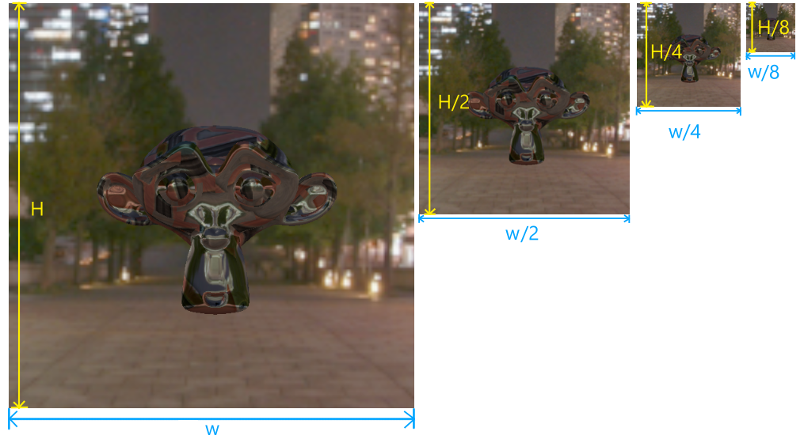

资源
=========

.. dropdown:: 更新记录
   :color: muted
   :icon: history

   * 2024/1/2 增加该文档
   * 2024/3/27 更新该文档
   * 2024/3/27 增加 ``缓存资源`` 章节。
   * 2024/3/27 增加 ``创建缓存`` 章节。
   * 2024/3/28 增加 ``vkCreateBuffer`` 章节。
   * 2024/3/28 增加 ``VkBufferCreateInfo`` 章节。
   * 2024/3/28 增加 ``VkBufferUsageFlagBits`` 章节。
   * 2024/3/29 更新 ``VkBufferUsageFlagBits`` 章节。
   * 2024/3/29 ``创建缓存`` 章节下增加 ``示例`` 章节。
   * 2024/3/29 增加 ``VkSharingMode`` 章节。
   * 2024/3/29 增加 ``销毁缓存`` 章节。
   * 2024/3/29 ``销毁缓存`` 章节下增加 ``示例`` 章节。
   * 2024/3/29 增加 ``图片资源`` 章节。
   * 2024/3/31 更新 ``图片资源`` 章节。
   * 2024/3/31 增加 ``创建图片`` 章节。
   * 2024/3/31 增加 ``vkCreateImage`` 章节。
   * 2024/3/31 增加 ``VkImageCreateInfo`` 章节。
   * 2024/3/31 增加 ``VkImageType`` 章节。
   * 2024/3/31 增加 ``VkExtent3D`` 章节。
   * 2024/4/2 增加 ``VkFormat`` 章节。
   * 2024/4/2 增加 ``格式布局`` 章节。
   * 2024/4/2 增加 ``数据类型`` 章节。
   * 2024/4/6 更新 ``格式布局`` 章节。
   * 2024/4/6 增加 ``VkSampleCountFlagBits`` 章节。
   * 2024/4/6 增加 ``图片资源逻辑模型`` 章节。
   * 2024/4/6 增加 ``VkImageTiling`` 章节。
   * 2024/4/9 更新 ``图片资源逻辑模型`` 章节。
   * 2024/4/10 增加 ``VkImageUsageFlagBits`` 章节。
   * 2024/4/13 增加 ``多级渐远`` 章节。
   * 2024/4/14 更新 ``多级渐远`` 章节。
   * 2024/4/14 更新 ``VkExtent3D`` 章节。
   * 2024/4/14 更新 ``VkImageCreateInfo`` 章节。
   * 2024/4/14 更新 ``VkImageUsageFlagBits`` 章节。
   * 2024/4/14 增加 ``格式属性`` 章节。
   * 2024/4/14 更新 ``VkImageTiling`` 章节。
   * 2024/4/14 增加 ``vkGetPhysicalDeviceFormatProperties`` 章节。
   * 2024/4/15 更新 ``vkGetPhysicalDeviceFormatProperties`` 章节。
   * 2024/4/15 增加 ``VkFormatFeatureFlagBits`` 章节。
   * 2024/4/16 更新 ``VkFormatFeatureFlagBits`` 章节。
   * 2024/4/16 增加 ``arrayLayers 与 VkImageCreateFlags`` 章节。
   * 2024/4/16 更新 ``图片资源逻辑模型`` 章节。
   * 2024/4/17 更新 ``arrayLayers 与 VkImageCreateFlags`` 章节。
   * 2024/4/18 更新 ``arrayLayers 与 VkImageCreateFlags`` 章节。
   * 2024/4/18 增加 ``VkImageCreateFlagBits`` 章节。
   * 2024/4/18 增加 ``立方体`` 章节。
   * 2024/4/20 更新 ``立方体`` 章节。
   * 2024/4/23 增加 ``示例`` 章节。
   * 2024/4/23 增加 ``二维纹理`` 章节。
   * 2024/4/23 增加 ``图片布局`` 章节。
   * 2024/4/23 增加 ``VkImageLayout`` 章节。

在 ``Vulkan`` 中只有 ``2`` 种资源 :

* :bdg-secondary:`Buffer` 缓存资源。一段连续内存的数据集合。
* :bdg-secondary:`Image` 图片资源。有特定数据格式的数据块集合。

.. note::

   ``Vulkan`` 标准中的资源其实并不只有这 ``2`` 种，比如其中的一种资源为 ``加速结构`` ，该资源在说明 ``Vulkan 硬件实时光追`` 时会涉及。由于 ``Buffer`` 和 ``Image`` 是最为核心的两个资源所以目前仅涉及这两个资源。

在 ``Vulkan`` 中创建的所有资源都是 :bdg-warning:`虚` 资源，换句话说就是，创建的资源仅仅是一个资源句柄，并没有对应存储资源数据的内存。资源需要绑定到合适的设备内存中才具有 :bdg-warning:`完整的一生` （图桓宇给出了一个赞许的大拇指 (๑•̀ㅂ•́)و✧ ）。

.. _Buffer:

缓存资源
###########

在 ``Vulkan`` 中使用 ``VkBuffer`` 句柄代表缓存资源。其定义如下：

.. code:: c++

   // 由 VK_VERSION_1_0 提供
   VK_DEFINE_NON_DISPATCHABLE_HANDLE(VkBuffer)

创建缓存
****************************

缓存资源通过 ``vkCreateBuffer(...)`` 函数创建，其定义如下：

vkCreateBuffer
--------------------

.. code:: c++

   // 由 VK_VERSION_1_0 提供
   VkResult vkCreateBuffer(
       VkDevice                                    device,
       const VkBufferCreateInfo*                   pCreateInfo,
       const VkAllocationCallbacks*                pAllocator,
       VkBuffer*                                   pBuffer);

* :bdg-secondary:`device` 要创建缓存的目标逻辑设备。
* :bdg-secondary:`pCreateInfo` 缓存的创建信息。
* :bdg-secondary:`pAllocator` 缓存句柄的内存分配器。如果为 ``nullptr`` 则使用内置的分配器，否则需要自定义句柄内存分配器。
* :bdg-secondary:`pBuffer` 创建的缓存结果。

其中 ``pCreateInfo`` 为缓存创建配置信息，对应的 ``VkBufferCreateInfo`` 类型定义如下：

VkBufferCreateInfo
-----------------------

.. code:: c++

   // 由 VK_VERSION_1_0 提供
   typedef struct VkBufferCreateInfo {
       VkStructureType        sType;
       const void*            pNext;
       VkBufferCreateFlags    flags;
       VkDeviceSize           size;
       VkBufferUsageFlags     usage;
       VkSharingMode          sharingMode;
       uint32_t               queueFamilyIndexCount;
       const uint32_t*        pQueueFamilyIndices;
   } VkBufferCreateInfo;

* :bdg-secondary:`sType` 该结构体的类型枚举值， :bdg-danger:`必须` 是 ``VkStructureType::VK_STRUCTURE_TYPE_BUFFER_CREATE_INFO`` 。
* :bdg-secondary:`pNext` 要么是 ``NULL`` 要么指向其他结构体来扩展该结构体。
* :bdg-secondary:`flags` 缓存创建的额外标志位参数。
* :bdg-secondary:`size` 要创建的缓存大小。单位为字节。
* :bdg-secondary:`usage` 用于指定该缓存的用途。
* :bdg-secondary:`sharingMode` 当该缓存会被多个设备队列访问时，该参数用于配置该缓存的共享模式。
* :bdg-secondary:`queueFamilyIndexCount` 指定 ``pQueueFamilyIndices`` 数组中元素数量。
* :bdg-secondary:`pQueueFamilyIndices` 用于指定将会访问该缓存的设备队列（族）。如果共享模式 :bdg-danger:`不是` ``VkSharingMode::VK_SHARING_MODE_CONCURRENT`` （并行访问）将会忽略该数组。

.. admonition:: VkBufferCreateFlags
   :class: note

   ``VkBufferCreateFlags`` 的有效值被定义在了 ``VkBufferCreateFlagBits`` 枚举中。 ``Vulkan 1.0`` 标准中在 ``VkBufferCreateFlagBits`` 枚举中定义了 ``稀疏资源`` 的标志位。由于目前还不会涉及到 ``稀疏资源`` 所以暂时先忽略。

其中 ``VkBufferCreateInfo::usage`` 用于配置该缓存的用途。在开发时，一个缓存 :bdg-danger:`一定` 是由于某些特定功能需求而存在的，底层设备可以在不同的需求（用途）的前提下使用更加高效的内部算法和结构，以此能够得到更加高效的执行效率。比如一个缓存中存储的结构如下：

.. _vertex_buffer_pseudocode_demo:

.. code:: c++

   struct Position
   {
      float x;
      float y;
      float z;
   };

   struct UV
   {
      float u;
      float v;
   };

   struct Vertex
   {
      Position position;
      UV uv;
   }

   std::vector<Vertex> vertices;
   vertices.push_back(...);
   vertices.push_back(...);

   VkBuffer buffer = 创建存储 Vertex 结构的数组缓存(vertices);
   vk设置该缓存的内部结构(Vertex);

由于 ``GPU`` 上的设备队列都是并行执行的（设备上有很多并行单元），当设备知道该缓存中存储的各个元素结构都相同时，可以并行的一块块的读取各个元素，而不需要像 ``CPU`` 那样从头按字节读取。这极大的提高了执行效率。

由于设备队列的并行性，其对于缓存的读写也是并行的，所以需要协调好各个队列对该缓存的读写，否则就会导致缓存数据混乱。如果某资源是某设备队列独享的，这将会省去不必要的跨设备队列间的同步，提高效率。为此，其中的 ``VkBufferCreateInfo::sharingMode`` 、 ``VkBufferCreateInfo::queueFamilyIndexCount`` 和 ``VkBufferCreateInfo::pQueueFamilyIndices`` 就是用于配置各个设备队列对该资源的访问权限，进一步明确设备对该资源的访问方式以提高效率。

其中 ``VkBufferCreateInfo::usage`` 的有效值被定义在了 ``VkBufferUsageFlagBits`` 枚举中，其定义如下：

VkBufferUsageFlagBits
^^^^^^^^^^^^^^^^^^^^^^^^

.. code:: c++

   // 由 VK_VERSION_1_0 提供
   typedef enum VkBufferUsageFlagBits {
       VK_BUFFER_USAGE_TRANSFER_SRC_BIT = 0x00000001,
       VK_BUFFER_USAGE_TRANSFER_DST_BIT = 0x00000002,
       VK_BUFFER_USAGE_UNIFORM_TEXEL_BUFFER_BIT = 0x00000004,
       VK_BUFFER_USAGE_STORAGE_TEXEL_BUFFER_BIT = 0x00000008,
       VK_BUFFER_USAGE_UNIFORM_BUFFER_BIT = 0x00000010,
       VK_BUFFER_USAGE_STORAGE_BUFFER_BIT = 0x00000020,
       VK_BUFFER_USAGE_INDEX_BUFFER_BIT = 0x00000040,
       VK_BUFFER_USAGE_VERTEX_BUFFER_BIT = 0x00000080,
       VK_BUFFER_USAGE_INDIRECT_BUFFER_BIT = 0x00000100
   } VkBufferUsageFlagBits;

* :bdg-secondary:`VK_BUFFER_USAGE_TRANSFER_SRC_BIT` 该缓存用于数据传输的数据源。
* :bdg-secondary:`VK_BUFFER_USAGE_TRANSFER_DST_BIT` 该缓存用于数据传输的目的数据。
* :bdg-secondary:`VK_BUFFER_USAGE_UNIFORM_TEXEL_BUFFER_BIT` 该缓存用于存储纹素数据。用于设备读取。
* :bdg-secondary:`VK_BUFFER_USAGE_STORAGE_TEXEL_BUFFER_BIT` 该缓存用于存储纹素数据。用于设备读取和存储。
* :bdg-secondary:`VK_BUFFER_USAGE_UNIFORM_BUFFER_BIT` 该缓存用于存储任意格式数据。用于设备读取。
* :bdg-secondary:`VK_BUFFER_USAGE_STORAGE_BUFFER_BIT` 该缓存用于存储任意格式数据。用于设备读取和存储。
* :bdg-secondary:`VK_BUFFER_USAGE_INDEX_BUFFER_BIT` 该缓存用于存储整型索引数据。
* :bdg-secondary:`VK_BUFFER_USAGE_VERTEX_BUFFER_BIT` 该缓存用于存储具有相同结构的顶点数据。
* :bdg-secondary:`VK_BUFFER_USAGE_INDIRECT_BUFFER_BIT` 该缓存用于间接数据。用于存储指令参数，设备可一次性读取这些参数。

.. note::

   `如上示例 <vertex_buffer_pseudocode_demo_>`_ 中就是 ``VkBufferUsageFlagBits::VK_BUFFER_USAGE_VERTEX_BUFFER_BIT`` 用途的典型用例。

.. note::

   ``VkBufferUsageFlagBits`` 中各个缓存用途将会在之后的章节逐渐涉及。

.. admonition:: 纹素
   :class: note

   纹素可以简单理解为带有格式的（像素）数据块。比如，可以对像素数据进行如下规定：

   一个像素颜色可以由 :bdg-danger:`红` :bdg-success:`绿` :bdg-primary:`蓝` 三种颜色值组成：

   .. figure:: ./_static/rgb.png
   
   .. admonition:: 规则一
      :class: note

      * :bdg-danger:`红` 为 ``16`` 位浮点数，有效值范围为 ``[0.0, 1.0]`` 。
      * :bdg-success:`绿` 为 ``16`` 位浮点数，有效值范围为 ``[0.0, 1.0]`` 。
      * :bdg-primary:`蓝` 为 ``16`` 位浮点数，有效值范围为 ``[0.0, 1.0]`` 。

   .. admonition:: 规则二
      :class: note

      * :bdg-danger:`红` 为 ``8`` 位无符号整数，有效值范围为 ``[0, 255]`` 。
      * :bdg-success:`绿` 为 ``8`` 位无符号整数，有效值范围为 ``[0, 255]`` 。
      * :bdg-primary:`蓝` 为 ``8`` 位无符号整数，有效值范围为 ``[0, 255]`` 。

   由此可以看出，一个像素其内部的数据会根据格式的不同而不同。

其中 ``VkBufferCreateInfo::sharingMode`` 有效值定义在 ``VkSharingMode`` 枚举中，其定义如下：

VkSharingMode
^^^^^^^^^^^^^^^^^^^^^^^^

.. code:: c++

   // 由 VK_VERSION_1_0 提供
   typedef enum VkSharingMode {
       VK_SHARING_MODE_EXCLUSIVE = 0,
       VK_SHARING_MODE_CONCURRENT = 1,
   } VkSharingMode;

* :bdg-secondary:`VK_SHARING_MODE_EXCLUSIVE` 表示该资源为设备队列独享资源。该资源一次只能被一种设备队列族中的队列访问。
* :bdg-secondary:`VK_SHARING_MODE_CONCURRENT` 表示该资源为设备队列共享资源。该资源一次能被多种设备队列族中的队列访问。

.. note:: 详细的说明将会在之后的章节展开。

示例
-----------------------

创建一个存储顶点数据的缓存

.. code:: c++

   VkDevice device = 之前创建的逻辑设备;

   struct Position
   {
      float x;
      float y;
      float z;
   };

   struct Normal
   {
      float x;
      float y;
      float z;
   };

   struct Color
   {
      float r;
      float g;
      float b;
      float a;
   };

   struct UV
   {
      float u;
      float v;
   };

   struct Vertex
   {
      Position position;
      Normal normal;
      Color color;
      UV uv;
   }

   std::vector<Vertex> vertices;
   vertices.push_back(/*position*/{-1, -1, 0}, /*normal*/{0, 0, 1}, /*color*/{1, 0, 0, 1}, /*uv*/{0, 0});
   vertices.push_back(/*position*/{ 1, -1, 0}, /*normal*/{0, 0, 1}, /*color*/{0, 1, 0, 1}, /*uv*/{1, 0});
   vertices.push_back(/*position*/{-1,  1, 0}, /*normal*/{0, 0, 1}, /*color*/{1, 1, 0, 1}, /*uv*/{0, 1});
   vertices.push_back(/*position*/{ 1, -1, 0}, /*normal*/{0, 0, 1}, /*color*/{0, 1, 0, 1}, /*uv*/{1, 0});
   vertices.push_back(/*position*/{ 1,  1, 0}, /*normal*/{0, 0, 1}, /*color*/{0, 0, 1, 1}, /*uv*/{1, 1});
   vertices.push_back(/*position*/{-1,  1, 0}, /*normal*/{0, 0, 1}, /*color*/{1, 1, 0, 1}, /*uv*/{0, 1});

   VkBufferCreateInfo buffer_create_info = {};
   buffer_create_info.sType = VkStructureType::VK_STRUCTURE_TYPE_BUFFER_CREATE_INFO;
   buffer_create_info.pNext = nullptr;
   buffer_create_info.flags = 0;
   buffer_create_info.size = sizeof(Vertex) * vertices.size();
   buffer_create_info.usage = VkBufferUsageFlagBits::VK_BUFFER_USAGE_VERTEX_BUFFER_BIT; // 该资源将用于顶点缓存
   buffer_create_info.sharingMode = VkSharingMode::VK_SHARING_MODE_EXCLUSIVE; // 使用队列独享模式
   buffer_create_info.queueFamilyIndexCount = 0;
   buffer_create_info.pQueueFamilyIndices = nullptr; // 当使用队列独享模式时，该字段将会被忽略

   VkBuffer buffer = VK_NULL_HANDLE;
   
   VkResult result = vkCreateBuffer(device, &buffer_create_info, nullptr, &buffer);
   if(result != VkResult::VK_SUCCESS)
   {
      throw std::runtime_error("VkBuffer 缓存资源创建失败");
   }

.. note:: 此时 ``vertices`` 中的数据并没有写入 ``buffer`` 中，其仅仅用于告诉 ``Vulkan`` 我需要多大的（ ``sizeof(Vertex) * vertices.size()`` ）缓存资源，并且 ``buffer`` 此时没有与之相关联的底层设备内存，这将会在之后的章节涉及。

销毁缓存
****************************

当缓存资源不再需要时就可以通过 ``vkDestroyBuffer(...)`` 函数将其销毁，该函数定义如下：

.. code:: c++

   // 由 VK_VERSION_1_0 提供
   void vkDestroyBuffer(
       VkDevice                                    device,
       VkBuffer                                    buffer,
       const VkAllocationCallbacks*                pAllocator);

* :bdg-secondary:`device` 要销毁的缓存对应所在的逻辑设备。
* :bdg-secondary:`buffer` 要销毁的缓存。
* :bdg-secondary:`pAllocator` 该缓存的句柄内存分配器。

示例
-----------------------

.. code:: c++

   VkDevice device = 之前创建的逻辑设备;
   VkBuffer buffer = 之前创建的缓存;

   vkDestroyBuffer(device, buffer, nullptr);

图片资源
###########

在 ``Vulkan`` 中一个图片资源代表相同格式数据块的多维集合，比如 ``一维/二维/三维`` 图片等。其通过 ``VkImage`` 句柄代表其图片资源，其定义如下：

.. code:: c++

   // 由 VK_VERSION_1_0 提供
   VK_DEFINE_NON_DISPATCHABLE_HANDLE(VkImage)

创建图片
****************************

图片资源通过 ``vkCreateImage(...)`` 函数创建，其定义如下：

vkCreateImage
-----------------------

.. code:: c++

   // 由 VK_VERSION_1_0 提供
   VkResult vkCreateImage(
       VkDevice                                    device,
       const VkImageCreateInfo*                    pCreateInfo,
       const VkAllocationCallbacks*                pAllocator,
       VkImage*                                    pImage);

* :bdg-secondary:`device` 要创建图片对应所在的逻辑设备。
* :bdg-secondary:`pCreateInfo` 图片资源的创建配置信息。
* :bdg-secondary:`pCreateInfo` 句柄内存分配器。
* :bdg-secondary:`pImage` 创建的目标图片句柄。

其中 ``VkImageCreateInfo`` 定义如下：

VkImageCreateInfo
-----------------------

.. code:: c++

   // 由 VK_VERSION_1_0 提供
   typedef struct VkImageCreateInfo {
       VkStructureType          sType;
       const void*              pNext;
       VkImageCreateFlags       flags;
       VkImageType              imageType;
       VkFormat                 format;
       VkExtent3D               extent;
       uint32_t                 mipLevels;
       uint32_t                 arrayLayers;
       VkSampleCountFlagBits    samples;
       VkImageTiling            tiling;
       VkImageUsageFlags        usage;
       VkSharingMode            sharingMode;
       uint32_t                 queueFamilyIndexCount;
       const uint32_t*          pQueueFamilyIndices;
       VkImageLayout            initialLayout;
   } VkImageCreateInfo;

* :bdg-secondary:`sType` 该结构体的类型枚举值， :bdg-danger:`必须` 是 ``VkStructureType::VK_STRUCTURE_TYPE_IMAGE_CREATE_INFO`` 。
* :bdg-secondary:`pNext` 要么是 ``NULL`` 要么指向其他结构体来扩展该结构体。
* :bdg-secondary:`flags` 创建该图片资源额外的标志位参数。
* :bdg-secondary:`imageType` 图片资源的类型。
* :bdg-secondary:`format` 该图片资源的纹素格式。
* :bdg-secondary:`extent` 该图片资源（各维度上的）大小。
* :bdg-secondary:`mipLevels` 多级渐远纹理级别。 :bdg-danger:`必须` 大于 ``0`` 。
* :bdg-secondary:`arrayLayers` 层级数量。 :bdg-danger:`必须` 大于 ``0`` 。
* :bdg-secondary:`samples` 采样点数量。
* :bdg-secondary:`tiling` 瓦片排布。
* :bdg-secondary:`usage` 该图片资源的用途。
* :bdg-secondary:`sharingMode` 当该图片会被多个设备队列访问时，该参数用于配置该图片共享模式。
* :bdg-secondary:`queueFamilyIndexCount` 指定 ``pQueueFamilyIndices`` 数组中元素数量。
* :bdg-secondary:`pQueueFamilyIndices` 用于指定将会访问该缓存的设备队列（族）。如果共享模式 :bdg-danger:`不是` ``VkSharingMode::VK_SHARING_MODE_CONCURRENT`` （并行访问）将会忽略该数组。
* :bdg-secondary:`initialLayout` 该图片的初始布局。

其中 ``VkImageType`` 定义如下：

VkImageType
^^^^^^^^^^^^^^^^^^^^^^^^

.. code:: c++

   // Provided by VK_VERSION_1_0
   typedef enum VkImageType {
       VK_IMAGE_TYPE_1D = 0,
       VK_IMAGE_TYPE_2D = 1,
       VK_IMAGE_TYPE_3D = 2,
   } VkImageType;

* :bdg-secondary:`VK_IMAGE_TYPE_1D` 一维图片。
* :bdg-secondary:`VK_IMAGE_TYPE_2D` 二维图片。
* :bdg-secondary:`VK_IMAGE_TYPE_3D` 三维图片。

其中 ``一维`` 纹理其本质上就是有相同数据块类型的一维数组：

.. code:: c++

   // 假如纹素结构如下
   typedef struct TexelFormat
   {
      uint8_t r;
      uint8_t g;
      uint8_t b;
      uint8_t a;
   }R8G8B8A8;

   // VK_IMAGE_TYPE_1D 图片资源可理解为
   TexelFormat images[VkImageCreateInfo.extent.width][1][1]; // 一维图片
   // 等价于
   TexelFormat images[VkImageCreateInfo.extent.width]; // 一维图片

其中 ``二维`` 纹理其本质上就是有相同数据块类型的二维数组：

.. code:: c++

   // 假如纹素结构如下
   typedef struct TexelFormat
   {
      uint8_t r;
      uint8_t g;
      uint8_t b;
      uint8_t a;
   }R8G8B8A8;

   // VK_IMAGE_TYPE_2D 图片资源可理解为
   TexelFormat images[VkImageCreateInfo.extent.width][VkImageCreateInfo.extent.height][1]; // 二维图片
   // 等价于
   TexelFormat images[VkImageCreateInfo.extent.width][VkImageCreateInfo.extent.height]; // 二维图片

其中 ``三维`` 纹理其本质上就是有相同数据块类型的二维数组：

.. code:: c++

   // 假如纹素结构如下
   typedef struct TexelFormat
   {
      uint8_t r;
      uint8_t g;
      uint8_t b;
      uint8_t a;
   }R8G8B8A8;

   // VK_IMAGE_TYPE_3D 图片资源可理解为
   TexelFormat images[VkImageCreateInfo.extent.width][VkImageCreateInfo.extent.height][VkImageCreateInfo.extent.depth]; // 三维图片

由此可见图片的各维度的大小是由 ``VkImageCreateInfo::extent`` 定义的，其 ``VkExtent3D`` 类型定义如下：

VkExtent3D
^^^^^^^^^^^^^^^^^^^^^^^^

.. code:: c++

   // 由 VK_VERSION_1_0 提供
   typedef struct VkExtent3D {
       uint32_t    width;
       uint32_t    height;
       uint32_t    depth;
   } VkExtent3D;

* :bdg-secondary:`width` 宽。 :bdg-danger:`必须` 大于 ``0`` 。
* :bdg-secondary:`height` 高。 :bdg-danger:`必须` 大于 ``0`` 。
* :bdg-secondary:`depth` 深度。 :bdg-danger:`必须` 大于 ``0`` 。

当 ``VkImageCreateInfo::imageType`` 为 ``VkImageType::VK_IMAGE_TYPE_1D`` 时，其大小规则如下：

* 维度大小使用 ``VkExtent3D::width`` 表示
* ``VkExtent3D::height`` 固定为 ``1`` 
* ``VkExtent3D::depth`` 固定为 ``1`` 

当 ``VkImageCreateInfo::imageType`` 为 ``VkImageType::VK_IMAGE_TYPE_2D`` 时，其大小规则如下：

* 维度大小使用 ``VkExtent3D::width`` 和 ``VkExtent3D::height`` 表示
* ``VkExtent3D::depth`` 固定为 ``1`` 

当 ``VkImageCreateInfo::imageType`` 为 ``VkImageType::VK_IMAGE_TYPE_3D`` 时，其大小规则如下：

* 维度大小使用 ``VkExtent3D::width`` 、 ``VkExtent3D::height`` 和 ``VkExtent3D::depth`` 表示

.. note:: 无论是几维图片，在 ``Vulkan`` 看来全部都是 ``三维`` 图片。只不过一维和二维会在固定维度上会坍缩到 ``1`` 。（ ``智子`` 表示：来看看我坍缩了几个维度？╭(●｀∀´●)╯）

其中 ``VkImageCreateInfo::format`` 对应的 ``VkFormat`` 枚举类型中有非常多的枚举值，我们这里拿几个经典的进行讲解：

VkFormat
^^^^^^^^^^^^^^^^^^^^^^^^

.. code:: c++

   // 由 VK_VERSION_1_0 提供
   typedef enum VkFormat {
       VK_FORMAT_UNDEFINED = 0,
       ...
       VK_FORMAT_R8_UNORM = 9,
       VK_FORMAT_R8_SNORM = 10,
       VK_FORMAT_R8_USCALED = 11,
       VK_FORMAT_R8_SSCALED = 12,
       VK_FORMAT_R8_UINT = 13,
       VK_FORMAT_R8_SINT = 14,
       VK_FORMAT_R8_SRGB = 15,
       VK_FORMAT_R8G8_UNORM = 16,
       ...
       VK_FORMAT_R8G8B8_UNORM = 23,
       ...
       VK_FORMAT_R8G8B8A8_UNORM = 37,
       ...
       VK_FORMAT_B8G8R8A8_SRGB = 50,
       ...
       VK_FORMAT_R16_SFLOAT = 76,
       ...
       VK_FORMAT_B10G11R11_UFLOAT_PACK32 = 122,
       ...
       VK_FORMAT_D16_UNORM = 124,
       ...
       VK_FORMAT_D32_SFLOAT = 126,
       VK_FORMAT_S8_UINT = 127,
       ...
       VK_FORMAT_D16_UNORM_S8_UINT = 128,
       VK_FORMAT_D24_UNORM_S8_UINT = 129,
       VK_FORMAT_D32_SFLOAT_S8_UINT = 130,
       VK_FORMAT_BC1_RGB_UNORM_BLOCK = 131,
       ...
       VK_FORMAT_ETC2_R8G8B8_UNORM_BLOCK = 147,
       ...
       VK_FORMAT_EAC_R11_UNORM_BLOCK = 153,
       ...
       VK_FORMAT_ASTC_4x4_UNORM_BLOCK = 157,
       ...
   } VkFormat;

其实 ``VK_FORMAT_UNDEFINED`` 表示未定义格式，这个没什么好说的，我们现在来说明其他的。可以发现每个枚举值声明基本规则如下：

.. math::

   \{VK\_FORMAT\}+\{\_\{格式布局\}\_+\_\{数据类型\}\_\} \times m

其中 ``VK_FORMAT`` 为枚举声明前缀，我们主要是关心 ``格式布局`` 和 ``数据类型`` 。

其中 ``格式布局`` 如下：

格式布局
"""""""""""""""""""""

格式布局主要是用于明确该格式下 :bdg-warning:`纹素` 的 :bdg-warning:`内部结构` 。

* :bdg-secondary:`R8` 拥有 :bdg-danger:`红色通道` 数据，占 ``8`` 个比特。
* :bdg-secondary:`R11` 拥有 :bdg-danger:`红色通道` 数据，占 ``11`` 个比特。
* :bdg-secondary:`R16` 拥有 :bdg-danger:`红色通道` 数据，占 ``16`` 个比特。
* :bdg-secondary:`R8G8` 拥有 :bdg-danger:`红色通道` 和 :bdg-success:`绿色通道` 数据，每个通道占 ``8`` 个比特。
* :bdg-secondary:`R8G8B8` 拥有 :bdg-danger:`红色通道` 、 :bdg-success:`绿色通道` 和 :bdg-primary:`蓝色通道` 数据，每个通道占 ``8`` 个比特。
* :bdg-secondary:`R8G8B8A8` 拥有 :bdg-danger:`红色通道` 、 :bdg-success:`绿色通道` 、 :bdg-primary:`蓝色通道` 数据和 :bdg-light:`透明度通道` 数据，每个通道占 ``8`` 个比特。
* :bdg-secondary:`B8G8R8A8` 拥有 :bdg-primary:`蓝色通道` 、 :bdg-success:`绿色通道` 、 :bdg-danger:`红色通道` 数据和 :bdg-light:`透明度通道` 数据，每个通道占 ``8`` 个比特。
* :bdg-secondary:`D16` 拥有 ``深度`` 数据，占 ``16`` 个比特。
* :bdg-secondary:`D24` 拥有 ``深度`` 数据，占 ``24`` 个比特。
* :bdg-secondary:`D32` 拥有 ``深度`` 数据，占 ``32`` 个比特。
* :bdg-secondary:`S8` 拥有 ``模板`` 数据，占 ``8`` 个比特。
* :bdg-secondary:`BC` :bdg-secondary:`ETC` :bdg-secondary:`EAC` :bdg-secondary:`ASTC` 表示数据为压缩形式。

.. admonition:: 压缩
   :class: note

   使用压缩可以在相似的视觉效果下可以占用更小的存储空间。此时我们先略过压缩格式，主要关注非压缩格式。

.. admonition:: 深度
   :class: note

   深度数据一般都是一个浮点数，其值一般用于表示图形表面到某一平面的距离信息。

   .. figure:: ./_static/depth.png
      :scale: 50%

      如上图，深度数据存储着如图红线所示的距离。

.. admonition:: 模板
   :class: note

   模板数据一般都是一个整数，与深度类似，其值一般用于表示图形表面是否（覆盖）映射到对应像素。

其中 ``数据类型`` 如下：

数据类型
"""""""""""""""""""""

数据类型主要是用于明确 :bdg-warning:`纹素` :bdg-warning:`内部结构` 的 :bdg-warning:`数据类型` 。

* :bdg-secondary:`UNORM` 无符号归一化数据。类型为 ``float`` 。数据有效范围为 :math:`[0, 1]` 。
* :bdg-secondary:`SNORM` 有符号归一化数据。类型为 ``float`` 。数据有效范围为 :math:`[-1, 1]` 。
* :bdg-secondary:`USCALED` 无符号整数。数据将会转成 ``float`` 。数据有效范围为 :math:`[0, {2^n}-1]` 。（ ``n`` 为 ``格式布局`` 中各数据所占比特位数）。
* :bdg-secondary:`SSCALED` 有符号整数。数据将会转成 ``float`` 。数据有效范围为 :math:`[{-2^{n-1}}, {2^{n-1}}-1]` 。（ ``n`` 为 ``格式布局`` 中各数据所占比特位数）。
* :bdg-secondary:`UINT` 有符号整数。数据将会转成 ``无符号整形`` 。数据有效范围为 :math:`[0, {2^n}-1]` 。（ ``n`` 为 ``格式布局`` 中各数据所占比特位数）。
* :bdg-secondary:`SINT` 有符号整数。数据将会转成 ``无符号整形`` 。数据有效范围为 :math:`[{-2^{n-1}}, {2^{n-1}}-1]` 。（ ``n`` 为 ``格式布局`` 中各数据所占比特位数）。
* :bdg-secondary:`UFLOAT` 无符号浮点数。用于数据包和一些压缩格式中。
* :bdg-secondary:`SFLOAT` 有符号浮点数。
* :bdg-secondary:`SRGB` 标准颜色空间 :bdg-danger:`R` :bdg-success:`G` :bdg-primary:`B` 通道为无符号归一化数据（同 ``UNORM`` ）。但其数据使用 `sRGB <https://learn.microsoft.com/zh-cn/windows/win32/wcs/srgb--a-standard-color-space>`_ 的非线性编码标准解析，如果 :bdg-light:`A` 通道存在则同样为无符号归一化数据。

.. admonition:: sRGB
   :class: note

   ``sRGB`` 标准一般用于屏幕显示。现在市面上几乎所有的设备都能够支持显示 ``sRGB`` 格式的图像数据。

其中 ``VkImageCreateInfo::samples`` 的 ``VkSampleCountFlagBits`` 枚举类型定义如下：

VkSampleCountFlagBits
^^^^^^^^^^^^^^^^^^^^^^^^

.. code:: c++

   // 由 VK_VERSION_1_0 提供
   typedef enum VkSampleCountFlagBits {
       VK_SAMPLE_COUNT_1_BIT = 0x00000001,
       VK_SAMPLE_COUNT_2_BIT = 0x00000002,
       VK_SAMPLE_COUNT_4_BIT = 0x00000004,
       VK_SAMPLE_COUNT_8_BIT = 0x00000008,
       VK_SAMPLE_COUNT_16_BIT = 0x00000010,
       VK_SAMPLE_COUNT_32_BIT = 0x00000020,
       VK_SAMPLE_COUNT_64_BIT = 0x00000040,
   } VkSampleCountFlagBits;

* :bdg-secondary:`VK_SAMPLE_COUNT_1_BIT` 有 ``1`` 个采样点。即，纹素自身（将分出 ``1`` 个子纹素）。
* :bdg-secondary:`VK_SAMPLE_COUNT_2_BIT` 有 ``2`` 个采样点。即，纹素自身将分出 ``2`` 个子纹素。
* :bdg-secondary:`VK_SAMPLE_COUNT_4_BIT` 有 ``4`` 个采样点。即，纹素自身将分出 ``4`` 个子纹素。
* :bdg-secondary:`VK_SAMPLE_COUNT_8_BIT` 有 ``8`` 个采样点。即，纹素自身将分出 ``8`` 个子纹素。
* :bdg-secondary:`VK_SAMPLE_COUNT_16_BIT` 有 ``16`` 个采样点。即，纹素自身将分出 ``16`` 个子纹素。
* :bdg-secondary:`VK_SAMPLE_COUNT_32_BIT` 有 ``32`` 个采样点。即，纹素自身将分出 ``32`` 个子纹素。
* :bdg-secondary:`VK_SAMPLE_COUNT_64_BIT` 有 ``64`` 个采样点。即，纹素自身将分出 ``64`` 个子纹素。

由于像素都是一块块的，并不能像一条线那样丝滑连续，当将连续的数据存入像像素这样的离散数据时，需要对连续数据进行采样，进而确定离散的像素值。像这样将连续数据转成离散数据必定会导致部分原始信息的丢失。在图像上就会产生锯齿。

   ``1`` 个纹素仅进行 ``1`` 次采样

如上图中每个格子为一个纹素（像素），其中心的点为采样点。当黄色部分完全覆盖了对应的 :bdg-danger:`采样点` 后，对应的纹素才会存储相应的数据，而部分覆盖纹素，但没有覆盖 :bdg-warning:`采样点` 的地方将不会存储（采样）任何值。进而导致锯齿。

为了减少锯齿，我们可以将一个纹素分割成多个子纹素来增加采样点，这样之前采样不到的纹素也会随着采样点的增多得到覆盖，进而得到采样，以此来达到抗锯齿的目的。

但越多的采样次数意味着更多的计算量，过多的计算量可能会延长运行时间。

.. admonition:: 子纹素
   :class: note

   纹素会将各子纹素的采样结果根据权重进行汇总，并将汇总结果作为该（顶级）纹素的结果。

   ``1`` 个纹素进行 ``16`` 次采样（ ``VkSampleCountFlagBits::VK_SAMPLE_COUNT_16_BIT`` ）

如下为 ``VK_SAMPLE_COUNT_1_BIT`` 和 ``VK_SAMPLE_COUNT_8_BIT`` 的成像对比：

   单次采样与 ``8`` 次采样对比示意图

其中 ``VkImageCreateInfo::tiling`` 的 ``VkImageTiling`` 类型定义如下：

图片资源逻辑模型
^^^^^^^^^^^^^^^^^^^^^^^^

现在我们来讲解一下如何理解 ``VkImageCreateInfo`` 中的各参数，并将他们从逻辑上关联起来，并建立一个易于理解的模型。

其中 ``VkImageCreateInfo`` 中与之有关的核心参数如下：

.. code:: c++

   typedef struct VkImageCreateInfo {
      ...
       VkImageType              imageType;
       VkFormat                 format;
       VkExtent3D               extent;
      ...
       uint32_t                 arrayLayers;
       VkSampleCountFlagBits    samples;
      ...
   } VkImageCreateInfo;

首先明确一下这几个变量的含义。

图片大小是由如下 ``2`` 个参数指定的：

* :bdg-secondary:`imageType` 用于指定该图片的维度。一维、二维还是三维图片。
* :bdg-secondary:`extent` 用于指定该图片每一个维度的大小。

而图片的每个纹素是由如下 ``2`` 个参数指定的：

* :bdg-secondary:`format` 用于指定该图片每一个纹素的具体格式。
* :bdg-secondary:`samples` 用于指定该图片每一个纹素会被分割成多少个子纹素。

如上这几个参数已经能够定义一个图片资源了。但 ``VkImageCreateInfo`` 中还有一个 ``arrayLayers`` 参数，说明如下：

* :bdg-secondary:`arrayLayers` 用于指定如上配置的图片个数。

也就是说通过 ``imageType`` 、 ``format`` 、 ``extent`` 和 ``samples`` 确定一个图片，使用 ``arrayLayers`` 来指定这样的图片有几个。对应 ``C++`` 逻辑代码如下：

.. code:: c++

   struct Image
   {
      VkImageType              imageType;
      VkFormat                 format;
      VkExtent3D               extent;
      VkSampleCountFlagBits    samples;
   };

   struct ImageCreateInfo
   {
      Image images[arrayLayers];
   };

   图片资源逻辑结构示意图

.. admonition:: arrayLayers
   :class: note

   ``arrayLayers`` :bdg-danger:`不可以` 随意指定数量，有一些限制。具体见 :ref:`arrayLayersAndVkImageCreateFlags` 章节。

.. _arrayLayersAndVkImageCreateFlags:

arrayLayers 与 VkImageCreateFlags
^^^^^^^^^^^^^^^^^^^^^^^^^^^^^^^^^^^^^^^

在介绍 ``VkImageCreateFlags`` 之前，先来说明一下与 ``VkImageCreateInfo::flags`` 无关的 ``arrayLayers`` 限制：

* 如果 ``VkImageCreateInfo::imageType`` 为 ``VkImageType::VK_IMAGE_TYPE_2D`` 并且 ``VkImageCreateInfo::tiling`` 为 ``VkImageTiling::VK_IMAGE_TILING_LINEAR`` 的话， ``VkImageCreateInfo::arrayLayers`` :bdg-danger:`必须` 为 ``1`` 。
* 如果 ``VkImageCreateInfo::imageType`` 为 ``VkImageType::VK_IMAGE_TYPE_3D`` 的话， ``VkImageCreateInfo::arrayLayers`` :bdg-danger:`必须` 为 ``1`` 。

接下来的话让我们看看 ``VkImageCreateInfo::flags`` 的有效值，对应的有效值被声明在 ``VkImageCreateFlagBits`` 枚举类型中，其定义如下：

VkImageCreateFlagBits
"""""""""""""""""""""""""

.. code-block:: c++

   // 由 VK_VERSION_1_0 提供
   typedef enum VkImageCreateFlagBits {
       VK_IMAGE_CREATE_SPARSE_BINDING_BIT = 0x00000001,
       VK_IMAGE_CREATE_SPARSE_RESIDENCY_BIT = 0x00000002,
       VK_IMAGE_CREATE_SPARSE_ALIASED_BIT = 0x00000004,
       VK_IMAGE_CREATE_MUTABLE_FORMAT_BIT = 0x00000008,
       VK_IMAGE_CREATE_CUBE_COMPATIBLE_BIT = 0x00000010,
   } VkImageCreateFlagBits;

* :bdg-secondary:`VK_IMAGE_CREATE_SPARSE_BINDING_BIT` 表示该图片将会使用 ``稀疏`` 内存进行绑定。
* :bdg-secondary:`VK_IMAGE_CREATE_SPARSE_RESIDENCY_BIT` 表示该图片将会部分使用 ``稀疏`` 内存进行绑定。如果指定了该标志位，则 ``VK_IMAGE_CREATE_SPARSE_BINDING_BIT`` 也 :bdg-danger:`必须` 使用开启。
* :bdg-secondary:`VK_IMAGE_CREATE_SPARSE_ALIASED_BIT` 表示该图片将会部分使用 ``稀疏`` 内存进行绑定。并且这一部分内存可能同时被另一个图片使用（或部分使用），如果指定了该标志位，则 ``VK_IMAGE_CREATE_SPARSE_BINDING_BIT`` 也 :bdg-danger:`必须` 使用开启。
* :bdg-secondary:`VK_IMAGE_CREATE_MUTABLE_FORMAT_BIT` 表示该图片可用于创建 ``图片视图`` 的格式可与该图片的格式不同。对于 ``多平面`` 格式， ``VK_IMAGE_CREATE_MUTABLE_FORMAT_BIT`` 表示 ``图片视图`` 可以用于表示图片中的某平面。
* :bdg-secondary:`VK_IMAGE_CREATE_CUBE_COMPATIBLE_BIT` 表示该图片可用于创建 ``立方体`` 图片。

.. admonition:: 图片视图
   :class: note

   在通过 ``vkCreateImage(...)`` 创建完图片之后，需要创建相应的 ``图片视图`` （ ``VkImageView`` ）才能被 ``Vulkan`` 使用。具体将会在之后的章节讲解。

.. admonition:: 多平面格式
   :class: warning

   好像是一种压缩格式，具体没研究过。一般像如下格式是用于多平面格式：

   .. code:: c++

      VkFormat::VK_FORMAT_G8B8G8R8_422_UNORM
      VkFormat::VK_FORMAT_G8_B8_R8_3PLANE_420_UNORM
      VkFormat::VK_FORMAT_G10X6_B10X6_R10X6_3PLANE_420_UNORM_3PACK16

   具体咋回事待研究。

其中我们主要关注 ``VK_IMAGE_CREATE_CUBE_COMPATIBLE_BIT`` 这个标志位。该标志位经常用于 ``立方体`` 图片：

立方体
"""""""""""""""""""""

所谓 ``立方体`` 图片（有时也叫 ``立方体纹理`` 英文为 ``Cubemap`` ）其实就是 ``6`` 张 ``二维`` 图片拼成的一个盒子。示意图如下：

   立方体示意图

而立方体中的图片数据经常用于存储场景的环境信息，比如天空信息。所以也常被称为 ``天空盒`` 。示意图如下：

   天空盒示意图

当 ``VkImageCreateInf::flags`` 中指定了 ``VkImageCreateFlagBits::VK_IMAGE_CREATE_CUBE_COMPATIBLE_BIT`` 标志位的话，则说明要创建一个立方体图片，则有如下限制要求：

* ``VkImageCreateInf::imageType`` :bdg-danger:`必须` 为 ``VkImageType::VK_IMAGE_TYPE_2D`` 。
* ``VkImageCreateInf::arrayLayers`` :bdg-danger:`必须` :bdg-danger:`大于等于` ``6`` 。
* ``VkImageCreateInf::extent`` 中的 ``width`` 和 ``height`` :bdg-danger:`必须` :bdg-danger:`相等` 。

..
   If flags contains VK_IMAGE_CREATE_CUBE_COMPATIBLE_BIT, arrayLayers must be greater than or equal to 6

多级渐远
^^^^^^^^^^^^^^^^^^^^^^^^

在 ``VkImageCreateInfo`` 中有一个 ``mipLevels`` 参数。该参数用于设置该图片的 ``多级渐远纹理级别`` 。

当使用透视投影（近大远小）相机加看向场景进行渲染时：

* 离相机近的物体会比较大，占用更多的像素。此时由于离相机近，使用分辨率较高的纹理将会获得更佳清晰的渲染结果。
* 离相机远的物体会比较小，占用更少的像素。此时由于离相机较远，使用分辨率较高的纹理在如此小范围的像素范围内采样将会导致效果锐化。为了减少这种锐化，最简单的方式就是使用一个相对较低分辨率的图片进行采样。

随着距离采样不同分辨率图片的技术叫做 ``多级渐远`` ，支持这种技术的图片叫做 ``多级渐远纹理（图片）`` 。

如下为 :bdg-danger:`不使用` 和 :bdg-danger:`使用` 多级渐远纹理的结果示意图：

.. list-table::

    * - .. figure:: ./_static/mip_mapping_off.jpg

           无多级渐远效果示意

      - .. figure:: ./_static/mip_mapping_anisotropic.jpg

           多级渐远效果示意

为了生成一系列低分辨率的图片，需要通过 ``VkImageCreateInfo::mipLevels`` 指定要为低分辨率图片分配的级别，每一个级别都对应一张新图片，下一级别图片的分辨率是上一级别图片分辨率的一半。

.. note::

   当 ``VkImageCreateInfo::mipLevels`` 为 ``1`` 时表示图片自身即为 ``一级渐远纹理`` 。

如下为一张二维图片的 ``多级渐远级别`` 为 ``4`` 的多级渐远纹理结构示意图：

* :bdg-secondary:`W` 为一级渐远纹理（图片其本身）宽度。
* :bdg-secondary:`H` 为一级渐远纹理（图片其本身）高度。

   二维图片多级渐远纹理结构示意图

.. admonition:: 多级渐远纹理内部数据
   :class: note

   如上示意图中各级的渐远纹理中每个像素都是有确切图像值的，这些只是帮助您从逻辑上理解多级渐远，但是在实际通过 ``vkCreateImage(...)`` 创建带有多级渐远纹理中，图片数据全都是初始值（可能为 ``0`` ）。每一级别的多级渐远图片中每个像素具体为何值，需要通过执行 ``GPU指令`` 手动运算赋值。这将会在之后的章节进行讲解。

VkImageTiling
^^^^^^^^^^^^^^^^^^^^^^^^

.. code:: c++

   // 由 VK_VERSION_1_0 提供
   typedef enum VkImageTiling {
       VK_IMAGE_TILING_OPTIMAL = 0,
       VK_IMAGE_TILING_LINEAR = 1,
   } VkImageTiling;

* :bdg-secondary:`VK_IMAGE_TILING_OPTIMAL` 优化排布。
* :bdg-secondary:`VK_IMAGE_TILING_LINEAR` 线性排布。

在 :ref:`Buffer` 章节我们已经知道缓存资源在 ``Host端`` 和 ``Device端`` 其为了更高的效率，内部的结构是不同的，图片资源也是如此。

当使用 ``VkImageTiling::VK_IMAGE_TILING_OPTIMAL`` 时，用于指示该图片资源将会使用 ``Device端`` 内部偏爱的结构（驱动内部结构）进行创建。这一般在 ``GPU`` 上高速并行读写计算时使用。

当使用 ``VkImageTiling::VK_IMAGE_TILING_LINEAR`` 时，用于指示该图片资源将会使用 ``Host端`` 偏爱的线性结构进行创建。这一般在 ``CPU`` 读写图片资源数据时使用。

..
   VK_IMAGE_TILING_LINEAR限制
   imageType is VK_IMAGE_TYPE_2D
   format is not a depth/stencil format
   mipLevels is 1
   arrayLayers is 1
   samples is VK_SAMPLE_COUNT_1_BIT
   usage only includes VK_IMAGE_USAGE_TRANSFER_SRC_BIT and/or VK_IMAGE_USAGE_TRANSFER_DST_BIT

其中 ``VkImageCreateInfo::usage`` 标志位的有效值定义在 ``VkImageUsageFlagBits`` 枚举中，其定义如下：

VkImageUsageFlagBits
^^^^^^^^^^^^^^^^^^^^^^^^

.. code:: c++

   // 由 VK_VERSION_1_0 提供
   typedef enum VkImageUsageFlagBits {
       VK_IMAGE_USAGE_TRANSFER_SRC_BIT = 0x00000001,
       VK_IMAGE_USAGE_TRANSFER_DST_BIT = 0x00000002,
       VK_IMAGE_USAGE_SAMPLED_BIT = 0x00000004,
       VK_IMAGE_USAGE_STORAGE_BIT = 0x00000008,
       VK_IMAGE_USAGE_COLOR_ATTACHMENT_BIT = 0x00000010,
       VK_IMAGE_USAGE_DEPTH_STENCIL_ATTACHMENT_BIT = 0x00000020,
       VK_IMAGE_USAGE_TRANSIENT_ATTACHMENT_BIT = 0x00000040,
       VK_IMAGE_USAGE_INPUT_ATTACHMENT_BIT = 0x00000080,
   } VkImageUsageFlagBits;

* :bdg-secondary:`VK_IMAGE_USAGE_TRANSFER_SRC_BIT` 该图片用于数据传输的数据源。
* :bdg-secondary:`VK_IMAGE_USAGE_TRANSFER_DST_BIT` 该图片用于数据传输的目的数据。
* :bdg-secondary:`VK_IMAGE_USAGE_SAMPLED_BIT` 该图片用于（纹素）采样（读取）。
* :bdg-secondary:`VK_IMAGE_USAGE_STORAGE_BIT` 该图片用于（纹素）数据存储（也可以读）。
* :bdg-secondary:`VK_IMAGE_USAGE_COLOR_ATTACHMENT_BIT` 该图片用于颜色附件。
* :bdg-secondary:`VK_IMAGE_USAGE_DEPTH_STENCIL_ATTACHMENT_BIT` 该图片用于深度-模板附件。
* :bdg-secondary:`VK_IMAGE_USAGE_TRANSIENT_ATTACHMENT_BIT` 该图片用于临时附件。该附件支持与 ``VK_MEMORY_PROPERTY_LAZILY_ALLOCATED_BIT`` 属性的（惰性）内存进行交互。
* :bdg-secondary:`VK_IMAGE_USAGE_INPUT_ATTACHMENT_BIT` 该图片用于输入附件。既可以用于采样（读取），也可以用于存储。与 ``VK_IMAGE_USAGE_STORAGE_BIT`` 不同的是可以用于附件。

.. admonition:: 采样
   :class: note

   图片采样就是获取图片中某一坐标位置像素的值。

.. admonition:: 附件
   :class: note

   所有的 ``附件`` 都是用于存储 ``GPU`` 的输出数据。在 ``Vulkan`` 中有 ``4`` 种附件：

   * :bdg-secondary:`VK_IMAGE_USAGE_COLOR_ATTACHMENT_BIT` 颜色附件。用于存储 ``GPU`` 在渲染图形后的输出数据。主要以颜色的形式（ ``rgba`` 等）进行存储。
   * :bdg-secondary:`VK_IMAGE_USAGE_DEPTH_STENCIL_ATTACHMENT_BIT` 深度-模板附件。用于存储 ``GPU`` 在渲染图形后输出的深度-模板数据。主要以深度-模板的形式（浮点数-整数）进行存储。
   * :bdg-secondary:`VK_IMAGE_USAGE_TRANSIENT_ATTACHMENT_BIT` 临时附件。主要用于与 ``惰性内存`` 进行交互。当图片资源确定只在 ``GPU`` 端进行读写时，可以使用该类型。
   * :bdg-secondary:`VK_IMAGE_USAGE_INPUT_ATTACHMENT_BIT` 输入附件。既可以用于采样（读取），也可以用于存储。与 ``VK_IMAGE_USAGE_STORAGE_BIT`` 不同的是可以用于附件。与其他附件类型不同的是，该附件类型原生支持 ``读`` 操作。

   更多 ``附件`` 说明将会在之后的 ``管线`` 和 ``帧缓冲（存）`` 中进行展开。

.. admonition:: 图片读写
   :class: note

   ``VkImageUsageFlagBits`` 中有些枚举值对应的图片用途或都支持读，或都支持写，但不同类型的图片用途在读写途径上不尽相同。这将会在之后的章节展开。

图片布局
^^^^^^^^^^^^^^^^^^^^^^^^

在 ``VkImageCreateInfo`` 的结构体中，最后一个成员为 ``initialLayout`` ，其用于设置目标图片的 ``布局`` 。 ``Vulkan`` 之所以在此声明一个布局，其最终目的还是为了提高设备对于该图片的操作效率。 :bdg-danger:`在某些特定场合下，如果图片布局为高效布局，则会提高设备的执行效率` 。其中支持的 ``VkImageLayout`` 布局枚举定义如下：

VkImageLayout
"""""""""""""""""""""

.. code:: c++

   // 由 VK_VERSION_1_0 提供
   typedef enum VkImageLayout {
       VK_IMAGE_LAYOUT_UNDEFINED = 0,
       VK_IMAGE_LAYOUT_GENERAL = 1,
       VK_IMAGE_LAYOUT_COLOR_ATTACHMENT_OPTIMAL = 2,
       VK_IMAGE_LAYOUT_DEPTH_STENCIL_ATTACHMENT_OPTIMAL = 3,
       VK_IMAGE_LAYOUT_DEPTH_STENCIL_READ_ONLY_OPTIMAL = 4,
       VK_IMAGE_LAYOUT_SHADER_READ_ONLY_OPTIMAL = 5,
       VK_IMAGE_LAYOUT_TRANSFER_SRC_OPTIMAL = 6,
       VK_IMAGE_LAYOUT_TRANSFER_DST_OPTIMAL = 7,
       VK_IMAGE_LAYOUT_PREINITIALIZED = 8,
   } VkImageLayout;

* :bdg-secondary:`VK_IMAGE_LAYOUT_UNDEFINED` 未定义布局。
* :bdg-secondary:`VK_IMAGE_LAYOUT_GENERAL` 通用布局。
* :bdg-secondary:`VK_IMAGE_LAYOUT_COLOR_ATTACHMENT_OPTIMAL` 图片附件最优布局。
* :bdg-secondary:`VK_IMAGE_LAYOUT_DEPTH_STENCIL_ATTACHMENT_OPTIMAL` 深度-模板附件最优布局。
* :bdg-secondary:`VK_IMAGE_LAYOUT_DEPTH_STENCIL_READ_ONLY_OPTIMAL` 深度-模板只读最优布局。
* :bdg-secondary:`VK_IMAGE_LAYOUT_SHADER_READ_ONLY_OPTIMAL` 着色器只读最优布局。
* :bdg-secondary:`VK_IMAGE_LAYOUT_TRANSFER_SRC_OPTIMAL` 数据传输源最优布局。
* :bdg-secondary:`VK_IMAGE_LAYOUT_TRANSFER_DST_OPTIMAL` 数据传输目标最优布局。
* :bdg-secondary:`VK_IMAGE_LAYOUT_PREINITIALIZED` 数据预初始化布局。

..
   VK_IMAGE_LAYOUT_UNDEFINED
   VK_IMAGE_LAYOUT_PREINITIALIZED
   VK_IMAGE_LAYOUT_GENERAL

现在基本上将 ``VkImageCreateInfo`` 中相关的核心概念过了一遍，但目前还有一个问题需要解决：

.. admonition:: 问题
   :class: hint

   ``VkImageCreateInfo::format`` 具体应该如何选取正确的格式进行设置？

格式属性
-----------------------

在 ``VkFormat`` 中有各种各样的格式，每种格式都代表着不同的数据布局和数据类型。相应 ``VkImageCreateInfo::format`` 的选择也会跟着 ``VkImageCreateInfo::usage`` 中指定的图片用途的不同而不同。

为此我们需要知道哪些格式在何种情况下会被使用。这就需要我们知道各种格式的属性。如果我们能够获取某一格式的属性，我们就能知道该格式支持何种使用方式。

在 ``Vulkan`` 中为我们提供了 ``vkGetPhysicalDeviceFormatProperties(...)`` 函数，用于获取某一格式的属性数据。其定义如下：

vkGetPhysicalDeviceFormatProperties
^^^^^^^^^^^^^^^^^^^^^^^^^^^^^^^^^^^^^^^^^^^^^^^^

.. code:: c++

   // 由 VK_VERSION_1_0 提供
   void vkGetPhysicalDeviceFormatProperties(
       VkPhysicalDevice                            physicalDevice,
       VkFormat                                    format,
       VkFormatProperties*                         pFormatProperties);

* :bdg-secondary:`physicalDevice` 要查询格式是否在该逻辑设备上支持。
* :bdg-secondary:`format` 要查询的格式。
* :bdg-secondary:`pFormatProperties` 格式的支持信息。

该函数用于查询 ``format`` 格式在 ``physicalDevice`` 上的支持情况，支持的信息数据将会写入 ``pFormatProperties`` 所指向的内存中。

其中 ``pFormatProperties`` 的 ``VkFormatProperties`` 类型定义如下：

VkFormatProperties
"""""""""""""""""""""

.. code:: c++

   // 由 VK_VERSION_1_0 提供
   typedef struct VkFormatProperties {
       VkFormatFeatureFlags    linearTilingFeatures;
       VkFormatFeatureFlags    optimalTilingFeatures;
       VkFormatFeatureFlags    bufferFeatures;
   } VkFormatProperties;

* :bdg-secondary:`linearTilingFeatures` 中存储着 ``VkFormatFeatureFlagBits`` 枚举中定义的特性标志位。用于表示当图片使用 ``VkImageTiling::VK_IMAGE_TILING_LINEAR`` 线性排布时，该格式支持的特性。
* :bdg-secondary:`optimalTilingFeatures` 中存储着 ``VkFormatFeatureFlagBits`` 枚举中定义的特性标志位。用于表示当图片使用 ``VkImageTiling::VK_IMAGE_TILING_OPTIMAL`` 优化排布时，该格式支持的特性。
* :bdg-secondary:`bufferFeatures` 中存储着 ``VkFormatFeatureFlagBits`` 枚举中定义的特性标志位。用于表示当缓存资源中存储对应格式的纹素数据时，该格式支持的特性。

.. admonition:: 缓存资源中存储对应格式的纹素数据
   :class: note

   缓存中可以存储任何形式的数据，缓存当然也可以用于存储一系列纹素数据。

其中 ``VkFormatFeatureFlags`` 类型的有效标志位定义在 ``VkFormatFeatureFlagBits`` 中，其定义如下：

VkFormatFeatureFlagBits
""""""""""""""""""""""""""""""""""""""

.. code:: c++

   // 由 VK_VERSION_1_0 提供
   typedef enum VkFormatFeatureFlagBits {
       VK_FORMAT_FEATURE_SAMPLED_IMAGE_BIT = 0x00000001,
       VK_FORMAT_FEATURE_STORAGE_IMAGE_BIT = 0x00000002,
       VK_FORMAT_FEATURE_STORAGE_IMAGE_ATOMIC_BIT = 0x00000004,
       VK_FORMAT_FEATURE_UNIFORM_TEXEL_BUFFER_BIT = 0x00000008,
       VK_FORMAT_FEATURE_STORAGE_TEXEL_BUFFER_BIT = 0x00000010,
       VK_FORMAT_FEATURE_STORAGE_TEXEL_BUFFER_ATOMIC_BIT = 0x00000020,
       VK_FORMAT_FEATURE_VERTEX_BUFFER_BIT = 0x00000040,
       VK_FORMAT_FEATURE_COLOR_ATTACHMENT_BIT = 0x00000080,
       VK_FORMAT_FEATURE_COLOR_ATTACHMENT_BLEND_BIT = 0x00000100,
       VK_FORMAT_FEATURE_DEPTH_STENCIL_ATTACHMENT_BIT = 0x00000200,
       VK_FORMAT_FEATURE_BLIT_SRC_BIT = 0x00000400,
       VK_FORMAT_FEATURE_BLIT_DST_BIT = 0x00000800,
       VK_FORMAT_FEATURE_SAMPLED_IMAGE_FILTER_LINEAR_BIT = 0x00001000,
   } VkFormatFeatureFlagBits;

如下为 ``VkFormatProperties::linearTilingFeatures`` 和 ``VkFormatProperties::optimalTilingFeatures`` 会拥有的标志位：

* :bdg-secondary:`VK_FORMAT_FEATURE_SAMPLED_IMAGE_BIT` 该格式图片支持采样（ ``VkImageUsageFlagBits::VK_IMAGE_USAGE_SAMPLED_BIT`` ）。
* :bdg-secondary:`VK_FORMAT_FEATURE_STORAGE_IMAGE_BIT` 该格式图片支持存储（ ``VkImageUsageFlagBits::VK_IMAGE_USAGE_STORAGE_BIT`` ）。
* :bdg-secondary:`VK_FORMAT_FEATURE_STORAGE_IMAGE_ATOMIC_BIT` 该格式图片支持原子存储。
* :bdg-secondary:`VK_FORMAT_FEATURE_COLOR_ATTACHMENT_BIT` 该格式图片支持颜色附件（ ``VkImageUsageFlagBits::VK_IMAGE_USAGE_COLOR_ATTACHMENT_BIT`` ）和输入附件（ ``VkImageUsageFlagBits::VK_IMAGE_USAGE_INPUT_ATTACHMENT_BIT`` ）。
* :bdg-secondary:`VK_FORMAT_FEATURE_COLOR_ATTACHMENT_BLEND_BIT` 该格式图片支持颜色附件（ ``VkImageUsageFlagBits::VK_IMAGE_USAGE_COLOR_ATTACHMENT_BIT`` ）并且支持颜色混合。
* :bdg-secondary:`VK_FORMAT_FEATURE_DEPTH_STENCIL_ATTACHMENT_BIT` 该格式图片支持深度-模板附件（ ``VkImageUsageFlagBits::VK_IMAGE_USAGE_DEPTH_STENCIL_ATTACHMENT_BIT`` ）。
* :bdg-secondary:`VK_FORMAT_FEATURE_BLIT_SRC_BIT` 该格式图片支持作为 ``构建`` （ ``Blit`` ）源头数据。
* :bdg-secondary:`VK_FORMAT_FEATURE_BLIT_DST_BIT` 该格式图片支持作为 ``构建`` （ ``Blit`` ）目标数据。
* :bdg-secondary:`VK_FORMAT_FEATURE_SAMPLED_IMAGE_FILTER_LINEAR_BIT` 如果同时支持 ``VK_FORMAT_FEATURE_SAMPLED_IMAGE_BIT`` 特性的话，该格式图片支持 ``线性`` 采样。如果同时支持 ``VK_FORMAT_FEATURE_BLIT_SRC_BIT`` 特性的话，该格式图片支持 ``构建`` （ ``Blit`` ）。当支持 ``VK_FORMAT_FEATURE_SAMPLED_IMAGE_BIT`` 或 ``VK_FORMAT_FEATURE_BLIT_SRC_BIT`` 时，则该 ``VK_FORMAT_FEATURE_SAMPLED_IMAGE_FILTER_LINEAR_BIT`` 特性也 :bdg-danger:`必须` 支持。

如下为 ``VkFormatProperties::bufferFeatures`` 会拥有的标志位：

* :bdg-secondary:`VK_FORMAT_FEATURE_UNIFORM_TEXEL_BUFFER_BIT` 该格式缓存支持存储相应格式的纹素数据用于采样。
* :bdg-secondary:`VK_FORMAT_FEATURE_STORAGE_TEXEL_BUFFER_BIT` 该格式缓存支持存储相应格式的纹素数据用于存储。
* :bdg-secondary:`VK_FORMAT_FEATURE_STORAGE_TEXEL_BUFFER_ATOMIC_BIT` 该格式缓存支持存储相应格式的纹素数据用于原子存储。
* :bdg-secondary:`VK_FORMAT_FEATURE_VERTEX_BUFFER_BIT` 该格式缓存支持存储相应格式的顶点缓存数据。

.. admonition:: 线性采样
   :class: note

   为图片采样的一种方式，将会在专门的章节进行讲解。

   .. admonition:: VkImageTiling::VK_IMAGE_TILING_LINEAR
      :class: note 
      
      该线性采样与 ``VkImageTiling::VK_IMAGE_TILING_LINEAR`` 不是同一事物，不要搞混。

.. admonition:: 构建 (Blit)
   :class: note

   用于图片与图片之间数据的拷贝和构建，将会在专门的章节进行讲解。

.. admonition:: 颜色混合
   :class: note

   用于图片与图片之间颜色的混合，经常用于实现透明效果。将会在专门的章节进行讲解。

.. admonition:: 原子操作
   :class: note

   原子操作只支持 ``单通道`` 格式数据（比如 ``VK_FORMAT_R8_UNORM`` 之类的）。

   .. admonition:: 未知
      :class: danger

      图片的原子操作笔者没有研究过，平时开发也没有碰到过，笔者也不知道具体是什么。需等笔者研究完或某位爱心大佬给出知识点说明。这里只给出笔者已知概念：

      * ``C++`` 中的原子操作为：某一系列操作指令是不可分割的， ``CPU`` 在处理这一部分指令时不会执行任何其他操作（挂起等）。这在多线程无锁读写同一数据时会涉及到。
      * 图片的原子操作好像是通过着色器进行的。

      .. admonition:: 着色器
         :class: note

         在 ``GPU`` 上执行的代码。将会在专门的章节进行讲解。

.. admonition:: 顶点缓存
   :class: note

   一个缓存（数组），内部的每一个 ``项`` 都是指定的相同格式。用于存储顶点数据（位置、法线等）。将会在专门的章节进行讲解。

.. 
   图片创建示例

示例
***************************

二维纹理
--------------------

在渲染时经常需要对纹理进行采样获取颜色信息。这需要我们准备用于采样的二维纹理：

.. code:: c++

   VkImageCreateInfo sample_image_create_info = {};
   sample_image_create_info.sType = VkStructureType::VK_STRUCTURE_TYPE_IMAGE_CREATE_INFO;
   sample_image_create_info.pNext = nullptr;
   sample_image_create_info.flags = 0;
   sample_image_create_info.imageType = VkImageType::VK_IMAGE_TYPE_2D;
   sample_image_create_info.format = VkFormat::VK_FORMAT_R8G8B8A8_UNORMS; 
   sample_image_create_info.extent.width = 512;
   sample_image_create_info.extent.height = 512;
   sample_image_create_info.extent.depth = 1;
   sample_image_create_info.mipLevels = 1;
   sample_image_create_info.arrayLayers = 1;
   sample_image_create_info.samples = VkSampleCountFlagBits::VK_SAMPLE_COUNT_1_BIT;
   sample_image_create_info.tiling = VkImageTiling::VK_IMAGE_TILING_OPTIMAL;
   sample_image_create_info.usage = VkImageUsageFlagBits::VK_IMAGE_USAGE_TRANSFER_DST_BIT | VkImageUsageFlagBits::VK_IMAGE_USAGE_SAMPLED_BIT;
   sample_image_create_info.sharingMode = VkSharingMode ::VK_SHARING_MODE_EXCLUSIVE;
   sample_image_create_info.queueFamilyIndexCount = 0;
   sample_image_create_info.pQueueFamilyIndices = nullptr;
   sample_image_create_info.initialLayout = VkImageLayout::VK_IMAGE_LAYOUT_UNDEFINED;
