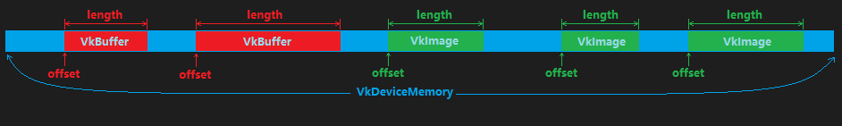

资源与内存
================

.. dropdown:: 更新记录
   :color: muted
   :icon: history

   * 2024/1/2 增加该文档
   * 2024/5/11 更新该文档
   * 2024/5/13 更新该文档
   * 2024/5/13 增加 ``获取支持的设备内存`` 章节。
   * 2024/5/13 增加 ``vkGetBufferMemoryRequirements`` 章节。
   * 2024/5/13 增加 ``vkGetImageMemoryRequirements`` 章节。
   * 2024/5/13 增加 ``VkMemoryRequirements`` 章节。
   * 2024/5/17 更新 ``VkMemoryRequirements`` 章节。
   * 2024/5/18 更新 ``VkMemoryRequirements`` 章节。
   * 2024/5/21 更新 ``VkMemoryRequirements`` 章节。
   * 2024/5/21 增加 ``资源与设备内存绑定`` 章节。
   * 2024/9/6 更新 ``对应关系`` 章节。
   * 2024/10/29 更新 ``资源与设备内存绑定`` 章节。
   * 2024/11/5 更新 ``资源与设备内存绑定`` 章节。

在 `资源 <./Resource.html>`_ 章节中我们知道一个资源仅仅是一个 ``虚拟资源句柄`` ，其本质上并没有相应的内存实体用于存储数据。所以在创建完资源后，需要分配内存并与资源进行绑定，用于之后的数据读写。

根据不同资源的不同配置，相应支持资源的内存策略不尽相同，比如：

* 当创建图片指定 ``VkImageCreateInfo::tiling`` 为 ``VkImageTiling::VK_IMAGE_TILING_OPTIMAL`` 的话，一般期望是在 ``Device`` 端的本地内存 （ ``VkMemoryPropertyFlagBits::VK_MEMORY_PROPERTY_DEVICE_LOCAL_BIT`` ） 上进行内存分配并绑定。
* 当创建图片指定 ``VkImageCreateInfo::tiling`` 为 ``VkImageTiling::VK_IMAGE_TILING_LINEAR`` 的话，一般期望是在 ``Host`` 端的内存 （ ``VkMemoryPropertyFlagBits::VK_MEMORY_PROPERTY_HOST_VISIBLE_BIT`` ） 上进行内存分配并绑定。

为了能够获取支持资源的内存信息， ``Vulkan`` 为我们提供了如下查询接口：

* :bdg-secondary:`vkGetBufferMemoryRequirements(...)` 获取支持该缓存资源的内存信息。
* :bdg-secondary:`vkGetImageMemoryRequirements(...)` 获取支持该图片资源的内存信息。

获取支持的设备内存
##################

其中 ``vkGetBufferMemoryRequirements(...)`` 和 ``vkGetImageMemoryRequirements(...)`` 定义如下：

vkGetBufferMemoryRequirements
*********************************

.. code:: c++

   // 由 VK_VERSION_1_0 提供
   void vkGetBufferMemoryRequirements(
       VkDevice                                    device,
       VkBuffer                                    buffer,
       VkMemoryRequirements*                       pMemoryRequirements);

* :bdg-secondary:`device` 对应的逻辑设备。
* :bdg-secondary:`buffer` 目标缓存。
* :bdg-secondary:`pMemoryRequirements` 支持该缓存资源的内存信息。

vkGetImageMemoryRequirements
*********************************

.. code:: c++

   // 由 VK_VERSION_1_0 提供
   void vkGetImageMemoryRequirements(
       VkDevice                                    device,
       VkImage                                     image,
       VkMemoryRequirements*                       pMemoryRequirements);

* :bdg-secondary:`device` 对应的逻辑设备。
* :bdg-secondary:`image` 目标图片。
* :bdg-secondary:`pMemoryRequirements` 支持该图片资源的内存信息。

无论是获取缓存支持的内存信息，还是图片的，其都会将资源支持的设备内存信息写入类型为 ``pMemoryRequirements`` 成员中，其类型为 ``VkMemoryRequirements`` ，定义如下：

VkMemoryRequirements
*********************************

.. code:: c++

   // 由 VK_VERSION_1_0 提供
   typedef struct VkMemoryRequirements {
       VkDeviceSize    size;
       VkDeviceSize    alignment;
       uint32_t        memoryTypeBits;
   } VkMemoryRequirements;

* :bdg-secondary:`size` 资源需要分配的设备内存大小。单位为 ``字节`` 。
* :bdg-secondary:`alignment` 为该资源绑定的设备内存起始地址 :bdg-danger:`必须` 进行内存对齐位数。单位为 ``字节`` 。
* :bdg-secondary:`memoryTypeBits` 支持的设备内存索引位域。

其中 ``memoryTypeBits`` 成员变量是最重要的设备内存信息。该参数为一个 ``uint32_t`` 类型变量，也就是一个 ``32`` 位的整形。

在 `设备内存 <./Memory.html#id6>`_ 章节的 `VkPhysicalDeviceMemoryProperties </Memory.html#vkphysicaldevicememoryproperties>`_ 中给出了其定义，如下：

.. code:: c++

   // 由 VK_VERSION_1_0 提供
   typedef struct VkPhysicalDeviceMemoryProperties {
       uint32_t        memoryTypeCount;
       VkMemoryType    memoryTypes[VK_MAX_MEMORY_TYPES];
       uint32_t        memoryHeapCount;
       VkMemoryHeap    memoryHeaps[VK_MAX_MEMORY_HEAPS];
   } VkPhysicalDeviceMemoryProperties;

再此之前反复强调过 ``VkPhysicalDeviceMemoryProperties::memoryTypes`` 数组索引值非常重要，是因为 ``VkMemoryRequirements::memoryTypeBits`` 与 ``VkPhysicalDeviceMemoryProperties::memoryTypes`` 有对应关系。其对应关系如下：

.. admonition:: 对应关系
   :class: important

   ``VkMemoryRequirements::memoryTypeBits`` 中的 ``32`` 个位，如果对应第 ``i`` 位为 ``1`` 说明 ``VkPhysicalDeviceMemoryProperties::memoryTypes[i]`` 对应的设备内存支持用于相应的资源。

   .. admonition:: VK_MAX_MEMORY_TYPES
      :class: note

      由于 ``VK_MAX_MEMORY_TYPES`` 为 ``32`` ，其定义如下：

      .. code:: c++

         #define VK_MAX_MEMORY_TYPES 32U

      所以一个 ``32`` 位的 ``VkMemoryRequirements::memoryTypeBits`` 完全可以覆盖到所有的 ``VkPhysicalDeviceMemoryProperties::memoryTypes`` 对应索引。

      示意图如下：

      .. figure:: ../_static/memory_type_bits.png

         memoryTypeBits 与 memoryTypes

      假如， ``VkPhysicalDeviceMemoryProperties::memoryTypes`` 有 ``10`` 个内存类型，其中 ``VkMemoryRequirements::memoryTypeBits`` 比特位为 ``1`` 所对应的内存索引的那个 ``设备内存`` 支持该为资源分配内存。

由于 ``VkMemoryRequirements::memoryTypeBits`` 中是按比特位存储的索引，所以我们需要遍历 ``32`` 位的每一位，来确定对应位是否为 ``1`` 。示例代码如下：

.. code:: c++

   VkMemoryRequirements memory_requirements = 之前通过 vkGetBufferMemoryRequirements(...) 或 vkGetImageMemoryRequirements(...) 获得的 VkMemoryRequirements 信息;

   uint32_t memory_type_bits = memory_requirements.memoryTypeBits;

   std::vector<uint32_t> support_memory_type_indices; // 存储所有支持的设备内存类型索引

   for(uint32_t index = 0; index < VK_MAX_MEMORY_TYPES; index++)
   {
      if((memory_type_bits & 1) == 1)
      {
         support_memory_type_indices.push_back(index);
      }

      memory_type_bits >>= 1; // 向右移1位，依次遍历所有比特位
   }

如上，便得到了所有支持对应资源的设备内存类型索引。之后就可以根据这些索引来筛选出满足需求的设备内存。比如筛选出带有 ``VkMemoryPropertyFlagBits::VK_MEMORY_PROPERTY_DEVICE_LOCAL_BIT`` 的设备本地内存：

.. code:: c++

   VkPhysicalDeviceMemoryProperties physical_device_memory_properties = 之前通过 vkGetPhysicalDeviceMemoryProperties(...) 获取到的设备内存信息;

   std::vector<uint32_t> support_memory_type_indices = 之前筛选出的所有支持对应资源的设备内存索引;

   std::vector<uint32_t> available_device_local_memory_type_indices; // 存储支持 VkMemoryPropertyFlagBits::VK_MEMORY_PROPERTY_DEVICE_LOCAL_BIT 的设备内存类型索引 

   for(uint32_t index = 0; index < support_memory_type_indices.size(); index++)
   {
      uint32_t memory_type_index = support_memory_type_indices[index];
      VkMemoryType memory_type = physical_device_memory_properties.memoryTypes[memory_type_index];

      // 如果对应的设备内存支持 VkMemoryPropertyFlagBits::VK_MEMORY_PROPERTY_DEVICE_LOCAL_BIT，则为我们期望的设备内存，存储其索引
      if((memory_type.propertyFlags & VkMemoryPropertyFlagBits::VK_MEMORY_PROPERTY_DEVICE_LOCAL_BIT) == VkMemoryPropertyFlagBits::VK_MEMORY_PROPERTY_DEVICE_LOCAL_BIT)
      {
         available_device_local_memory_type_indices.push_back(memory_type_index);
      }
   }

   if(!available_device_local_memory_type_indices.empty())
   {
      // 找到了既支持资源也支持 VkMemoryPropertyFlagBits::VK_MEMORY_PROPERTY_DEVICE_LOCAL_BIT 的设备内存类型索引
      for(uint32_t index = 0; index < available_device_local_memory_type_indices.size(); index++)
      {
         uint32_t memory_type_index = available_device_local_memory_type_indices[index];
         ... // 使用 memory_type_index 分配内存
      }
   }
   else
   {
      throw std::runtime_error("没找到支持的内存类型");
   }

以此类推，我们就可以根据不同的需求，筛选出不同情况下最理想的设备内存索引，并在之后用于 `内存分配 <./Memory.html#id9>`_ 。

..
   bool memory_type_from_properties(struct sample_info &info, uint32_t typeBits, VkFlags requirements_mask, uint32_t *typeIndex) 
   {
    // Search memtypes to find first index with those properties
    for (uint32_t i = 0; i < info.memory_properties.memoryTypeCount; i++) {
        if ((typeBits & 1) == 1) {
            // Type is available, does it match user properties?
            if ((info.memory_properties.memoryTypes[i].propertyFlags & requirements_mask) == requirements_mask) {
                *typeIndex = i;
                return true;
            }
        }
        typeBits >>= 1;
    }
    // No memory types matched, return failure
    return false;
   }

   pass = memory_type_from_properties(info, mem_reqs.memoryTypeBits,
                                      VK_MEMORY_PROPERTY_HOST_VISIBLE_BIT | VK_MEMORY_PROPERTY_HOST_COHERENT_BIT,
                                      &alloc_info.memoryTypeIndex);

.. 
   memoryTypeBits

资源与设备内存绑定
##################

通过之前的介绍，我们已经知道两件事：

* 如何在我们需要的设备内存上申请内存
* 如何创建我们需要的资源

现在 ``资源`` 和 ``设备内存`` 都有了，接下来就可以将两者进行关联，即 ``绑定`` 。

``绑定`` 主要有两种：

* ``缓存`` 与 ``设备内存`` 进行绑定。对应的接口为 ``vkBindBufferMemory(...)`` 。
* ``图片`` 与 ``设备内存`` 进行绑定。对应的接口为 ``vkBindImageMemory(...)`` 。

接口定义如下：

.. code-block:: c++

   // 由 VK_VERSION_1_0 提供
   VkResult vkBindBufferMemory(
       VkDevice                                    device,
       VkBuffer                                    buffer,
       VkDeviceMemory                              memory,
       VkDeviceSize                                memoryOffset);

* :bdg-secondary:`device` 对应的逻辑设备。
* :bdg-secondary:`buffer` 对应绑定的缓存。
* :bdg-secondary:`memory` 对应绑定的设备内存。
* :bdg-secondary:`memoryOffset` 对应绑定的设备内存的相对偏移。

.. code-block:: c++

   // 由 VK_VERSION_1_0 提供
   VkResult vkBindImageMemory(
       VkDevice                                    device,
       VkImage                                     image,
       VkDeviceMemory                              memory,
       VkDeviceSize                                memoryOffset);

* :bdg-secondary:`device` 对应的逻辑设备。
* :bdg-secondary:`image` 对应绑定的图片。
* :bdg-secondary:`memory` 对应绑定的设备内存。
* :bdg-secondary:`memoryOffset` 对应绑定的设备内存的相对偏移。

其中  ``buffer`` 、 ``memory`` 和 ``image`` 都需要从 ``device`` 中创建出来，这个不需要再赘述。这里主要需要说明一下 ``memoryOffset`` 参数的作用。

在 ``Vulkan`` 中其鼓励用户创建分配一块大的设备内存，不同的资源占用该设备内存不同的部分。这不仅能够最大化重复利用一块内存，优化内存使用率，也为用户制定自定义内存管理机制提供途径。这样设计的根本原因是： ``Vulkan`` 对于 ``VkDeviceMemory`` 创建的数量有 :bdg-danger:`上限` 。

在 :ref:`Get_Physical_Devicce_Properties` 章节中我们知道其内部有 :ref:`Vk_Physical_Device_Limits` 限制信息。其中有 ``maxMemoryAllocationCount`` 成员：

.. code-block:: c++

   // 由 VK_VERSION_1_0 提供s
   typedef struct VkPhysicalDeviceLimits {
       ...
       uint32_t maxMemoryAllocationCount;
       ...
   } VkPhysicalDeviceLimits;

* :bdg-secondary:`maxMemoryAllocationCount` 可通过 :ref:`vk_Allocate_Memory` 创建的最大同时存在的设备内存数量。且 ``Vulkan`` 要求该限制数量不能小于 ``4096``

.. note:: 

   未完待续