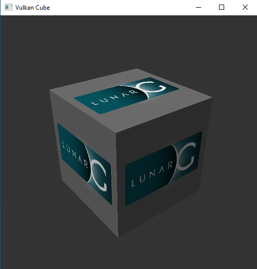
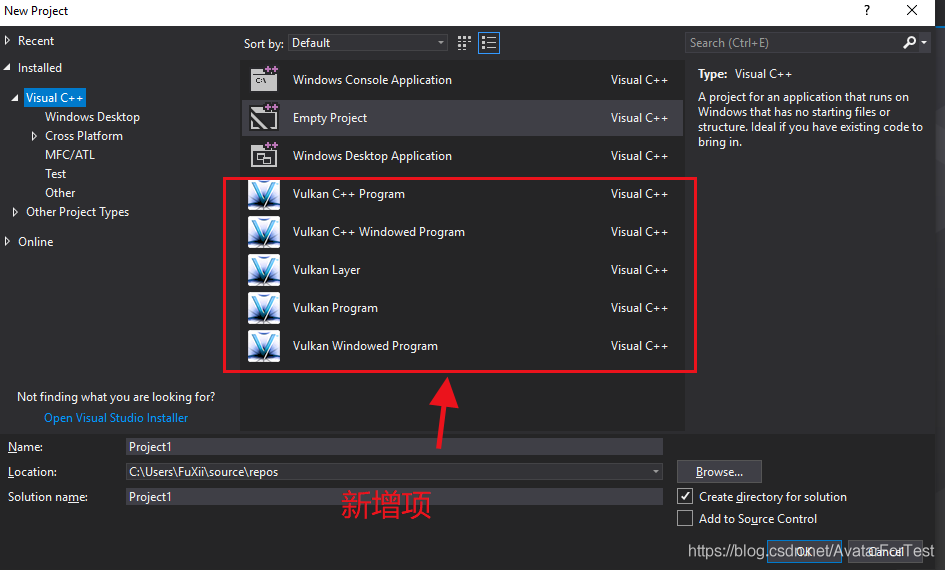
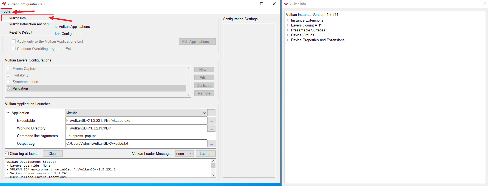

开始于 Vulkan SDK
===================

.. dropdown:: 更新记录
   :color: muted
   :icon: history

   * 2023/5/16 增加该文章
   * 2023/5/16 增加 ``安装 Vulkan SDK`` 章节
   * 2023/5/16 增加 ``验证安装`` 章节
   * 2023/5/16 增加 ``SDK的版本`` 章节
   * 2023/5/16 增加 ``Vulkan Loader`` 章节
   * 2023/5/16 增加 ``Vulkan的版本`` 章节
   * 2023/5/16 增加 ``Vulkan的库`` 章节
   * 2023/5/16 增加 ``Vulkan的头文件`` 章节
   * 2023/5/17 更新 ``安装 Vulkan SDK`` 章节
   * 2023/5/17 更新 ``Vulkan的版本`` 章节
   * 2023/5/18 更新 ``Vulkan的头文件`` 章节
   * 2023/5/18 增加 ``Vulkan SDK 最佳实践`` 章节
   * 2023/6/23 增加 ``Vulkan SDK 内容`` 章节
   * 2023/6/23 增加 ``Bin 和 Bin32`` 章节
   * 2023/6/23 增加 ``Include 与 Lib 和 Lib32`` 章节
   * 2023/6/23 增加 ``Templates`` 章节
   * 2023/6/29 更新 ``安装 Vulkan SDK`` 章节，改成 ``Tab`` 标签呈现
   * 2023/7/10 增加 ``查看 Vulkan 所有相关信息`` 章节
   * 2024/1/2 更新 ``Vulkan的库`` 章节。修正不推荐使用 ``vulkan-1.lib`` 的跳转说明链接。
   * 2024/8/29 增加 ``Vulkan 三角形`` 章节。
   * 2024/8/29 增加 ``编译`` 章节。

``Khronos`` 这次推出了 ``Vulkan`` 官方的软件开发工具包 `Vulkan SDK <https://vulkan.lunarg.com/home/welcome>`_ ，这避免了像 ``OpenGL`` 开发环境混乱的情形再次上演。

目前 ``Vulkan`` 支持如下平台：

* Windows
* Linux
* MacOS
* Android

下载对应平台的安装包，安装即可。

.. important::

   ``Vulkan SDK`` 并不会安装硬件设备的 ``Vulkan`` 驱动！！仅仅提供用于应用开发和调试的工具和库，如果您在尝试安装驱动，请移步至对应硬件设备供应商的官网处获取驱动。

安装 Vulkan SDK
####################

.. hint::

   本人目前只完整适配过 ``Windows`` 和 ``Linux`` 系统，主要以这两个操作系统讲解。
   有关 ``Android`` 的适配应该和 ``Linux`` 是相通的， ``MacOS`` 没适配，苹果的电脑太贵了。 ┑(￣Д ￣)┍

   对于 ``Android`` 和  ``MacOS`` 有适配过的小伙伴，欢迎分享~ ꒰'ꀾ'꒱ 。

.. tab-set::

    .. tab-item:: Windows 安装

      ``Vulkan SDK`` 是一个自解压安装包，运行下载的可执行文件即可。默认的安装地址为 ``C:\VulkanSDK\{VulkanSDK的版本}`` 。

      .. note::

         如果你已经下载安装了一个或多个新版的 ``Vulkan SDK`` （ ``1.2.189.1`` 或是更新的版本 ），此时如果您需要安装一个老版本的 ``Vulkan SDK`` （早于 ``1.2.189.1``）的话，
         您必须将最近安装的 ``Vulkan SDK`` 卸载掉，可以使用 ``Windows`` 系统的控制面板的应用管理进行卸载，或是通过 ``Vulkan SDK`` 安装目录下的
         ``maintenancetool.exe`` 进行卸载。

      ``Vulkan SDK`` 安装之后将会将安装目录作为 ``VULKAN_SDK`` 的变量添加到环境变量中，并且也会将 ``%VULKAN_SDK%\Bin`` 目录添加到系统的 ``PATH`` 环境变量中。同时也会增加
      ``VK_SDK_PATH`` 环境变量，其值和 ``VULKAN_SDK`` 环境变量是一样的。

      .. note::

         一些程序和命令行环境在没有重新启动时可能获取不到 ``Vulkan SDK`` 相关的环境变量。

    .. tab-item:: Linux 安装

      ``Vulkan SDK`` 是一个压缩文件，将其解压出来放到任意您想放到的位置即可。

        1. 创建一个文件夹，用于存放安装的 ``Vulkan SDK`` 。假如这个文件夹叫 ``vulkan``，在您的 ``HOME`` 目录下。

           .. code:: console

              cd ~
              mkdir vulkan
              cd vulkan

        2. 使用 ``sha256sum`` 检查下载的压缩文件的完整性。假如压缩包下载到了 ``$HOME/Downloads``。

           .. code:: console

              sha256sum $HOME/Downloads/vulkansdk-linux-x86_64-1.x.yy.z.tar.gz

           .. note::

              ``x`` 、``yy`` 和 ``z`` 是解压出来的 ``Vulkan SDK`` 对应版本，下文皆是如此。

        3. 解压 ``Vulkan SDK`` 压缩包。假如压缩包下载到了 ``$HOME/Downloads``。

           .. code:: console

              tar xf $HOME/Downloads/vulkansdk-linux-x86_64-1.x.yy.z.tar.gz

        4. 如果没有安装运行时依赖，安装之。

           Ubuntu 22.04:

           .. code:: console

              sudo apt install qtbase5-dev libxcb-xinput0 libxcb-xinerama0

           Ubuntu 20.04:

           .. code:: console

              sudo apt install qt5-default libxcb-xinput0 libxcb-xinerama0

           Fedora:

           .. code:: console

              sudo dnf install qt xinput libXinerama

           Arch Linux:

           .. code:: console

              sudo pacman -S qt5-base libxcb libxinerama

        与 ``Windows`` 系统不同的是， ``Linux`` 的环境变量需要自己手动设置。要设置的环境变量如下表所示，其中 ``VULKAN_SDK`` 环境变量是安装 ``Vulkan SDK`` 的目录（比如 ``~/vulkan/1.x.yy.z/x86_64`` ），剩下的
        环境变量路径都相对于 ``VULKAN_SDK`` 路径。

        ======================  =========================================
          环境变量               文件/路径
        ======================  =========================================
        ``PATH``                 ``$VULKAN_SDK/bin``
        ``LD_LIBRARY_PATH``      ``$VULKAN_SDK/lib``
        ``VK_LAYER_PATH``        ``$VULKAN_SDK/etc/vulkan/explicit_layer.d``
        ``VK_ADD_LAYER_PATH``    ``$VULKAN_SDK/etc/vulkan/explicit_layer.d``
        ======================  =========================================

        使用 ``source`` 指令去加载设置环境变量脚本：

        .. code:: console

           source ~/vulkan/1.x.yy.z/setup-env.sh

        或者可以自己手动设置环境变量：

        .. code:: console

           export VULKAN_SDK=~/vulkan/1.x.yy.z/x86_64
           export PATH=$VULKAN_SDK/bin:$PATH
           export LD_LIBRARY_PATH=$VULKAN_SDK/lib${LD_LIBRARY_PATH:+:$LD_LIBRARY_PATH}
           export VK_LAYER_PATH=$VULKAN_SDK/etc/vulkan/explicit_layer.d

        .. admonition:: 永久性设置 ``Vulkan SDK`` 环境变量
           :class: note

           以上的两种方式为临时设置环境变量，当更换或重启控制台、重启计算机都会使之前设置的环境变量失效。
           如果想要永久性设置环境变量，请参考对应 ``shell`` 或桌面文档，不同系统有些许区别。比如在大多数 ``Ubuntu`` 的桌面系统中，在 ``.profile`` 文件中增加
           ``setup-env.sh`` 文件的源，用于设置永久性环境变量，该环境变量之后就可以全局使用而不需要单独配置。

        对于卸载 ``Vulkan SDK`` 仅通过删除 ``Vulkan SDK`` 解压安装的文件夹即可，例如：

        .. code:: console

           rm -rf ~/vulkan/1.x.yy.z

验证安装
####################

安装完 ``Vulkan SDK`` ，并配置完环境变量后，打开终端命令行程序，运行：

.. code:: console

   vkcube

你将会看到一个旋转的方盒子，说明安装配置成功。

   vkcube

SDK的版本
####################

安装的 ``SDK`` 版本是由其中发布的 ``Vulkan`` 头文件的 ``Vulkan`` 版本所决定的， ``SDK`` 版本号的组成结构为 ``主版本号.副版本号.补丁版本号.修订版本号`` 。
最后的修订版本号代指同一 ``Vulkan`` 头文件版本下 ``SDK`` 的修订版本，一般用于在同一 ``Vulkan`` 版本中发布多个 ``SDK`` 时使用。
比如 ``SDK`` 的版本为 ``1.1.70.0`` 意味着此 ``SDK`` 使用的 ``Vulkan`` 头文件版本为 ``1.1.70``

.. note::

   ``SDK`` 的版本版本内容是向下兼容的，新版本的 ``SDK`` 支持老版本的内容，而反过来则不行。比如 ``1.1.130.0`` 的 ``SDK`` 可以用于开发 ``Vulkan 1.0`` 和 ``Vulkan 1.1`` 而不能开发 ``Vulkan 1.2`` 的功能。
   还有就是， ``SDK`` 的版本并不一定显示什么版本就能用什么版本开发，具体支持什么版本的 ``Vulkan`` ，需要从设备驱动中获取返回该设备支持的 ``Vulkan`` 版本，才能知道可以使用什么版本的 ``Vulkan`` 的功能 ，比如你下安装了支持 ``Vulkan 1.3`` 的 ``SDK`` ，
   而硬件设备驱动返回其仅支持 ``Vulkan 1.0`` ，则你可以使用此 ``Vulkan 1.3`` 的 ``SDK`` 开发 ``Vulkan 1.0`` 的功能。

Vulkan Loader
####################

之前说过可以通过硬件设备驱动获取设备支持的 ``Vulkan`` 版本，在 ``Vulkan`` 中这是通过调用 ``Vulkan`` 标准函数 ``vkGetPhysicalDeviceProperties`` 函数获取到的，之前说过 ``Vulkan`` 统一了函数获取方式，对于 ``vkGetPhysicalDeviceProperties`` 是通过
``Vulkan Loader`` 获取到的。顾名思义 ``Vulkan Loader`` 就是用于获取 ``Vulkan`` 标准函数的模块， ``Vulkan`` 中所有的标准函数都是通过 ``Vulkan Loader`` 获取到。

.. admonition:: vkGetPhysicalDeviceProperties
   :class: note

   在 ``Vulkan`` 中可通过调用 ``vkGetPhysicalDeviceProperties`` 函数获取到对应物理设备的属性。该函数通过指定 ``目标物理设备句柄`` 获取 ``VkPhysicalDeviceProperties`` 结构体数据，以此获得目标物理设备的属性。

   .. code:: c++

      // 由Vulkan1.0提供
      void vkGetPhysicalDeviceProperties(
         VkPhysicalDevice physicalDevice,
         VkPhysicalDeviceProperties* pProperties);

   .. code:: c++
      
      // 由Vulkan1.0提供
      typedef struct VkPhysicalDeviceProperties {
         uint32_t apiVersion;
         uint32_t driverVersion;
         uint32_t vendorID;
         uint32_t deviceID;
         VkPhysicalDeviceType deviceType;
         char deviceName[VK_MAX_PHYSICAL_DEVICE_NAME_SIZE];
         uint8_t pipelineCacheUUID[VK_UUID_SIZE];
         VkPhysicalDeviceLimits limits;
         VkPhysicalDeviceSparseProperties sparseProperties;
      } VkPhysicalDeviceProperties;
   
   您可能还不太清楚 ``VkPhysicalDeviceProperties`` 中的每一项都是什么意思，不过大可放心，所有的项目都将会在之后的教程中讲解，我们目前需要先关注 ``VkPhysicalDeviceProperties::apiVersion`` 这一项，此项即为目标设备支持的 ``Vulkan`` 版本。

那 ``Vulkan Loader`` 是什么？具体长什么样呢？在哪里能找到？

其实 ``Vulkan Loader`` 就是一个动态库，和常见的动态库没什么区别，在 ``Windows`` 操作系统中为 ``vulkan-1.dll``，在 ``Linux`` 操作系统中为 ``libvulkan.so.1`` 或 ``libvulkan.so``，一般都在系统目录下 。
``Vulkan Loader`` 实现了 ``Vulkan API`` 入口，并且管理 ``Layers``，扩展，和驱动。

.. admonition:: Layer
   :class: note

   是 ``Vulkan Loader`` 的一种插件，一般用于为应用开发提供验证和函数调试，用于检查您开发的程序哪里出现了错误，并及时给出提示。
  
如果系统中安装了支持 ``Vulkan`` 的驱动或安装了 ``Vulkan SDK`` 的话， 就会有 ``Vulkan`` 的运行时，该运行时自身就有 ``Vulkan Loader`` 的动态库。如果系统没有找到 ``Vulkan`` 的运行时的话，可以从
`Vulkan SDK <https://vulkan.lunarg.com/home/welcome>`_ 官方网页获取最新的 ``Vulkan Runtime``。

.. note::

   ``Vulkan`` 的运行时一般不需要单独下载安装，一般操作系统都自带该运行时。也就是操作系统一般都自带 ``Vulkan Loader`` 。

Vulkan的版本
####################

一旦系统中安装了支持 ``Vulkan`` 的驱动，这里会有两个 ``Vulkan`` 版本，一个版本是 ``Vulkan Loader`` 的版本，一个是物理设备的版本。

* ``Vulkan Loader`` 的版本

   这也是 ``Vulkan`` ``Instance`` 的版本。如果命令行中执行 ``vulkaninfo`` 指令， ``Vulkan`` ``Instance`` 的版本将会第一个显示。 ``Vulkan Loader`` 是跟随您的设备驱动更新而一同发行的。

   .. admonition:: Instance
      :class: note

      ``Instance`` 是指在 ``Vulkan`` 中最初之物: ``VkInstance`` 。 ``VkInstance`` 在 ``Vulkan`` 中是一个句柄，在开发 ``Vulkan`` 应用时要做的第一步就是创建 ``VkInstance``。这是通过调用 ``vkCreateInstance`` 函数创建的，其中
      在创建时需要指定 ``VkInstanceCreateInfo`` 数据，该数据下还需要指定 ``VkApplicationInfo`` 数据，此  ``VkApplicationInfo`` 内部有个 ``apiVersion`` 成员变量，此成员变量即为 ``Vulkan`` ``Instance`` 的版本。

      .. code:: c++

         // 由Vulkan1.0提供
         VkResult vkCreateInstance(
            const VkInstanceCreateInfo*                 pCreateInfo,
            const VkAllocationCallbacks*                pAllocator,
            VkInstance*                                 pInstance);

      .. code:: c++

         // 由Vulkan1.0提供
         typedef struct VkInstanceCreateInfo {
            VkStructureType             sType;
            const void*                 pNext;
            VkInstanceCreateFlags       flags;
            const VkApplicationInfo*    pApplicationInfo;
            uint32_t                    enabledLayerCount;
            const char* const*          ppEnabledLayerNames;
            uint32_t                    enabledExtensionCount;
            const char* const*          ppEnabledExtensionNames;
         } VkInstanceCreateInfo;

      .. code:: c++

         // 由Vulkan1.0提供
         typedef struct VkApplicationInfo {
            VkStructureType    sType;
            const void*        pNext;
            const char*        pApplicationName;
            uint32_t           applicationVersion;
            const char*        pEngineName;
            uint32_t           engineVersion;
            uint32_t           apiVersion;
         } VkApplicationInfo;

* 每个物理设备的版本

   对应的就是 ``VkPhysicalDeviceProperties::apiVersion`` 的版本，该版本是设备 ``Vulkan`` 驱动的版本。您可以在执行 ``vulkaninfo`` 指令后于 ``Device Properties and Extensions`` 文字标签之后找到 ``apiVersion`` 的相关信息。

随着 ``Vulkan`` 的更新和发展， ``Vulkan`` 的版本号也随之增长。最开始发布了 ``Vulkan1.0`` 版本，之后 ``Vulkan1.1`` 、 ``Vulkan1.2`` 再到后来发布的 ``Vulkan1.3`` ，每一个版本的更新都意味着更多丰富的功能的增加。
无论是 ``VkApplicationInfo::apiVersion`` 还是 ``VkPhysicalDeviceProperties::apiVersion`` 其数据类型都是 ``uint32_t``，而 ``Vulkan`` 的版本都是 ``主版本号.副版本号.补丁版本号.修订版本号`` （有时补丁版本号省略）这样的，如何用 ``uint32_t`` 表示呢？

``Vulkan`` 为我们提供了 ``VK_MAKE_VERSION``、 ``VK_VERSION_MAJOR``、 ``VK_VERSION_MINOR``、 ``VK_VERSION_PATCH`` 函数（宏函数），帮助我们将 ``主版本号.副版本号.补丁版本号`` 和 ``uint32_t`` 之间进行转换。

.. note:: 这里没有 ``修订版本号`` 的描述，是因为当时 ``Vulkan`` 标准组当时仅考虑使用 ``主版本号.副版本号.补丁版本号`` 作为有效版本（补丁版本号在使用时一般为 ``0`` ）， ``修订版本号`` 仅为一些小修改不会影响有效版本的标准。

.. code:: c++

   // 由Vulkan1.0提供
   #define VK_MAKE_VERSION(major, minor, patch) \
    ((((uint32_t)(major)) << 22U) | (((uint32_t)(minor)) << 12U) | ((uint32_t)(patch)))

.. code:: c++

   // 由Vulkan1.0提供
   #define VK_VERSION_MAJOR(version) ((uint32_t)(version) >> 22U)

.. code:: c++

   // 由Vulkan1.0提供
   #define VK_VERSION_MINOR(version) (((uint32_t)(version) >> 12U) & 0x3FFU)

.. code:: c++

   // 由Vulkan1.0提供
   #define VK_VERSION_PATCH(version) ((uint32_t)(version) & 0xFFFU)

当 ``Vulkan1.2.175`` 发布后，对于 ``Vulkan`` 的版本增加了对于 ``变体版本号`` 的描述（对于 ``Vulkan`` 接口来说  ``变体版本号`` 永远是 ``0`` 。并且改变塞入了 ``Vulkan1.0`` 标准中 ），之前与版本有关的函数被遗弃，而是提供了新的描述函数：

.. code:: c++

   // 由Vulkan1.0提供，代替之前的VK_MAKE_VERSION
   #define VK_MAKE_API_VERSION(variant, major, minor, patch) \
       ((((uint32_t)(variant)) << 29U) | (((uint32_t)(major)) << 22U) | (((uint32_t)(minor)) << 12U) | ((uint32_t)(patch)))

.. code:: c++

   // 由Vulkan1.0提供
   #define VK_API_VERSION_VARIANT(version) ((uint32_t)(version) >> 29U)

.. code:: c++

   // 由Vulkan1.0提供，代替之前的VK_VERSION_MAJOR
   #define VK_API_VERSION_MAJOR(version) (((uint32_t)(version) >> 22U) & 0x7FU)

.. code:: c++

   // 由Vulkan1.0提供，代替之前的VK_VERSION_MINOR
   #define VK_API_VERSION_MINOR(version) (((uint32_t)(version) >> 12U) & 0x3FFU)

.. code:: c++

   // 由Vulkan1.0提供，代替之前的VK_VERSION_PATCH
   #define VK_API_VERSION_PATCH(version) ((uint32_t)(version) & 0xFFFU)

不难发现每个版本的不同分量是使用位域将对应分量版本号存入 ``uint32_t`` 数据中，其中：

.. note:: 一共 ``32`` 位

* ``31`` - ``29`` 位使用 ``3`` 位存储 ``变体版本号``
* ``28`` - ``22`` 位使用 ``7`` 位存储 ``主版本号``
* ``21`` - ``12`` 位使用 ``10`` 位存储 ``副版本号``
* ``11`` - ``0`` 位使用 ``12`` 位存储 ``补丁版本号``

同时 ``Vulkan`` 还很贴心的为我们提前声明了一些有效版本：

.. code:: c++

   // 由Vulkan1.0提供
   #define VK_HEADER_VERSION 247

.. code:: c++

   // 由Vulkan1.0提供
   #define VK_API_VERSION_1_0 VK_MAKE_API_VERSION(0, 1, 0, 0)

.. code:: c++

   // 由Vulkan1.0提供
   #define VK_HEADER_VERSION_COMPLETE VK_MAKE_API_VERSION(0, 1, 3, VK_HEADER_VERSION)

.. code:: c++

   // 由Vulkan1.1提供
   #define VK_API_VERSION_1_1 VK_MAKE_API_VERSION(0, 1, 1, 0)

.. code:: c++

   // 由Vulkan1.2提供
   #define VK_API_VERSION_1_2 VK_MAKE_API_VERSION(0, 1, 2, 0)

.. code:: c++

   // 由Vulkan1.3提供
   #define VK_API_VERSION_1_3 VK_MAKE_API_VERSION(0, 1, 3, 0)

.. note:: ``VK_HEADER_VERSION`` 为 ``Vulkan`` 头文件发布版本号，一般为补丁版本号。

这样就可以使用 ``uint32_t`` 承接 ``Vulkan`` 的版本了：

.. code:: c++

   uint32_t api_version_1_0 = VK_MAKE_API_VERSION(0, 1, 0, 0);
   uint32_t api_version_variant = VK_API_VERSION_VARIANT(api_version_1_0);//0
   uint32_t api_version_major = VK_API_VERSION_MAJOR(api_version_1_0);//1
   uint32_t api_version_minor = VK_API_VERSION_MINOR(api_version_1_0);//0
   uint32_t api_version_patch = VK_API_VERSION_PATCH(api_version_1_0);//0

Vulkan的头文件
####################

大家已经在之前见过 ``Vulkan`` 的一些函数和定义了，比如 ``VK_MAKE_API_VERSION`` 、 ``vkCreateInstance`` 等， ``Vulkan`` 标准中所有的这一切都定义在 ``Vulkan`` 的头文件。

头文件位于 ``Vulkan SDK`` 的安装目录下： ``$VULKAN_SDK/Include`` 。

.. note::

   ``$VULKAN_SDK/Include`` 的目录下一般不仅包括 ``Vulkan`` 的头文件，其包括整个 ``Vulkan SDK`` 的头文件。其中 ``vk_video`` 和 ``vulkan`` 内包含 ``Vulkan`` 的头文件。

在 ``$VULKAN_SDK/Include/vulkan`` 文件夹下有三个头文件比较重要：

* ``vk_platform.h`` 包含一些跨平台相关的通用宏定义和声明
* ``vulkan_core.h`` 该头文件为 ``Vulkan`` 的核心头文件， ``Vulkan`` 所有的核心声明定义都在此头文件夹下。
* ``vulkan.h`` 内部包含 ``vk_platform.h`` 和 ``vulkan_core.h`` 两个头文件，并且包含特定平台的头文件。

.. important:: ``vulkan_core.h`` 是最重要的头文件。

让我们看一下 ``vulkan.h`` :

.. code:: c++

   // vulkan.h

   #include "vk_platform.h"
   #include "vulkan_core.h"

   #ifdef VK_USE_PLATFORM_ANDROID_KHR
   #include "vulkan_android.h"
   #endif

   #ifdef VK_USE_PLATFORM_WAYLAND_KHR
   #include "vulkan_wayland.h"
   #endif

   ...

   #ifdef VK_USE_PLATFORM_WIN32_KHR
   #include <windows.h>
   #include "vulkan_win32.h"
   #endif

   #ifdef VK_USE_PLATFORM_XCB_KHR
   #include <xcb/xcb.h>
   #include "vulkan_xcb.h"
   #endif

   #ifdef VK_USE_PLATFORM_XLIB_KHR
   #include <X11/Xlib.h>
   #include "vulkan_xlib.h"
   #endif

   ...

   #ifdef VK_ENABLE_BETA_EXTENSIONS
   #include "vulkan_beta.h"
   #endif

   #endif // VULKAN_H_

可以看到 ``vulkan.h`` 包含 ``vk_platform.h`` 和 ``vulkan_core.h`` ，并且使用平台宏包含特定平台的头文件。
其中 ``vulkan_beta.h`` 为 ``Vulkan`` 的测试功能声明（在不远的将来会提升至 ``Vulkan`` 的核心或是扩展）。

如果在 ``Windows`` 系统下开发则需要在使用 ``vulkan.h`` 之前定义 ``VK_USE_PLATFORM_WIN32_KHR`` 宏定义。

.. code:: c++

   #define VK_USE_PLATFORM_WIN32_KHR
   #include <vulkan.h>

剩下的 ``Vulkan`` 头文件，大部分就是 ``Vulkan`` 的扩展功能头文件。还有一个 ``vk_enum_string_helper.h`` 头文件，该头文件可以帮助我们将
``Vulkan`` 的定义和声明输出成字符串，这对于开发调试输出信息很重要。

如果开发者不想使用 ``Vulkan SDK`` 中的头文件，可以到 `Vulkan-Headers <https://github.com/KhronosGroup/Vulkan-Headers>`_ 仓库获取最新 ``Vulkan`` 头文件。

Vulkan的库
####################

``Vulkan`` 的库在 ``Vulkan SDK`` 中为静态库。如果您在安装 ``Vulkan SDK`` 时勾选安装 ``32`` 位的库（默认只安装 ``64`` 位）的库，则 ``Vulkan SDK`` 下会有两个库文件夹：

* ``Lib`` 用于 ``64`` 位开发的静态库
* ``Lib32`` 用于 ``32`` 位开发的静态库

其包括整个 ``Vulkan SDK`` 的静态库。其中我们主要只关注 ``vulkan-1.lib`` 这个库，使用此静态链接库，在开发 ``Vulkan`` 应用时将其链接进程序就可以调用 ``Vulkan`` 的函数了。

.. admonition:: vulkan-1.lib
   :class: attention

   现在已经不推荐使用静态库链接到 ``Vulkan`` 了。而是推荐直接使用 ``Vulkan`` 的动态库，也就是 ``Vulkan`` 运行时的那个动态库， ``Windows`` 下为 ``vulkan-1.dll`` ，
   在 ``Linux`` 操作系统中为 ``libvulkan.so.1`` 或 ``libvulkan.so`` 。有关原因请查阅 `加载 Vulkan 动态库 <./Overview.html#id5>`_ 章节。

Vulkan SDK 内容
######################

``Vulkan SDK`` 安装之后，对应的安装目录下有很多文件和文件夹，这里对内部内容进行简单介绍。

.. note:: 这里主要以 ``Windows`` 系统下的 ``1.3.246.1`` 版本的 ``Vulkan SDK`` 为基础进行介绍，其他操作系统的其他版本的 ``Vulkan SDK`` 内容都差不多。

======================  =========================================
  文件夹                 说明
======================  =========================================
``Bin``                 ``64`` 位二进制库和可执行程序，包括系统路径下的 ``layer`` 和 ``JSON`` 的清单文件。:bdg-warning:`注：如果只安装了32位的话将不会有该文件夹`
``Bin32``               ``32`` 位二进制库和可执行程序，包括系统路径下的 ``layer`` 和 ``JSON`` 的清单文件
``Config``              用于 ``SDL2`` 库的 ``CMake`` 文件
``Helpers``             该文件夹下的程序被 ``Vulkan SDK`` 的安装器和维护工具使用。请不要移除这些文件
``Demos``               ``Vulkan Cube`` 和 ``Vulkan Info`` 的程序源码和 ``Visual Studio`` 的工程
``Include``             用于编译 ``Vulkan`` 程序的头文件
``Lib``                 ``64`` 位 ``layer`` 和工具的二进制库
``Lib32``               ``32`` 位 ``layer`` 和工具的二进制库
``share``               ``vk.xml`` 文件的主目录
``Source``              ``spirv_reflect.c`` 之类的源码
``Templates``           ``Visual Studio`` 的 ``Vulkan`` 工程模板
======================  =========================================

Bin 和 Bin32
*****************

该文件夹下一般都是一些常用的 ``layer`` 和工具的二进制文件。其中有几个可执行程序需要注意一下：

* ``vkcube.exe`` 一般用于快速验证 ``Vulkan SDK`` 是否安装成功。执行会展现一个旋转方盒子。
* ``vkvia.exe`` 是 ``Vulkan Installation Analyzer(VIA)`` 的可执行程序，是 ``Vulkan`` 的安装验证分析器。当执行该程序后，会在执行目录输出 ``vkvia.html`` 文件，使用浏览器可查看相关信息。
* ``vkconfig.exe`` 是用于查看和配置 ``Vulkan`` 信息和环境的利器，非常好用。
* ``glslangValidator.exe`` 用于验证 ``GLSL`` 和 ``HLSL`` 着色器文件的语法正确性并生成 ``Vulkan`` 支持的 ``SPIR-V`` 着色器文件。

.. admonition:: SPIR-V
   :class: note

   ``SPIR-V`` 是 ``Vulkan`` 唯一支持的着色器格式，是一个人类不可阅读的二进制格式标准，只要是给硬件使用的。

Include 与 Lib 和 Lib32
*************************

``Include`` 与 ``Lib`` 和 ``Lib32`` 会根据 ``Vulkan SDK`` 安装时选择的安装内容的不同而不同，但大体应该相差不大。

* ``glslang`` 是 ``glslangValidator.exe`` 的父工程， ``glslangValidator.exe`` 是 ``glslang`` 的一个子项目程序。
* ``shaderc`` 与 ``glslang`` 类似，也是进行着色器文件编译。
* ``spirv_cross`` 用于将 ``SPIR-V`` 的文件转换成 ``GLSL`` 或 ``HLSL`` 标准或人类可阅读的格式。
* ``spirv-tools`` 用于验证 ``SPIR-V`` 着色器的正确性的可以简单理解为 ``SPIR-V`` 版的 ``glslang`` 。
* ``vulkan-1.lib`` ``Vulkan`` 的静态加载库。

Templates
*************************

该文件夹下有对应 ``VisualStudio`` 版本的文件夹，分别用于对应相应版本的 ``VisualStudio`` 项目模板，一般都是压缩文件。将压缩文件直接复制到如下目录：

.. code:: console

   C:\Users\{UserName}\Documents\Visual Studio {Version}\Templates\ProjectTemplates\Visual C++ Project

* :bdg-secondary:`{UserName}` 您电脑的用户名。
* :bdg-secondary:`{Version}` ``VisualStudio`` 的版本。

之后打开相应版本的 ``VisualStudio`` ，新建项目就会有如图新增选项：

   VisualStudio 工程模板

查看 Vulkan 所有相关信息
########################

在 ``Vulkan SDK`` 的安装目录的 ``Bin`` 下有一个 ``vkconfig.exe`` 可执行程序。

执行 ``vkconfig.exe`` 并点击菜单栏的 :menuselection:`Tools --> Vulkan Info` 将会弹出 ``Vulkan Info`` 窗口，该窗口可以查看 ``Vulkan`` 的所有相关信息。

   Vulkan 所有相关信息界面

Vulkan SDK 最佳实践
######################

对于 ``Vulkan SDK`` 的最佳实践就是 ``不使用`` ``Vulkan SDK`` 。是的，不使用安装的 ``Vulkan SDK`` 中的头文件和静态库。

* 对于库

   使用 ``Vulkan`` 运行时的动态库，因为不是每个电脑都安装了 ``Vulkan SDK`` ，但是想要运行 ``Vulkan`` 应用，其运行时是必须的，也就是说基本上每台设备上都有该 ``Vulkan`` 动态库。

   .. admonition:: 使用 ``Vulkan`` 动态库
      :class: note

      有关如何使用 ``Vulkan`` 动态库加载 ``Vulkan`` 函数，将在后文细说 ``Vulkan`` 时详细讲解。

* 对于 ``Vulkan`` 的头文件

   使用 `Vulkan-Headers <https://github.com/KhronosGroup/Vulkan-Headers>`_ 仓库获取最新 ``Vulkan`` 头文件。

.. admonition:: 不使用 ``Vulkan SDK``
   :class: caution

   理论上来说是不需要依赖 ``Vulkan SDK`` 的，但是如果使用一些第三方库，这些第三方库可能会依赖  ``Vulkan SDK`` ，比如 `VulkanMemoryAllocator <https://github.com/GPUOpen-LibrariesAndSDKs/VulkanMemoryAllocator>`_ 。此时 ``Vulkan SDK`` 还是需要的。

Vulkan 三角形
######################

对于 ``Vulkan`` 来说，想要绘制一个三角形需要学习各种前置知识，才能够整理出一个简单三角形的绘制流程 ，且代码量往往比较大，而很多新入门小伙伴对 ``Vulkan`` 绘制一个三角形的具体代码为何样很感兴趣。在这里提供一个完整的 ``Vulkan`` 绘制三角形的示例代码：

.. card:: VulkanTriangle.rar
   :link: ./_static/VulkanTriangle.rar
   :shadow: md
   :text-align: center

   点击下载

编译
******

1. 下载解压
2. 找到 ``README.md`` 文件，在 ``README.md`` 同级目录中新建 ``build`` 文件夹
3. 在 ``build`` 文件夹目录下打开 ``命令行`` 程序
4. 输入 ``cmake ..`` 并回车，将会在 ``build`` 文件夹下生成项目工程
5. 打开执行即可