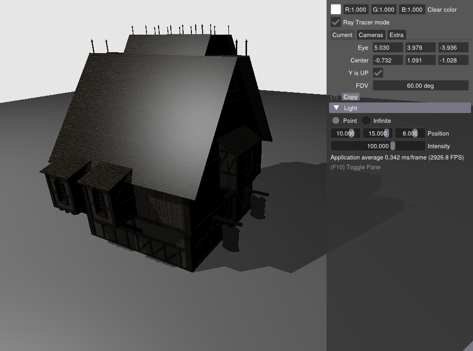
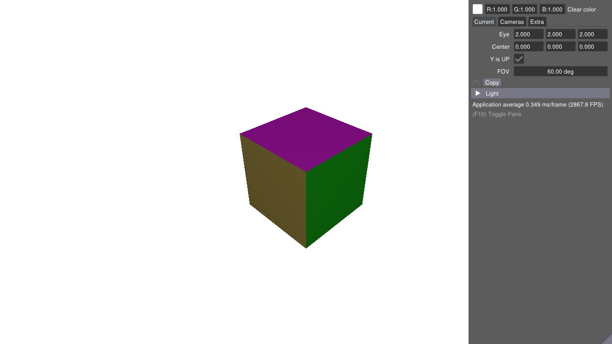
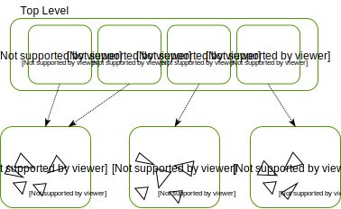

NVIDIA Vulkan 光线追踪教程
=============================

.. admonition:: 更新记录
   :class: admonition

   * 2023/5/15 创建本文
   * 2023/5/15 增加 ``介绍`` 章节
   * 2023/5/15 增加 ``配置环境`` 章节
   * 2023/5/15 增加 ``生成解决方案`` 章节
   * 2023/5/17 增加 ``生成解决方案`` 章节
   * 2023/5/17 增加 ``编译和运行`` 章节
   * 2023/5/17 增加 ``开始步入光线追踪`` 章节
   * 2023/5/18 更新 ``开始步入光线追踪`` 章节
   * 2023/5/18 增加 ``加速结构`` 章节
   * 2023/5/20 更新 ``加速结构`` 章节
   * 2023/5/20 增加 ``末级加速结构`` 章节

`文献源`_

.. _文献源: https://nvpro-samples.github.io/vk_raytracing_tutorial_KHR/

本文所提供的的代码和文档聚焦于使用 `VK_KHR_ray_tracing_pipeline <https://www.khronos.org/registry/vulkan/specs/1.2-extensions/html/vkspec.html#VK_KHR_ray_tracing_pipeline>`_ 扩展展示一个基础光追示例。
该教程从一个基于 ``Vulkan`` 开发的基础程序开始，并且提供一步步的介绍去修改和增加函数和功能。

    最终结果

.. admonition:: GitHub仓库
    :class: note

    https://github.com/nvpro-samples/vk_raytracing_tutorial_KHR

介绍
####################

本教程重点介绍将光线跟踪添加到现有 ``Vulkan`` 应用中的步骤，并假设您对 ``Vulkan`` 有一定的了解。
对于像交换链管理、 ``Render Pass`` 等常见的组件已经封装在了 `C++ API helpers <https://github.com/nvpro-samples/nvpro_core/tree/master/nvvk>`_ 和
英伟达的 `nvpro-samples <https://github.com/nvpro-samples/build_all>`_ 框架中。这个框架包含很多高级示例，对于 ``Vulkan`` 和 ``OpenGL`` 最佳实践也在其中。
我们同时使用一个助手去生成光追的加速结构，我们会在本文中对其进行详细说明。

.. note:: 出于教育的目的，所有的代码都在分散一些很小的文件中。要将这些结合起来需要额外的抽象层级。

配置环境
####################

推荐的方式是通过 ``nvpro-samples`` 的 ``build_all`` 脚本去下载包括 ``NVVK`` 在内的工程。

在命令行中，从 https://github.com/nvpro-samples/build_all 中克隆 ``nvpro-samples/build_all`` 仓库：

.. code:: 

    git clone https://github.com/nvpro-samples/build_all.git

之后打开 ``build_all`` 文件夹并切执行 ``clone_all.bat`` ( ``Windows`` ) 或 ``clone_all.sh`` ( ``Linux`` )。

如果你希望克隆尽可能少的仓库，打开命令行，并且执行如下指令，只克隆您需要的仓库：

.. code:: 

    git clone --recursive --shallow-submodules https://github.com/nvpro-samples/nvpro_core.git
    git clone https://github.com/nvpro-samples/vk_raytracing_tutorial_KHR.git

生成解决方案
********************

对于存储构建生成的解决方案，最经典的是在工程主目录下创建一个 ``build`` 文件夹。您可以是使用 ``CMake-GUI`` 或者如下指令生成目标工程：

.. code:: 

    cd vk_raytracing_tutorial_KHR
    mkdir build
    cd build
    cmake ..

.. note:: 
    
    如果您没有使用 ``Visual Studio 2019`` 或者更高版本，请确保 ``Visual Studio`` 中目标平台选择的是 ``x64`` 平台。
    对于 ``Visual Studio 2019`` 来说默认是 ``x64`` 平台，但老版本就不一定了。

工具安装
********************

我们需要一张支持 ``VK_KHR_ray_tracing_pipeline`` 扩展的显卡。对于英伟达的图形卡，您需要最起码是 ``2021年`` 或之后的 `Vulkan驱动 <https://developer.nvidia.com/vulkan-driver>`_ 。

该工程最低需要 `Vulkan SDK <https://vulkan.lunarg.com/sdk/home>`_ 的版本为 ``1.2.161``。该工程是使用 ``1.2.182.0`` 进行测试的。

编译和运行
####################

打开位于 ``build`` 目录下的解决方案，之后编译并运行 `vk_ray_tracing__before_KHR <https://github.com/nvpro-samples/vk_raytracing_tutorial_KHR/tree/master/ray_tracing__before>`_ 。

该示例将会是此教程的示例起点。这是一个用于加载 ``OBJ`` 文件并使用 ``Vulkan`` 光栅化渲染他们的小框架。您可以通过阅读 `Base Overview <https://github.com/nvpro-samples/vk_raytracing_tutorial_KHR/blob/master/ray_tracing__before/README.md#nvidia-vulkan-ray-tracing-tutorial>`_ 来纵观该示例是如何实现的。
我们将使用这个框架加载几何体并且渲染场景来实现光线追踪。

    首次执行

接下来的步骤将是修改 ``vk_ray_tracing__before_KHR`` 使其支持光线追踪。该教程修改后的最终结果将是同 ``vk_ray_tracing__simple_KHR`` 一样。如果开发过程发生错误
可以看看该工程。

``vk_ray_tracing__simple_KHR`` 工程将会作为额外教程的起点进行开发讲解。

开始步入光线追踪
####################

首先进入 ``main.cpp`` 文件的 ``main`` 函数，找到使用 ``nvvk::ContextCreateInfo`` 设置需要的 ``Vulkan`` 扩展。为了激活使用光线追踪，我们需要 ``VK_KHR_ACCELERATION_STRUCTURE`` 和 ``VK_KHR_RAY_TRACING_PIPELINE`` 两个扩展。这两个扩展
还依赖于其他扩展，如下是所有需要激活的扩展。

.. code:: c++

    // #VKRay: 激活光线追踪扩展
    VkPhysicalDeviceAccelerationStructureFeaturesKHR accelFeature{VK_STRUCTURE_TYPE_PHYSICAL_DEVICE_ACCELERATION_STRUCTURE_FEATURES_KHR};
    contextInfo.addDeviceExtension(VK_KHR_ACCELERATION_STRUCTURE_EXTENSION_NAME, false, &accelFeature);  // 用于构建加速结构
    VkPhysicalDeviceRayTracingPipelineFeaturesKHR rtPipelineFeature{VK_STRUCTURE_TYPE_PHYSICAL_DEVICE_RAY_TRACING_PIPELINE_FEATURES_KHR};
    contextInfo.addDeviceExtension(VK_KHR_RAY_TRACING_PIPELINE_EXTENSION_NAME, false, &rtPipelineFeature);  // 用于 vkCmdTraceRaysKHR
    contextInfo.addDeviceExtension(VK_KHR_DEFERRED_HOST_OPERATIONS_EXTENSION_NAME);  // 光线追踪光线的依赖

在这写代码背后，其帮助我们选择一个支持激活 ``VK_KHR_*`` 扩展的物理设备，之后在调用 ``vkCreateDevice`` 之前将 ``VkPhysicalDevice*FeaturesKHR`` 结构体插入 ``VkDeviceCreateInfo`` 的 ``pNext`` 链中。
这将激活光线追踪特性并且获取有关设备对于光线追踪的能力。如果你对背后的原理好奇，可与预览 ``Vulkan`` 上下文封装 `Context::initInstance() <https://github.com/nvpro-samples/nvpro_core/blob/1c59039a1ab0d777c79a29b09879a2686ec286dc/nvvk/context_vk.cpp#L211>`_ 。

.. admonition:: 加载函数指针
    :class: note

    与 ``OpenGL`` 一样，当在 ``Vulkan`` 中使用扩展时，您需要使用 ``vkGetInstanceProcAddr`` 和 ``vkGetDeviceProcAddr`` 手动加载扩展函数指针。该示例的 ``nvvk::Context`` 类在内部使用魔法已经为您做好了，对于获取 ``Vulkan`` 的 ``C`` 语言的 ``API`` 可以通过调用 `load_VK_EXTENSIONS <https://github.com/nvpro-samples/nvpro_core/blob/fd6f14c4ddcb6b2ec1e79462d372b32f3838b016/nvvk/extensions_vk.cpp#L2647>`_ 获取。

在 ``hello_vulkan.h`` 中的 ``HelloVulkan`` 类中，增加一个初始化函数和用于存储 ``GPU`` 的光追属性的成员变量。

.. code:: c++

    // #VKRay
    void initRayTracing();
    VkPhysicalDeviceRayTracingPipelinePropertiesKHR m_rtProperties{VK_STRUCTURE_TYPE_PHYSICAL_DEVICE_RAY_TRACING_PIPELINE_PROPERTIES_KHR};

在 ``hello_vulkan.cpp`` 结尾增加 ``initRayTracing()`` 函数体，该函数将会使用扩展查询 ``GPU`` 的光追属性。特别是对于获取最大递归深度的属性，例如对于单个光线可调用操作的嵌套式追踪数量。其可以看做场景中的单条光线递归路径追踪中可以反弹的次数。
需要注意的是，为了性能考量，递归应该尽量保持最小，这有利于循环执行。这也会查询之后章节创建着色器绑定表所需要的着色器头部大小。

.. code:: c++

    // 初始化Vulkan光线追踪
    // #VKRay
    void HelloVulkan::initRayTracing()
    {
      // 设置光追属性
      VkPhysicalDeviceProperties2 prop2{VK_STRUCTURE_TYPE_PHYSICAL_DEVICE_PROPERTIES_2};
      prop2.pNext = &m_rtProperties;
      vkGetPhysicalDeviceProperties2(m_physicalDevice, &prop2);
    }

main
********************

在 ``main.cpp`` 的 ``main()`` 函数中，我们在 ``helloVk.updateDescriptorSet()`` 之后调用初始化函数。

.. code:: c++

    // #VKRay
    helloVk.initRayTracing();

.. admonition:: 练习
    :class: note

    当执行该程序时，您可以在 ``initRayTracing()`` 函数出打个断点查看光追属性数据。在 ``Quadro RTX 6000`` 设备上，
    最大的递归深度是 ``31`` ，着色器组处理组的大小是 ``16``。

加速结构
####################

为了提高效率，光线追踪使用加速结构（ ``acceleration structure`` ( ``AS`` ) ）组织几何体，这样在渲染时将减少光线-三角形求交测试的次数。该结构在硬件上使用经典的层级数据结构存储，但给用户提供可接触的层级只有
两级：一个顶级加速结构 （ ``top-level acceleration structure`` ( ``TLAS`` ) ）可以引用任意数量的末级加速结构 （ ``bottom-level acceleration structures`` ( ``BLAS`` ) ）。对于可以支持多少个顶级加速结构，
可通过 ``VkPhysicalDeviceAccelerationStructurePropertiesKHR::maxInstanceCount`` 获取到。通常一个末级加速结构对应场景中一个单独的 ``3D`` 模型，并且一个顶级加速结构通过每一个单独的末级加速结构所对应的的位置（使用 ``3×4`` 的变换矩阵）
构建场景。

末级加速结构存储确切具体的顶点数据，末级加速结构使用一个或多个顶点缓存（ ``vertex buffers`` ）构建，每一个顶点缓存都会有自己的变换矩阵（这与顶级加速结构的矩阵进行区分），这样我们就可以在一个末级加速结构中存储多个有位置数据的模型。

.. note::
    
    如果一个物体在同一个末级加速结构中实例化多次，他们的几何体数据将会进行复制。这对于提高一些静态，未实例化的场景的性能特别有帮助。
    据经验来说，末级加速结构越少越好。

顶级加速结构将会包含物体的实例，每一个实例都会有自己的变换矩阵并且引用一个具体的末级加速结构。我们将会从一个末级加速结构和一个单位矩阵的顶级加速结构实例开始实现。

    加速结构

该教程将会加载一个 ``OBJ`` 文件，并将其索引、顶点和材质数据存储到 ``ObjModel`` 数据结构中。该模型同时引用一个 ``ObjInstance`` 数据结构，其中包含用于特定实例的变换矩阵。对于光线追踪， ``ObjModel`` 和一系列的 ``ObjInstances`` 将在之后分别用于构建末级加速结构和顶级加速结构。

为了假话光线追踪，我们使用一个帮助类，用于充当一个顶级加速结构和多个末级加速结构的容器，并且提供构建加速结构的接口函数。在 ``hello_vulkan.h`` 的头文件中包含 ``raytrace_vkpp`` 帮助类。

.. code:: c++

    // #VKRay
    #include "nvvk/raytraceKHR_vk.hpp"

之后我们可以在 ``HelloVulkan`` 类中增加该类型的成员变量。

.. code:: c++

    nvvk::RaytracingBuilderKHR m_rtBuilder;

并且在 ``initRaytracing()`` 末尾进行初始化。

.. code:: c++

    m_rtBuilder.setup(m_device, &m_alloc, m_graphicsQueueIndex);

.. admonition:: 内存管理
   :class: note

   该光追帮助类使用 `nvvk/resourceallocator_vk.hpp <https://github.com/nvpro-samples/nvpro_core/blob/master/nvvk/resourceallocator_vk.hpp>`_ 避免去管理 ``Vulkan`` 内存。其内部提供 ``nvvk::AccelKHR`` 类型，该类型包含 ``VkAccelerationStructureKHR`` 用于缓存创建和备份所需要的信息。
   该资源可以使用不同的内存分配策略进行分配。在该教程中我们使用我们自己的 `DMA <https://github.com/nvpro-samples/nvpro_core/blob/master/nvvk/memallocator_dma_vk.hpp>`_ 。其他的内存分配器也是可以使用的，
   比如 `Vulkan Memory Allocator（VMA） <https://github.com/GPUOpen-LibrariesAndSDKs/VulkanMemoryAllocator>`_ 或是专用内存分配器（比如一个 ``VkDeviceMemory`` 对应一个对象的策略，这种分配策略对于教学目的最容易理解，但是并不能用于产品开发）。

末级加速结构
********************