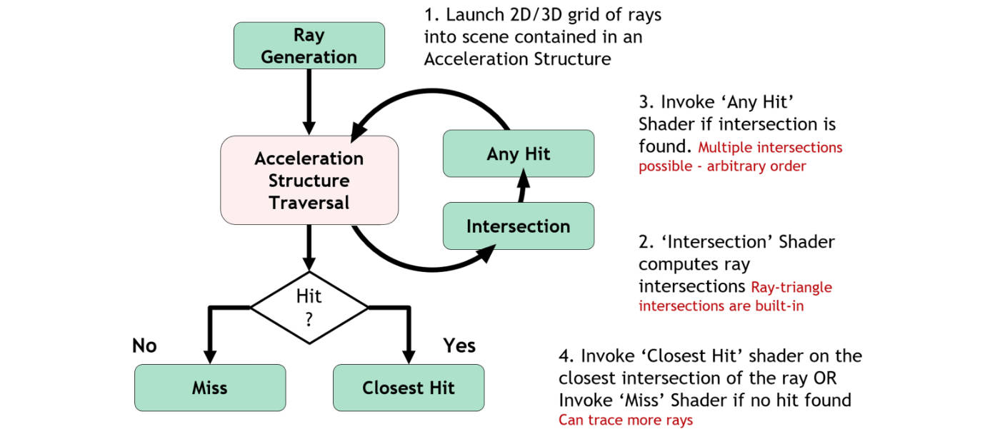
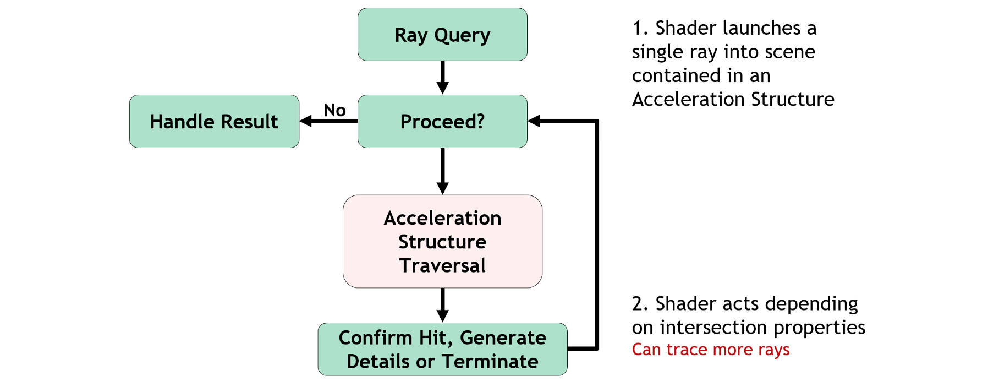
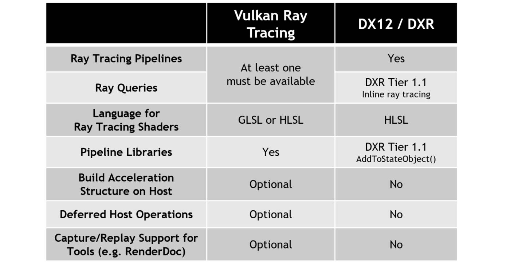

# Vulkan 光线追踪最终标准发布

```{admonition} 更新记录
:class: note

* 2023/5/11 发布完成
```

[文献源](https://www.khronos.org/blog/vulkan-ray-tracing-final-specification-release)

## 历史回顾

对于基于硬件的实时光追，最早是`NVIDIA`在2018年10月10日在`DirectX 12`中正式发布的名为`DirectX Raytracing (DXR)`的功能。而`Khronos`组织也在2018年的1月成立了`Vulkan`光追组制定`Vulkan`的光追标准，并在2020年3月发布了一个临时扩展（没记错的话应该是`Vulkan 1.2`，当时的扩展名为`VK_KHR_ray_tracing`，而`VK_NV_ray_tracing`扩展在这之前就已经发布了），经过一些用户和硬件供应商的反馈，最终在2020年的11月份发布了`Vulkan`实时光追标准的最终版（`Vulkan 1.2.162`）。`Vulkan`实时光追标准的发布是里程碑式的存在，标志着第一个工业级开源、跨平台、跨设备的光追加速标准问世（甚至可以在移动设备上使用光追加速）。

## 光追标准

最终发布版与临时发布版大体上没什么区别，最终发布版如下：

`Vulkan`的扩展标准：

* [VK_KHR_acceleration_structure](https://www.khronos.org/registry/vulkan/specs/1.2-extensions/man/html/VK_KHR_acceleration_structure.html)
* [VK_KHR_ray_tracing_pipeline](https://www.khronos.org/registry/vulkan/specs/1.2-extensions/man/html/VK_KHR_ray_tracing_pipeline.html)
* [VK_KHR_ray_query](https://www.khronos.org/registry/vulkan/specs/1.2-extensions/man/html/VK_KHR_ray_query.html)
* [VK_KHR_pipeline_library](https://www.khronos.org/registry/vulkan/specs/1.2-extensions/man/html/VK_KHR_pipeline_library.html)
* [VK_KHR_deferred_host_operations](https://www.khronos.org/registry/vulkan/specs/1.2-extensions/man/html/VK_KHR_deferred_host_operations.html)

`SPIR-V`的扩展标准：

* [SPV_KHR_ray_tracing](http://htmlpreview.github.io/?https://github.com/KhronosGroup/SPIRV-Registry/blob/master/extensions/KHR/SPV_KHR_ray_tracing.html)
* [SPV_KHR_ray_query](http://htmlpreview.github.io/?https://github.com/KhronosGroup/SPIRV-Registry/blob/master/extensions/KHR/SPV_KHR_ray_query.html)

`GLSL`的扩展标准：

* [GLSL_EXT_ray_tracing](https://github.com/KhronosGroup/GLSL/blob/master/extensions/ext/GLSL_EXT_ray_tracing.txt)
* [GLSL_EXT_ray_query](https://github.com/KhronosGroup/GLSL/blob/master/extensions/ext/GLSL_EXT_ray_query.txt)
* [GLSL_EXT_ray_flags_primitive_culling](https://github.com/KhronosGroup/GLSL/blob/master/extensions/ext/GLSL_EXT_ray_flags_primitive_culling.txt)

## 扩展结构

最终发布版与临时发布版最显著的区别在于临时发布版的`VK_KHR_ray_tracing`扩展在最终发布版中被分成了三个扩展:

* `VK_KHR_acceleration_structure`：用于加速结构的构建和管理
* `VK_KHR_ray_tracing_pipeline`：用于光追着色器阶段和光追管线
* `VK_KHR_ray_query`：用于所有着色器阶段的内部光线查询

`Khronos`标准组采纳了一些市场调研和厂家的意见，提供单独的光线查询功能而不需要创建光追管线，所以原先的`VK_KHR_ray_tracing`扩展被细分，用于避免重复和依赖。实现（设备制造商）可以实现`VK_KHR_ray_tracing_pipeline`或者`VK_KHR_ray_query`之一，或是两者都实现，取决于市场需求。两个扩展都依赖于`VK_KHR_acceleration_structure`扩展，该扩展用于提供基本的加速结构的管理。对于桌面级别的设备供应商任致力于都支持`VK_KHR_ray_tracing_pipeline`和`VK_KHR_ray_query`扩展。

现在`Vulkan`光线追踪扩展标准由原先的临时提升到了核心中，也就是将光追扩展接口从`vulkan_beta.h`中移动到`vulkan_core.h`，所以用户不再需要声明`#define VK_ENABLE_BETA_EXTENSIONS`来激活`Vulkan`光线追踪的功能

这些扩展的依赖有些许变化，现在需要依赖`Vulkan 1.1`和`SPIR-V 1.4`。`VK_KHR_acceleration_structure`需要依赖`Vulkan 1.1`，`VK_EXT_descriptor_indexing`，`VK_KHR_buffer_device_address`和`VK_KHR_deferred_host_operations`。同样我们也意识到这么多依赖链很是繁琐，如果使用`Vulkan 1.2`事情将变得简单，但是并不是所有的平台都支持实现了`Vulkan 1.2`标准，并且我们并不想在光追标准中再增加其他的人为限值。我们也考虑到将`VK_KHR_deferred_host_operations`作为显示依赖是因为在创建管线时需要延迟操作需要该扩展。我们将`VK_KHR_pipeline_library`作为`VK_KHR_ray_tracing_pipeline`的一种相对松弛的扩展依赖而不是严格依赖，所以仅仅在使用相关扩展功能是才去激活扩展，用于减少负载。此外`VK_KHR_acceleration_structure`，`VK_KHR_ray_tracing_pipeline`和`VK_KHR_ray_query`都需要最小支持`SPIR-V 1.4`（该版本中增加了对于着色器的入口函数的改变），`SPIR-V 1.5`也可以在`Vulkan 1.2`上被使用。

功能方面，如下的标准需要所有的设备支持：

`VK_KHR_acceleration_structure`要求：

* `VK_KHR_deferred_host_operations`
* `accelerationStructure`
* `descriptorBindingAccelerationStructureUpdateAfterBind`
* `descriptorIndexing`有关的所有特性（如果支持`Vulkan 1.2`）或者使用`VK_EXT_descriptor_indexing`扩展
* `Vulkan 1.2`的`bufferDeviceAddress`或者`VK_KHR_buffer_device_address`扩展

设备如果支持`VK_KHR_ray_tracing_pipeline`要求：

* `VK_KHR_acceleration_structure`
* `rayTracingPipeline`
* `rayTracingPipelineTraceRaysIndirect`
* `rayTraversalPrimitiveCulling`（如果支持`VK_KHR_ray_query`）
* `VK_KHR_pipeline_library`

设备如果支持`VK_KHR_ray_query`要求：

* `VK_KHR_acceleration_structure`
* `rayQuery`

此外这些扩展有一些可选的功能。

对于`VK_KHR_acceleration_structure`要求：

* `accelerationStructureCaptureReplay`
* `accelerationStructureIndirectBuild`
* `accelerationStructureHostCommands`

对于`VK_KHR_ray_tracing_pipeline`要求：

* `rayTracingPipelineShaderGroupHandleCaptureReplay`
* `rayTracingPipelineShaderGroupHandleCaptureReplayMixed`
* `rayTraversalPrimitiveCulling`(如果不支持`VK_KHR_ray_query`)

## 加速结构（Acceleration Structures）

`Vulkan`对于光追扩展标准的最终版中变化最大的就是加速结构的创建和布局。

我们接纳了`API`转换层作者们的意见（比如[vkd3d-proton](https://github.com/HansKristian-Work/vkd3d-proton)），对于将`DXR`层置于`Vulkan`光追加速结构的顶层是不明智的。这使得加速结构的创建大小和存储在`VkBuffer`中发生了改变，而不是使用单独专用的加速结构进行存储。对应的变化位于`VkAccelerationStructureKHR`和`VkAccelerationStructureNV`句柄不再是指代同一实例句柄，并且不能混用。与之相似的结构或者函数在使用这个两个句柄时也不再相同，也不能混用。

我们同时增加了加速结构类型声明`VK_ACCELERATION_STRUCTURE_TYPE_GENERIC_KHR`。可以用在当加速结构在创建时还不知道确切的加速结构类型（在顶部或是在底部），确切的加速结构类型必须是`VK_ACCELERATION_STRUCTURE_TYPE_TOP_LEVEL_KHR`或者`VK_ACCELERATION_STRUCTURE_TYPE_BOTTOM_LEVEL_KHR`，并且一旦创建就不能改变。开发`Vulkan`应用时不应该使用`VK_ACCELERATION_STRUCTURE_TYPE_GENERIC_KHR`，这会在将来影响设备功能和效率。

我们也接纳了`Vulkan`层实现作者们的意见（比如[MoltenVK](https://github.com/KhronosGroup/MoltenVK)），意见指出一些光追要求（比如设备地址）使得`Vulkan`在层级上难以在其他`API`上实现。不幸的是对于像支持`DXR`的奇偶校验同样是不可能的。我们希望在未来的其他`API`版本中会支持这些特性。

我们听说开发者比较喜欢统一的创建接口和构造参数，比如同一`VK_NV_ray_tracing`和`DXR`。我们将加速结构的创建更改成基于大小的创建，并且这个大小可与构造时的同一个结构体中计算出来（`vkGetAccelerationStructureBuildSizesKHR`），或者来自于压缩查询（`vkCmdWriteAccelerationStructuresPropertiesKHR`）。我们同时得知一些开发商需要在创建时得到更多信息，所以我们将`pMaxPrimitiveCounts`增加到了`vkGetAccelerationStructureBuildSizesKHR`中。

之前在几何描述某些方面是存在冲突的并且在自动代码生成方面不尽如人意（比如验证层（`validation layers`）），并且解决了由于`ppGeometries`的二元对立导致的歧义，并且增加了`pGeometries`，这要求二者在使用时只能指定其中一个使用。

其他的一些增加包括：加速结构的创建时间捕获和回溯标志位。`nullDescriptor`支持加速结构与`VK_EXT_robustness2`和`VK_DESCRIPTOR_SET_LAYOUT_CREATE_UPDATE_AFTER_BIND_POOL_BIT`相互作用。

最后，我们将所有的扩展更改成一致使用设备地址。这其中有很多命名建议，其中一些已被采纳，并且一些名称和命名风格被修改成统一并且可扩展的方式。有关更多细节请查阅`VK_KHR_acceleration_structure`的问题`3`和`4`的更新日志。

## Host端的延迟操作（Deferred Host Operations）

*注：`Host`端一般指`CPU`端*

我么改造了`vkBuildAccelerationStructuresKHR`和`vkCreateRayTracingPipelinesKHR`指令的延迟`Host`端操作。取消了使用`pNext`对于各种独立创建和构造的链式操作，现在延迟操作通过指令的上层参数来设置指令是否为延迟操作。当指令为延迟操作的话，应用必须在延迟操作结束之后获取返回的数据。如果之前有一些延迟操作并且没有其他的措施防止不清晰的行为发生，这时难以明确合适能够获取安全数据。我们相信新的语义是清晰的并且对于并行友好，但是付诸的代价就是需要一直开启`VK_KHR_deferred_host_operations`扩展。


*如上图为：`Host`延迟操作使用加速结构在多核`CPU`上部署已达到更高的帧率和限制帧停顿*

## 光追管线

对于光追管线的改变并不多，基本上都是改变内部的`SPIR-V`和着色器编译链相关。

此外`vkCreateRayTracingPipelinesKHR`中增加了适用延迟操作的修改，并且将`VkPipelineLibraryCreateInfoKHR`和`VkRayTracingPipelineInterfaceCreateInfoKHR`更改成可选项，这样如果`VkPipelineLibraryCreateInfoKHR`和`VkRayTracingPipelineInterfaceCreateInfoKHR`没有使用就不须要激活`VK_KHR_pipeline_library`扩展了。

对于光追管线最大的改变就是明确的增加了栈大小的管理。光追管线在进行光线追踪时需要调用所有的有关执行链，这潜在会有大量的着色器集。当着色器执行时，驱动实现可能会使用栈去存储参数数据，这也间接要求栈要足够大，进而可以处理所有着色器的任何执行链的调用。默认的栈大小可能相当的大，所以我们给应用提供在管线编译之后使用更优栈大小的可能。一般当应用可以计算出紧凑型栈内存理应使用更优的策略。并且增加了一个新的动态状态`VK_DYNAMIC_STATE_RAY_TRACING_PIPELINE_STACK_SIZE_KHR`用于使用光追管线去查询着色器组`vkGetRayTracingShaderGroupStackSizeKHR`的栈大小时使用，与此对应的设置管线栈大小的函数即为`vkCmdSetRayTracingPipelineStackSizeKHR`。

另一个新增特性来自于`DXR`层的积极反馈，即可以通过加速结构地址进行光线追踪。为此，加速结构的设备地址可通过`vkGetAccelerationStructureDeviceAddressKHR`将结果缓存在缓存中或者其他着色器资源中。对于着色器（`SPIR-V`），则可以使用`OpConvertUToAccelerationStructureKHR`显示转换声明`OpTypeAccelerationStructureKHR`描述符类型（在`GLSL`中使用`accelerationStructureEXT`构造）。其结果之后可以用于加速结构中使用`OpTraceRayKHR`指令进行追踪（`traceRayEXT()`）,此种转换是单向的，并且没有其他操作支持加速结构描述符。



*如上图为：光追管线提供的隐式光线求交管理*

`SPIR-V`标准组也对`SPIR-V`的扩展提供了反馈，将`Payload`参数更改成`OpTraceRayKHR`并且将`Callable Data`参数更改成`OpExecuteCallableKHR`。之前这些参数使用像`GLSL`中的`location`布局来进行匹配，然而这些`location`在`SPIR-V`没有意义，而是直接使用合适的存储类指针直接替换，为了实现这些需要新的指令操作码声明`OpTraceRayKHR`和`OpExecuteCallableKHR`。可以就与`SPV_NV_ray_tracing`进行划分防止混淆了。

另一个`SPIR-V`的改变来自于内部对于`OpIgnoreIntersectionKHR`和`OpTerminateRayKHR`的反馈，将这些转变成终止指令，因为他们会终止调用者的调用。这也必须是块中的最后一条指令。同样，这需要新的指令操作码。这对`GLSL`的冲击较大，这些函数指令将不再是内置函数，而是跳转语句，当在使用着色器时现在是仅仅使用`ignoreIntersectionEXT`而不是`ignoreIntersectionEXT()`。

`SPIR-V`对于光追管线的的变化总结就是：提供了新功能和枚举`RayTracingKHR`,使得驱动实现和工具链在已过时的`SPIR-V`和最终版之间进行区分。并且对于还对`ShaderRecordBufferKHR`所需的显式布局进行了一些澄清，并将其视为`StorageBuffer`的存储类。同时我们也规定了返回值和对于`OpReportIntersectionKHR`的值`T`越界所返回的相关行为，并澄清一部分位域用于各种光追参数。

对于`VK_KHR_acceleration_structure`扩展，我们将设备缓存地址独立出来，这样就可以使用光线追踪指令通过`VkStridedDeviceAddressRegionKHR`去获取着色器绑定表中的缓存设备地址。`vkCmdTraceRaysIndirectKHR`也与之相似的，通过缓存设备地址间接获取参数。

我们也更新了`Vulkan 1.2`与`VK_KHR_vulkan_memory_model`扩展之间的交互，并且要求一些内置变量成为`Volatile`变量，供着色器使用。

其他的改变包括增加创建2023年5月9日15:23:32捕获和着色器组句柄的回溯标志位，增加了一些之前忽略的属性和限值，和一些为了明确用途的重命名。有关更多细节请查阅`VK_KHR_ray_tracing_pipeline`的问题`3`和`4`，`SPV_KHR_ray_tracing`的问题`2`还有扩展的更新日志。

## 光线查询

考虑到`Vulkan`接口对于表面光线查询欠缺，大部分的光线查询改变都在`SPIR-V`扩展和交互中。

`SPV_KHR_ray_query`也是支持通过加速结构地址进行发射光线查询，并且增加`OpConvertUToAccelerationStructureKHR`用于将加速结构设备地址转变成`OpTypeAccelerationStructureKHR`描述符。这些在之后可以通过加速结构使用`OpRayQueryInitializeKHR`进行追踪。

对于光追管线，也新增了功能和枚举`RayQueryKHR`，这可以是的驱动的实现者将老版的临时版本与最终版明确区分开。我们同时为提出遮罩使用一套位域值，并且不允许查询`AABB`图元的候选`T`值。

最终，我们对于光线参数进行了数量上的限值，要求`HitT`作为光线间隔用于`OpRayQueryGenerateIntersectionKHR`，并且限值追踪顶级的加速结构。

对于更多的细节和其他改变，请查阅`VK_KHR_ray_query`的问题`1`，`SPV_KHR_ray_query`的问题`1`和扩展更新日志。



*如上图为：光线查询提供从任意着色器中明确光线管理*

## 正路在此

这一章将会给出创建加速结构新流程的纵览和对于资源创建与光追进行同步的快速入门。

### 加速结构的创建

*注：加速结构的创建和构建是两个不同的东西，创建指的是创建加速结构句柄，构建指的是创建加速结构内部数据和结构*

为了创建加速结构，应用必须首先确定加速结构需要的大小。对于创建时的加速结构、缓存大小和更新可通过`vkGetAccelerationStructureBuildSizesKHR`指令使用`VkAccelerationStructureBuildSizesInfoKHR`获得。对于创建加速结构时指定的`shape`和`type`位于`VkAccelerationStructureBuildGeometryInfoKHR`结构体中，该结构体之后也被用于真正的加速结构构建，但是此时加速结构的参数和几何数据并不需要全都填充完善（虽然可以填补完善），仅仅完善加速结构的类型、几何类型、数量和最大大小即可。这个大小可以支持任意足够相似的加速结构。对于加速结构目标会进行紧凑拷贝，这需要从`vkCmdWriteAccelerationStructuresPropertiesKHR`指令中获取大小。一旦需求的大小确定了，为加速结构创建`VkBuffer`（`accelerationStructureSize`），并且一个或多个`VkBuffer`用于创建（`buildScratchSize`）和更新（`updateScratchSize`）缓冲。

之后，加速结构`VkAccelerationStructureKHR`对象就可以使用`vkCreateAccelerationStructureKHR`指令根据`type`和`size`创建，并将结果存放在`VkAccelerationStructureCreateInfoKHR`中指定的`buffer`的`offset`位置中。与`Vulkan`中的其他资源不同，指定的这一部分魂村将会完全用于加速结构，并不需要额外的缓存用于加速结构的查询或者内存绑定。如果你愿意，多个加速结构甚至可以放在同一个`VkBuffer`中，只需要多个加速结构之间不互相覆盖即可。

最后，使用`vkCmdBuildAccelerationStructuresKHR`指令可以用于去构建加速结构。此构建使用的是与创建时相同的`VkAccelerationStructureBuildGeometryInfoKHR`结构体，但是此时此时需要指定所有的几何数据（顶点，索引，变换，`aabbs`包围盒，和实例）和缓存数据。一旦构建完成此加速结构将会完全自完善（`self-contained`），并且构建的输入和缓存可以重复利用除非在之后的构建更新中有计划使用他们。

### 资源使用和同步

本章将提供各种缓存使用纵观，并且简单讲解光追操作有关的同步使用。

用于备份加速结构的缓存将会使用`VK_BUFFER_USAGE_ACCELERATION_STRUCTURE_STORAGE_BIT_KHR`进行创建。缓存将会使用`VK_BUFFER_USAGE_STORAGE_BUFFER_BIT`用于暂存空间，并且使用`VK_BUFFER_USAGE_ACCELERATION_STRUCTURE_BUILD_INPUT_READ_ONLY_BIT_KHR`用于加速结构的构建输入（比如顶点，索引，变换，`aabbs`包围盒，和实例）。如果缓存用于着色器绑定表将会使用`VK_BUFFER_USAGE_SHADER_BINDING_TABLE_BIT_KHR`创建，并且如果使用间接构建的话追踪参数将会使用`VK_BUFFER_USAGE_INDIRECT_BUFFER_BIT`创建使用。

为了与加速结构的构建指令（`vkCmdBuildAccelerationStructuresKHR`和`vkCmdBuildAccelerationStructuresIndirectKHR`）进行同步，需要使用`VK_PIPELINE_STAGE_ACCELERATION_STRUCTURE_BUILD_BIT_KHR`管线阶段声明。访问加速结构的数据源或目标数据缓存将使用`VK_ACCESS_ACCELERATION_STRUCTURE_READ_BIT_KHR`或`VK_ACCESS_ACCELERATION_STRUCTURE_WRITE_BIT_KHR`。构建时访问输入缓存（顶点，索引，变换，`aabbs`包围盒，和实例）使用`VK_ACCESS_SHADER_READ_BIT`访问类型并且访问间接参数使用`VK_ACCESS_INDIRECT_COMMAND_READ_BIT`访问类型。

为了与加速结构的拷贝指令（`vkCmdWriteAccelerationStructuresPropertiesKHR`、`vkCmdCopyAccelerationStructureKHR`、`vkCmdCopyAccelerationStructureToMemoryKHR`和`vkCmdCopyMemoryToAccelerationStructureKHR`）进行同步，同样需要使用`VK_PIPELINE_STAGE_ACCELERATION_STRUCTURE_BUILD_BIT_KHR`管线阶段。访问加速结构的读写使用`VK_ACCESS_ACCELERATION_STRUCTURE_READ_BIT_KHR`或`VK_ACCESS_ACCELERATION_STRUCTURE_WRITE_BIT_KHR`，此外通过设备地址访问的缓存使用`VK_ACCESS_TRANSFER_READ_BIT`或`VK_ACCESS_TRANSFER_WRITE_BIT`访问类型。

与光追指令（`vkCmdTraceRaysKHR`或`vkCmdTraceRaysIndirectKHR`）进行同步，`VK_PIPELINE_STAGE_RAY_TRACING_SHADER_BIT_KHR`管线阶段用于着色器访问绑定的缓存表使用`VK_ACCESS_SHADER_READ_BIT`访问，对于访问间接数据在`VK_PIPELINE_STAGE_DRAW_INDIRECT_BIT`管线阶段使用`VK_ACCESS_INDIRECT_COMMAND_READ_BIT`进行访问。

与加速结构在任何图形，计算或是光追管线阶段进行光线查询同步，对应的管线阶段使用`VK_ACCESS_ACCELERATION_STRUCTURE_READ_BIT_KHR`进行数据访问。



*如上图为：`Vulkan`的光追与`DXR`的比较。两者之间进行移植非常简单，包括可共享的`HLSL`光追着色器*

## 结论和资源

现在最终版的`Vulkan`光追扩展已经发布，现在支持临时版本的嵌入式也会在不久支持最终版光追扩展，有关其他工具和组件可通过[GitHub](https://khr.io/vulkanrtfeedback)进行查阅。我们推荐所有的开发者转去使用最终的`Khronos`发布的`Vulkan`光追最终版。

支持`Vulkan`光追扩展的`NVIDIA`显卡驱动以及哪些显卡支持的信息可在[developer.nvidia.com/vulkan-driver](https://developer.nvidia.com/vulkan-driver)中找到。对于`AMD`显卡驱动可在[https://www.amd.com/en/support/kb/release-notes/rn-rad-win-20-11-2-vrt-beta](https://www.amd.com/en/support/kb/release-notes/rn-rad-win-20-11-2-vrt-beta)中找到。光追扩展同样可以通过2021年的`Intel`的`Xe-HPG`显卡支持，通过定期的驱动程序更新提供支持。

有关如何使用`Vulkan`光追用于混合渲染，同时使用光栅化和光追，以此来达到令人信服和画面同时保持交互程度请查看[Vulkan Ray Tracing Best Practices for Hybrid Rendering](https://www.khronos.org/blog/vulkan-ray-tracing-best-practices-for-hybrid-rendering)博客讨论有关在`Wolfenstein:Youngblood`（德军总部：新血脉）中使用最终版光追扩展实现的反射效果。

也可以查阅现今进行更新后支持光追扩展的[NVIDIA Vulkan Ray Tracing Tutorial](https://github.com/nvpro-samples/vk_raytracing_tutorial_KHR)和2020年6月份发布的[NVIDIA Nsight Graphics developer tool](https://news.developer.nvidia.com/nvidia-announces-nsight-graphics-2020-6/)。请关注更多即将发布的有关的生产驱动程序、工具和示例公告。

`Vulkan`工作组同样鼓励开发者和内容创建社区使用`Vulkan`的光追扩展并积极反馈问题。这可通过[Khronos Developer Slack](https://khr.io/slack)和[Vulkan GitHub Issues Tracker](https://github.com/KhronosGroup/Vulkan-Docs/issues)进行讨论和反馈。

欢迎来到便携式、跨厂商、跨平台光线追踪加速的时代！
